# 🎮 XB Homebrew Vault

[](https://github.com/marcelofrau/xb-homebrew-vault/releases)
[](LICENSE)
[](https://dotnet.microsoft.com/download)
[](https://github.com/marcelofrau/xb-homebrew-vault/actions)
[](https://github.com/marcelofrau/xb-homebrew-vault/releases)
[](https://www.virustotal.com/gui/home/upload)

> The easiest way to manage homebrew on your Xbox Dev Mode console — browse, install, and control everything wirelessly from your PC.

<p align="center">
  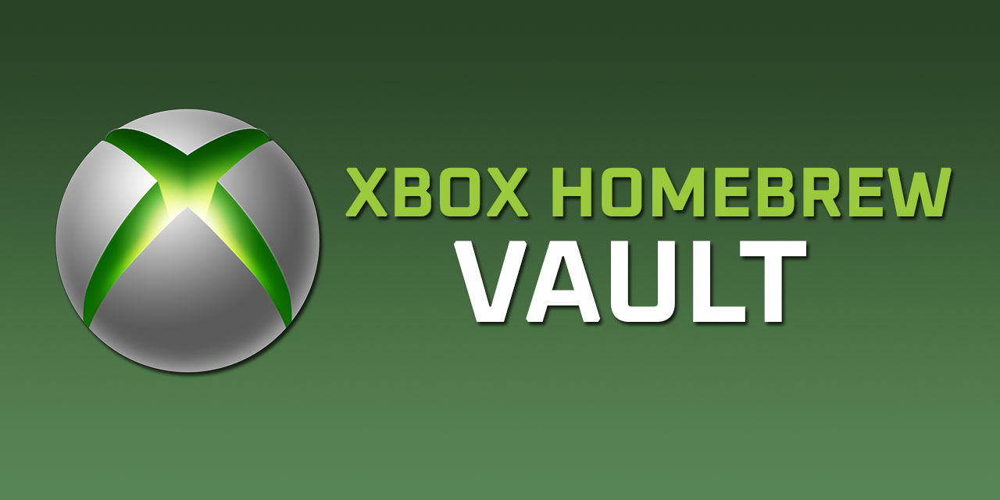
</p>

<p align="center">
  <a href="https://github.com/marcelofrau/xb-homebrew-vault/releases/latest"><strong>⬇️ Download Latest Release</strong></a>
  &nbsp;·&nbsp;
  <a href="https://marcelofrau.github.io/xb-homebrew-vault"><strong>🌐 Website</strong></a>
  &nbsp;·&nbsp;
  <a href="https://github.com/marcelofrau/xb-homebrew-vault/issues">Report a Bug</a>
</p>

---

## What is this?

XB Homebrew Vault connects to your Xbox in [Developer Mode](https://wiki.sternserv.xyz/docs/xbox-setup/xbox-developer-mode-setup) over Wi-Fi and gives you a full desktop GUI to manage it — no Xbox dashboard required, no USB cables.

Browse and install from the full [Emulation Revival](https://emulationrevival.github.io) catalog, manage your installed packages, monitor performance in real time, and use tools that would otherwise require the Xbox Device Portal web UI.

---

## ✨ Features

| | Feature | Description |
|---|---------|-------------|
| 🔍 | **Catalog Browser** | Browse and search the Emulation Revival catalog — emulators, apps, ports, utilities — with category and compatibility filters |
| 📦 | **One-Click Install** | Auto-download, dependency resolution, and wireless upload to your Xbox |
| ⬇️ | **Custom Install Wizard** | Install `.appx`/`.msix`/`.zip` from local files or URLs — analysis, dependency check, dual progress bars |
| 🛠️ | **Dev Tools** | Screenshot capture, system info, process manager, network info, real-time CPU/GPU/RAM chart |
| 💾 | **USB Permission Wizard** | Prepare a USB drive for Xbox Dev Mode — auto-detect drives, apply NTFS permissions via icacls |
| 🔗 | **First-Run Setup Wizard** | Guided 3-step setup for first-time users — enter IP, credentials, test connection |
| 📁 | **File Explorer** | ✅ Browse, upload/download, delete, create folders over SSH/SFTP with dual-pane tree + list view |
| 🌙 | **Blades Theme** | Xbox 360-inspired dark theme with green accents |
| 🔐 | **Secure Credentials** | Obfuscated local storage — no cloud, no accounts, no telemetry |
| 📋 | **Activity Log** | Full in-app log with multi-select, copy, auto-scroll, and configurable log level |

---

## 📸 Screenshots

| | |
|---|---|
| **Catalog Browser** — Blades theme | **App Detail View** |
| 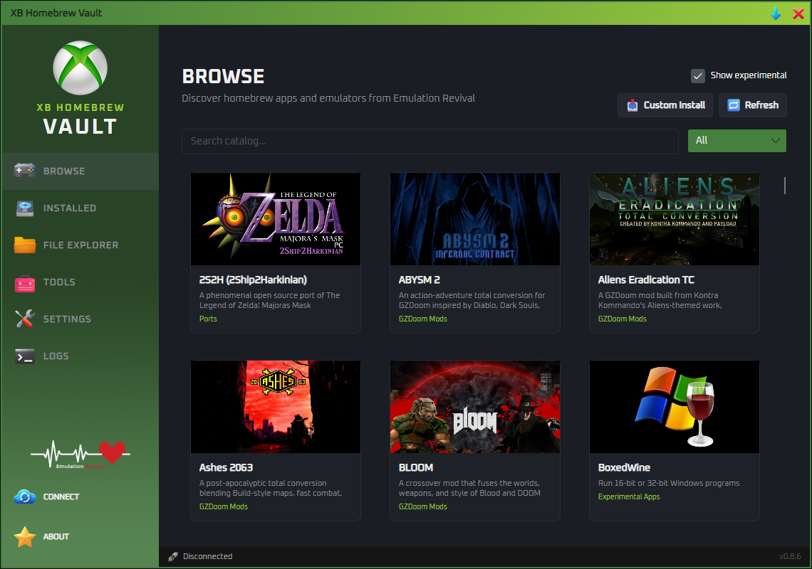 | 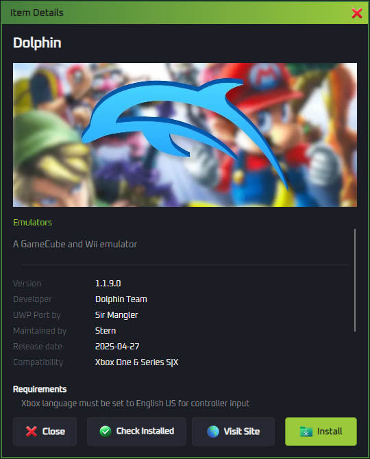 |

<details>
<summary>More screenshots</summary>

| | |
|---|---|
| **Installed Packages** | **Installing from Browse** |
| 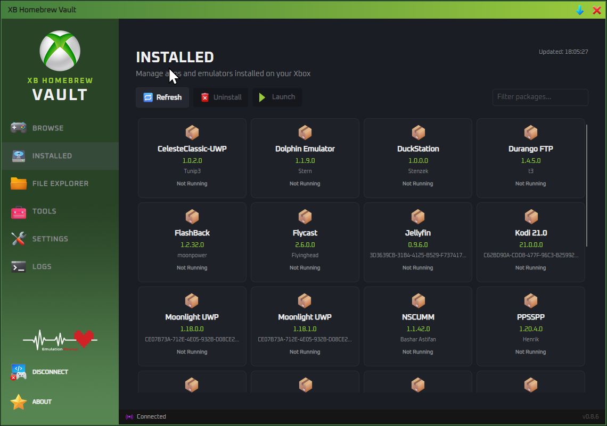 | 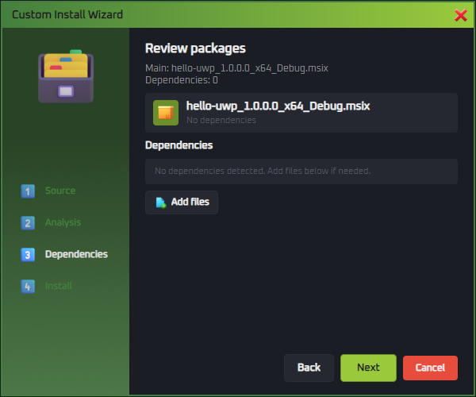 |
| **Install Complete** | **Custom Install Wizard** |
| 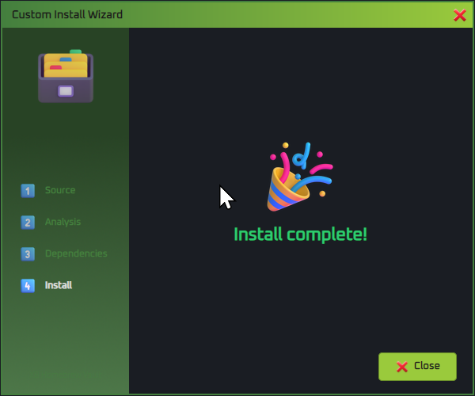 | 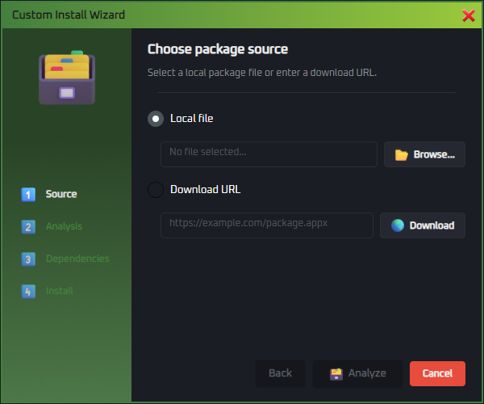 |
| **Confirm Uninstall** | **Not Connected** |
| 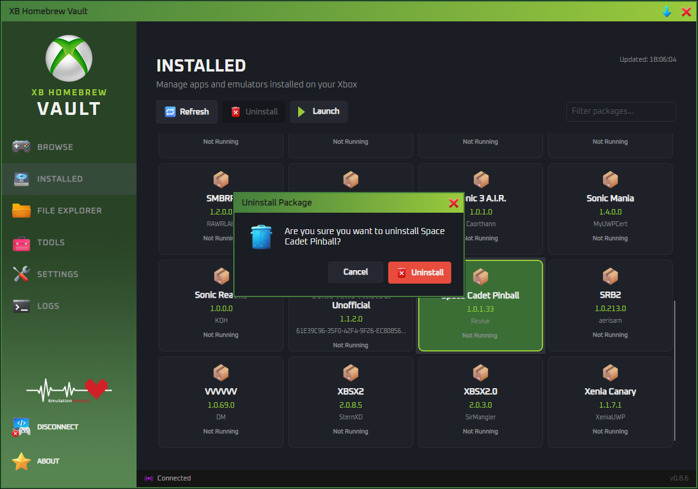 | 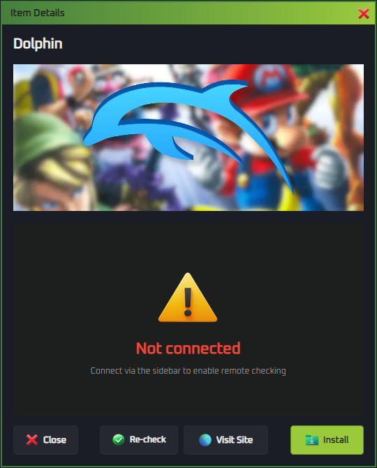 |
| **Connection Dialog** | **About Window** |
| 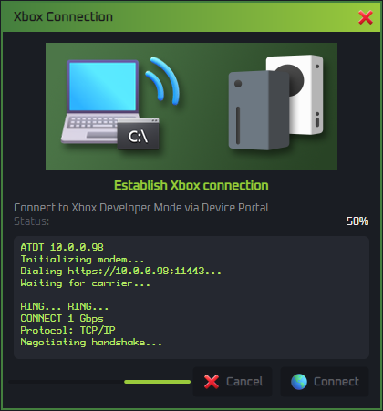 | 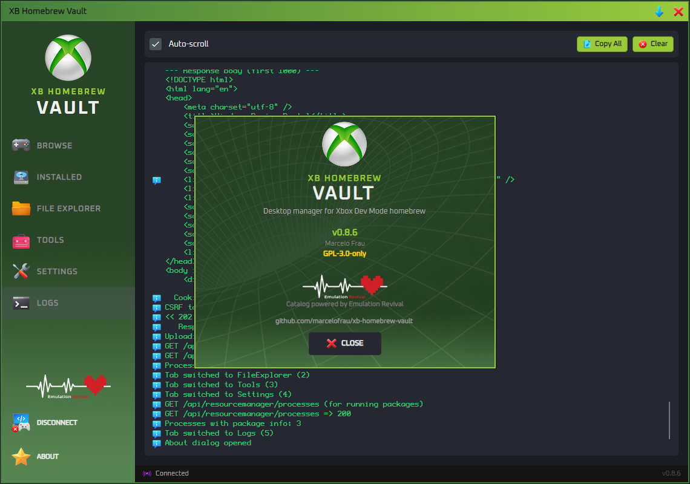 |
| **Dev Tools Panel** | **Performance Monitor** |
| 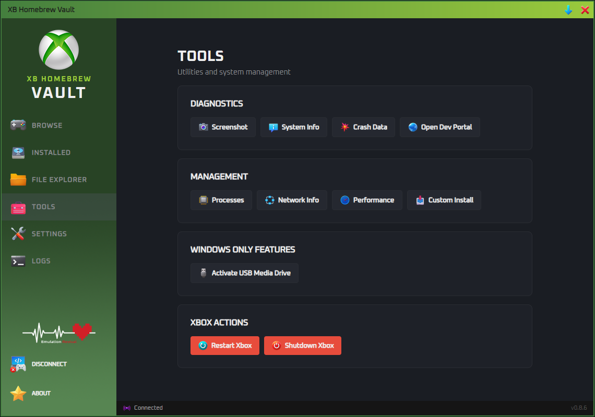 |  |
| **Process List** | **Screen Capture** |
| 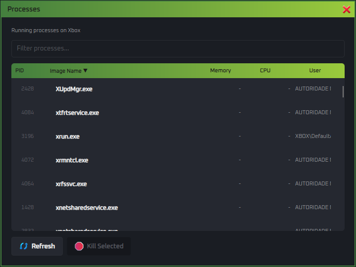 | 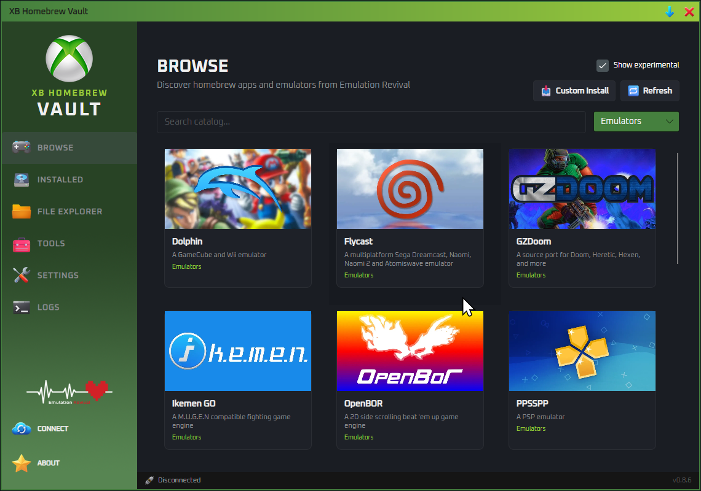 |

</details>

---

## 📥 Installation

### Quick start

1. Download the latest ZIP from the [Releases page](https://github.com/marcelofrau/xb-homebrew-vault/releases)
2. Extract and run `XBVault` — no install needed, fully self-contained
3. On first launch, the setup wizard guides you through connecting to your Xbox

**Releases available for:**
- `XBVault-v{version}-win-x64.zip` — Windows 10/11 x64
- `XBVault-v{version}-linux-x64.zip` — Linux x64
- `XBVault-v{version}-osx-x64.zip` — macOS Intel
- `XBVault-v{version}-osx-arm64.zip` — macOS Apple Silicon

### Prerequisites

- **Xbox One or Xbox Series S|X** in [Developer Mode](https://wiki.sternserv.xyz/docs/xbox-setup/xbox-developer-mode-setup)
- Xbox and PC on the **same local network**
- Windows 10/11, macOS, or Linux (x64)

### Connect to your Xbox

1. Open **Settings** → enter your Xbox's IP address and Dev Mode credentials
2. Click **Test Connection** — green indicator means you're live
3. Browse the catalog and start installing

---

## 🗺️ Roadmap

| Phase | Status | Description |
|-------|--------|-------------|
| Connection & credentials | ✅ | Xbox Device Portal connect, settings, obfuscation, first-run wizard |
| Catalog browser | ✅ | Emulation Revival `catalog.json` API, search, filters, detail view |
| Package management | ✅ | Install, uninstall, dependency resolution, custom install wizard |
| Dev Tools | ✅ | Screenshot, system info, processes, network, performance chart |
| USB permission wizard | ✅ | WMI drive detection, icacls permission grant |
| File Explorer (SSH/SFTP) | ✅ | Browse, upload/download, delete, create folders — dual-pane tree + list |
| Cross-platform polish | ⏳ | macOS build v0.8.6, Linux/macOS runtime guards v0.9.2 |

See the full [Roadmap](https://marcelofrau.github.io/xb-homebrew-vault/roadmap) for details and future plans.

---

## 🧰 Tech Stack

| Layer | Technology |
|-------|-----------|
| Runtime | .NET 8 |
| UI Framework | Avalonia UI 12 |
| Architecture | MVVM — CommunityToolkit.Mvvm with source generators |
| Catalog API | Emulation Revival `catalog.json` |
| Xbox API | Xbox Device Portal (REST + WebSocket) |
| USB detection | WMI via `System.Management` (Windows) |

---

## 🏗️ Building from Source

Requires **.NET 8 SDK**.

```powershell
# Clone
git clone https://github.com/marcelofrau/xb-homebrew-vault.git
cd xb-homebrew-vault

# Run (development)
.\build\run.ps1

# Build release (produces self-contained ZIP)
.\build\build-release.ps1 -Version 0.9.4 -Arch x64
```

## 🏛️ Project Structure

```
XBVault/
├── Models/        # Data models (CatalogItem, InstalledPackage, UsbDriveInfo…)
├── ViewModels/    # MVVM view models (CommunityToolkit source generators)
├── Views/         # Avalonia AXAML windows & controls
├── Services/      # Business logic & API clients
│   ├── XboxDeviceService.cs      — All Xbox Device Portal calls
│   ├── CatalogApiService.cs      — Emulation Revival catalog.json
│   ├── PackageInstallService.cs  — Package analysis & install pipeline
│   ├── UsbDriveDetector.cs       — WMI USB drive listing
│   ├── SettingsService.cs        — Settings persistence
│   └── Logger.cs                 — Application logging
├── Controls/      # Custom UI controls (CdSpinner, IconTextBlock)
├── Converters/    # Value converters
└── Assets/        # Icons, fonts, themes
build/             # Build & packaging scripts
docs/              # Documentation + Jekyll site source
```

## 📦 Release Artifacts

Releases are built on tag push (`v*`) via GitHub Actions (Windows + Ubuntu + macOS matrix). Each release includes:

- `XBVault-{version}-win-x64.zip` — Windows self-contained
- `XBVault-{version}-linux-x64.zip` — Linux self-contained
- `XBVault-{version}-osx-x64.zip` — macOS Intel
- `XBVault-{version}-osx-arm64.zip` — macOS Apple Silicon

## 🙏 Thanks

Splash and About window backgrounds by **Johnson Martin** on [Unsplash](https://unsplash.com/@johnsonmartin).

### Emulation Revival

A heartfelt thank you to **MewLew** and the entire [Emulation Revival](https://emulationrevival.github.io) team.

XB Homebrew Vault wouldn't exist without their work. They built and maintain the whole infrastructure that makes Xbox Dev Mode homebrew accessible — curating the catalog, tracking compatibility, hosting the JSON API, and keeping everything up to date as new releases come out. The Browse experience in XBVault is powered entirely by what they built. If you find this app useful, go give their project some love too.

## 🎨 Icons

Icons by [Icons8](https://icons8.com) (3d-fluency & fluency styles), [Microsoft FluentUI Emoji](https://github.com/microsoft/fluentui-emoji), and [KyleBing retro console icons](https://github.com/KyleBing/retro-game-console-icons).

See [docs/attributions.md](docs/attributions.md) for full attribution.

## 📄 License

GNU General Public License v3.0 — see [LICENSE](LICENSE) for details.

---

<p align="center">
  <sub>⚠️ Not affiliated with Microsoft, Xbox, or Emulation Revival.</sub>
</p>
