# 🎮 XB Homebrew Vault

[](https://github.com/marcelofrau/xb-homebrew-vault/releases)
[](LICENSE)
[](https://dotnet.microsoft.com/download)
[](https://github.com/marcelofrau/xb-homebrew-vault/actions)
[](https://github.com/marcelofrau/xb-homebrew-vault/actions/workflows/deploy-docs.yml)
[](https://github.com/marcelofrau/xb-homebrew-vault/releases)
[](https://www.virustotal.com/gui/home/upload)

> The easiest way to manage homebrew on your Xbox Dev Mode console — browse, install, and control everything wirelessly from your PC or Android phone.

<p align="center">
  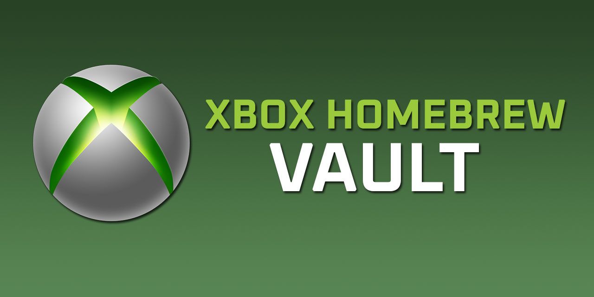
</p>

<p align="center">
  <a href="https://github.com/marcelofrau/xb-homebrew-vault/releases/latest"><strong>⬇️ Download Latest Release</strong></a>
  &nbsp;·&nbsp;
  <a href="https://xbvault.pages.dev"><strong>🌐 Website</strong></a>
  &nbsp;·&nbsp;
  <a href="https://github.com/marcelofrau/xb-homebrew-vault/issues">Report a Bug</a>
</p>

---

## What is this?

XB Homebrew Vault connects to your Xbox in [Developer Mode](https://wiki.sternserv.xyz/docs/xbox-setup/xbox-developer-mode-setup) over Wi-Fi and gives you a full desktop GUI to manage it — no Xbox dashboard required, no USB cables.

Browse and install from the full [Emulation Revival](https://emulationrevival.github.io) catalog, manage your installed packages, monitor performance in real time, and use tools that would otherwise require the Xbox Device Portal web UI.

---

## ✨ Features

| | Feature | Description |
|---|---------|-------------|
| 🔍 | **Catalog Browser** | Browse and search the Emulation Revival catalog — emulators, apps, ports, utilities — with category and compatibility filters |
| 📦 | **One-Click Install** | Auto-download, dependency resolution, and wireless upload to your Xbox |
| ⬇️ | **Custom Install Wizard** | Install `.appx`/`.msix`/`.zip` from local files or URLs — analysis, dependency check, dual progress bars |
| 🛠️ | **Dev Tools** | Screenshot capture, system info, process manager, network info, real-time CPU/GPU/RAM chart |
| 💾 | **USB Permission Wizard** | Prepare a USB drive for Xbox Dev Mode — auto-detect drives, apply NTFS permissions via icacls |
| 🔗 | **First-Run Setup Wizard** | Guided 3-step setup for first-time users — enter IP, credentials, test connection |
| 📁 | **File Explorer** | ✅ Browse, upload/download, delete, create folders over SSH/SFTP with dual-pane tree + list view |
| 🌙 | **Blades Theme** | Xbox 360-inspired dark theme with green accents |
| 🔐 | **Secure Credentials** | Obfuscated local storage — no cloud, no accounts, no telemetry |
| 📋 | **Activity Log** | Full in-app log with multi-select, copy, auto-scroll, and configurable log level |
| 🔬 | **XRay / Inspector** | Live Xbox log streaming and Lua REPL via TCP — connect to agents on ports 9000–9009, send commands, view real-time logs, run diagnostics |
| ⌨️ | **Keyboard Shortcuts** | Escape to close, Ctrl+Enter for quick actions — built-in shortcuts for common workflows |
| 📱 | **Mobile App (Android)** | Full portrait Android port — browse, sideload, file explorer, logs, tools, notifications and jobs on your phone |
| 🔗 | **QR Connect** | Share and receive your Xbox connection as a QR code |
| ⬆️ | **Sideload Wizard** | Install `.appx`/`.msix`/`.zip` from local files or indirect share links (GoFile, Google Drive, OneDrive) |
| 🔄 | **Smart Update Detection** | Version overrides resolve Xbox-manifest vs catalog version drift; 10+ matching strategies find updates without false positives |

---

## 📸 Screenshots

| | |
|---|---|
| **Catalog Browser** — Blades theme | **App Detail View** |
| 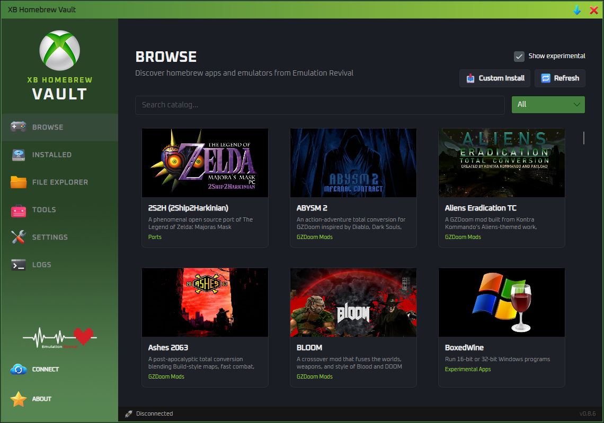 | 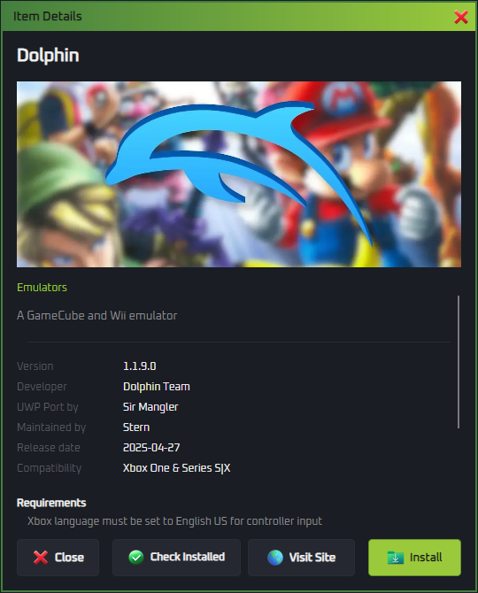 |

<details>
<summary>More screenshots</summary>

| | |
|---|---|
| **Installed Packages** | **Installing from Browse** |
| 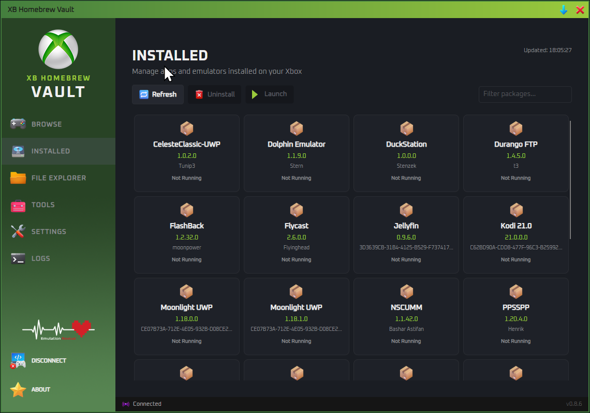 | 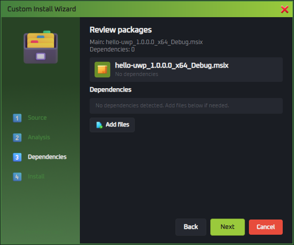 |
| **Install Complete** | **Custom Install Wizard** |
| 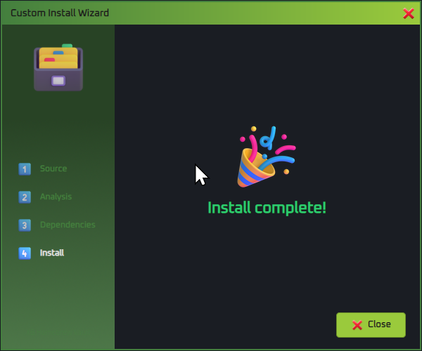 | 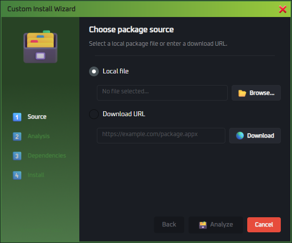 |
| **Confirm Uninstall** | **Not Connected** |
| 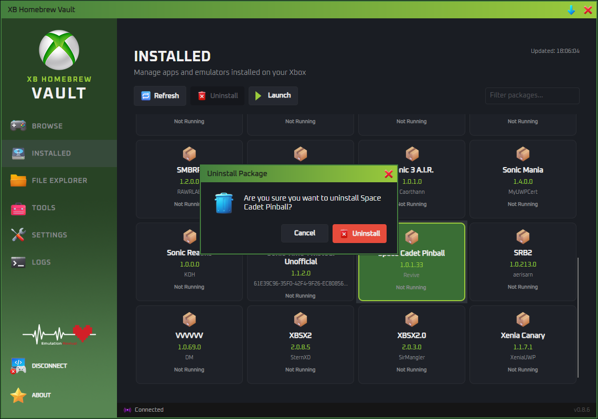 | 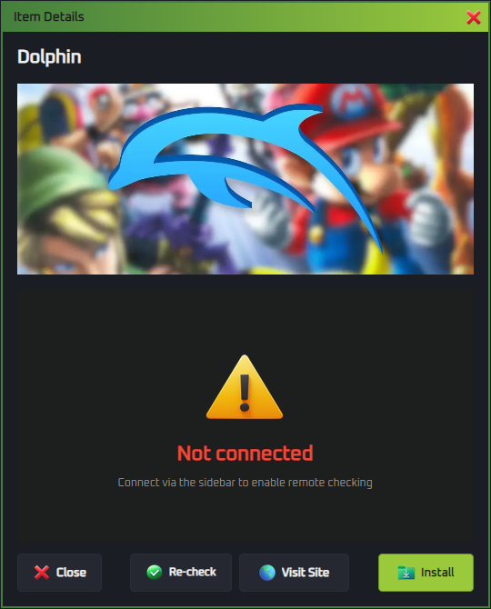 |
| **Connection Dialog** | **About Window** |
| 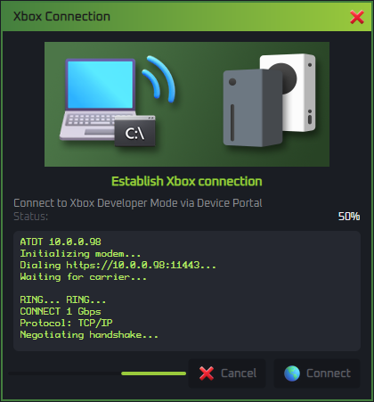 | 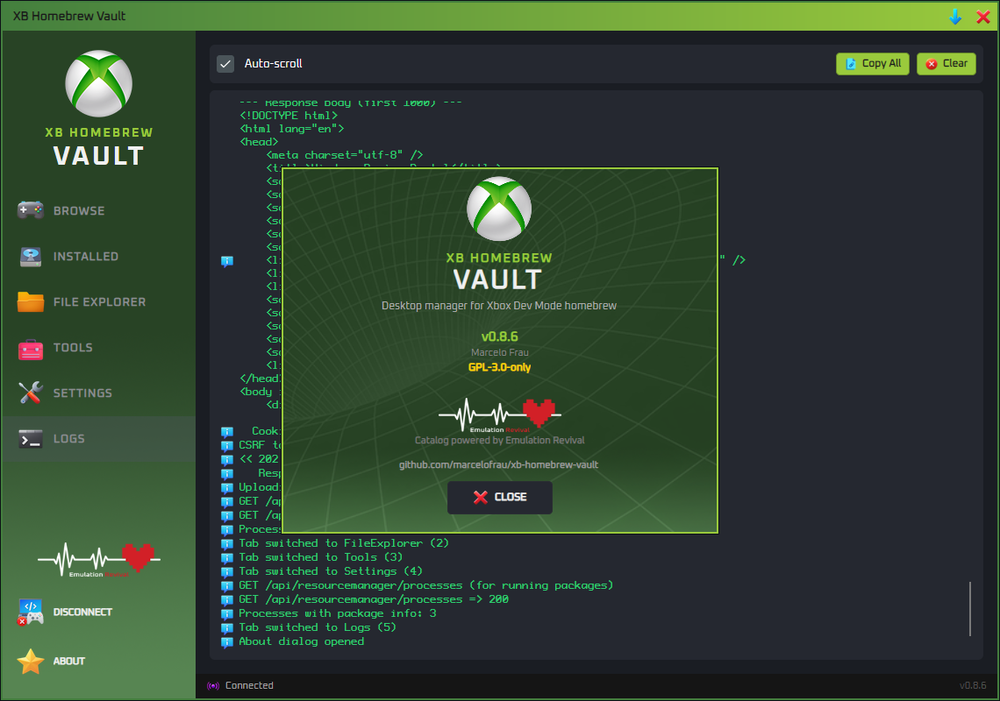 |
| **Dev Tools Panel** | **Performance Monitor** |
| 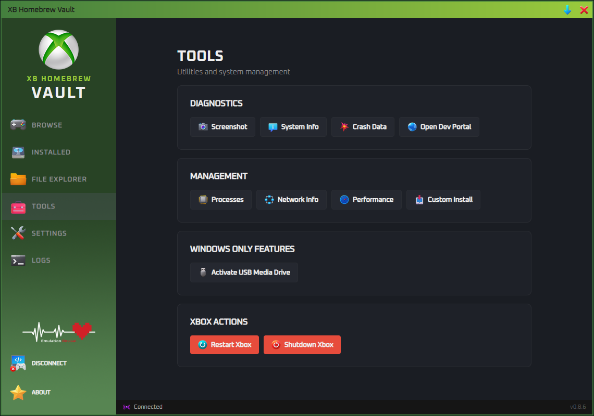 | 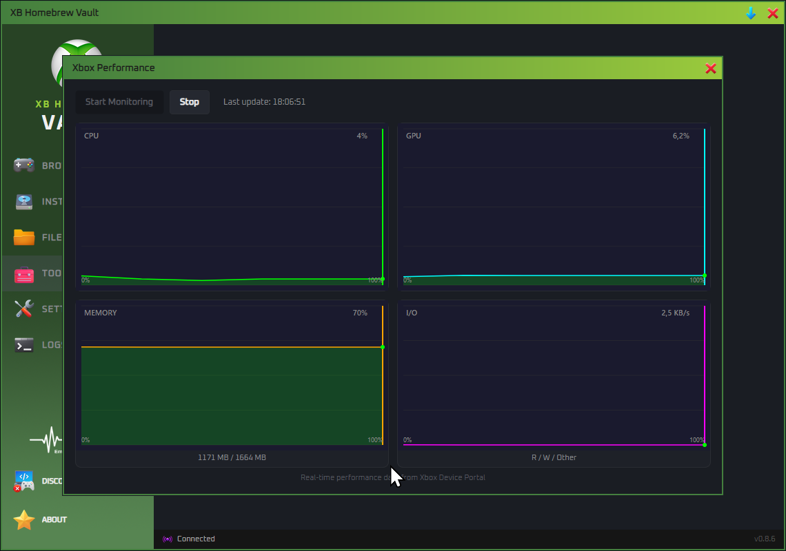 |
| **Process List** | **Screen Capture** |
| 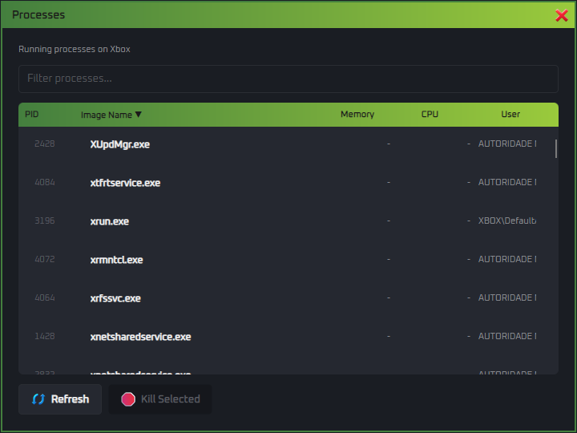 | 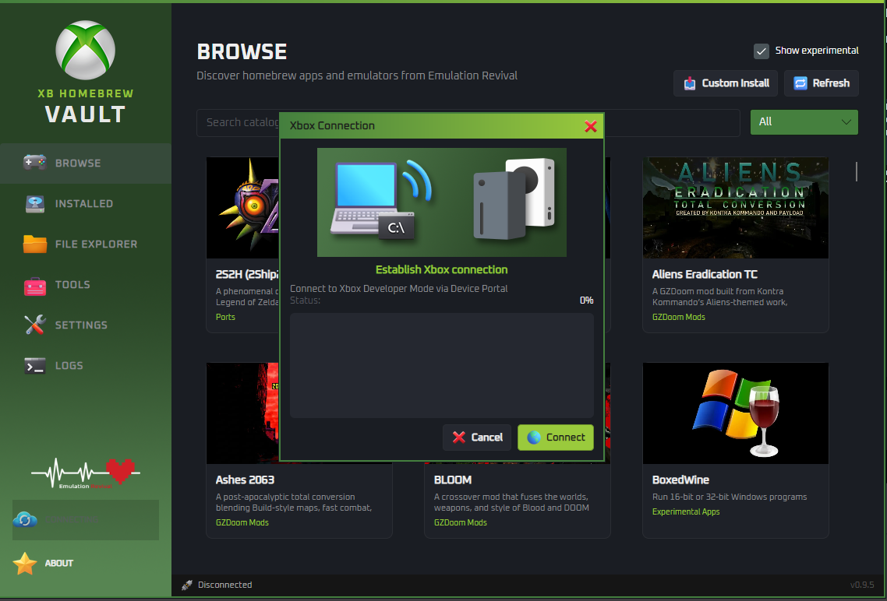 |
| **Discord Community** | **Multi-Option Install** |
| 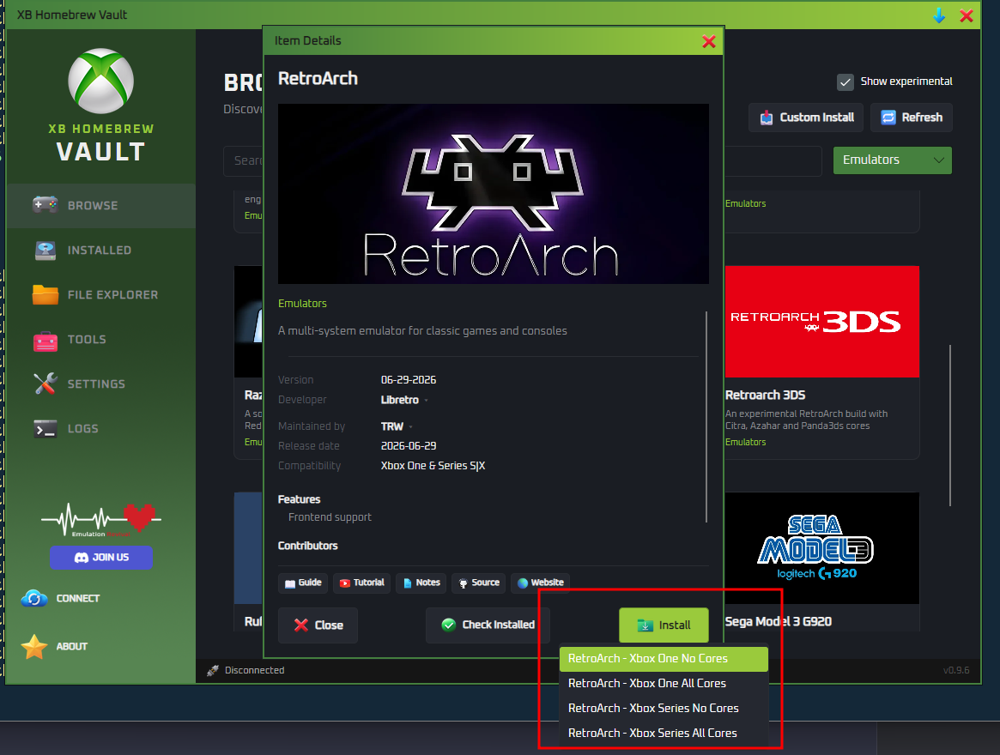 | 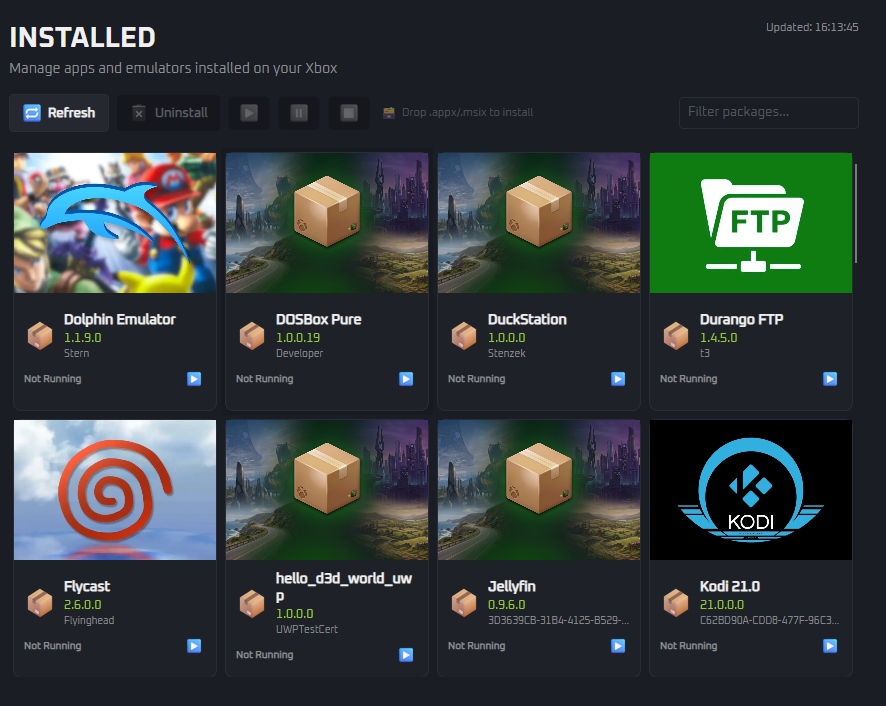 |
| **Contributor Links** | **Author Donations** |
| 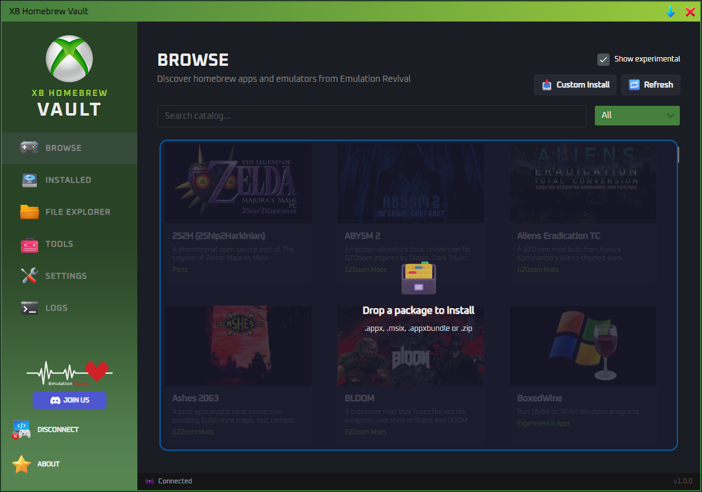 | 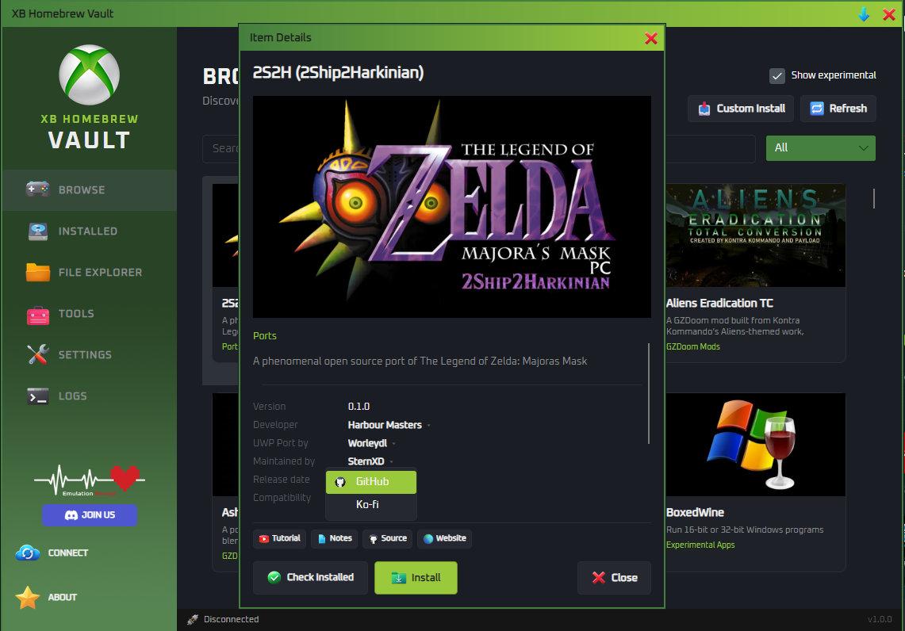 |

</details>

---

## 📥 Installation

### Quick start

1. Download the latest ZIP from the [Releases page](https://github.com/marcelofrau/xb-homebrew-vault/releases)
2. Extract and run `XBVault` — no install needed, fully self-contained
3. On first launch, the setup wizard guides you through connecting to your Xbox

**Releases available for:**
- `XBVault-v{version}-win-x64.zip` — Windows 10/11 x64
- `XBVault-v{version}-win-arm64.zip` — Windows on ARM (Snapdragon)
- `XBVault-v{version}-linux-x64.zip` — Linux x64
- `XBVault-v{version}-linux-arm64.zip` — Linux ARM64
- `XBVault-v{version}-osx-x64.zip` — macOS Intel
- `XBVault-v{version}-osx-arm64.zip` — macOS Apple Silicon
- `XBVault-v{version}-android-arm64.apk` — Android (ARM64 phones and tablets)

**On Android:** download the APK from the [Releases page](https://github.com/marcelofrau/xb-homebrew-vault/releases) and sideload it (allow "Install unknown apps" for your browser). The app runs entirely on-device — no phone-to-PC coupling needed.

### Prerequisites

- **Xbox One or Xbox Series S|X** in [Developer Mode](https://wiki.sternserv.xyz/docs/xbox-setup/xbox-developer-mode-setup)
- Xbox and device on the **same local network**
- Windows 10/11, macOS, Linux (x64), or Android 8+ (ARM64)

### Connect to your Xbox

1. Open **Settings** → enter your Xbox's IP address and Dev Mode credentials
2. Click **Test Connection** — green indicator means you're live
3. Browse the catalog and start installing

---

## 🗺️ Roadmap

| Phase | Status | Description |
|-------|--------|-------------|
| Connection & credentials | ✅ | Xbox Device Portal connect, settings, obfuscation, first-run wizard |
| Catalog browser | ✅ | Emulation Revival `catalog.json` API, search, filters, detail view |
| Package management | ✅ | Install, uninstall, dependency resolution, custom install wizard |
| Dev Tools | ✅ | Screenshot, system info, processes, network, performance chart |
| USB permission wizard | ✅ | WMI drive detection, icacls permission grant |
| File Explorer (SSH/SFTP) | ✅ | Browse, upload/download, delete, create folders — dual-pane tree + list |
| User Files portal browser | ✅ | REST-based portal browsing, rename/delete/new folder |
| X-Ray / Inspector | ✅ | TCP agent discovery, Lua REPL, live log streaming |
| Wizards | ✅ | X-Files enablement, Loopback Exempt manager, sideload |
| Cross-platform polish | ✅ | Windows/macOS/Linux x64+arm64, self-contained builds |
| Mobile app (Android) | ✅ | v2.0.0 — full portrait port, QR connect, sideload, file explorer |
| Update detection | ✅ | Overrides, 10+ match strategies, adaptive badges, per-app ignore |
| Modern runtime | ✅ | .NET 10 (LTS) — see the [migration notes](docs/architecture.md) |

See the full [Roadmap](https://xbvault.pages.dev/roadmap) for details and future plans.

---

## 🔬 XRay — Live Xbox Diagnostics

XB Homebrew Vault includes built-in support for [XRay](https://github.com/marcelofrau/xb-xray-py-connector), a lightweight TCP-based diagnostics agent for Xbox homebrew.

| Capability | Description |
|------------|-------------|
| **Agent Discovery** | Automatically scans ports 9000–9009 for XRay agents |
| **Lua REPL** | Send Lua commands directly to your Xbox — output streamed in real time |
| **Live Log Streaming** | View Xbox application logs as they happen |
| **Syntax Highlighting** | AvaloniaEdit-powered console with FiraCode Nerd Font |

XRay runs as a separate agent on your Xbox. XB Homebrew Vault discovers it and provides a built-in Inspector console for sending commands and viewing output — no separate tools needed.

[Learn more →](https://xbvault.pages.dev/inspector)

---

## 🧰 Tech Stack

| Layer | Technology |
|-------|-----------|
| Runtime | .NET 10 |
| UI Framework | Avalonia UI 12 |
| Architecture | MVVM — CommunityToolkit.Mvvm with source generators |
| Mobile | .NET Android (`net10.0-android36.0`, arm64) — same Avalonia codebase |
| Catalog API | Emulation Revival `catalog.json` |
| Xbox API | Xbox Device Portal (REST + WebSocket) |
| SSH/SFTP | SSH.NET 2026.0.0 |
| USB detection | WMI via `System.Management` (Windows) |

---

## 🏗️ Building from Source

Requires **.NET 10 SDK**.

```powershell
# Clone
git clone https://github.com/marcelofrau/xb-homebrew-vault.git
cd xb-homebrew-vault

# Run (development)
.\build\run.ps1

# Build release (produces self-contained ZIP)
.\build\build-release.ps1 -Version 2.0.4 -Arch x64

# Android release APK (signed, requires Android SDK + JDK 21)
.\build\build-release-android.ps1 -Version 2.0.4
```

## 🏛️ Project Structure

```
XBVault/
├── Models/        # Data models (CatalogItem, InstalledPackage, UsbDriveInfo…)
├── ViewModels/    # MVVM view models (CommunityToolkit source generators)
├── Views/         # Avalonia AXAML — desktop windows + Mobile* views (shared, cross-platform)
├── Services/      # Business logic & API clients
│   ├── XboxAuthService.cs          — Authentication & connection
│   ├── XboxPackageService.cs       — Package catalog & install
│   ├── XboxProcessService.cs       — Running processes & crash dumps
│   ├── XboxSystemService.cs        — System info & screenshots
│   ├── XboxNetworkService.cs       — Network & performance telemetry
│   ├── XboxPerformanceService.cs   — Real-time CPU/GPU/RAM WebSocket feed
│   ├── CatalogApiService.cs        — Emulation Revival catalog.json
│   ├── SftpService.cs / SftpTransferService.cs — SSH/SFTP file operations
│   ├── PackageOverrideService.cs   — Catalog overrides (embedded + remote version overrides)
│   ├── UrlResolverService.cs       — Indirect share links (GoFile, Google Drive, OneDrive)
│   ├── AutostartService.cs         — Launch apps on connect
│   └── SettingsService.cs          — Settings persistence
├── Controls/      # Custom UI controls (CdSpinner, IconTextBlock)
├── Converters/    # Value converters
└── Assets/        # Icons, fonts, themes

XBVault.Desktop/   # Windows/macOS/Linux desktop entry point
XBVault.Android/   # Android entry point (MainActivity, AndroidApp, csproj)
tests/             # xUnit test suite
build/             # Build & packaging scripts
docs/              # Documentation + Jekyll site source
```

> **Note:** `XboxDeviceService` was split into the six `Xbox*Service` classes above (see [docs/architecture.md](docs/architecture.md)). Mobile views share the desktop ViewModels and services — only the view layer is rebuilt for phones.

## 📦 Release Artifacts

Releases are built on tag push (`v*`) via GitHub Actions (Windows + Ubuntu + macOS matrix). Each release includes:

- `XBVault-{version}-win-x64.zip` — Windows self-contained
- `XBVault-{version}-win-arm64.zip` — Windows ARM64 self-contained
- `XBVault-{version}-linux-x64.zip` — Linux self-contained
- `XBVault-{version}-linux-arm64.zip` — Linux ARM64 self-contained
- `XBVault-{version}-osx-x64.zip` — macOS Intel
- `XBVault-{version}-osx-arm64.zip` — macOS Apple Silicon
- `XBVault-{version}-android-arm64.apk` — Android ARM64 (signed APK)

Windows, Linux and macOS ZIPs are self-contained (no runtime install needed); the Android APK is code-signed with the project's release keystore.

## 🙏 Thanks

Splash and About window backgrounds by **Johnson Martin** on [Unsplash](https://unsplash.com/@johnsonmartin).

### Emulation Revival

A heartfelt thank you to **MewLew** and the entire [Emulation Revival](https://emulationrevival.github.io) team.

XB Homebrew Vault wouldn't exist without their work. They built and maintain the whole infrastructure that makes Xbox Dev Mode homebrew accessible — curating the catalog, tracking compatibility, hosting the JSON API, and keeping everything up to date as new releases come out. The Browse experience in XBVault is powered entirely by what they built. If you find this app useful, go give their project some love too.

## 🎨 Icons

Icons by [Icons8](https://icons8.com) (3d-fluency & fluency styles), [Microsoft FluentUI Emoji](https://github.com/microsoft/fluentui-emoji), and [KyleBing retro console icons](https://github.com/KyleBing/retro-game-console-icons).

See [docs/attributions.md](docs/attributions.md) for full attribution.

## 📄 License

GNU General Public License v3.0 — see [LICENSE](LICENSE) for details.

---

<p align="center">
  <sub>⚠️ Not affiliated with Microsoft, Xbox, or Emulation Revival.</sub>
</p>
