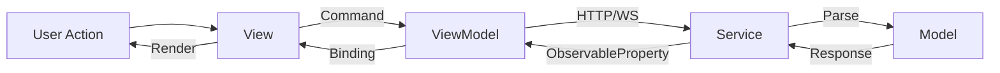
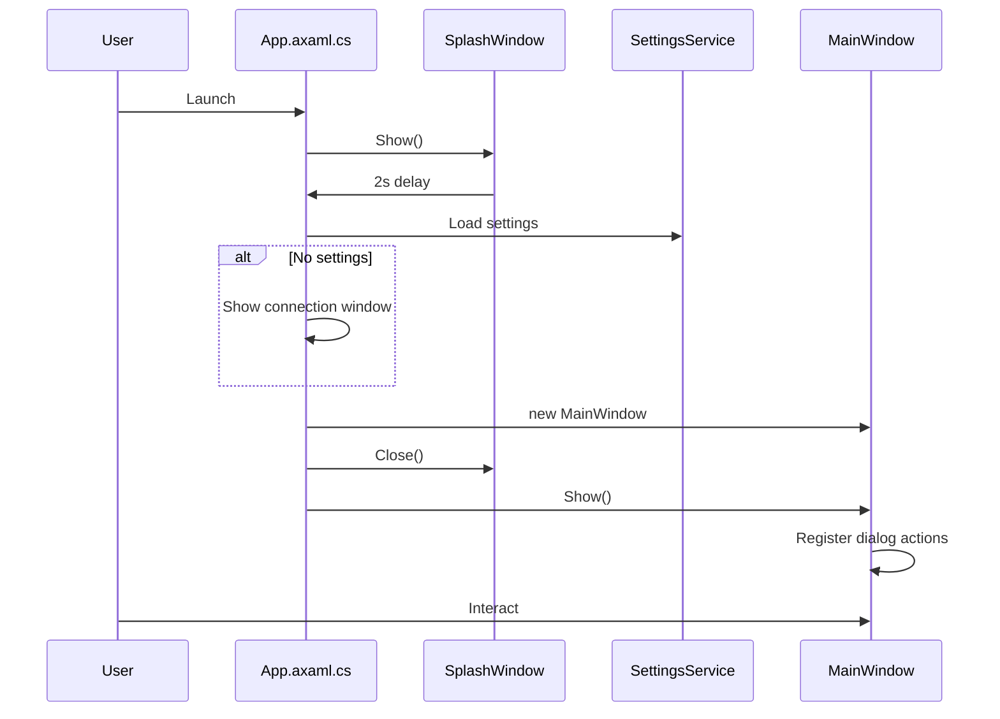
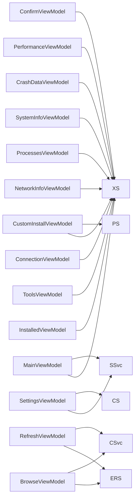
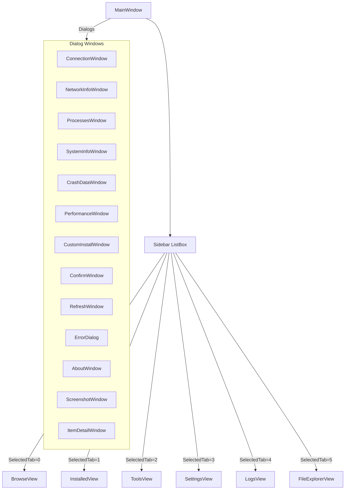

# Architecture

## Overview

XB Homebrew Vault uses the **MVVM** pattern with **CommunityToolkit.Mvvm** and **Avalonia UI**. It is a Windows desktop client communicating with an Xbox console in Developer Mode via the Windows Device Portal (WDP) REST API and WebSocket.

## Layered Architecture

```mermaid
graph TD
    subgraph Views["Views (Avalonia XAML)"]
        MW[MainWindow]
        SW[SplashWindow]
        BV[BrowseView]
        IV[InstalledView]
        SV[SettingsView]
        TV[ToolsView]
        LV[LogsView]
        FV[FileExplorerView]
        CW[ConnectionWindow]
        NIW[NetworkInfoWindow]
        PW[ProcessesWindow]
        SIW[SystemInfoWindow]
        CDW[CrashDataWindow]
        PerfW[PerformanceWindow]
        SS[SetupWindow — removed dead]
    end

    subgraph ViewModels["ViewModels (CommunityToolkit.Mvvm)"]
        MVM[MainViewModel]
        BVM[BrowseViewModel]
        IVM[InstalledViewModel]
        SVM[SettingsViewModel]
        TVM[ToolsViewModel]
        CVM[ConnectionViewModel]
        NIVM[NetworkInfoViewModel]
        PVM[ProcessesViewModel]
        SIVM[SystemInfoViewModel]
        CDVM[CrashDataViewModel]
        PerfVM[PerformanceViewModel]
        RVM[RefreshViewModel]
        ConfVM[ConfirmViewModel]
        CIWM[CustomInstallViewModel]
    end

    subgraph Services["Services"]
        XS[XboxDeviceService]
        ERS[EmulationRevivalService]
        PS[PackageInstallService]
        SSvc[SettingsService]
        CS[CryptoService]
        CSvc[CacheService]
        L[Logger]
    end

    subgraph Models["Models"]
        CI[CatalogItem]
        IP[InstalledPackage]
        PI[ProcessInfo]
        NI[NetworkInfo]
        SI[SystemInfo]
        CD[CrashDumpInfo]
        PSnap[PerformanceSnapshot]
        XC[XboxConnection]
        AS[AppSettings]
        IPI[InstallProgressInfo]
    end

    Views --> ViewModels
    ViewModels --> Services
    Services --> Models
```



## Data flow



## App startup flow



## ViewModel → Service dependency map



## Navigation



## Xbox WDP API Integration

`XboxDeviceService` communicates with the Xbox Developer Mode Device Portal:

| Endpoint | Method | Purpose |
|----------|--------|---------|
| `/api/os/info` | GET | Device info, connection test |
| `/api/app/packagemanager/packages` | GET | List installed packages |
| `/api/app/packagemanager/package` | POST | Install package |
| `/api/app/packagemanager/package` | DELETE | Uninstall package |
| `/api/taskmanager/app` | POST | Launch app by PackageRelativeId |
| `/api/taskmanager/app/state` | POST | Suspend/resume/terminate package |
| `/api/resourcemanager/processes` | GET | List running processes |
| `/api/taskmanager/process` | DELETE | Kill process by PID |
| `/ext/app/runningtitle` | GET | Get currently running title |
| `/api/app/debug/crashdump` | GET | List crash dumps |
| `/api/app/debug/crashdump/{filename}` | DELETE | Delete crash dump |
| `/api/app/debug/crashcontrol` | GET | Get crash dump settings |
| `/api/app/debug/crashcontrol` | POST | Enable/disable crash dumps |
| `/api/networking/networkconfig` | GET | Get network configuration |
| `/api/wifi/interfaces` | GET | List WiFi interfaces |
| `/api/wifi/networks/{guid}` | GET | List WiFi networks |
| `/api/system/info` | GET | Get system information |
| `/api/screenshot` | GET | Capture screenshot |
| `/api/system/restart` | POST | Restart Xbox |
| `/api/system/shutdown` | POST | Shutdown Xbox |
| `/api/resourcemanager/processes` | GET | Performance data |

Authentication: HTTP Basic Auth (username/password set in Xbox Dev Mode).

## Performance WebSocket

`XboxDeviceService` connects to a WebSocket endpoint for real-time performance:

```
wss://{xbox-ip}:11443/api/resourcemanager/processes
```

Receives JSON frames with `PerformanceSnapshot` data (CPU, memory, GPU, temperature per core).

## Emulation Revival Scraping

`EmulationRevivalService` fetches catalog from 7 static HTML pages on `https://emulationrevival.github.io/`:

- `/xbox-dev-mode/emulators.html`
- `/xbox-dev-mode/frontends.html`
- `/xbox-dev-mode/ports.html`
- `/xbox-dev-mode/apps.html`
- `/xbox-dev-mode/experimental-apps.html`
- `/xbox-dev-mode/media-apps.html`
- `/xbox-dev-mode/utilities.html`

Each page is parsed via HtmlAgilityPack into `CatalogItem` models. Results are cached by `CacheService`.

## Settings Persistence

`SettingsService` stores configuration JSON at `%APPDATA%/XBVault/settings.json`. Passwords are obfuscated using salt+XOR+Base64 via `CryptoService`.

## Window pattern

All dialog windows use a shared template:

- `WindowDecorations="None"` — no OS chrome
- `Background="{StaticResource SurfaceBrush}"` — dark gray #1A1D23
- Root `<Border>` with `BorderBrush="#447F3E" BorderThickness="2" Margin="1"` — green border + 1px gap
- Title bar with green gradient + close button (red hover #CC3333)
- Content area padded at 20px
- Drag via `PointerPressed="OnTitleBarPointerPressed"` + `BeginMoveDrag()`
- Close via `OnCloseClick` + `Close()`
