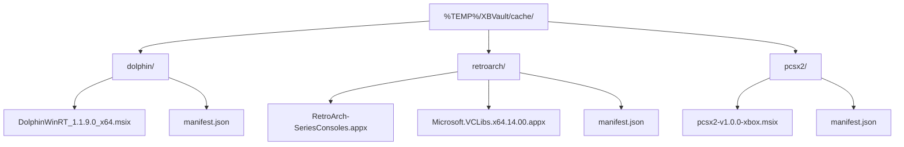

# Data Sources

## Emulation Revival

### Base URL

```
https://emulationrevival.github.io
```

### Catalog Pages

| Page | URL | Category |
|------|-----|----------|
| Emulators | `/xbox-dev-mode/emulators.html` | Emulator |
| Frontends | `/xbox-dev-mode/frontends.html` | Frontend |
| Game Ports | `/xbox-dev-mode/ports.html` | GamePort |
| Apps | `/xbox-dev-mode/apps.html` | App |
| Experimental | `/xbox-dev-mode/experimental-apps.html` | Experimental |
| Media | `/xbox-dev-mode/media-apps.html` | Media |
| Utilities | `/xbox-dev-mode/utilities.html` | Utility |

### Card Data Extracted Per Item

| Field | HTML Source |
|-------|-------------|
| Name | `h3` inside card |
| Description | First paragraph after h3 |
| Version | List item: "Version:" text |
| Release date | List item: "Release date:" text |
| Developer | List item: "Developer:" text |
| Download URL | `a[href]` with download text |
| Source URL | GitHub icon link |
| Compatibility | List item: "Compatibility:" text |
| Requirements | List item: "Requires:" text |
| Features | List item: "Features:" text |
| Image | `img` inside card |

### Parsing Method

HtmlAgilityPack with XPath/CSS selectors targeting the card structure. Pages use a consistent HTML pattern.

## Package Cache

Downloaded packages are stored in `%TEMP%/XBVault/cache/`:



`manifest.json` stores parsed metadata and dependency info so reinstalls don't need re-download:

```json
{
  "name": "RetroArch",
  "version": "1.16.0",
  "category": "Emulator",
  "packageFile": "RetroArch-SeriesConsoles.appx",
  "dependencies": ["Microsoft.VCLibs.x64.14.00.appx"],
  "sourceUrl": "https://emulationrevival.github.io/..."
}
```
