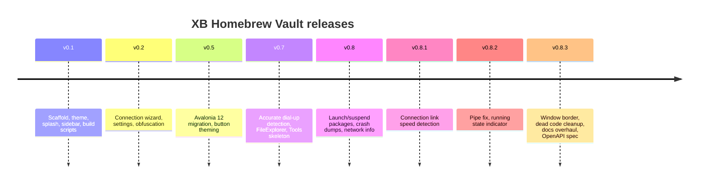
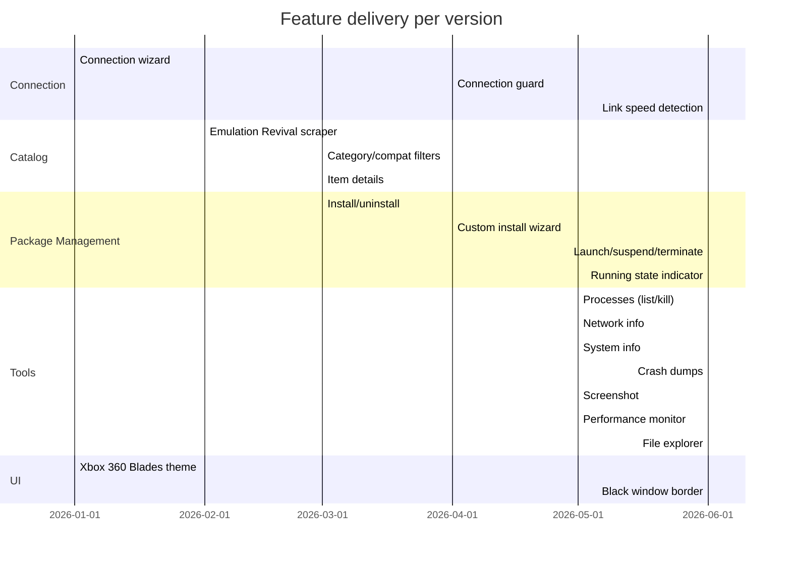
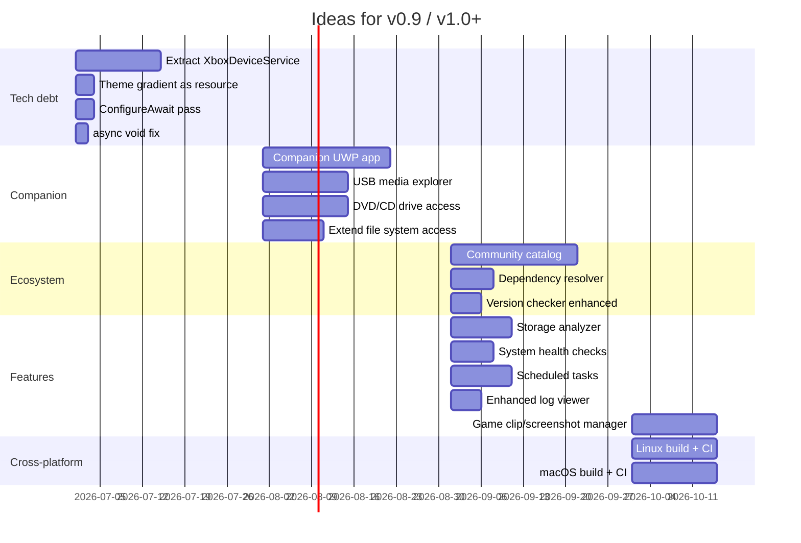

# Roadmap

## Version history

## Released features

## Current state

**Version:** v0.8.3 (bugfix)

The app is feature-complete for daily homebrew management on Xbox Dev Mode.

## Future ideas

### v0.9 — Tech debt & polish

- Break `XboxDeviceService` into smaller domain services
- Theme gradient + close button extracted as `StaticResource` / UserControl
- `ConfigureAwait(false)` audit
- Remove `async void` from code-behinds

### v1.0 — Companion app & ecosystem

**Companion UWP (runs on Xbox in Dev Mode):**
- USB media explorer — navigate pendrives/HDs, copy ROMs/saves
- DVD/CD drive access — read disc content, extract files
- Extended file system access — beyond WDP (`X:\`, `D:\`, restricted paths)

**Community & automation:**
- Community catalog — curated homebrew repo, click-to-install
- Dependency resolver — auto-install VC++ runtimes, .NET, etc.
- Enhanced version checker — compare installed vs catalog, 1-click update
- Scheduled tasks — recurring restart/shutdown/scrape/backup

**Tools:**
- Storage analyzer — pie chart per-app, temp/cache cleanup
- System health checks — ping, latency, storage, memory overview
- Enhanced log viewer — Xbox real-time logs, filter, search, export
- Game clip/screenshot manager — download captures from Xbox

### v?.?.? — Mid/long term

- **Cross-platform**: Linux + macOS (see `CROSS-PLATFORM-PORTING.md`)
- **Media player streaming**: play Xbox media on PC over network
- **Xbox Remote Play**: stream Xbox screen to PC (ultimate goal)
