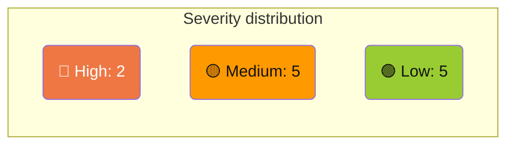

# Technical Debt

Items identified across the codebase, ordered by severity.

## 🔴 High

### 1. XboxDeviceService — God class

`XBVault/Services/XboxDeviceService.cs` — 1033 lines, 22+ public methods.

**Problems:**
- Mixes HTTP methods, WebSocket, parsing, logging
- Handles too many domains: packages, processes, crash dumps, network, system info, screenshots, performance WS, restart/shutdown
- Every new feature adds another method to the same class

**Recommendation:** Split into:
- `XboxPackageService` (install, uninstall, launch, suspend, terminate, list)
- `XboxProcessService` (list, kill, running title)
- `XboxCrashService` (list, delete, crash control)
- `XboxNetworkService` (network config, wifi)
- `XboxSystemService` (system info, restart, shutdown, screenshot)
- `XboxPerformanceService` (WebSocket connection, snapshot parsing)

### 2. ~~`_Backup/` directory tracked in git~~ ✅ Resolved (v0.8.3)

Removed from tracking, added to `.gitignore`, deleted from disk.

## 🟡 Medium

### 3. Border CornerRadius does not clip Image with UniformToFill (Avalonia 12.0.0)

BrowseView + ItemDetailWindow: `Border CornerRadius="8,8,0,0"` with `Image Stretch="UniformToFill"` inside does not clip the image to the rounded corners. Image corners "bleed through" the Card border.

**Attempts that did not work:**
- Overlay `Border` with stroke on top (masked but hover was "behind")
- Separate `Border` for Image with `CornerRadius` (Avalonia did not clip)
- `ClipToBounds="True"` combined (clips rectangle, not rounded)

**Suggested next step:**
- Apply `Clip` geometry via code-behind (`RectangleGeometry` with `RadiusX/Y` bound to `ActualWidth/ActualHeight`)
- Or migrate to `ImageBrush` with `CornerRadius` in a `Border` (different render path)
- Check if Avalonia 11.1+ fixes this (project uses 12.0.0)

### 4. Title bar gradient duplicated in 14 windows

The same `LinearGradientBrush` (#447F3E → #9ACA3C) is defined **inline** in every dialog window plus MainWindow, some twice (title bar + table header).

**Recommendation:** Extract as a named `StaticResource` in `BladesTheme.axaml`:
```xml
<LinearGradientBrush x:Key="TitleGradient" StartPoint="0%,0%" EndPoint="100%,0%">
  <GradientStop Color="#447F3E" Offset="0"/>
  <GradientStop Color="#9ACA3C" Offset="1"/>
</LinearGradientBrush>
```

### 5. Close button template duplicated in 14 windows

The same `<Button>` with inline styles (`#CC3333` hover, 32×32, transparent default) is copied into every window.

**Recommendation:** Create a reusable `WindowCloseButton` style or UserControl with the red hover behavior.

### 6. `async void` in code-behind (fire-and-forget)

4 event handlers use `async void` (dangerous — unhandled exceptions crash the process):

| File | Method |
|------|--------|
| `Views/ConnectionWindow.axaml.cs:37` | `OnConnectionCompleted` |
| `Views/ErrorDialog.axaml.cs:60` | `OnCopyClick` |
| `Views/LogsView.axaml.cs:41` | `OnCopyClick` |
| `Views/NetworkInfoWindow.axaml.cs:15` | `OnLoaded` |

**Recommendation:** Wrap body in `Task.Run` or use a safe `FireAndForget` helper with exception logging.

### 7. No `ConfigureAwait(false)` anywhere

Zero instances of `.ConfigureAwait(false)` across the entire codebase.

**Recommendation:** Add to all service-layer `await` calls (HTTP, file I/O, WebSocket) where the continuation does not need the UI context. Skip in ViewModel code that updates `ObservableProperty`.

## 🟢 Low

### 8. Hardcoded magic delays

`Task.Delay(ms)` with inline magic numbers:

| File | Values |
|------|--------|
| `ConnectionViewModel.cs` | 300, 500, 400, 600, 250, 350 (multiple) |
| `XboxDeviceService.cs` | 2000, 3000 |
| `SettingsViewModel.cs` | 3000 |
| `RefreshViewModel.cs` | 200 |
| `CustomInstallViewModel.cs` | 1000 |

**Recommendation:** Name as `const int` with a descriptive identifier.

### 9. `App.axaml.cs` — 349 lines

The main application startup file registers every dialog action inline (about, connect, refresh, custom install, browse detail, etc.), making it hard to navigate.

**Recommendation:** Extract dialog registration into a separate `DialogRegistry` class or push registration into each ViewModel's constructor.

### 10. `PerformanceSnapshot.cs:78` — catch with no log

```csharp
catch (Exception ex)
{
    result = null; // no Logger call
}
```

All other `catch (Exception ex)` blocks in Services log via `Logger.Error(ex, ...)`. This one silently swallows.

### 11. `DllImport` in Logger (Windows-only)

`XBVault/Services/Logger.cs:150` uses `[DllImport("kernel32.dll")]` for `AttachConsole`. This blocks Linux/macOS portability.

**Recommendation:** Guard with `RuntimeInformation.IsOSPlatform(OSPlatform.Windows)` or provide a no-op fallback.

### 12. Orphaned `_Backup` icons after SetupWindow removal

`Assets/_Backup/Icons/setup-save-continue.ico` and `setup-test-connection.ico` reference the removed SetupWindow. Harmless but unused.

## Summary



**Effort estimate:**

| Severity | Items | Estimated effort |
|----------|-------|-----------------|
| 🔴 High | 2 | 2–4 hours |
| 🟡 Medium | 5 | 5–10 hours |
| 🟢 Low | 5 | 2–4 hours |
| **Total** | **12** | **9–18 hours** |
