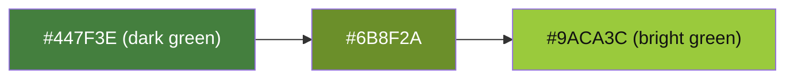

# Xbox 360 Blades Theme

## Color Palette

| Token | Hex | Usage |
|-------|-----|-------|
| `BladesBg` | `#0D1117` | Main window background |
| `BladesSurface` | `#1A1D23` | Dialog window background |
| `BladesSurfaceAlt` | `#252830` | Card/list backgrounds |
| `BladesSurfaceHover` | `#2F333A` | Hover state |
| `BladesAccent` | `#9ACA3C` | Primary accent (Xbox 360 green) |
| `BladesAccentDim` | `#6B8F2A` | Accent dimmed |
| `BladesAccentGlow` | `#B5E665` | Accent hover glow |
| `BladesText` | `#F0F0F0` | Primary text |
| `BladesTextMuted` | `#8B8D91` | Secondary text |
| `BladesTextDim` | `#5A5C60` | Disabled/labels |
| `BladesDanger` | `#E74C3C` | Destructive actions |
| `BladesSuccess` | `#2ECC71` | Success indicators |
| `BladesWarning` | `#F39C12` | Warnings |
| `BladesBorder` | `#2A2D33` | Borders, dividers |
| `BladesCardBg` | `#1E2128` | Card backgrounds |
| `BladesSidebarBg` | `#0A0C0F` | Sidebar background |
| `BladesInputBg` | `#0F1F0F` | Input background |
| `BladesInputBorder` | `#4A7A20` | Input border |
| `BladesInputBorderHover` | `#6B8F2A` | Input border hover |

```mermaid
%%{init: {'theme': 'base', 'themeVariables': {'background': '#0D1117'}}}%%
packedBubble
    titleColors
    BladesBg_0D1117: #0D1117
    BladesSurface_1A1D23: #1A1D23
    BladesSurfaceAlt_252830: #252830
    BladesSurfaceHover_2F333A: #2F333A
    BladesAccent_9ACA3C: #9ACA3C
    BladesAccentDim_6B8F2A: #6B8F2A
    BladesAccentGlow_B5E665: #B5E665
    BladesText_F0F0F0: #F0F0F0
    BladesTextMuted_8B8D91: #8B8D91
    BladesTextDim_5A5C60: #5A5C60
    BladesDanger_E74C3C: #E74C3C
    BladesSuccess_2ECC71: #2ECC71
    BladesWarning_F39C12: #F39C12
    BladesBorder_2A2D33: #2A2D33
    BladesCardBg_1E2128: #1E2128
    BladesSidebarBg_0A0C0F: #0A0C0F
    BladesInputBg_0F1F0F: #0F1F0F
    BladesInputBorder_4A7A20: #4A7A20
    BladesInputBorderHover_6B8F2A: #6B8F2A
```

## Title bar gradient

All dialog windows use the same gradient on the title bar:



- Direction: horizontal (`StartPoint="0%,0%" EndPoint="100%,0%"`)
- Title text on gradient: `#1A1A1A` (dark text)
- Close button on gradient: transparent bg, `#CC3333` on hover

## Typography

- **Title font**: Oxanium (Bold: 700) — loaded from `Assets/Fonts/Oxanium-700.ttf`
- **Body font**: Oxanium (Regular: 400) — loaded from `Assets/Fonts/Oxanium-400.ttf`
- **Mono font**: ProFontWindows Nerd Font — loaded from `Assets/Fonts/ProFontWindowsNerdFont-Regular.ttf`
- **Fallback**: Inter (via `Avalonia.Fonts.Inter`), Segoe UI, sans-serif

## Window border

All `WindowDecorations="None"` windows have a 1px margin exposing the window background
(contrast border) and a 2px `#447F3E` inner border.

## Component Styles

| Component | Style |
|-----------|-------|
| Buttons | Rounded (4px), dark bg, green accent on hover |
| Text boxes | Dark bg, green border on focus |
| Cards | Elevated dark surface, subtle border |
| Scrollbars | Thin, dark track, lighter thumb |
| Progress bars | Green indeterminate animation |

## Inspiration

The color scheme is inspired by the **Xbox 360 Original Dashboard (Blades)**, featuring:
- Dark backgrounds with green accents
- High contrast text hierarchy
- Sidebar navigation with blade-style selection indicator
- Subtle glow effects on accent elements
