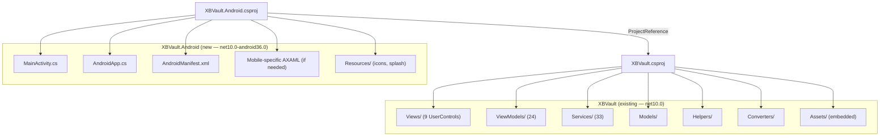
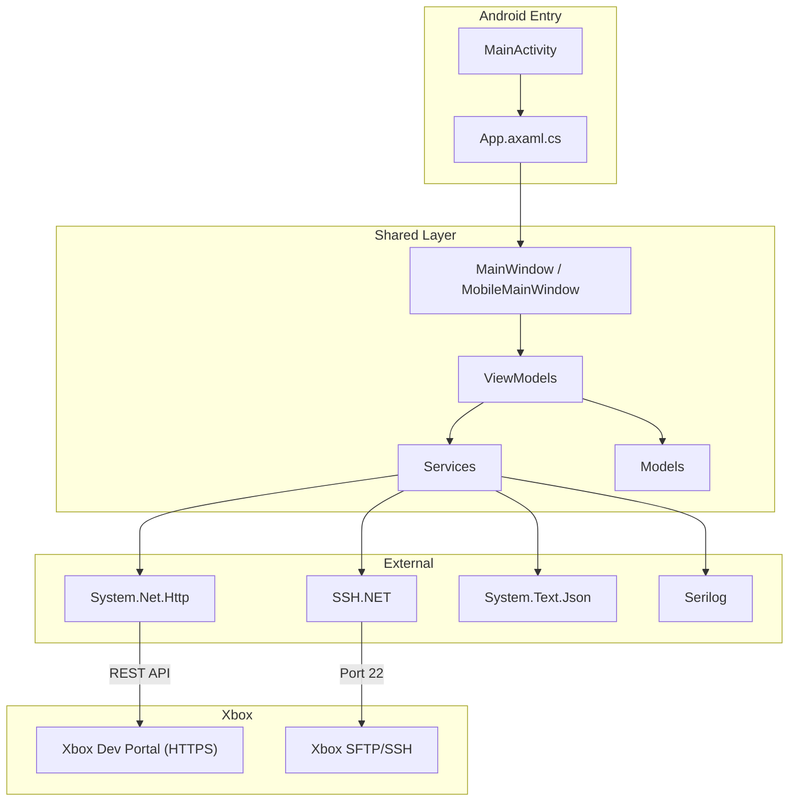
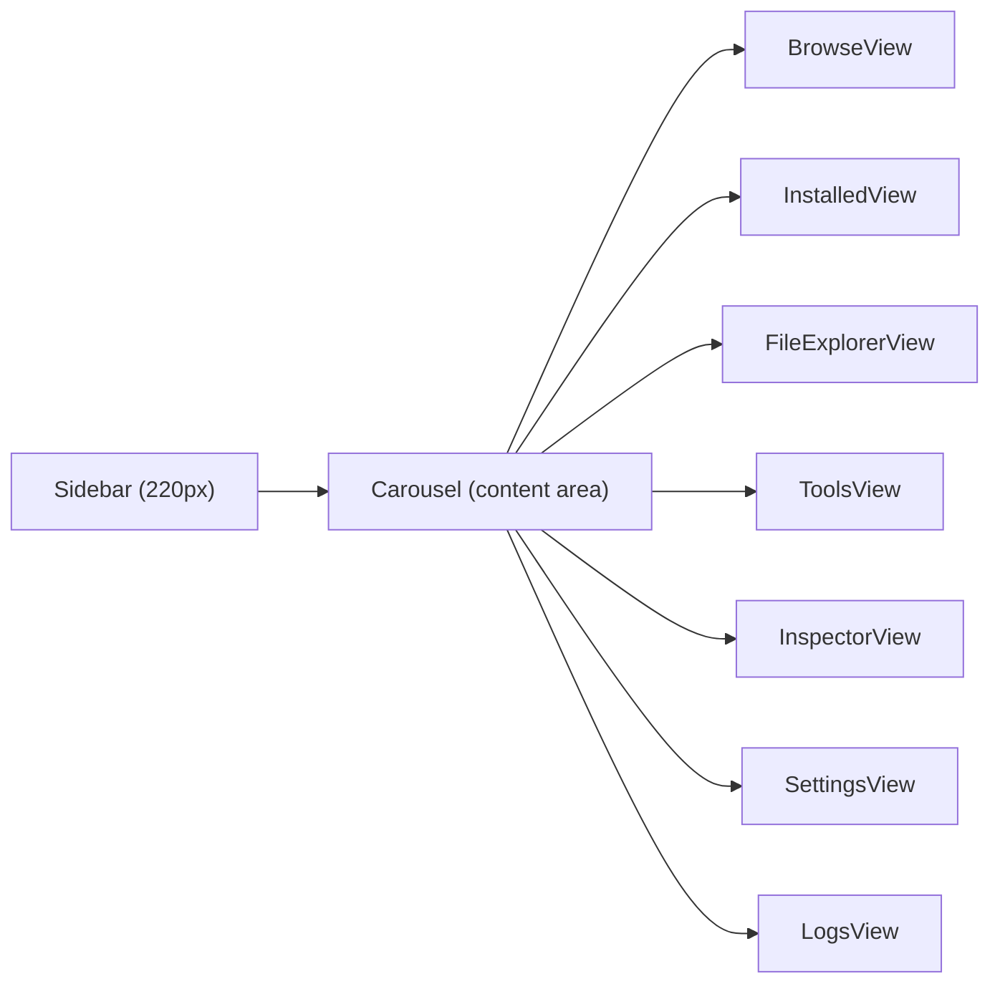
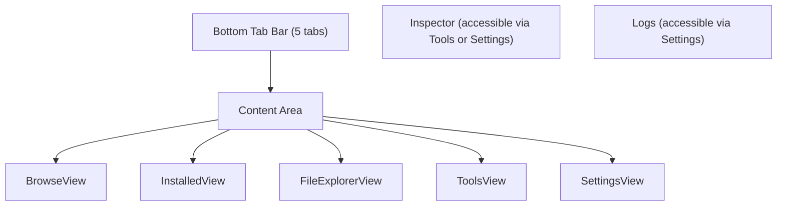

# Architecture — Android Port

## Design Decision: Separate Project

The Android port uses a **separate project** (`XBVault.Android`) rather than multi-targeting the existing `XBVault.csproj`. Rationale:

| Approach | Pros | Cons |
|----------|------|------|
| **Separate project** (chosen) | Clean build — no Windows-only packages polluting Android builds; independent CI; no risk of breaking desktop | Some shared code duplication in project file |
| Multi-target in same csproj | Single project to maintain | `Avalonia.Desktop`, `System.Management`, `Tmds.DBus` all pulled into Android builds; complex conditional compilation; risk of breaking desktop |

The shared code (ViewModels, Services, Models, Helpers) lives in the existing `XBVault` project and is consumed via `<ProjectReference>`.

> **BLOCKER — NETSDK1150 (discovered during Phase 0):**
> The desktop project (`XBVault.csproj`) has `OutputType=Exe` (non-self-contained). The Android project is self-contained by default. .NET **does not allow** a self-contained executable to reference a non-self-contained executable.
>
> **Required fix (after refactoring branch merges):** Extract shared code into `XBVault.Shared` (OutputType=Library, net10.0). Both desktop and Android heads reference it. This is the standard Avalonia multi-platform pattern. See [05-implementation-plan.md](05-implementation-plan.md) Phase 0 tasks for details.

## Project Structure



## Dependency Flow



## Entry Point — Android vs Desktop

### Desktop (`Program.cs`)

```
Main(args)
  → Parse CLI args (--help, --console, --reset-data, --check)
  → Logger.AttachConsole()
  → Single-instance Mutex
  → PreFlightChecker.Run()
  → BuildAvaloniaApp().StartWithClassicDesktopLifetime(args)
```

### Android (`MainActivity.cs` + `AndroidApp.cs`)

```csharp
// AndroidApp.cs
[Application]
public class AndroidApp : AvaloniaAndroidApplication<App>
{
    protected AndroidApp(IntPtr javaReference, JniHandleOwnership transfer)
        : base(javaReference, transfer) { }
}

// MainActivity.cs
[Activity(Label = "XBVault",
          Theme = "@style/MainTheme",
          MainLauncher = true,
          ConfigurationChanges = ConfigChanges.ScreenSize | ConfigChanges.Orientation)]
public class MainActivity : AvaloniaMainActivity
{
}
```

Key differences:
- **No CLI arg parsing** — Android has no console
- **No single-instance mutex** — Android manages activity lifecycle
- **No PreFlightChecker console output** — health checks run silently
- **No `StartWithClassicDesktopLifetime`** — Android uses its own lifecycle via `AvaloniaMainActivity`
- `App.OnFrameworkInitializationCompleted()` runs the same service initialization

## Navigation Architecture

### Desktop: Sidebar + Carousel



### Mobile: Bottom Tab Bar + Content Area



The `MainViewModel.SelectedTab` index maps to both navigation systems — the Carousel binding works identically; only the visual chrome changes.

## Dialog Strategy

### Desktop: `ShowDialog()` (separate Window)

All 21 dialog views inherit from `Window` and are opened via `ShowDialog(mainWindow)`. This creates a new OS window with its own chrome.

### Mobile: Embedded pages or fullscreen overlays

On Android, dialogs are rendered as:

1. **Fullscreen pages** — pushed onto a navigation stack within the content area
2. **Bottom sheets** — for simple confirms/inputs (ConfirmWindow, InputDialog, DeleteConfirmWindow)
3. **Reused UserControls** — some Window-based dialogs may be converted to UserControls for mobile embedding

The `ShowDialog()` calls in ViewModels will be routed through a platform-aware dialog service that decides the presentation.

## Shared Resources

Both projects share:
- **Assets/** — all embedded AvaloniaResource images, icons, themes
- **BladesTheme.axaml** — custom theme (Xbox/green styling)
- **Converters/** — BoolInverseConverter, StringNotEmptyConverter, etc.
- **Models/** — ToastHost, NotificationAction, AppSettings, etc.

No resource duplication needed — the `XBVault` project is referenced as a dependency.

## Android-Specific Files

| File | Purpose |
|------|---------|
| `XBVault.Android/MainActivity.cs` | Android activity entry point |
| `XBVault.Android/AndroidApp.cs` | Avalonia Android application class |
| `XBVault.Android/AndroidManifest.xml` | Permissions (INTERNET, ACCESS_NETWORK_STATE), min SDK, screen config |
| `XBVault.Android/Resources/` | Android-native splash screen, launcher icons |
| `XBVault.Android/Styles/` | Android theme overrides if needed |

## Package References

### XBVault.Android.csproj

```xml
<Project Sdk="Microsoft.NET.Sdk">
  <PropertyGroup>
    <TargetFramework>net10.0-android36.0</TargetFramework>
    <OutputType>Exe</OutputType>
    <SupportedOSPlatformVersion>21</SupportedOSPlatformVersion>
  </PropertyGroup>

  <ItemGroup>
    <PackageReference Include="Avalonia" Version="12.0.0" />
    <PackageReference Include="Avalonia.Android" Version="12.0.0" />
    <PackageReference Include="Avalonia.Themes.Fluent" Version="12.0.0" />
    <PackageReference Include="Avalonia.Fonts.Inter" Version="12.0.0" />
  </ItemGroup>

  <ItemGroup>
    <ProjectReference Include="..\XBVault\XBVault.csproj" />
  </ItemGroup>
</Project>
```

**Not included** (desktop-only):
- `Avalonia.Desktop` — desktop platform support
- `Avalonia.AvaloniaEdit` — code editor (mobile feature TBD)
- `System.Management` — WMI (Windows only)
- `Tmds.DBus.Protocol` — Linux D-Bus
