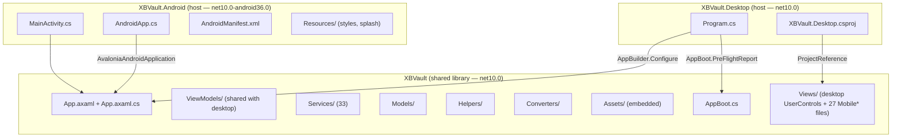
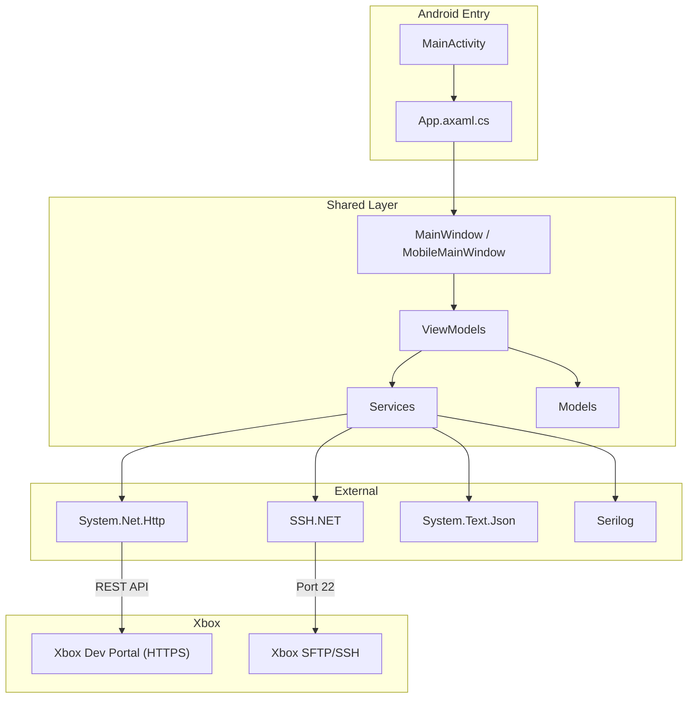
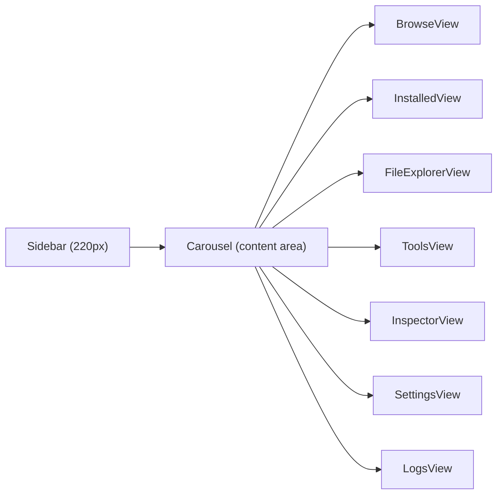
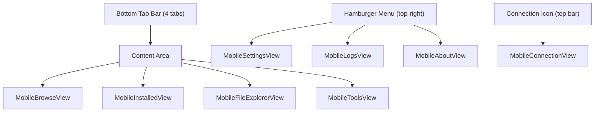

# Architecture — Android Port

## Design Decision: 3-Project Structure

The Android port uses the **canonical Avalonia multi-platform pattern** — a shared library + platform-specific hosts:

| Project | Type | Target | Purpose |
|---------|------|--------|---------|
| `XBVault/` | Library | net10.0 | Shared code: Views, ViewModels, Services, Models, Assets |
| `XBVault.Desktop/` | Exe | net10.0 | Desktop host: `Program.cs` (entry point, CLI, mutex) |
| `XBVault.Android/` | Exe | net10.0-android36.0 | Android host: `MainActivity.cs`, `AndroidApp.cs` |
| `tests/XBVault.Tests/` | Library | net10.0 | xUnit tests (390+ tests) |

### Why This Pattern?

The shared library (`XBVault/`) is a **pure Library** (no OutputType, no RuntimeIdentifiers). This is critical:
- MSBuild outer-multi-RID builds propagate RIDs to referenced projects
- A library with no RIDs avoids the propagation problem entirely
- Both Desktop and Android simply reference `XBVault` with a plain `<ProjectReference>`
- No `SetTargetFramework`, `SkipGetTargetFrameworkProperties`, or `XBVaultShared` hacks needed

### Why Not a Separate `XBVault.Shared` Project?

Initially we tried renaming `XBVault` to `XBVault.Shared`, but:
- All AXAML resources reference `avares://XBVault/...` (assembly name = `XBVault`)
- Renaming the assembly would break every resource reference
- So `XBVault/` stays as the shared library with assembly name `XBVault`

## Project Structure



## Dependency Flow



## Entry Point — Android vs Desktop

### Desktop (`XBVault.Desktop/Program.cs`)

```
Main(args)
  → Parse CLI args (--help, --console, --reset-data, --check)
  → Logger.AttachConsole()
  → Single-instance Mutex
  → PreFlightChecker.Run() → AppBoot.PreFlightReport = report
  → BuildAvaloniaApp().StartWithClassicDesktopLifetime(args)
```

### Android (`XBVault.Android/MainActivity.cs` + `AndroidApp.cs`)

```csharp
// AndroidApp.cs
[Application]
public class AndroidApp : AvaloniaAndroidApplication<App>
{
    protected AndroidApp(IntPtr javaReference, JniHandleOwnership transfer)
        : base(javaReference, transfer) { }
}

// MainActivity.cs
[Activity(Label = "XBVault",
          Theme = "@style/MainTheme",
          MainLauncher = true,
          ConfigurationChanges = ConfigChanges.ScreenSize | ConfigChanges.Orientation)]
public class MainActivity : AvaloniaMainActivity
{
}
```

Key differences:
- **No CLI arg parsing** — Android has no console
- **No single-instance mutex** — Android manages activity lifecycle
- **No PreFlightChecker console output** — health checks run silently
- **No `StartWithClassicDesktopLifetime`** — Android uses its own lifecycle via `AvaloniaMainActivity`
- `App.OnFrameworkInitializationCompleted()` runs the same service initialization

## Circular Dependency Resolution

`App.axaml.cs` references `Program.PreFlightReport` to log pre-flight results. When `Program.cs` moved to `XBVault.Desktop`, this became a circular dependency (shared → desktop → shared).

**Solution:** `AppBoot.cs` in the shared library holds the static `PreFlightReport` property. Desktop sets it before calling `BuildAvaloniaApp()`. Shared code reads from `AppBoot.PreFlightReport`.

## Navigation Architecture

### Desktop: Sidebar + Carousel



### Mobile: Bottom Tab Bar + Content Area



The `MainViewModel.SelectedTab` index maps to both navigation systems — the Carousel binding works identically; only the visual chrome changes.

**Actual implementation (shipped in v2.0.0):**
- **One hybrid window** — `MobileMainWindow` (a `UserControl`) hosts the tab carousel, top bar, bottom tab bar, and a full-screen `NavigationPanel`. There is no second OS window anywhere on mobile.
- **Overlays** — every non-tab screen (setup wizard, connection, settings, about, logs, tools result views, item detail, dialogs) is pushed as a fullscreen overlay onto `NavigationPanel` via `App.ShowOverlay(...)` → `MobileMainWindow.ShowOverlay`. Overlays cover the top bar + content + tabs.
- **Wizards** — `MobileWizardShell` provides shared step navigation (Next/Back/step dots); setup wizard, custom install and sideload wizards use it.
- **Back navigation** — a tab-history stack sits behind a central `SwitchToTab`: hardware back closes overlays first, then pops tab history, and an empty stack returns to Browse (the implicit base tab, never pushed). The app exits only when back is pressed on Browse.
- **Connection path** — the shared `MainViewModel.Connection` VM is bound to a `MobileConnectionView` overlay opened from the top-bar icon (and via the first-run setup wizard).

## Mobile Shell & Lifecycle

- **Splash → main swap** — Avalonia's `MainViewFactory` reassignment does not work in the Android host; `App.OnFrameworkInitializationCompleted()` swaps the root panel content directly (`rootPanel.Children.Remove/Add`), replacing `MobileSplashView` with `MobileMainWindow` after a short min-delay.
- **Portrait-only, fullscreen** — the activity is locked to portrait and the shell owns its safe-area margins.
- **Safe areas** — AXAML margins are only a first-frame guess; at runtime the code applies the real `SafeAreaPadding` (or zeroes margins on devices where system bars sit outside the app surface). Edge-to-edge is forced on Android 15+ (API 35) once the app targets API 36, and Android 16+ (API 36) removes the opt-out entirely.
- **Service injection** — no DI container; `App.axaml.cs` composes the same services as desktop and passes them to mobile views as properties, mirroring the desktop pattern.

**Key differences from desktop:**
- **4 tabs** (Browse, Installed, Explorer, Tools) — take the place of the desktop carousel
- **Settings, Logs, About** accessed via the top-right hamburger flyout
- **Connection** accessed via the top-bar connect icon
- **All mobile views are standalone files in `XBVault/Views/`** (shared project) — pure-Avalonia `Mobile*` views that embed no Android types. They are kept separate from the desktop UserControls so each platform gets maximum design freedom; `App.axaml.cs` lives in the shared project and therefore cannot reference `XBVault.Android` types (this avoids the shared→android circular dependency).

## Dialog Strategy

### Desktop: `ShowDialog()` (separate Window)

All 21 dialog views inherit from `Window` and are opened via `ShowDialog(mainWindow)`. This creates a new OS window with its own chrome.

### Mobile: fullscreen overlay views on the shared shell

On Android there are no separate windows — every dialog is a dedicated `Mobile*` view hosted in the shell's `NavigationPanel`:

1. **Dialogs** — `MobileConfirmDialogView`, `MobileInputDialogView`, `MobileInfoDialogView`, `MobileErrorDialogView`, `MobileQrDialogView` (all safe-area aware).
2. **Wizards** — `MobileSetupWizardView`, `MobileCustomInstallView` and the sideload flow run through `MobileWizardShell` (shared Next/Back step navigation).
3. **Results & tools** — `MobileToolResultView` / `MobileToolOverlayView` show command output and tool execution inside the shell.
4. **Item detail** — `MobileDetailView` is an overlay with install/update actions; `MobileSftpInfoView`, `MobileLoopbackView`, `MobileScreenshotView` cover their desktop counterparts.

The `ShowDialog()` calls in desktop ViewModels are **not** reused on mobile — overlays are triggered from `App.axaml.cs`, which wires the shared VMs' dialog delegates to the mobile overlay views instead.

## Shared Resources

Both projects share:
- **Assets/** — all embedded AvaloniaResource images, icons, themes
- **BladesTheme.axaml** — custom theme (Xbox/green styling)
- **Converters/** — BoolInverseConverter, StringNotEmptyConverter, etc.
- **Models/** — ToastHost, NotificationAction, AppSettings, etc.

No resource duplication needed — the `XBVault` project is referenced as a dependency.

## Android-Specific Files

| File | Purpose |
|------|---------|
| `XBVault.Android/MainActivity.cs` | Android activity entry point (`AvaloniaMainActivity`) |
| `XBVault.Android/AndroidApp.cs` | Avalonia Android application class (`AvaloniaAndroidApplication<App>`) |
| `XBVault.Android/AndroidManifest.xml` | Permissions (INTERNET, ACCESS_NETWORK_STATE), theme |
| `XBVault.Android/Resources/values/styles.xml` | `MainTheme` (AppCompat DayNight NoActionBar) |
| `XBVault.Android/Resources/values-v31/styles.xml` | Material You variant |

## Package References

### XBVault.Android.csproj

```xml
<Project Sdk="Microsoft.NET.Sdk">
  <PropertyGroup>
    <TargetFramework>net10.0-android36.0</TargetFramework>
    <OutputType>Exe</OutputType>
    <SupportedOSPlatformVersion>23</SupportedOSPlatformVersion>
    <RuntimeIdentifier>android-arm64</RuntimeIdentifier>
  </PropertyGroup>

  <ItemGroup>
    <PackageReference Include="Avalonia" Version="12.0.5" />
    <PackageReference Include="Avalonia.Android" Version="12.0.5" />
    <PackageReference Include="Avalonia.Themes.Fluent" Version="12.0.5" />
    <PackageReference Include="Avalonia.Fonts.Inter" Version="12.0.5" />
  </ItemGroup>

  <ItemGroup>
    <ProjectReference Include="..\XBVault\XBVault.csproj" />
  </ItemGroup>
</Project>
```

**Not included** (in shared library but not called on Android):
- `Avalonia.Desktop` — desktop platform support (only in `XBVault.Desktop`)
- `Avalonia.AvaloniaEdit` — code editor (mobile feature TBD)
- `System.Management` — WMI (Windows only, guarded by `IsWindows()`)
- `Tmds.DBus.Protocol` — Linux D-Bus (never used)
