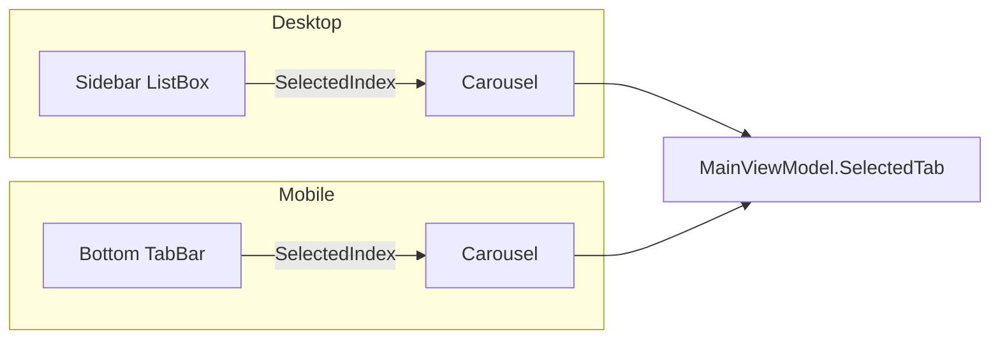

# UI Adaptation — Mobile Layout

## Current Desktop Layout

```
┌──────────────────────────────────────────────────────────────┐
│ Title Bar (32px) — custom, draggable, minimize/max/close     │
├──────────┬───────────────────────────────────────────────────┤
│          │ Top-right icons (bell, tasks)                     │
│ Sidebar  ├───────────────────────────────────────────────────┤
│ (220px)  │                                                   │
│          │  Content Area (Carousel)                          │
│ Brand    │                                                   │
│ Nav List │  [BrowseView] [InstalledView] [FileExplorer] ...  │
│ Connect  │                                                   │
│ About    │                                                   │
│          ├───────────────────────────────────────────────────┤
│          │ Status Bar (28px) — connection status + version   │
└──────────┴───────────────────────────────────────────────────┘
```

## Proposed Mobile Layout

```
┌──────────────────────────────────────┐
│ Status Bar (system)                  │
├──────────────────────────────────────┤
│ Top Bar: App title + bell + tasks    │
├──────────────────────────────────────┤
│                                      │
│  Content Area                        │
│  (fullscreen, scrollable)            │
│                                      │
│                                      │
│                                      │
├──────────────────────────────────────┤
│ Bottom Tab Bar (5 tabs)              │
│ [Browse] [Installed] [Files] [Tools] │
│ [Settings]                           │
└──────────────────────────────────────┘
```

---

## Navigation Changes

### Desktop: Sidebar (220px fixed)

- Vertical list with icon + text labels
- Connect/Disconnect button at bottom
- Brand logo at top
- Always visible

### Mobile: Bottom Tab Bar

The bottom tab bar follows Material Design / iOS conventions:

| Tab | Icon | Content |
|-----|------|---------|
| Browse | Browse icon | BrowseView |
| Installed | Package icon | InstalledView |
| Files | Folder icon | FileExplorerView |
| Tools | Wrench icon | ToolsView |
| Settings | Gear icon | SettingsView |

**Inspector** and **Logs** are not top-level tabs on mobile — accessed via Settings or Tools.

### Implementation

The `MainViewModel.SelectedTab` index maps to both navigation systems. The Carousel binding works identically; only the visual chrome changes.



---

## Top Bar Adaptation

### Desktop: Title bar + status icons

Custom window chrome with minimize/maximize/close, notifications bell, tasks indicator.

### Mobile: App bar

```
┌──────────────────────────────────────┐
│ [hamburger?]  XB Homebrew Vault  🔔 ⚙ │
└──────────────────────────────────────┘
```

- **App title** centered or left-aligned
- **Notifications bell** with badge (same as desktop)
- **Tasks indicator** with badge
- **No window controls** — Android system handles this
- Optional hamburger menu for secondary actions

---

## Content Area Adaptation

### BrowseView (Desktop)

Desktop uses a responsive grid of cards with hover effects:

```
┌─────────────────────────────────────┐
│  ┌─────┐  ┌─────┐  ┌─────┐        │
│  │Card │  │Card │  │Card │        │
│  │     │  │     │  │     │        │
│  └─────┘  └─────┘  └─────┘        │
│  ┌─────┐  ┌─────┐  ┌─────┐        │
│  │Card │  │Card │  │Card │        │
│  └─────┘  └─────┘  └─────┘        │
└─────────────────────────────────────┘
```

### BrowseView (Mobile)

Mobile uses a single-column or 2-column card list:

```
┌──────────────────────────────────────┐
│ Search: [________________]           │
├──────────────────────────────────────┤
│ ┌──────────────────────────────────┐ │
│ │ 🎮  App Name                     │ │
│ │ Description text here...         │ │
│ │ v1.0  ★ 4.5                     │ │
│ └──────────────────────────────────┘ │
│ ┌──────────────────────────────────┐ │
│ │ 🎮  Another App                  │ │
│ │ Description text here...         │ │
│ └──────────────────────────────────┘ │
└──────────────────────────────────────┘
```

**Key changes:**
- Cards stack vertically (1 column on phone, 2 on tablet)
- Touch targets minimum 48dp
- Remove hover effects (no hover on touch)
- Swipe gestures for quick actions (optional)

### InstalledView (Desktop)

Already uses a list layout — minimal changes needed. Card widths adapt to content area.

### FileExplorerView (Desktop)

Desktop uses a TreeView sidebar (260px) + file list:

```
┌──────────┬───────────────────────────┐
│ TreeView │ File List                 │
│ 260px    │ Name | Size | Modified   │
│          │                           │
└──────────┴───────────────────────────┘
```

### FileExplorerView (Mobile)

TreeView is not touch-friendly. Replace with a flat navigation:

```
┌──────────────────────────────────────┐
│ ← D:\DevelopmentFiles\current       │
├──────────────────────────────────────┤
│ 📁 Subfolder1                        │
│ 📁 Subfolder2                        │
│ 📄 file.appx          12 MB         │
│ 📄 test.dll           340 KB        │
├──────────────────────────────────────┤
│ [Upload] [New Folder] [Refresh]      │
└──────────────────────────────────────┘
```

**Key changes:**
- Breadcrumb navigation replaces TreeView
- Tap folder to navigate into it
- Back arrow to go up one level
- Action bar at bottom (Upload, New Folder, Refresh)
- Long-press for context menu (Download, Delete, Rename)

### ToolsView (Desktop)

Desktop uses a grid of tool buttons:

```
┌──────┬──────┬──────┐
│ Tool │ Tool │ Tool │
├──────┼──────┼──────┤
│ Tool │ Tool │      │
└──────┴──────┴──────┘
```

### ToolsView (Mobile)

Vertical list of tool cards:

```
┌──────────────────────────────────────┐
│ ┌──────────────────────────────────┐ │
│ │ 📱  Screenshot                   │ │
│ │ Capture Xbox screen              │ │
│ └──────────────────────────────────┘ │
│ ┌──────────────────────────────────┐ │
│ │ 📊  Performance                  │ │
│ │ CPU and memory monitoring        │ │
│ └──────────────────────────────────┘ │
│ ┌──────────────────────────────────┐ │
│ │ 🔧  USB Permission               │ │
│ │ Windows Only                     │ │
│ └──────────────────────────────────┘ │
└──────────────────────────────────────┘
```

Windows-only tools show "Windows Only" badge and are non-interactive on mobile.

---

## Dialog Adaptation Strategy

### Desktop: `ShowDialog()` → New OS Window

All 21 dialogs are `Window` subclasses opened as modal dialogs with their own chrome.

### Mobile: Three Presentation Modes

#### 1. Fullscreen Page (for complex dialogs)

Used for: ConnectionWindow, SetupWizardWindow, ItemDetailWindow, CustomInstallWindow, PerformanceWindow

```
┌──────────────────────────────────────┐
│ ← Back                    Title      │
├──────────────────────────────────────┤
│                                      │
│  [Full dialog content]               │
│                                      │
│                                      │
├──────────────────────────────────────┤
│ [Action Button]                      │
└──────────────────────────────────────┘
```

Implementation: Convert `Window` to `UserControl`, embed in a navigation frame within the content area.

#### 2. Bottom Sheet (for simple dialogs)

Used for: ConfirmWindow, DeleteConfirmWindow, InputDialog, ErrorDialog

```
┌──────────────────────────────────────┐
│ (dimmed content behind)              │
│                                      │
├──────────────────────────────────────┤
│ Are you sure you want to delete?     │
│                                      │
│ [Cancel]              [Delete]       │
└──────────────────────────────────────┘
```

Implementation: Slide-up panel overlay.

#### 3. Inline (for informational dialogs)

Used for: AboutWindow, SftpInfoWindow, DiscordPopup, RefreshWindow

Show content inline or as a simple overlay card.

### Dialog Conversion Table

| Desktop Dialog | Mobile Mode | Conversion Effort |
|----------------|-------------|-------------------|
| ConnectionWindow | Fullscreen page | High — multi-step wizard |
| SetupWizardWindow | Fullscreen page | High — multi-step wizard |
| ItemDetailWindow | Fullscreen page | Medium — scrollable content |
| CustomInstallWindow | Fullscreen page | Medium — form inputs |
| PerformanceWindow | Fullscreen page | Complex — real-time charts |
| ConfirmWindow | Bottom sheet | Low — two buttons |
| DeleteConfirmWindow | Bottom sheet | Low — two buttons |
| InputDialog | Bottom sheet | Low — text field + buttons |
| ErrorDialog | Bottom sheet | Low — text + close |
| AboutWindow | Inline card | Low — static content |
| SftpInfoWindow | Inline card | Low — text display |
| DiscordPopup | Inline card | Low — single action |
| RefreshWindow | Inline card | Low — progress indicator |
| ScreenshotWindow | Fullscreen page | Medium — image display |
| SystemInfoWindow | Fullscreen page | Medium — data grid |
| ProcessesWindow | Fullscreen page | Medium — list with actions |
| NetworkInfoWindow | Fullscreen page | Medium — data display |
| CrashDataWindow | Fullscreen page | Medium — file list |
| UsbPermissionWindow | Skip | Not applicable on Android |
| LoopbackExemptWindow | Skip | Not applicable on Android |

---

## Touch Adaptation

### Minimum Touch Targets

All interactive elements must be at least **48x48dp** (Android Material Design guideline). Current desktop buttons may be smaller.

### Hover Effects

Desktop styles use `:pointerover` pseudo-class extensively. On Android these simply don't trigger — no removal needed, but consider adding `:pressed` states for tactile feedback.

### Scroll Behavior

Desktop uses mouse wheel scrolling. Android uses fling/gesture scrolling. Avalonia handles this natively — no changes needed.

### Keyboard Shortcuts

Desktop MainWindow handles:
- `Escape` — close popup
- `Ctrl+Tab` / `PageDown` / `PageUp` — switch tabs
- `Home` / `End` — first/last tab

These have no equivalent on mobile. The tab bar handles navigation directly.

---

## Responsive Breakpoints

| Width | Layout | Device |
|-------|--------|--------|
| < 600dp | Single column, bottom tab bar, stacked cards | Phone portrait |
| 600–840dp | Two columns, bottom tab bar, 2-column cards | Phone landscape / small tablet |
| > 840dp | Sidebar (collapsible), 3-column cards | Tablet landscape / desktop |

The `MainWindow.axaml` can use `OnPlatform` or adaptive `VisualState` triggers to switch layouts.

---

## Font and Spacing Adjustments

Desktop uses:
- `FontSize="11"` to `"14"` for most text
- `Padding="16,7"` for nav items
- Custom `BodyFont` family

Mobile should:
- Increase minimum font size to 14sp for body text
- Use `Sp` units instead of `px` where possible
- Increase padding for touch targets
- Maintain the Xbox/green theme (BladesTheme.axaml) — no changes needed

---

## Status Bar Integration

### Desktop: Custom status bar (28px)

```
┌──────────────────────────────────────────────────┐
│ ● Connected to 192.168.1.42    XBVault v1.4.0   │
└──────────────────────────────────────────────────┘
```

### Mobile: Merge with top bar or use Android system status area

The connection status indicator moves to the top bar or becomes a colored strip below the app bar:

```
┌──────────────────────────────────────┐
│ ● Connected to 192.168.1.42          │ (green strip)
├──────────────────────────────────────┤
│ App content                          │
└──────────────────────────────────────┘
```
