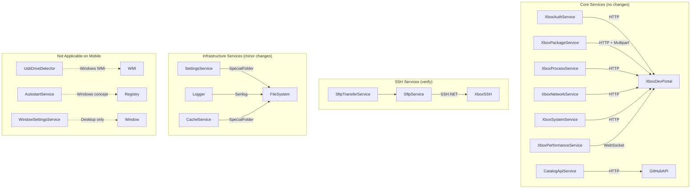

# Services — Android Adaptation

## Overview

The service layer is overwhelmingly cross-platform. All Xbox communication is HTTP/JSON or SSH/SFTP — no platform-specific APIs involved. The only services needing attention are those with file paths, P/Invoke, or desktop-specific concepts.

For shared service contracts and frontend-boundary rules, see the [Developer Architecture Guide](../developer-architecture.md).

---

## Service Dependency Diagram



---

## HTTP Services — No Changes (11 services)

All Xbox REST API communication is pure `HttpClient` + `System.Text.Json`. These work identically on Android.

| Service | Lines | API Pattern |
|---------|-------|-------------|
| XboxAuthService | 384 | Basic auth, CSRF, cookie management |
| XboxPackageService | 504 | Package list/install/uninstall/launch |
| XboxProcessService | 90 | Process list/kill |
| XboxNetworkService | 99 | Network config |
| XboxSystemService | 237 | Screenshots, system info, crash dumps |
| XboxPerformanceService | 87 | WebSocket metrics streaming |
| XboxResponseParser | 169 | JSON parsing helpers |
| CatalogApiService | 452 | GitHub catalog with disk cache |
| GitHubReleaseCheckerService | 72 | GitHub releases API |
| PortalAppFilesService | 449 | Xbox Dev Portal filesystem |
| PackageOverrideService | 183 | Embedded catalog overrides |

### Security Note: Self-Signed Certificates

`XboxAuthService` and `XboxPerformanceService` use `ServerCertificateCustomValidationCallback = (_, _, _, _) => true` to bypass self-signed certificate validation on Xbox Dev Portal.

On Android, this is functionally required (Xbox uses self-signed certs) but should be reviewed:
- The bypass is scoped to Xbox connections only (different HttpClient instances)
- Consider certificate pinning for the Xbox connection in future

---

## SSH/SFTP Services — Verify on Android (2 services)

### SftpService (706 lines)

Uses SSH.NET (`Renci.SshNet`) for:
- SSH shell commands (`SshClient.RunCommand`)
- SFTP directory listing
- File upload/download streams

**Android compatibility:** SSH.NET supports .NET Android via `netstandard2.0`. The package should resolve correctly for `android-arm64` and `android-x64` RIDs.

**Verification needed:**
1. SSH.NET NuGet package restores correctly for `net10.0-android36.0`
2. `System.Security.Cryptography` is available on Android (it should be — .NET Android includes BCL)
3. SSH connections work through Android's network stack

**Risk:** Low — SSH.NET is widely used in Xamarin/MAUI Android apps.

### SftpTransferService (791 lines)

Orchestrates file transfers using `ISftpService`. Pure BCL file I/O (`File.OpenRead`, `File.Create`, `ZipFile.ExtractToDirectory`). No platform dependencies.

**Android:** Fully compatible. `Path.GetTempPath()` resolves to Android temp directory.

---

## Infrastructure Services — Minor Changes (7 services)

### SettingsService (117 lines)

```csharp
// Current: uses SpecialFolder.ApplicationData
var settingsDir = Path.Combine(
    Environment.GetFolderPath(Environment.SpecialFolder.ApplicationData),
    "XBVault");
```

**Android resolution:** `/data/data/<package>/files/XBVault/`

**Status:** Works as-is. The BCL handles the platform difference. Settings file will be in app-private storage.

**Optional enhancement:** Log the resolved path during startup for debugging.

---

### Logger (345 lines)

**P/Invoke:** `kernel32.dll` (`AttachConsole`, `AllocConsole`) — guarded by `OperatingSystem.IsWindows()` at line 161. Never executes on Android.

**File sink:** Uses `SpecialFolder.ApplicationData` for log directory. Works on Android.

**Console sink:** `Console.BufferWidth` access wrapped in try-catch. Safe on Android.

**Status:** No changes needed.

---

### CacheService (124 lines)

Uses `SpecialFolder.LocalApplicationData` for cache root.

**Android resolution:** `/data/data/<package>/cache/`

**Status:** Works as-is. Cache directory is app-private.

---

### CatalogApiService (452 lines)

Uses `SpecialFolder.LocalApplicationData` for catalog cache.

**Status:** Works as-is. Same resolution as CacheService.

---

### PackageInstallService (568 lines)

Uses `SpecialFolder.LocalApplicationData` for analysis temp directory.

**Status:** Works as-is. Temp files created during package analysis use standard BCL.

---

### PreFlightChecker (270 lines)

Uses both `SpecialFolder.ApplicationData` and `SpecialFolder.LocalApplicationData`.

**Minor change needed:** `RunHealthCheck()` method (line 171+) writes to `Console.WriteLine()` — Android has no console. Guard with platform check or skip on mobile.

**Optional:** Add Android-specific health check that validates network permissions and storage access.

---

### UpdateVersionCache (90 lines)

Uses `SpecialFolder.LocalApplicationData` for cache file.

**Status:** Works as-is.

---

## Not Applicable on Mobile (3 services)

### UsbDriveDetector (218 lines)

WMI-based USB detection. Already returns empty list on non-Windows via:
- `#if WINDOWS_BUILD` preprocessor directive
- `RuntimeInformation.IsOSPlatform(OSPlatform.Windows)` runtime check

**Status:** No changes needed. Returns empty list on Android.

---

### WindowSettingsService (43 lines)

Manages main window size persistence. Desktop-only concept.

**Status:** Skip on Android. The app runs fullscreen. Window size restore code in `MainWindow` constructor should be guarded with platform check.

---

### AutostartService (36 lines)

Reads/writes an autostart package name in settings. The concept of "launch an Xbox app on boot" has no Android equivalent.

**Status:** Skip on mobile. The ViewModel that uses it (`ToolsViewModel.OpenAutostartAsync`) should show "Not available on mobile" on Android.

---

## PlatformDialog — Major Changes Required (1 service)

### Current Implementation (135 lines)

```csharp
public static class PlatformDialog
{
    public static void Alert(string title, string message)
    {
        if (OperatingSystem.IsWindows())
            Win32MessageBox(...);      // user32.dll P/Invoke
        else if (OperatingSystem.IsMacOS())
            RunOsascript(...);          // osascript via Process.Start
        else
            LinuxDialog(...);           // zenity/xmessage via Process.Start
    }
}
```

### Android Problem

- `user32.dll` — unavailable on Android
- `osascript` — unavailable on Android
- `zenity` / `xmessage` — unavailable on Android
- Falls through to `LinuxDialog()` which silently fails (all catches swallow)

### Android Solution

Add an Android branch using Avalonia's UI layer:

```csharp
public static class PlatformDialog
{
    public static void Alert(string title, string message)
    {
        if (OperatingSystem.IsWindows())
            Win32MessageBox(title, message);
        else if (OperatingSystem.IsMacOS())
            RunOsascript(title, message);
        else if (OperatingSystem.IsAndroid())
            AvaloniaDialog(title, message);  // NEW
        else
            LinuxDialog(title, message);
    }

    private static void AvaloniaDialog(string title, string message)
    {
        // Use Avalonia's TopLevel to show a dialog on the main thread
        // or defer to the app's dialog service
    }
}
```

**Alternative:** Route all dialog calls through an `IDialogService` interface that the Android project implements with native Android dialogs or Avalonia `Window.ShowDialog()`.

---

## File System Path Summary

| Service | SpecialFolder Used | Android Path | Works? |
|---------|-------------------|--------------|--------|
| SettingsService | `ApplicationData` | `/data/data/<pkg>/files/XBVault/` | Yes |
| Logger | `ApplicationData` | `/data/data/<pkg>/files/XBVault/logs/` | Yes |
| CacheService | `LocalApplicationData` | `/data/data/<pkg>/cache/XBVault/` | Yes |
| CatalogApiService | `LocalApplicationData` | `/data/data/<pkg>/cache/XBVault/catalog/` | Yes |
| PackageInstallService | `LocalApplicationData` | `/data/data/<pkg>/cache/XBVault/analysis/` | Yes |
| PreFlightChecker | Both | Resolves correctly | Yes |
| UpdateVersionCache | `LocalApplicationData` | `/data/data/<pkg>/cache/XBVault/updates/` | Yes |

**All paths are app-private on Android.** No external storage permissions needed for these operations.

---

## Network Requirements

AndroidManifest.xml must declare:

```xml
<uses-permission android:name="android.permission.INTERNET" />
<uses-permission android:name="android.permission.ACCESS_NETWORK_STATE" />
```

These are required for:
- HTTP communication with Xbox Dev Portal
- SSH/SFTP connections to Xbox
- GitHub API calls for catalog/updates
- WebSocket connections for performance monitoring

---

## Implementation Order

1. **PlatformDialog** — Add Android branch (required for any UI feedback)
2. **PreFlightChecker** — Guard console output
3. **WindowSettingsService** — Guard window size restore
4. **SSH.NET verification** — Test package restore and connection on Android
5. **AutostartService** — Add "not available on mobile" guard
6. **UsbDriveDetector** — Verify empty-list behavior on Android build
