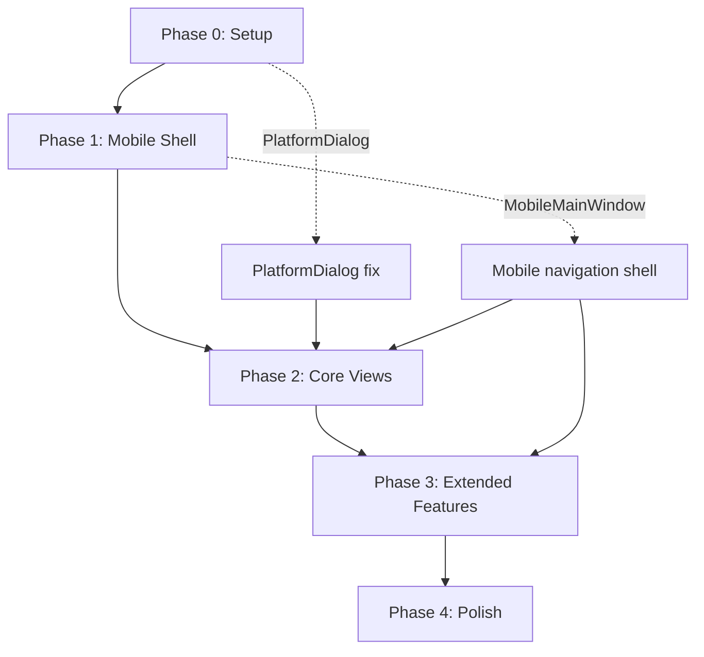

# Implementation Plan — Android Port

## Overview

Five-phase implementation plan with incremental deliverables. Each phase produces a testable artifact.

---

## Phase 0: Project Setup (1–2 days)

**Goal:** Buildable Android project that launches and shows a blank Avalonia screen.

**Current verification (2026-08-17):** `XBVault.Android/` exists, restores, and builds in Release for `net10.0-android36.0/android-arm64` when `JAVA_HOME` points to **JDK 21** (`%LOCALAPPDATA%/Android/Sdk/jdk-21`). JDK 25 still fails with `XA0030`, so Android build commands should set or inherit JDK 21.

### Tasks

| # | Task | Estimate | Dependencies |
|---|------|----------|--------------|
| 0.1 | Create `XBVault.Android/` directory and `XBVault.Android.csproj` | 30min | — |
| 0.2 | Add NuGet references: `Avalonia.Android`, `Avalonia.Themes.Fluent`, `Avalonia.Fonts.Inter` | 15min | 0.1 |
| 0.3 | Add `<ProjectReference>` to `../XBVault/XBVault.csproj` | 15min | 0.1 |
| 0.4 | Create `MainActivity.cs` (inherits `AvaloniaMainActivity`) | 30min | 0.2, 0.3 |
| 0.5 | Create `AndroidApp.cs` (inherits `AvaloniaAndroidApplication<App>`) | 30min | 0.4 |
| 0.6 | Create `AndroidManifest.xml` with INTERNET permission | 15min | 0.1 |
| 0.7 | Verify desktop build still works (`dotnet build XBVault`) | 15min | — |
| 0.8 | Verify Android build works (`dotnet build XBVault.Android -f net10.0-android36.0`) | 30min | 0.1–0.6 |
| 0.9 | Run in Android emulator — verify Avalonia splash screen appears | 30min | 0.8 |
| 0.10 | Install/select JDK 21 and verify `JAVA_HOME` / `dotnet build` uses it | ✅ done locally | Android workload |

### Acceptance Criteria

- [ ] `dotnet build XBVault.Android -f net10.0-android36.0` succeeds
- [x] JDK 21 is selected; JDK 25 is not used for Android builds
- [ ] Android emulator launches and shows Avalonia UI (even if blank/broken)
- [ ] Desktop build (`dotnet build XBVault`) still works unchanged
- [ ] No regressions in existing desktop functionality

### Risk Mitigation

- If SSH.NET fails to restore for Android, create a conditional `<PackageReference>` with `Condition="'$(TargetFramework)' != 'net10.0-android36.0'"`
- If `Avalonia.AvaloniaEdit` doesn't support Android, same conditional treatment

---

## Phase 1: Mobile Shell (3–5 days)

**Goal:** Pre-splash, Avalonia splash, and working mobile navigation shell with bottom tab bar, top bar, and content area switching between views.

**UI/UX Design Reference:** [09-mobile-ux-design.md](09-mobile-ux-design.md)

### Phase 1A: Pre-Splash + Avalonia Splash (done)

**Status:** ✅ Complete. App builds, deploys to emulator, shows placeholder screen.

### Phase 1B: Shell + Splash (current)

**Goal:** Pre-splash native, Avalonia splash, MobileMainWindow shell with top bar, tab bar, hamburger menu.

#### Tasks

| # | Task | Estimate | Dependencies |
|---|------|----------|--------------|
| 1B.1 | Copy hamburger icon from personal set → shared (`mainwindow-hamburger-20.png`) | 15min | — |
| 1B.2 | Copy splash_icon.png to Android drawable | 15min | — |
| 1B.3 | Pre-splash: update `styles.xml` (values + values-v31) with `#284325` + logo | 30min | 1B.2 |
| 1B.4 | Create `MobileSplashView.axaml` + `.cs` (portrait splash, all text, version) | 2h | Assets do shared |
| 1B.5 | Create `MobileMainWindow.axaml` + `.cs` (top bar + content + tab bar) | 3h | 1B.1 |
| 1B.6 | Wire `App.axaml.cs`: init services, splash → main transition | 2h | 1B.3, 1B.4, 1B.5 |
| 1B.7 | Update `MainActivity`: portrait lock | 15min | — |
| 1B.8 | Build + deploy emulador — validate full flow | 1h | 1B.1–1B.7 |

#### Acceptance Criteria

- [ ] Pre-splash: fundo `#284325` + logo appears instantly on app open
- [ ] Avalonia splash: portrait layout, all text elements, dynamic version
- [ ] Transitions: pre-splash → splash → main are automatic
- [ ] Top bar: logo + title left, connection icon + hamburger right
- [ ] Top bar: `TitleGradient` background (#447F3E → #9ACA3C)
- [ ] Bottom tab bar: 4 icons (Browse, Installed, Files, Tools), no text
- [ ] Tab switching works (Browse default)
- [ ] Selected tab shows accent color indicator
- [ ] Hamburger menu opens with 5 options (Notifications, Jobs, Logs, Settings, About)
- [ ] Connection icon visible (tap shows placeholder)
- [ ] Portrait-only (rotation locked)
- [ ] Blade theme consistent: Xbox green colors, Oxanium fonts
- [ ] Desktop build unchanged

---

## Phase 2: Core Views (5–8 days)

**Goal:** Browse, Installed, and Connection features fully functional on Android.

### Tasks

| # | Task | Estimate | Dependencies |
|---|------|----------|--------------|
| **BrowseView** | | | |
| 2.1 | Audit BrowseView.axaml for desktop-specific layout (fixed widths, hover) | 1h | — |
| 2.2 | Create `MobileBrowseView.axaml` or adapt existing with responsive triggers | 3h | 2.1 |
| 2.3 | Test catalog loading and display on Android | 1h | 2.2 |
| 2.4 | Test item detail dialog → convert to fullscreen page on mobile | 2h | 2.2 |
| **InstalledView** | | | |
| 2.5 | Audit InstalledView.axaml for mobile readiness | 1h | — |
| 2.6 | Adapt card widths and touch targets | 1h | 2.5 |
| 2.7 | Test package list loading on Android | 1h | 2.6 |
| 2.8 | Test package actions (launch, uninstall, install) on Android | 2h | 2.6 |
| **ConnectionWindow** | | | |
| 2.9 | Convert ConnectionWindow to fullscreen page on mobile | 3h | 1.4 |
| 2.10 | Test Xbox connection flow end-to-end on Android | 2h | 2.9 |
| 2.11 | Test auto-connect on Android | 1h | 2.10 |
| **PlatformDialog** | | | |
| 2.12 | Add Android branch to PlatformDialog using Avalonia dialogs | 2h | — |
| 2.13 | Test all dialog calls on Android | 1h | 2.12 |

### Acceptance Criteria

- [ ] BrowseView displays catalog cards in responsive layout
- [ ] Item detail opens as fullscreen page on mobile
- [ ] InstalledView shows package list with working actions
- [ ] Connection wizard works end-to-end on Android
- [ ] All dialog calls show properly on Android
- [ ] SSH/SFTP connection to Xbox verified on Android emulator or device

---

## Phase 3: Extended Features (5–8 days)

**Goal:** File Explorer, Tools, Settings, Inspector, and Logs functional on Android.

### Tasks

| # | Task | Estimate | Dependencies |
|---|------|----------|--------------|
| **FileExplorerView** | | | |
| 3.1 | Replace TreeView with breadcrumb navigation on mobile | 4h | 1.4 |
| 3.2 | Add touch-friendly file list (larger rows, long-press context menu) | 2h | 3.1 |
| 3.3 | Test SFTP file browsing on Android | 2h | 3.2 |
| 3.4 | Test file upload/download on Android | 2h | 3.3 |
| **ToolsView** | | | |
| 3.5 | Convert button grid to vertical card list on mobile | 2h | 1.4 |
| 3.6 | Gate Windows-only tools (USB Permission, Loopback) with "Not available" message | 1h | 3.5 |
| 3.7 | Test each tool on Android | 2h | 3.6 |
| **SettingsView** | | | |
| 3.8 | Audit SettingsView.axaml for mobile readiness | 1h | — |
| 3.9 | Test settings save/load on Android | 1h | 3.8 |
| **InspectorView** | | | |
| 3.10 | Test InspectorView on Android (connection details, console) | 2h | 1.4 |
| 3.11 | Consider AvaloniaEdit fallback if it doesn't work on Android | 2h | 3.10 |
| **LogsView** | | | |
| 3.12 | Test LogsView on Android | 1h | 1.4 |
| 3.13 | Consider AvaloniaEdit fallback for log display | 2h | 3.12 |
| **Dialogs** | | | |
| 3.14 | Convert remaining complex dialogs to fullscreen pages | 4h | 2.12 |
| 3.15 | Convert simple dialogs to bottom sheets | 2h | 2.12 |

### Acceptance Criteria

- [ ] File Explorer navigation works via breadcrumbs
- [ ] File upload/download works over SSH on Android
- [ ] Tools grid displays as vertical list with proper gating
- [ ] Settings save/load works
- [ ] Inspector shows connection details
- [ ] Logs display correctly
- [ ] All dialog types render properly on mobile

---

## Phase 4: Polish (3–5 days)

**Goal:** Production-ready Android app with proper edge case handling.

### Tasks

| # | Task | Estimate | Dependencies |
|---|------|----------|--------------|
| 4.1 | Landscape orientation support | 3h | Phase 3 |
| 4.2 | Tablet layout optimization (>840dp width) | 3h | 4.1 |
| 4.3 | Toast notification positioning for mobile | 1h | — |
| 4.4 | Performance testing — scroll smoothness, memory usage | 2h | — |
| 4.5 | Battery optimization — background WebSocket connections | 2h | — |
| 4.6 | Android back button handling | 2h | — |
| 4.7 | Network state change handling (WiFi disconnect/reconnect) | 2h | — |
| 4.8 | Settings path migration if needed | 1h | — |
| 4.9 | Splash screen (Android native) | 2h | — |
| 4.10 | App icon (adaptive icon for Android) | 1h | — |
| 4.11 | App name and metadata in AndroidManifest | 30min | — |
| 4.12 | Final end-to-end testing on physical device | 3h | All |

### Acceptance Criteria

- [ ] App works in both portrait and landscape
- [ ] Tablet layout uses space effectively
- [ ] Toast notifications appear correctly
- [ ] Smooth 60fps scrolling in all list views
- [ ] No memory leaks during long sessions
- [ ] Android back button navigates back correctly
- [ ] Network reconnection recovers gracefully
- [ ] Native splash screen with app branding
- [ ] Adaptive icon works on Android launcher

---

## Dependency Graph

---

## Time Estimates Summary

| Phase | Min (days) | Max (days) | Deliverable |
|-------|-----------|-----------|-------------|
| Phase 0 | 1 | 2 | Buildable Android project |
| Phase 1 | 3 | 5 | Mobile navigation shell |
| Phase 2 | 5 | 8 | Core features working |
| Phase 3 | 5 | 8 | All features working |
| Phase 4 | 3 | 5 | Production-ready |
| **Total** | **17** | **28** | Android release |

---

## Open Questions

1. **AvaloniaEdit on Android:** Does `Avalonia.AvaloniaEdit` work on Android? If not, LogsView and InspectorView need a plain `TextBlock` fallback.
2. **SSH.NET on Android:** Verify package restore and actual SSH connections work on `net10.0-android36.0`.
3. **Minimum Android API level:** Avalonia 12 supports API 21+ (Android 5.0). Target API 21 or higher?
4. **APK vs AAB:** Google Play requires AAB (Android App Bundle). For sideloading, APK is fine.
5. **Signing:** Debug signing for development, release signing for distribution.
