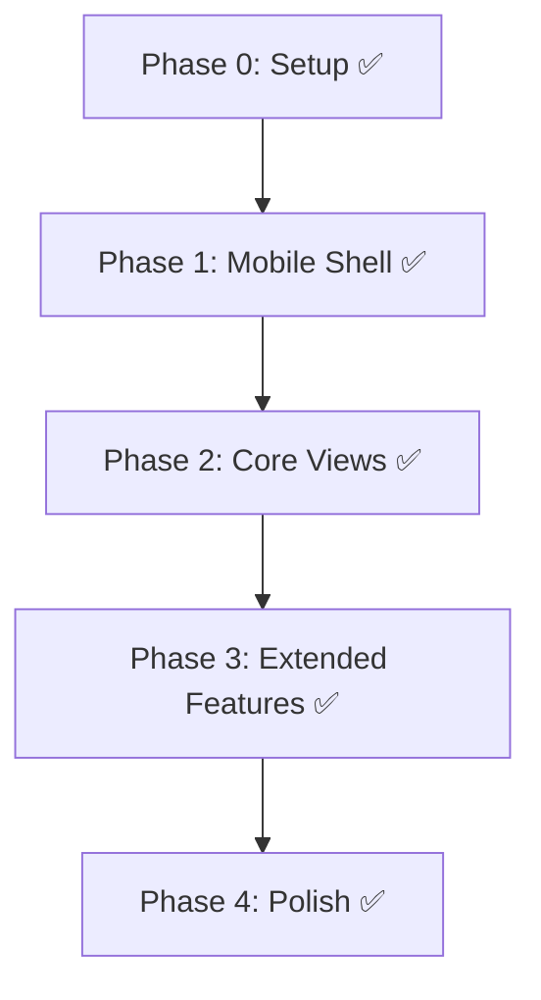

# Implementation Plan — Android Port

## Overview

Phased implementation plan with incremental deliverables. Each phase produces a testable artifact.

> **Current status (2026-08-27):** All phases shipped in v2.0.0+. This page documents the original plan and its delivery record.

---

## Phase 0: Project Setup ✅ Complete

**Goal:** Buildable Android project that launches and shows a blank Avalonia screen.

All tasks done. JDK 21 configured, Android build passes, emulator launches.

---

## Phase 1: Mobile Shell ✅ Complete

### Phase 1A: Pre-Splash + Avalonia Splash ✅

- Conditional RuntimeIdentifier in csproj (override via CLI)
- Build scripts with `-Arch` parameter (default x64 emulator)
- `App.axaml.cs` Android lifetime branch (`IActivityApplicationLifetime`)
- JDK 21 auto-detection from scoop

### Phase 1B: Shell + Splash ✅

**Deliverables:** Native pre-splash, Avalonia splash, MobileMainWindow shell.

All 8 tasks done. Key decisions:
- Views live in shared `XBVault/Views/` (not Android project — circular dep constraint)
- Splash transition: `TaskCompletionSource` waits for `splash.Loaded` before 2s delay
- Navigation: `Panel.Children.Add/Clear` for overlays, `Carousel` for tab content
- `SplashMinDelayMs = 2000`

### Phase 1C: Mobile Views ✅

| View | Status | Notes |
|------|--------|-------|
| MobileBrowseView | ✅ | Cards with images, category filter, search, CdSpinner |
| MobileDetailView | ✅ | Fullscreen item detail, install button |
| MobileAboutView | ✅ | Splash bg image, Discord flyout, gradient top bar |
| MobileSettingsView | ✅ | Single-column, Save button, gradient top bar |
| MobileToolsView | ✅ | 4 section cards (Diagnostics, Management, External Media, Xbox Actions) |

Plus: `PlatformHelper.OpenUrl`, `AndroidBackHandler`, systematic `Logger.Info`, launcher icons, `log-android.ps1/sh`.

---

## Phase 2: Core Views ✅ Delivered

Browse, Item Detail, Connection, Installed, File Explorer, Logs — all shipped and verified on physical devices.

**Goal:** Browse, Installed, and Connection features fully functional on Android.

### Done

| # | Task | Status |
|---|------|--------|
| 2.1 | MobileBrowseView — card layout with images, category filter, search | ✅ |
| 2.2 | BrowseViewModel — immediate thumbnail apply (no batch delay) | ✅ |
| 2.3 | Catalog auto-load on view creation | ✅ |
| 2.4 | MobileDetailView — fullscreen item detail with install button | ✅ |
| 2.5 | ErrorDialog Android compat — log-only on Android | ✅ |
| 2.6 | Back button crash fix — suppress TopLevelImpl NRE on lifecycle events | ✅ |

### Remaining

| # | Task | Estimate | Dependencies |
|---|------|----------|--------------|
| 2.7 | InstalledView — card list with package actions, working actions | 3h | — |
| 2.8 | ConnectionWindow — fullscreen page conversion | 4h | — |
| 2.9 | Xbox connection flow end-to-end on Android | 3h | 2.8 |
| 2.10 | Confirm/DeleteConfirm/Error dialogs — bottom sheets or safe wrappers | 2h | — |
| 2.11 | Browse scroll performance — viewport-based lazy loading for thumbnails | 4h | — |

### Acceptance Criteria

- [x] BrowseView displays catalog cards with images in responsive layout
- [x] Item detail opens as fullscreen page on mobile
- [ ] InstalledView shows package list with working actions
- [ ] Connection wizard works end-to-end on Android
- [ ] All dialog calls show properly on Android
- [ ] SSH/SFTP connection to Xbox verified on Android device

---

## Phase 3: Extended Features ✅ Delivered

Tools, Settings, Sideload Wizard, Jobs, Notifications, Loopback, Screenshot, SFTP info — shipped.

**Goal:** File Explorer, Tools (real actions), Settings (full), Logs functional on Android.

| # | Task | Estimate | Dependencies |
|---|------|----------|--------------|
| 3.1 | MobileFilesView — breadcrumb navigation, touch-friendly file list | 6h | 2.9 |
| 3.2 | Test SFTP file browsing on Android | 2h | 3.1 |
| 3.3 | Test file upload/download on Android | 2h | 3.2 |
| 3.4 | MobileToolsView — wire real tool actions (currently placeholder cards) | 3h | 2.9 |
| 3.5 | Gate Windows-only tools (USB Permission, Loopback) with "Not available" | 1h | 3.4 |
| 3.6 | MobileSettingsView — wire real settings save/load | 2h | — |
| 3.7 | Logs view — plain TextBlock (no AvaloniaEdit on Android) | 3h | — |
| 3.8 | SetupWizardWindow — fullscreen page | 4h | — |
| 3.9 | TasksPanel, NotificationsPanel — mobile alternatives (bottom sheet or inline) | 4h | — |

### Acceptance Criteria

- [ ] File Explorer navigation works via breadcrumbs
- [ ] File upload/download works over SSH on Android
- [ ] Tools grid displays as vertical list with proper gating
- [ ] Settings save/load works
- [ ] Logs display correctly
- [ ] All dialog types render properly on mobile

---

## Phase 4: Polish ✅ Delivered

Safe areas, status-bar icons, back navigation, QR connect, URL resolver — shipped.

**Goal:** Production-ready Android app with proper edge case handling.

| # | Task | Estimate | Dependencies |
|---|------|----------|--------------|
| 4.1 | Toast notification positioning for mobile | 1h | — |
| 4.2 | Performance testing — scroll smoothness, memory usage | 2h | Phase 3 |
| 4.3 | Battery optimization — background connections | 2h | Phase 3 |
| 4.4 | Network state change handling (WiFi disconnect/reconnect) | 2h | Phase 3 |
| 4.5 | Settings path migration if needed | 1h | — |
| 4.6 | Adaptive icon fix — launcher still shows generic | 2h | — |
| 4.7 | Native splash logo restoration | 1h | — |
| 4.8 | App name and metadata in AndroidManifest | 30min | — |
| 4.9 | Final end-to-end testing on physical device | 3h | All |

### Acceptance Criteria

- [ ] Smooth 60fps scrolling in all list views
- [ ] No memory leaks during long sessions
- [ ] Network reconnection recovers gracefully
- [ ] Adaptive icon works on Android launcher
- [ ] Native splash screen shows logo correctly
- [ ] Final end-to-end testing on physical device

---

## Dependency Graph

---

## Known Issues (2026-08-19)

| Issue | Severity | Notes |
|-------|----------|-------|
| Launcher icon shows generic | Medium | Legacy mipmap PNGs correct, adaptive icon removed; may be launcher cache |
| Native splash logo missing | Low | `drawable/splash_icon.png` exists and referenced in v31 styles; may render but be too brief to see |
| TopLevelImpl NRE on back press | Medium | Suppressed via try-catch, root cause: Android `OnBackPressed` races with Avalonia lifecycle |
| Browse thumbnail blocking UI | Medium | 520px images decoded all at once; needs viewport-based lazy loading |
