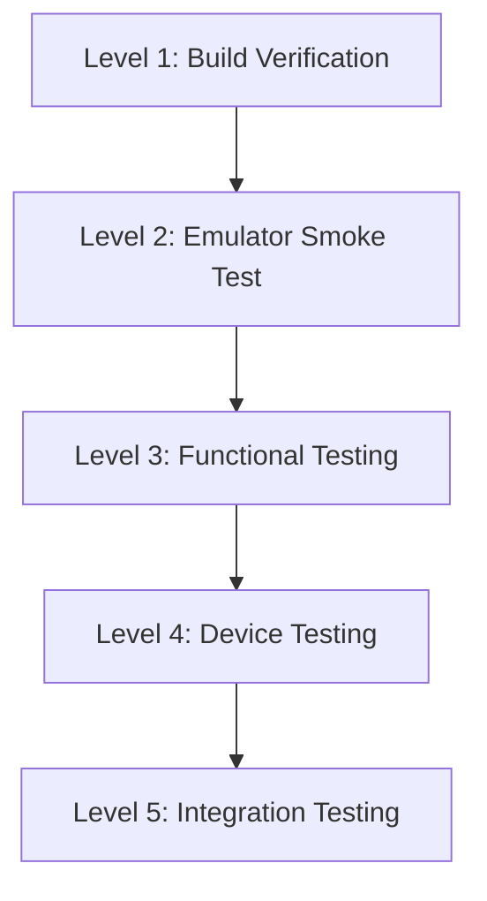

# Testing Strategy — Android

> **Updated 2026-08-27.** All phases shipped; the checklists below serve as the regression matrix used during manual device testing. Automated suite (xUnit) now lives in `tests/XBVault.Tests` (390+ tests) and is not duplicated on device. Port

## Testing Levels



---

## Level 1: Build Verification

**When:** Every code change
**Where:** Developer machine + CI
**Time:** < 2 minutes

### Commands

```bash
# Verify desktop build still works
dotnet build XBVault -c Release

# Verify Android build
dotnet build XBVault.Android -f net10.0-android36.0 -c Debug

# Run existing tests
dotnet test tests/XBVault.Tests -c Release
```

### Checklist

- [ ] Desktop build succeeds with no new warnings
- [ ] Android build succeeds with no errors
- [ ] Existing unit tests pass
- [ ] No new analyzer warnings

---

## Level 2: Emulator Smoke Test

**When:** After Phase 0 and Phase 1
**Where:** Android emulator
**Time:** 5 minutes

### Emulator Setup

1. Install Android SDK via Visual Studio or `sdkmanager`
2. Create AVD: Pixel 6 API 34 (Android 14)
3. Enable hardware acceleration (HAXM or Hyper-V)

### Smoke Test Script

```bash
# Build and deploy to emulator
dotnet build XBVault.Android -f net10.0-android36.0 -c Debug
dotnet android:run -f net10.0-android36.0

# Or use adb
adb install -r XBVault.Android/bin/Debug/net10.0-android36.0/com.companyname.xbvault.apk
adb shell am start -n com.companyname.xbvault/.MainActivity
```

### Checklist

- [ ] App launches without crash
- [ ] Avalonia UI renders (not blank screen)
- [ ] Bottom tab bar visible (Phase 1+)
- [ ] Tab switching works
- [ ] No ANR (Application Not Responding) dialogs

---

## Level 3: Functional Testing

**When:** After Phase 2+
**Where:** Android emulator or device on same network as Xbox
**Time:** 15–30 minutes per session

### Test Scenarios

#### Connection

| # | Test | Steps | Expected |
|---|------|-------|----------|
| F.1 | Manual connection | Enter Xbox IP, port, credentials → Connect | Connected, green status indicator |
| F.2 | Auto-connect | Start app with saved credentials | Auto-connects within 5 seconds |
| F.3 | Disconnect | Tap Disconnect button | Returns to disconnected state |
| F.4 | Connection error | Enter wrong IP → Connect | Error dialog with message |
| F.5 | Reconnect | Disconnect → Connect again | Reconnects successfully |

#### Browse

| # | Test | Steps | Expected |
|---|------|-------|----------|
| F.6 | Load catalog | Open Browse tab | Catalog loads with items |
| F.7 | Search | Type in search field | Filters results |
| F.8 | View details | Tap an item | Item detail page opens |
| F.9 | Install from browse | Tap Install on item detail | Package downloads and installs |
| F.10 | Catalog offline | Enable airplane mode → open Browse | Shows cached catalog |

#### Installed

| # | Test | Steps | Expected |
|---|------|-------|----------|
| F.11 | List packages | Open Installed tab | Shows installed Xbox packages |
| F.12 | Launch package | Tap Launch on a package | Xbox launches the app |
| F.13 | Uninstall package | Tap Uninstall → confirm | Package removed from list |
| F.14 | Update available | Package has update | Update badge shown |

#### File Explorer

| # | Test | Steps | Expected |
|---|------|-------|----------|
| F.15 | Browse files | Open File Explorer tab | Shows Xbox filesystem |
| F.16 | Navigate folders | Tap a folder | Enters folder, shows contents |
| F.17 | Go back | Tap back arrow | Returns to parent directory |
| F.18 | Upload file | Tap Upload → select file | File uploads with progress |
| F.19 | Download file | Long-press file → Download | File downloads to device |

#### Settings

| # | Test | Steps | Expected |
|---|------|-------|----------|
| F.20 | View settings | Open Settings tab | Shows settings form |
| F.21 | Change IP | Edit Xbox IP → Save | Setting persists |
| F.22 | Change scale | Adjust UI scale slider | UI scales (desktop only) |

---

## Level 4: Device Testing

**When:** After Phase 3
**Where:** Physical Android device
**Time:** 1–2 hours

### Device Requirements

- Android 8.0+ (API 26+) for broad compatibility
- Same WiFi network as Xbox Dev Mode console
- USB debugging enabled for deploy

### Device-Specific Tests

| # | Test | Device | Expected |
|---|------|--------|----------|
| D.1 | Phone portrait | Any phone | Layout correct, all elements visible |
| D.2 | Phone landscape | Any phone | Layout adapts, no overlap |
| D.3 | Tablet portrait | Any tablet | 2-column layout where appropriate |
| D.4 | Tablet landscape | Any tablet | Sidebar or 3-column layout |
| D.5 | Small screen | 5" phone | All elements tappable, readable |
| D.6 | Large screen | 7"+ tablet | Efficient use of space |
| D.7 | Slow network | Throttled WiFi | Loading states, timeouts handled |
| D.8 | Background/foreground | Kill and reopen app | State preserved or reloaded |
| D.9 | Screen rotation | Rotate device mid-use | Layout adapts, no crash |
| D.10 | Back button | Press Android back | Navigates back correctly |

### Performance Tests

| # | Test | Tool | Target |
|---|------|------|--------|
| P.1 | Cold start time | Manual | < 3 seconds to interactive |
| P.2 | Scroll smoothness | Manual | 60fps in all list views |
| P.3 | Memory usage | `adb shell dumpsys meminfo` | < 150MB active |
| P.4 | Network latency | Manual | SSH commands respond < 2s |
| P.5 | Long session | 30min continuous use | No memory leaks, no ANR |

---

## Level 5: Integration Testing

**When:** After Phase 4
**Where:** Device + Xbox Dev Mode console
**Time:** 1–2 hours

### End-to-End Flows

| # | Flow | Steps |
|---|------|-------|
| E.1 | First launch → connect → browse → install → launch | Complete onboarding flow |
| E.2 | Browse → install → verify on Xbox | Install appears in Xbox package list |
| E.3 | File Explorer → upload → verify on Xbox | File accessible on Xbox filesystem |
| E.4 | Settings → change → reconnect | Settings persist across reconnection |
| E.5 | Connection loss → reconnect | Handles network interruption gracefully |
| E.6 | Multiple installs | Install 3+ packages in sequence |
| E.7 | Large file upload | Upload 100MB+ package via File Explorer |

---

## Automated Testing

### Unit Tests (existing)

The existing `tests/XBVault.Tests` project runs on desktop. For Android:

- ViewModels are testable on any platform (no UI dependencies)
- Services can be tested with mocked HTTP/SSH
- Run existing tests as part of Android CI

### UI Tests (future)

Avalonia supports UI testing via:
- `HeadlessRunner` for automated AXAML tests
- Custom test harness for ViewModels

Not recommended for initial port — manual testing is sufficient for Phase 0–3.

---

## Test Environment Setup

### Prerequisites

```bash
# Install Android SDK (via Visual Studio or manual)
# Required: Platform API 34, Build Tools 34.0.0

# Verify SDK
dotnet workload list  # Should show android workload
adb --version

# Create emulator AVD
avdmanager create avd -n Pixel6_API34 -k "system-images;android-34;google_apis;x86_64"
emulator -avd Pixel6_API34
```

### Network Setup

For testing Xbox connection from emulator:
- Xbox and development machine on same subnet
- Xbox Dev Mode enabled and portal running
- Emulator uses host network (default for Android emulator)

For testing from physical device:
- Device and Xbox on same WiFi
- Use Xbox IP address (not localhost)

---

## Bug Reporting

When issues are found during testing:

1. **Capture logs:**
   ```bash
   adb logcat -s "XBVault" > android_logs.txt
   ```

2. **Capture screenshot:**
   ```bash
   adb shell screencap -p /sdcard/screenshot.png
   adb pull /sdcard/screenshot.png
   ```

3. **Include in report:**
   - Device model and Android version
   - Steps to reproduce
   - Expected vs actual behavior
   - Log file and screenshot
