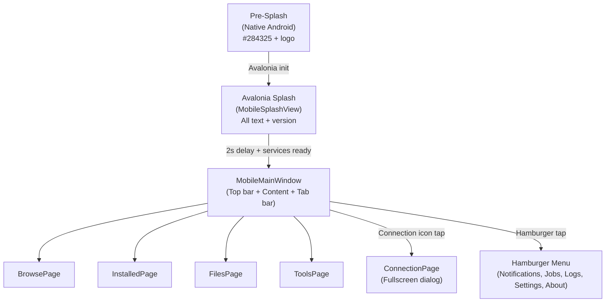

# Mobile UX Design — Android Port

> Complete UX specification for the Android app. All UI decisions are documented here.
> Android views are **independent files** in `XBVault.Android/Views/` — they copy visual patterns from desktop but have full freedom to change later.

---

## Design Principles

| Principle | Rule |
|-----------|------|
| **Blade theme fidelity** | Same Xbox 360 green identity, Oxanium fonts, gradients, card styles. Android inherits `BladesTheme.axaml` from shared via `App.axaml`, but AXAML views are independent. |
| **Mobile-first UX** | Bottom tabs, fullscreen pages, touch targets ≥48dp, no hover effects. |
| **Portrait-only** | Fase 1-3. `ScreenOrientation.Portrait` in `MainActivity`. |
| **Independent UI** | Android views are NEW files in `XBVault.Android/Views/`. No shared AXAML with desktop. Copy when needed for independence. |
| **Shared ViewModels** | `XBVault/ViewModels/` — same code for desktop and Android. Contract layer. |
| **Icon reuse** | Same icons as desktop, referenced via `avares://XBVault/Assets/...`. Copy only for native Android resources (pre-splash drawable). |

---

## Screen Flow



---

## Screen 1: Pre-Splash (Native Android)

Splash nativo Android que aparece **instantaneamente** ao abrir a app, antes do Avalonia inicializar.

### Visual

```
┌──────────────────────────────────────┐
│                                      │
│            (fundo #284325)           │
│                                      │
│                                      │
│            [Xbox Logo]               │
│           (centralizado)             │
│                                      │
│                                      │
│                                      │
└──────────────────────────────────────┘
```

Fundo sólido `#284325` (verde escuro Xbox) com logo da aplicação centralizado.

### Assets

| Asset | Fonte | Destino |
|-------|-------|---------|
| Logo | `XBVault/Assets/Views/SplashWindow/splash-appicon-80.png` | `XBVault.Android/Resources/drawable/splash_icon.png` (copia) |

### Config

- `styles.xml`: `windowBackground=#284325`, `windowSplashScreenBackground=#284325`, `windowSplashScreenAnimatedIcon=@drawable/splash_icon`
- `values-v31/styles.xml`: idem + API 31+ splash attributes

---

## Screen 2: Avalonia Splash (`MobileSplashView`)

Splash Avalonia que aparece assim que o framework inicializa. Repete o layout do desktop splash adaptado pra portrait.

### Visual (portrait)

```
┌──────────────────────────────────────┐
│         (splash-bg.png fill)         │
│                                      │
│            [Xbox Logo 80x80]         │
│                                      │
│         XB HOMEBREW                  │
│            VAULT                     │
│                                      │
│  Desktop manager for Xbox Dev Mode   │
│            ────                      │
│            v2.0.4                    │
│         Marcelo Frau                 │
│         GPL-3.0-only                 │
│                                      │
│   ──────────────────────────────     │
│          (progress bar)              │
└──────────────────────────────────────┘
```

### Elementos (mesmos do desktop)

| Elemento | Estilo | Asset |
|----------|--------|-------|
| Fundo | `ImageBrush splash-bg.png` UniformToFill | `avares://XBVault/Assets/Views/SplashWindow/splash-bg.png` |
| Borda | `#9ACA3C` 2px | — |
| Logo | 80x80 centralizado | `avares://XBVault/Assets/Views/SplashWindow/splash-appicon-80.png` |
| "XB HOMEBREW" | AccentBrush (#9ACA3C), bold, 14px, letter-spacing 2 | texto |
| "VAULT" | TextBrush (#F0F0F0), bold, 30px, letter-spacing 3 | texto |
| Subtítulo | #B0B0B0, 12px | texto |
| Separador | 40px, AccentBrush | — |
| Versão | AccentBrush, bold, 15px | `BuildInfo.DisplayVersion` |
| Autor | #888, 11px | texto |
| Licença | YellowBrush (#FFD700), semi-bold, 12px | texto |
| Progress bar | indeterminate, AccentBrush, 2px | — |

### Duração

~2 segundos (mesmo `SplashMinDelayMs` do desktop), depois transição automática pro MobileMainWindow.

### Arquivos

| Arquivo | Tipo |
|---------|------|
| `XBVault.Android/Views/MobileSplashView.axaml` | AXAML (UserControl) |
| `XBVault.Android/Views/MobileSplashView.axaml.cs` | Code-behind |

---

## Screen 3: MobileMainWindow Shell

Shell principal — top bar, content area, bottom tab bar.

### Visual

```
┌──────────────────────────────────────┐
│ Top Bar                               │
│ [logo] XB Homebrew Vault   [🔗] [☰] │
├──────────────────────────────────────┤
│                                      │
│  Content Area                        │
│  (BrowsePage por default)            │
│  (conteúdo interno na Fase 2)        │
│                                      │
│                                      │
│                                      │
├──────────────────────────────────────┤
│ Bottom Tab Bar (4 tabs, icons only)  │
│ [🔍] [📦] [📁] [🔧]                │
└──────────────────────────────────────┘
```

### Top Bar

| Elemento | Posição | Visual | Comportamento |
|----------|---------|--------|---------------|
| Logo Xbox (small) | Esquerda | 24x24, do asset `splash-appicon-80.png` escala menor | Decorativo |
| "XB Homebrew Vault" | Esquerda ao lado do logo | Font TitleFont (Oxanium), bold, 16px, TextBrush | Decorativo |
| Ícone conexão | Direita | Asset do desktop, muda cor por status | Tap → ConnectionPage (Fase 2). Placeholder na Fase 1B |
| Hamburger (☰) | Direita, extremo | Ícone 3 linhas | Tap → abre dropdown menu |

**Background**: `TitleGradient` (#447F3E → #9ACA3C) — mesmo gradiente do desktop.
**Altura**: 48dp (touch-friendly).

### Connection Status Icons

| Status | Asset | Cor |
|--------|-------|-----|
| Conectado | `mainwindow-status-connected-16.png` | AccentBrush (#9ACA3C) |
| Desconectado | `mainwindow-status-disconnected-16.png` | TextMutedBrush (#8B8D91) |
| Não configurado | `mainwindow-status-notconfigured-16.png` | TextDimBrush (#5A5C60) |

### Hamburger Menu

Dropdown popup posicionado abaixo do ícone:

```
┌────────────────────────────────┐
│ 🔔  Notifications              │
│ 📋  Jobs                       │
│ ──────────────                 │
│ 📋  Logs                       │
│ ⚙   Settings                   │
│ ──────────────                 │
│ ℹ   About                      │
└────────────────────────────────┘
```

**Background**: `SurfaceAltBrush` (#252830), borda `BorderBrush`.
**Estilo**: Reutiliza o estilo `MenuFlyout` do BladesTheme (já existe).
**Items**: Ícones 20x20 do desktop, texto 14px.

### Bottom Tab Bar — 4 tabs, icons only

| Tab | Índice | Ícone | Cor selecionado | Cor não-selecionado |
|-----|--------|-------|-----------------|---------------------|
| Browse | 0 | `mainwindow-browse-32.png` | AccentBrush | TextMutedBrush |
| Installed | 1 | `mainwindow-installed-32.png` | AccentBrush | TextMutedBrush |
| Files | 2 | `mainwindow-fileexplorer-32.png` | AccentBrush | TextMutedBrush |
| Tools | 3 | `mainwindow-tools-32.png` | AccentBrush | TextMutedBrush |

**Ícones**: Mesmos assets do desktop, referenciados via `avares://XBVault/Assets/Views/MainWindow/...`.
**Background**: `SurfaceBrush` (#1A1D23) ou `BgBrush` (#0D1117).
**Altura**: 56dp.
**Selecionado**: Ícone fica verde + indicador sutil (underline ou dot).
**Sem texto**: Só ícones.

**Binding**: `SelectedIndex` → `MainViewModel.SelectedTab` (0-3).

### Content Area

`Carousel` ou `ContentControl` com `DataTemplate`:

```xml
<Carousel SelectedIndex="{Binding SelectedTab}">
  <!-- Tab 0: BrowsePage placeholder -->
  <!-- Tab 1: InstalledPage placeholder -->
  <!-- Tab 2: FilesPage placeholder -->
  <!-- Tab 3: ToolsPage placeholder -->
</Carousel>
```

**Fase 1B**: Só placeholders ("Browse" / "Installed" / "Files" / "Tools"). Conteúdo real na Fase 2.

### Arquivos

| Arquivo | Tipo |
|---------|------|
| `XBVault.Android/Views/MobileMainWindow.axaml` | AXAML (UserControl or Window) |
| `XBVault.Android/Views/MobileMainWindow.axaml.cs` | Code-behind |

---

## Tab Mapping

| Desktop Tab | Índice | Mobile Tab | Índice Mobile | Acessível por |
|-------------|--------|------------|---------------|---------------|
| Browse | 0 | Browse | 0 | Tab bar |
| Installed | 1 | Installed | 1 | Tab bar |
| FileExplorer | 2 | Files | 2 | Tab bar |
| Tools | 3 | Tools | 3 | Tab bar |
| Inspector | 4 | — | — | **Excluído do Android** |
| Settings | 5 | — | — | Hamburger menu |
| Logs | 6 | — | — | Hamburger menu |

**Nota**: `MainViewModel.SelectedTab` usa índices 0-6. No mobile são 0-3 pras tabs + 4 pra Settings via hamburger. Inspector excluído do Android.

---

## Dialog Strategy

### Desktop: `ShowDialog()` (separate Window)

All 21 dialog views inherit from `Window` and are opened via `ShowDialog(mainWindow)`.

### Mobile: 3 presentation modes

| Modo | Quando | Exemplos |
|------|--------|----------|
| **Fullscreen page** | Dialogs complexos (multi-step, forms) | ConnectionPage, SetupWizardPage, ItemDetailPage, CustomInstallPage |
| **Bottom sheet** | Confirms simples, erros | ConfirmPage, DeleteConfirmPage, ErrorPage, InputPage |
| **Inline** | Info estática, ações simples | AboutPage, SftpInfoPage, RefreshPage |

### Navigation Stack

Desktop usa `ShowDialog(mainWindow)`. Android vai usar:
- `ShowConnectAction` → push ConnectionPage (Fase 2)
- `ShowAboutAction` → push AboutPage (Fase 2)
- `ShowDetailAction` → push ItemDetailPage (Fase 2)

**Fase 1B**: Só seta as ações como noop ou placeholder.

---

## Back Button Behavior

1. Se NavigationStack tem página → pop
2. Se em tab que não é Browse → vai pra Browse
3. Se em Browse → minimize/exit

---

## Touch Guidelines

- Mínimo 48x48dp pra targets interativos
- Font size mínimo 14sp corpo
- Sem hover effects, usar `:pressed`
- Scroll natural do Android
- Swipe gestures para navegação entre tabs (opcional Fase 4)

---

## Icon Mapping

### Referenciados do shared via `avares://XBVault/Assets/...`

| Uso | Asset | Tamanho original | Uso no Android |
|-----|-------|-----------------|----------------|
| Fundo splash | `SplashWindow/splash-bg.png` | full | ImageBrush UniformToFill |
| Logo splash | `SplashWindow/splash-appicon-80.png` | 80x80 | Centralizado no splash + logo top bar |
| Tab Browse | `MainWindow/mainwindow-browse-32.png` | 32x32 | Ícone tab, scale pra 24dp |
| Tab Installed | `MainWindow/mainwindow-installed-32.png` | 32x32 | Ícone tab, scale pra 24dp |
| Tab Files | `MainWindow/mainwindow-fileexplorer-32.png` | 32x32 | Ícone tab, scale pra 24dp |
| Tab Tools | `MainWindow/mainwindow-tools-32.png` | 32x32 | Ícone tab, scale pra 24dp |
| Status conectado | `MainWindow/mainwindow-status-connected-16.png` | 16x16 | Top bar connection icon |
| Status desconectado | `MainWindow/mainwindow-status-disconnected-16.png` | 16x16 | Top bar connection icon |
| Status não-config | `MainWindow/mainwindow-status-notconfigured-16.png` | 16x16 | Top bar connection icon |
| Hamburger | `MainWindow/mainwindow-hamburger-20.png` | 20x20 | Top bar hamburger icon |
| Menu: Notifications | `MainWindow/mainwindow-bell-20.png` | 20x20 | Menu item icon |
| Menu: Jobs | `MainWindow/mainwindow-tasks-20.png` | 20x20 | Menu item icon |
| Menu: Logs | `MainWindow/mainwindow-logs-32.png` | 32x32 | Scale pra 20dp no menu |
| Menu: Settings | `MainWindow/mainwindow-settings-32.png` | 32x32 | Scale pra 20dp no menu |
| Menu: About | `MainWindow/mainwindow-about-32.png` | 32x32 | Scale pra 20dp no menu |

### Ícone novo copiado do personal set

| Uso | Fonte | Destino |
|-----|-------|---------|
| Hamburger menu | `F:\workspace\icons8-personal-set\20x20\fluentui-hamburger-20.png` | `XBVault/Assets/Views/MainWindow/mainwindow-hamburger-20.png` |

### Cópia pro Android drawable (pre-splash nativo)

| Uso | Fonte | Destino |
|-----|-------|---------|
| Logo pre-splash | `XBVault/Assets/Views/SplashWindow/splash-appicon-80.png` | `XBVault.Android/Resources/drawable/splash_icon.png` |

---

## Blade Theme Color Palette (Reference)

| Token | Hex | Usage |
|-------|-----|-------|
| `BladesBg` | `#0D1117` | Main background |
| `BladesSurface` | `#1A1D23` | Dialog/surface background |
| `BladesSurfaceAlt` | `#252830` | Card/list backgrounds |
| `BladesAccent` | `#9ACA3C` | Primary accent (Xbox green) |
| `BladesAccentDim` | `#6B8F2A` | Accent dimmed |
| `BladesText` | `#F0F0F0` | Primary text |
| `BladesTextMuted` | `#8B8D91` | Secondary text |
| `BladesTextDim` | `#5A5C60` | Disabled/labels |
| `BladesDanger` | `#E74C3C` | Destructive actions |
| `BladesBorder` | `#2A2D33` | Borders, dividers |
| `BladesCardBg` | `#1E2128` | Card backgrounds |
| `TitleGradient` | `#447F3E → #9ACA3C` | Top bar gradient |

---

## Typography (Reference)

- **Title**: Oxanium Bold 700 (`Assets/Fonts/Oxanium-700.ttf`)
- **Body**: Oxanium Regular 400 (`Assets/Fonts/Oxanium-400.ttf`)
- **Mono**: ProFontWindows Nerd Font (`Assets/Fonts/ProFontWindowsNerdFont-Regular.ttf`)
- **Fallback**: Inter, Segoe UI, sans-serif
