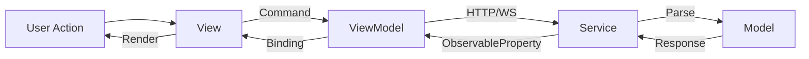
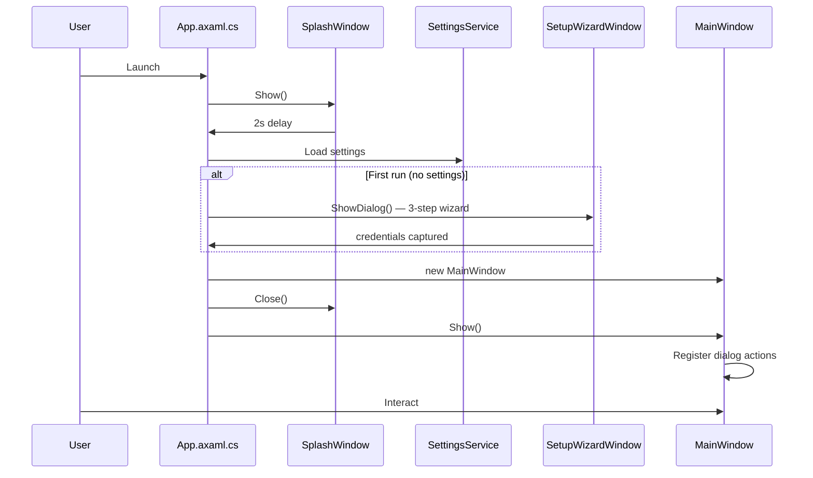
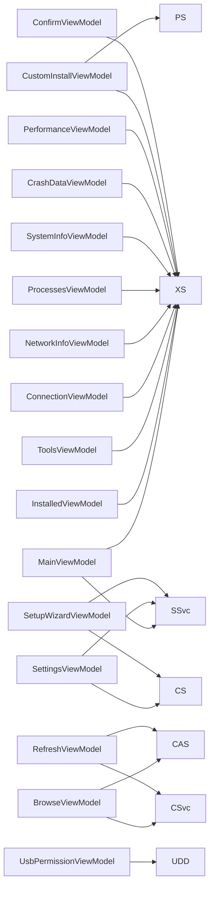
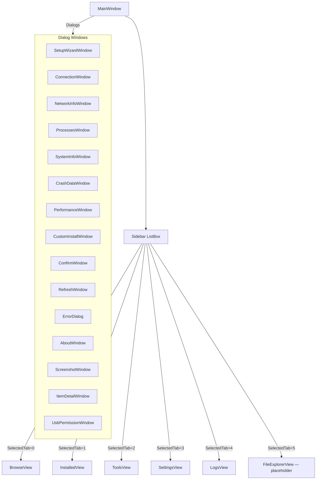

# Architecture

XB Homebrew Vault uses the **MVVM** pattern with **CommunityToolkit.Mvvm** and **Avalonia UI 12**. It targets Windows and Linux via .NET 8, communicating with an Xbox console in Developer Mode via the Windows Device Portal (WDP) REST API and WebSocket.

## Layered Architecture

```mermaid
graph TD
    subgraph Views["Views (Avalonia XAML)"]
        MW[MainWindow]
        SW[SplashWindow]
        SetupW[SetupWizardWindow]
        BV[BrowseView]
        IV[InstalledView]
        SV[SettingsView]
        TV[ToolsView]
        LV[LogsView]
        FV[FileExplorerView]
        CW[ConnectionWindow]
        NIW[NetworkInfoWindow]
        PW[ProcessesWindow]
        SIW[SystemInfoWindow]
        CDW[CrashDataWindow]
        PerfW[PerformanceWindow]
        UsbW[UsbPermissionWindow]
    end

    subgraph ViewModels["ViewModels (CommunityToolkit.Mvvm)"]
        MVM[MainViewModel]
        BVM[BrowseViewModel]
        IVM[InstalledViewModel]
        SVM[SettingsViewModel]
        TVM[ToolsViewModel]
        CVM[ConnectionViewModel]
        NIVM[NetworkInfoViewModel]
        PVM[ProcessesViewModel]
        SIVM[SystemInfoViewModel]
        CDVM[CrashDataViewModel]
        PerfVM[PerformanceViewModel]
        RVM[RefreshViewModel]
        ConfVM[ConfirmViewModel]
        CIWM[CustomInstallViewModel]
        SWVM[SetupWizardViewModel]
        USBVM[UsbPermissionViewModel]
    end

    subgraph Services["Services"]
        XS[XboxDeviceService]
        CAS[CatalogApiService]
        PS[PackageInstallService]
        SSvc[SettingsService]
        CS[CryptoService]
        CSvc[CacheService]
        UDD[UsbDriveDetector]
        AH[AdminHelper]
        L[Logger]
    end

    subgraph Models["Models"]
        CI[CatalogItem]
        IP[InstalledPackage]
        PI[ProcessInfo]
        NI[NetworkInfo]
        SI[SystemInfo]
        CD[CrashDumpInfo]
        PSnap[PerformanceSnapshot]
        XC[XboxConnection]
        AS[AppSettings]
        IPI[InstallProgressInfo]
        UDI[UsbDriveInfo]
    end

    Views --> ViewModels
    ViewModels --> Services
    Services --> Models
```



| Layer | Responsibility |
|-------|---------------|
| **Views** | Avalonia AXAML windows and user controls — purely declarative |
| **ViewModels** | Commands, observable state, business-logic orchestration |
| **Services** | All I/O: HTTP, WebSocket, file system, settings, crypto, caching, WMI |
| **Models** | Plain data classes — `CatalogItem`, `InstalledPackage`, `PerformanceSnapshot`, etc. |

## Data Flow



## App Startup



## Services

| Service | Responsibility |
|---------|---------------|
| `XboxDeviceService` | All Xbox Device Portal API calls (REST + WebSocket). God class — split planned. 1038 lines. |
| `CatalogApiService` | Fetches and parses the Emulation Revival `catalog.json` API. Replaced the former HTML scraper. |
| `PackageInstallService` | Package analysis, dependency resolution, install pipeline |
| `SettingsService` | Persists `AppSettings` to `%APPDATA%/XBVault/settings.json` |
| `CryptoService` | XOR + Base64 credential obfuscation |
| `CacheService` | In-memory catalog cache with expiry |
| `UsbDriveDetector` | Lists USB drives via WMI (`System.Management`) — Windows-only |
| `AdminHelper` | Elevation helpers for operations requiring admin rights |
| `Logger` | File + console logging (`AttachConsole` via `DllImport` — Windows-only) |

## ViewModel → Service Dependency Map



| ViewModel | Window/View | Key services |
|-----------|-------------|-------------|
| `BrowseViewModel` | BrowseView | CatalogApiService, CacheService |
| `InstalledViewModel` | InstalledView | XboxDeviceService |
| `ToolsViewModel` | ToolsView | XboxDeviceService |
| `CustomInstallViewModel` | CustomInstallWindow | XboxDeviceService, PackageInstallService |
| `PerformanceViewModel` | PerformanceWindow | XboxDeviceService (WebSocket) |
| `SettingsViewModel` | SettingsView | SettingsService, CryptoService |
| `UsbPermissionViewModel` | UsbPermissionWindow | UsbDriveDetector |
| `SetupWizardViewModel` | SetupWizardWindow | SettingsService, CryptoService |

## Navigation



Dialogs are opened via registered delegate actions in `App.axaml.cs`.

> **Note:** `FileExplorerView` (tab 5) is currently a placeholder — "Not implemented yet". Full SSH/SFTP-based file explorer is planned as the next major feature.

## Xbox WDP API Integration

`XboxDeviceService` communicates with the Xbox Developer Mode Device Portal:

Base URL: `https://{xbox-ip}:11443` · Auth: HTTP Basic

| Endpoint | Method | Purpose |
|----------|--------|---------|
| `/api/os/info` | GET | Device info, connection test |
| `/api/app/packagemanager/packages` | GET | List installed packages |
| `/api/app/packagemanager/package` | POST | Install package |
| `/api/app/packagemanager/package` | DELETE | Uninstall package |
| `/api/taskmanager/app` | POST | Launch app by PackageRelativeId |
| `/api/taskmanager/app/state` | POST | Suspend/resume/terminate package |
| `/api/resourcemanager/processes` | GET | List running processes |
| `/api/taskmanager/process` | DELETE | Kill process by PID |
| `/ext/app/runningtitle` | GET | Get currently running title |
| `/api/app/debug/crashdump` | GET | List crash dumps |
| `/api/app/debug/crashdump/{filename}` | DELETE | Delete crash dump |
| `/api/app/debug/crashcontrol` | GET | Get crash dump settings |
| `/api/app/debug/crashcontrol` | POST | Enable/disable crash dumps |
| `/api/networking/networkconfig` | GET | Get network configuration |
| `/api/wifi/interfaces` | GET | List WiFi interfaces |
| `/api/wifi/networks/{guid}` | GET | List WiFi networks |
| `/api/system/info` | GET | Get system information |
| `/api/screenshot` | GET | Capture screenshot |
| `/api/system/restart` | POST | Restart Xbox |
| `/api/system/shutdown` | POST | Shutdown Xbox |

## Catalog API

`CatalogApiService` fetches the Emulation Revival catalog from a single JSON endpoint:

```
https://emulationrevival.github.io/catalog.json
```

The JSON is parsed into `CatalogItem` models covering categories: Emulator, Frontend, GamePort, App, Experimental, Media, Utility. Results are cached by `CacheService`.

> **Previously:** the catalog was scraped from 7 individual HTML pages using HtmlAgilityPack. That approach was replaced when Emulation Revival published the `catalog.json` API, which provides more reliable and structured data.

## Performance WebSocket

`XboxDeviceService` connects to a WebSocket endpoint for real-time performance:

```
wss://{xbox-ip}:11443/api/resourcemanager/processes
```

Receives JSON frames with `PerformanceSnapshot` data (CPU, memory, GPU clock, temperature per core). Rendered by `PerformanceViewModel`.

## Settings Persistence

`SettingsService` reads/writes `%APPDATA%/XBVault/settings.json`. Passwords obfuscated by `CryptoService` (salt + XOR + Base64) — not encryption, just obfuscation to avoid plaintext in JSON.

## USB Permission Wizard

`UsbPermissionViewModel` + `UsbDriveDetector` implement a Windows-only wizard that:

1. Lists USB drives via WMI (`System.Management`)
2. Grants `ALL APPLICATION PACKAGES` NTFS permissions via `icacls`
3. Includes a spinner, 1-second minimum delay, and skips protected system directories

This allows Xbox Dev Mode to read ROM/media files from USB drives.

## Window Pattern

All dialog windows share a common template:

- `WindowDecorations="None"` — no OS chrome
- `Background="{StaticResource SurfaceBrush}"` — dark gray `#1A1D23`
- Root `<Border>` with `BorderBrush="#447F3E" BorderThickness="2" Margin="1"` — green border + 1px gap
- Title bar: `LinearGradientBrush` from `#447F3E` → `#9ACA3C`
- Close button: transparent default, `#CC3333` on hover
- Content area: 20px padding
- Drag via `PointerPressed="OnTitleBarPointerPressed"` + `BeginMoveDrag()`

See [Window Template](window-template) for the full AXAML template.

## CI / Build

CI runs on every push and PR via GitHub Actions:

| Job | Runs on | Steps |
|-----|---------|-------|
| `build` | Windows + Ubuntu (matrix) | restore → build Release |
| `release` | Windows + Ubuntu + macOS (tag push only) | publish win-x64, win-arm64, linux-x64, osx-x64, osx-arm64 → ZIP → GitHub Release |

Release artifacts: `XBVault-{version}-win-x64.zip`, `XBVault-{version}-linux-x64.zip`, `XBVault-{version}-osx-x64.zip`, and `XBVault-{version}-osx-arm64.zip` (all self-contained).

---

[← Home](.) · [API Docs →](api)
