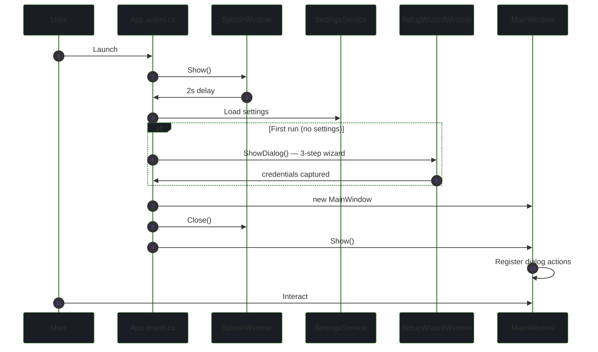
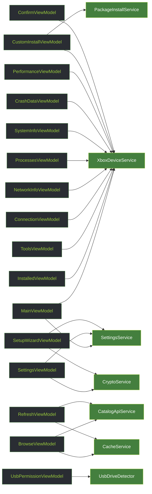
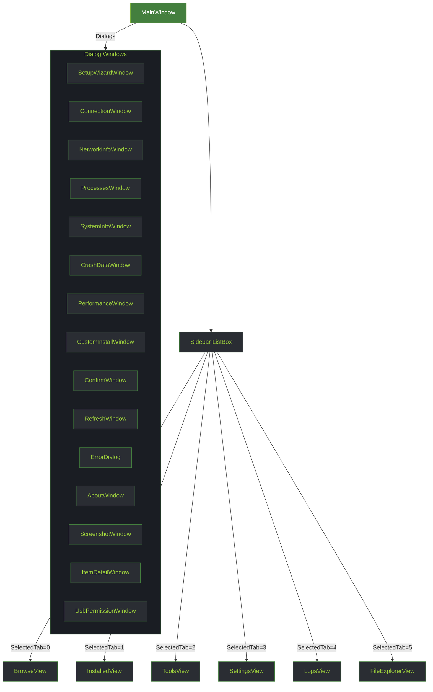

# Architecture

XB Homebrew Vault uses the **MVVM** pattern with **CommunityToolkit.Mvvm** and **Avalonia UI 12**. It targets Windows and Linux via .NET 8, communicating with an Xbox console in Developer Mode via the Windows Device Portal (WDP) REST API and WebSocket.

## Layered Architecture

```mermaid
graph TD
    subgraph Views["Views (Avalonia XAML)"]
        MW[MainWindow]
        SW[SplashWindow]
        SetupW[SetupWizardWindow]
        BV[BrowseView]
        IV[InstalledView]
        SV[SettingsView]
        TV[ToolsView]
        LV[LogsView]
        FV[FileExplorerView]
        CW[ConnectionWindow]
        NIW[NetworkInfoWindow]
        PW[ProcessesWindow]
        SIW[SystemInfoWindow]
        CDW[CrashDataWindow]
        PerfW[PerformanceWindow]
        UsbW[UsbPermissionWindow]
    end

    subgraph ViewModels["ViewModels (CommunityToolkit.Mvvm)"]
        MVM[MainViewModel]
        BVM[BrowseViewModel]
        IVM[InstalledViewModel]
        SVM[SettingsViewModel]
        TVM[ToolsViewModel]
        CVM[ConnectionViewModel]
        NIVM[NetworkInfoViewModel]
        PVM[ProcessesViewModel]
        SIVM[SystemInfoViewModel]
        CDVM[CrashDataViewModel]
        PerfVM[PerformanceViewModel]
        RVM[RefreshViewModel]
        ConfVM[ConfirmViewModel]
        CIWM[CustomInstallViewModel]
        SWVM[SetupWizardViewModel]
        USBVM[UsbPermissionViewModel]
    end

    subgraph Services["Services"]
        XS[XboxDeviceService]
        CAS[CatalogApiService]
        PS[PackageInstallService]
        SSvc[SettingsService]
        CS[CryptoService]
        CSvc[CacheService]
        UDD[UsbDriveDetector]
        AH[AdminHelper]
        L[Logger]
    end

    subgraph Models["Models"]
        CI[CatalogItem]
        IP[InstalledPackage]
        PI[ProcessInfo]
        NI[NetworkInfo]
        SI[SystemInfo]
        CD[CrashDumpInfo]
        PSnap[PerformanceSnapshot]
        XC[XboxConnection]
        AS[AppSettings]
        IPI[InstallProgressInfo]
        UDI[UsbDriveInfo]
    end

    Views --> ViewModels
    ViewModels --> Services
    Services --> Models
    
    style Views fill:#1A1D23,stroke:#447F3E,color:#9ACA3C
    style ViewModels fill:#1A1D23,stroke:#447F3E,color:#9ACA3C
    style Services fill:#447F3E,stroke:#9ACA3C,color:#fff
    style Models fill:#2A2D33,stroke:#447F3E,color:#9ACA3C
    style MW fill:#2A2D33,stroke:#447F3E,color:#9ACA3C
    style SW fill:#2A2D33,stroke:#447F3E,color:#9ACA3C
    style SetupW fill:#2A2D33,stroke:#447F3E,color:#9ACA3C
    style BV fill:#2A2D33,stroke:#447F3E,color:#9ACA3C
    style IV fill:#2A2D33,stroke:#447F3E,color:#9ACA3C
    style SV fill:#2A2D33,stroke:#447F3E,color:#9ACA3C
    style TV fill:#2A2D33,stroke:#447F3E,color:#9ACA3C
    style LV fill:#2A2D33,stroke:#447F3E,color:#9ACA3C
    style FV fill:#2A2D33,stroke:#447F3E,color:#9ACA3C
    style CW fill:#2A2D33,stroke:#447F3E,color:#9ACA3C
    style NIW fill:#2A2D33,stroke:#447F3E,color:#9ACA3C
    style PW fill:#2A2D33,stroke:#447F3E,color:#9ACA3C
    style SIW fill:#2A2D33,stroke:#447F3E,color:#9ACA3C
    style CDW fill:#2A2D33,stroke:#447F3E,color:#9ACA3C
    style PerfW fill:#2A2D33,stroke:#447F3E,color:#9ACA3C
    style UsbW fill:#2A2D33,stroke:#447F3E,color:#9ACA3C
    style MVM fill:#2A2D33,stroke:#447F3E,color:#9ACA3C
    style BVM fill:#2A2D33,stroke:#447F3E,color:#9ACA3C
    style IVM fill:#2A2D33,stroke:#447F3E,color:#9ACA3C
    style SVM fill:#2A2D33,stroke:#447F3E,color:#9ACA3C
    style TVM fill:#2A2D33,stroke:#447F3E,color:#9ACA3C
    style CVM fill:#2A2D33,stroke:#447F3E,color:#9ACA3C
    style NIVM fill:#2A2D33,stroke:#447F3E,color:#9ACA3C
    style PVM fill:#2A2D33,stroke:#447F3E,color:#9ACA3C
    style SIVM fill:#2A2D33,stroke:#447F3E,color:#9ACA3C
    style CDVM fill:#2A2D33,stroke:#447F3E,color:#9ACA3C
    style PerfVM fill:#2A2D33,stroke:#447F3E,color:#9ACA3C
    style RVM fill:#2A2D33,stroke:#447F3E,color:#9ACA3C
    style ConfVM fill:#2A2D33,stroke:#447F3E,color:#9ACA3C
    style CIWM fill:#2A2D33,stroke:#447F3E,color:#9ACA3C
    style SWVM fill:#2A2D33,stroke:#447F3E,color:#9ACA3C
    style USBVM fill:#2A2D33,stroke:#447F3E,color:#9ACA3C
    style XS fill:#2A2D33,stroke:#9ACA3C,color:#fff
    style CAS fill:#2A2D33,stroke:#9ACA3C,color:#fff
    style PS fill:#2A2D33,stroke:#9ACA3C,color:#fff
    style SSvc fill:#2A2D33,stroke:#9ACA3C,color:#fff
    style CS fill:#2A2D33,stroke:#9ACA3C,color:#fff
    style CSvc fill:#2A2D33,stroke:#9ACA3C,color:#fff
    style UDD fill:#2A2D33,stroke:#9ACA3C,color:#fff
    style AH fill:#2A2D33,stroke:#9ACA3C,color:#fff
    style L fill:#2A2D33,stroke:#9ACA3C,color:#fff
    style CI fill:#2A2D33,stroke:#9ACA3C,color:#000
    style IP fill:#2A2D33,stroke:#9ACA3C,color:#000
    style PI fill:#2A2D33,stroke:#9ACA3C,color:#000
    style NI fill:#2A2D33,stroke:#9ACA3C,color:#000
    style SI fill:#2A2D33,stroke:#9ACA3C,color:#000
    style CD fill:#2A2D33,stroke:#9ACA3C,color:#000
    style PSnap fill:#2A2D33,stroke:#9ACA3C,color:#000
    style XC fill:#2A2D33,stroke:#9ACA3C,color:#000
    style AS fill:#2A2D33,stroke:#9ACA3C,color:#000
    style IPI fill:#2A2D33,stroke:#9ACA3C,color:#000
    style UDI fill:#2A2D33,stroke:#9ACA3C,color:#000
```



| Layer | Responsibility |
|-------|---------------|
| **Views** | Avalonia AXAML windows and user controls — purely declarative |
| **ViewModels** | Commands, observable state, business-logic orchestration |
| **Services** | All I/O: HTTP, WebSocket, file system, settings, crypto, caching, WMI |
| **Models** | Plain data classes — `CatalogItem`, `InstalledPackage`, `PerformanceSnapshot`, etc. |

## Data Flow


## App Startup



## Services

| Service | Responsibility |
|---------|---------------|
| `XboxDeviceService` | All Xbox Device Portal API calls (REST + WebSocket). God class — split planned. **1,207 lines, 35 methods** across 8 domains (see detailed breakdown below). |
| `CatalogApiService` | Fetches and parses the Emulation Revival `catalog.json` API. Replaced the former HTML scraper. |
| `PackageInstallService` | Package analysis, dependency resolution, install pipeline |
| `SettingsService` | Persists `AppSettings` to `%APPDATA%/XBVault/settings.json` |
| `CryptoService` | XOR + Base64 credential obfuscation |
| `CacheService` | In-memory catalog cache with expiry |
| `UsbDriveDetector` | Lists USB drives via WMI (`System.Management`) — Windows-only |
| `AdminHelper` | Elevation helpers for operations requiring admin rights |
| `Logger` | File + console logging (`AttachConsole` via `DllImport` — Windows-only) |

> **Verified from Phase 1 code analysis.** Metrics and rationale below reflect the actual source.

### Service Responsibilities (Detailed)

#### XboxDeviceService — domains

The god class spans **8 unrelated domains** (1,207 lines, 35 public methods):

| Domain | Methods | Examples |
|--------|--------:|----------|
| Connection | 6 | `Configure(baseUrl, user, pass)`, `IsConfigured`, connection test |
| Packages | 9 | `ListPackagesAsync`, `InstallPackageAsync`, `UninstallAsync`, `LaunchAsync`, `SuspendAsync`, `TerminateAsync`, `WaitForPackageManagerReady` |
| Processes | 2 | `GetProcessesAsync`, `KillProcessAsync(pid)` |
| Crash dumps | 4 | `ListCrashDumpsAsync`, `DeleteCrashDumpAsync`, `GetCrashControlAsync`, `SetCrashControl` |
| Network | 4 | `GetNetworkConfigAsync`, `GetWifiInterfacesAsync`, `GetWifiNetworksAsync` |
| System | 3 | `GetSystemInfoAsync`, `RestartXboxAsync`, `ShutdownXboxAsync` |
| Screenshot | 1 | `GetScreenshotAsync` (WebSocket) |
| SFTP auth | 2 | `FetchSmbPasswordAsync`, `GetSshCredentials` |

**Key design patterns:**
- **HTTP client recreation on `Configure`** — a fresh `HttpClient` per connection works around `BaseAddress` immutability.
- **Certificate validation bypass** — self-signed console certificates; dev-only.
- **CSRF token via `CookieContainer`** — token attached automatically to requests.
- **WebSocket for performance** — real-time metrics stream, separate from the REST surface.

**Planned split** (tracked in [Tech Debt](tech-debt)):

```text
XboxPackageService     → install, uninstall, launch, suspend, terminate, list
XboxProcessService     → list, kill, running title
XboxCrashService       → list, delete, control
XboxNetworkService     → network config, WiFi
XboxSystemService      → info, restart, shutdown, screenshot
XboxPerformanceService → WebSocket connection
```

#### Other services

| Service | Notes & rationale |
|---------|-------------------|
| `CatalogApiService` | Fetches `catalog.json`, 6-hour TTL, persistent disk cache, stale-fallback on API failure. See [Data Sources](data-sources). |
| `PackageInstallService` | Multi-phase pipeline: download → analyze → upload → install → poll. Regex-based dependency/junk classification. See [Package Installation Flow](integration-package-installation-flow). |
| `SftpService` | Implements `IDisposable`. Wraps synchronous SSH.NET in `Task.Run` to keep the UI responsive; operation timeout + keep-alive. Powers the File Explorer. See [SSH/SFTP & Path Handling](integration-ssh-sftp-challenges). |
| `SettingsService` | Persists to `%APPDATA%\XBVault\settings.json`; credentials obfuscated (XOR + Base64), not encrypted. |
| `CryptoService` | XOR each byte with a key, then Base64 — obfuscation only, not security. |
| `CacheService` | In-memory TTL cache for catalog items; used by browse/refresh flows. |
| `UsbDriveDetector` | WMI enumeration + `icacls` permissioning; Windows-only. See [USB Device Discovery](integration-usb-device-discovery). |
| `AdminHelper` | UAC elevation helpers for admin-only operations. |
| `Logger` | File + console logging; `AttachConsole` via `DllImport("kernel32.dll")` — Windows-specific. |

## ViewModel → Service Dependency Map



| ViewModel | Window/View | Key services |
|-----------|-------------|-------------|
| `BrowseViewModel` | BrowseView | CatalogApiService, CacheService |
| `InstalledViewModel` | InstalledView | XboxDeviceService |
| `ToolsViewModel` | ToolsView | XboxDeviceService |
| `CustomInstallViewModel` | CustomInstallWindow | XboxDeviceService, PackageInstallService |
| `PerformanceViewModel` | PerformanceWindow | XboxDeviceService (WebSocket) |
| `SettingsViewModel` | SettingsView | SettingsService, CryptoService |
| `UsbPermissionViewModel` | UsbPermissionWindow | UsbDriveDetector |
| `SetupWizardViewModel` | SetupWizardWindow | SettingsService, CryptoService |

## MVVM Patterns & Conventions

The app uses **CommunityToolkit.Mvvm** source generators throughout.

**Observable properties & commands:**

```csharp
[ObservableProperty]
private string? selectedItem;            // generates SelectedItem + change notification

[RelayCommand]
private async Task BrowseItemAsync() { } // generates BrowseItemCommand (IAsyncRelayCommand)
```

**ViewModel lifecycle:** constructor injection of services → synchronous setup → async initialization fired from the View (e.g. `Loaded`) via a `[RelayCommand]`.

```csharp
public BrowseViewModel(CatalogApiService catalog, CacheService cache)
{
    _catalog = catalog;                  // constructor injection
    _cache = cache;
}

[RelayCommand]
private async Task LoadCatalogAsync()
{
    var items = await _catalog.FetchCatalogAsync();
    Items.Clear();
    Items.AddRange(items);               // observable update — must run on UI thread
}
```

**Async threading convention:**
- **Service layer** should use `.ConfigureAwait(false)` (no UI affinity required).
- **ViewModel layer** intentionally omits `ConfigureAwait` — observable updates must stay on the UI thread.

> The codebase does not yet apply `ConfigureAwait(false)` in services — tracked in [Tech Debt](tech-debt).

## Navigation



Dialogs are opened via registered delegate actions in `App.axaml.cs`.

> **Note:** `FileExplorerView` (tab 5) ships as a functional SSH/SFTP file explorer in **v0.8.7** (it was a "Not implemented yet" placeholder in earlier releases). See [SSH/SFTP & Path Handling](integration-ssh-sftp-challenges).

## Xbox WDP API Integration

`XboxDeviceService` communicates with the Xbox Developer Mode Device Portal:

Base URL: `https://{xbox-ip}:11443` · Auth: HTTP Basic

| Endpoint | Method | Purpose |
|----------|--------|---------|
| `/api/os/info` | GET | Device info, connection test |
| `/api/app/packagemanager/packages` | GET | List installed packages |
| `/api/app/packagemanager/package` | POST | Install package |
| `/api/app/packagemanager/package` | DELETE | Uninstall package |
| `/api/taskmanager/app` | POST | Launch app by PackageRelativeId |
| `/api/taskmanager/app/state` | POST | Suspend/resume/terminate package |
| `/api/resourcemanager/processes` | GET | List running processes |
| `/api/taskmanager/process` | DELETE | Kill process by PID |
| `/ext/app/runningtitle` | GET | Get currently running title |
| `/api/app/debug/crashdump` | GET | List crash dumps |
| `/api/app/debug/crashdump/{filename}` | DELETE | Delete crash dump |
| `/api/app/debug/crashcontrol` | GET | Get crash dump settings |
| `/api/app/debug/crashcontrol` | POST | Enable/disable crash dumps |
| `/api/networking/networkconfig` | GET | Get network configuration |
| `/api/wifi/interfaces` | GET | List WiFi interfaces |
| `/api/wifi/networks/{guid}` | GET | List WiFi networks |
| `/api/system/info` | GET | Get system information |
| `/api/screenshot` | GET | Capture screenshot |
| `/api/system/restart` | POST | Restart Xbox |
| `/api/system/shutdown` | POST | Shutdown Xbox |

## Catalog API

`CatalogApiService` fetches the Emulation Revival catalog from a single JSON endpoint:

```
https://emulationrevival.github.io/catalog.json
```

The JSON is parsed into `CatalogItem` models covering categories: Emulator, Frontend, GamePort, App, Experimental, Media, Utility. Results are cached by `CacheService`.

> **Previously:** the catalog was scraped from 7 individual HTML pages using HtmlAgilityPack. That approach was replaced when Emulation Revival published the `catalog.json` API, which provides more reliable and structured data.

## Performance WebSocket

`XboxDeviceService` connects to a WebSocket endpoint for real-time performance:

```
wss://{xbox-ip}:11443/api/resourcemanager/processes
```

Receives JSON frames with `PerformanceSnapshot` data (CPU, memory, GPU clock, temperature per core). Rendered by `PerformanceViewModel`.

## Settings Persistence

`SettingsService` reads/writes `%APPDATA%/XBVault/settings.json`. Passwords obfuscated by `CryptoService` (salt + XOR + Base64) — not encryption, just obfuscation to avoid plaintext in JSON.

## USB Permission Wizard

`UsbPermissionViewModel` + `UsbDriveDetector` implement a Windows-only wizard that:

1. Lists USB drives via WMI (`System.Management`)
2. Grants `ALL APPLICATION PACKAGES` NTFS permissions via `icacls`
3. Includes a spinner, 1-second minimum delay, and skips protected system directories

This allows Xbox Dev Mode to read ROM/media files from USB drives.

## Window Pattern

All dialog windows share a common template:

- `WindowDecorations="None"` — no OS chrome
- `Background="{StaticResource SurfaceBrush}"` — dark gray `#1A1D23`
- Root `<Border>` with `BorderBrush="#447F3E" BorderThickness="2" Margin="1"` — green border + 1px gap
- Title bar: `LinearGradientBrush` from `#447F3E` → `#9ACA3C`
- Close button: transparent default, `#CC3333` on hover
- Content area: 20px padding
- Drag via `PointerPressed="OnTitleBarPointerPressed"` + `BeginMoveDrag()`

See [Window Template](window-template) for the full AXAML template.

## Design Decisions & Rationale

Key architectural decisions and the reasoning behind them:

| # | Decision | Why |
|---|----------|-----|
| 1 | **Multi-phase package install** | The Xbox package manager blocks while processing and requires all files present before the install request; pre-analysis avoids redundant uploads and enables progress reporting. |
| 2 | **Case-insensitive dependency folders** | Creators use `Dependencies/`, `deps/`, or `dep/` — detected via an `OrdinalIgnoreCase` set. |
| 3 | **`Task.Run` wrapper for SFTP** | SSH.NET is synchronous; wrapping in `Task.Run` keeps the UI thread responsive during connect/transfer. |
| 4 | **WebSocket for performance metrics** | Real-time samples (10+/sec) — server push is more efficient than HTTP polling and matches what WDP exposes. |
| 5 | **6-hour catalog TTL + stale fallback** | The catalog changes infrequently; stale data beats no data during brief Emulation Revival downtime and enables offline browsing. |
| 6 | **Obfuscation, not encryption, for settings** | Any key would be hard-coded in the assembly; XOR+Base64 only prevents casual plaintext inspection — acceptable for a dev tool. |
| 7 | **Manual service composition (no DI container)** | Transparent and easy to follow at this size; would adopt `Microsoft.Extensions.DependencyInjection` if the service count grows substantially. |
| 8 | **Shared window template** | `WindowDecorations="None"` + green border + gradient title bar + `BeginMoveDrag()` for consistent Blades styling. See [Window Template](window-template). |
| 9 | **Single credential reuse** | The same Xbox credentials drive HTTP Basic (WDP), SFTP (SSH.NET), and SMB (USB folders) — one credential simplifies the UX. |

## CI / Build

CI runs on every push and PR via GitHub Actions:

| Job | Runs on | Steps |
|-----|---------|-------|
| `build` | Windows + Ubuntu (matrix) | restore → build Release |
| `release` | Windows + Ubuntu + macOS (tag push only) | publish win-x64, win-arm64, linux-x64, osx-x64, osx-arm64 → ZIP → GitHub Release |

Release artifacts: `XBVault-{version}-win-x64.zip`, `XBVault-{version}-linux-x64.zip`, `XBVault-{version}-osx-x64.zip`, and `XBVault-{version}-osx-arm64.zip` (all self-contained).

---

[← Home](.) · [API Docs →](api)
