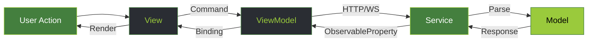
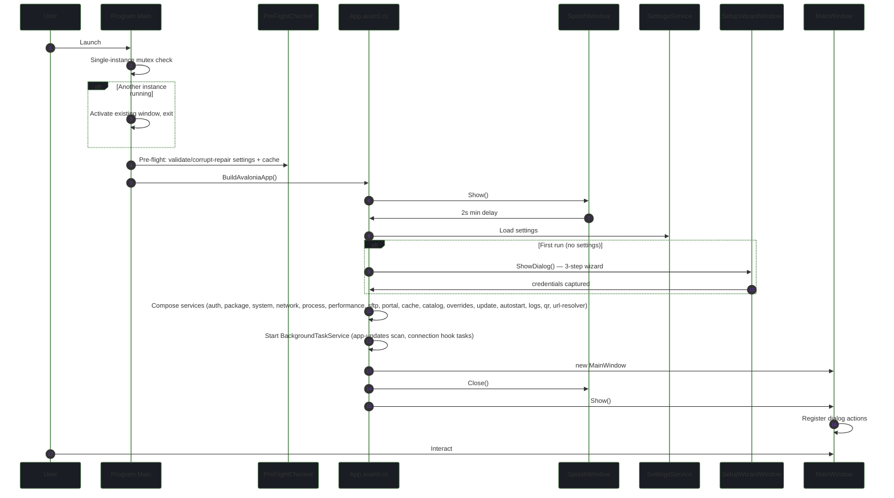
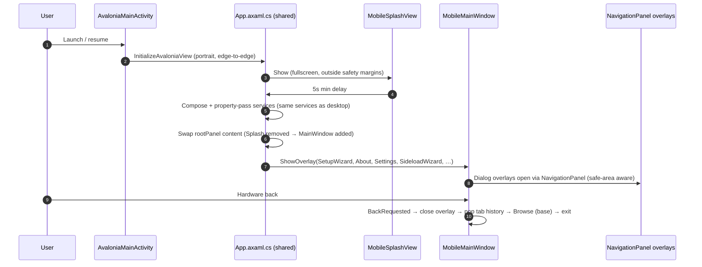
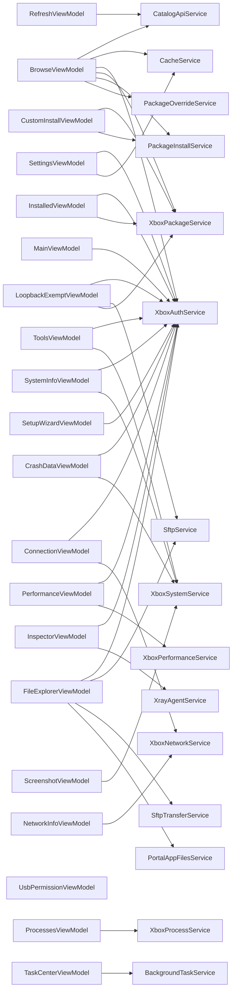
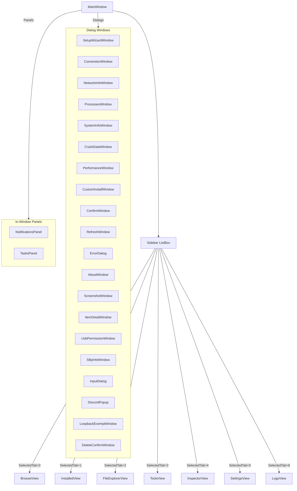

# Architecture

XB Homebrew Vault uses the **MVVM** pattern with **CommunityToolkit.Mvvm** and **Avalonia UI 12**, running on **.NET 10** (desktop: Windows/macOS/Linux; mobile: **.NET Android**, arm64).

For contributor-facing layer contracts, threading rules, and Android reuse guidance, see the [Developer Architecture Guide](developer-architecture.md).

## Layered Architecture


```mermaid
graph TD
    subgraph Views["Views (Avalonia XAML)"]
        MW[MainWindow]
        SW[SplashWindow]
        SetupW[SetupWizardWindow]
        BV[BrowseView]
        IV[InstalledView]
        SV[SettingsView]
        TV[ToolsView]
        LV[LogsView]
        FV[FileExplorerView]
        InV[InspectorView]
        NotifP[NotificationsPanel]
        TasksP[TasksPanel]
        CW[ConnectionWindow]
        NIW[NetworkInfoWindow]
        PW[ProcessesWindow]
        SIW[SystemInfoWindow]
        CDW[CrashDataWindow]
        PerfW[PerformanceWindow]
        UsbW[UsbPermissionWindow]
        LbW[LoopbackExemptWindow]
        SS[SScreenshotWindow]
        CustW[CustomInstallWindow]
        ItemW[ItemDetailWindow]
        DelW[DeleteConfirmWindow]
        DiscW[DiscordPopup]
        SftpW[SftpInfoWindow]
    end

    subgraph ViewModels["ViewModels (CommunityToolkit.Mvvm)"]
        MVM[MainViewModel]
        BVM[BrowseViewModel]
        IVM[InstalledViewModel]
        SVM[SettingsViewModel]
        TVM[ToolsViewModel]
        FVM[FileExplorerViewModel]
        InVM[InspectorViewModel]
        CVM[ConnectionViewModel]
        NIVM[NetworkInfoViewModel]
        PVM[ProcessesViewModel]
        SIVM[SystemInfoViewModel]
        CDVM[CrashDataViewModel]
        PerfVM[PerformanceViewModel]
        RVM[RefreshViewModel]
        ConfVM[ConfirmViewModel]
        CIWM[CustomInstallViewModel]
        SWVM[SetupWizardViewModel]
        USBVM[UsbPermissionViewModel]
        ShVM[ScreenshotViewModel]
        LbVM[LoopbackExemptViewModel]
        DelVM[DeleteConfirmViewModel]
        TkVM[TaskCenterViewModel]
    end

    subgraph Services["Services"]
        Auth[XboxAuthService]
        Pkg[XboxPackageService]
        Proc[XboxProcessService]
        Net[XboxNetworkService]
        Sys[XboxSystemService]
        Perf[XboxPerformanceService]
        Parser[XboxResponseParser]
        CAS[CatalogApiService]
        PS[PackageInstallService]
        SSvc[SettingsService]
        CS[CryptoService]
        CSvc[CacheService]
        UDD[UsbDriveDetector]
        Sftp[SftpService]
        SftpT[SftpTransferService]
        Portal[PortalAppFilesService]
        XRay[XrayAgentService]
        UpdChk[GitHubReleaseCheckerService]
        PO[PackageOverrideService]
        BgT[BackgroundTaskService]
        NotifC[NotificationCenterService]
        IAU[InstalledAppUpdateService]
        VChk[VersionCheckerService]
        LOR[LocalOverrideService]
        AutoS[AutostartService]
        PL[PackageLauncher]
        QR[QRCodeService]
        LogS[LogShareService]
        URL[UrlResolverService]
        PreF[PreFlightChecker]
        WinSet[WindowSettingsService]
        UpdCache[UpdateVersionCache]
        Colorizer[InspectorConsoleColorizer]
        PDiag[PlatformDialog]
        PH[PlatformHelper]
        LA[IAppLogger + SerilogAdapter]
        SL[ServiceLocator]
    end

    subgraph Models["Models"]
        CI[CatalogItem]
        IP[InstalledPackage]
        PI[ProcessInfo]
        NI[NetworkInfo]
        SI[SystemInfo]
        CD[CrashDumpInfo]
        PSnap[PerformanceSnapshot]
        XC[XboxConnection]
        AS[AppSettings]
        IPI[InstallProgressInfo]
        UDI[UsbDriveInfo]
        SftpE[SftpEntry]
        XA[XrayAgentInfo]
        BgTask[BackgroundTask]
        Notif[NotificationItem]
    end

    Views --> ViewModels
    ViewModels --> Services
    Services --> Models

    style Views fill:#1A1D23,stroke:#447F3E,color:#9ACA3C
    style ViewModels fill:#1A1D23,stroke:#447F3E,color:#9ACA3C
    style Services fill:#447F3E,stroke:#9ACA3C,color:#fff
    style Models fill:#2A2D33,stroke:#447F3E,color:#9ACA3C
```

| Layer | Responsibility |
|-------|---------------|
| **Views** | Avalonia AXAML windows and user controls — purely declarative |
| **ViewModels** | Commands, observable state, business-logic orchestration |
| **Services** | All I/O: HTTP, WebSocket, SSH/SFTP, file system, settings, crypto, caching, WMI |
| **Models** | Plain data classes — `CatalogItem`, `InstalledPackage`, `PerformanceSnapshot`, etc. |

## Data Flow


```mermaid
flowchart LR
    U[User Action] --> V[View]
    V -->|Command| VM[ViewModel]
    VM -->|HTTP/WS| S[Service]
    S -->|Parse| M[Model]
    M -->|Response| S
    S -->|ObservableProperty| VM
    VM -->|Binding| V
    V -->|Render| U

    style U fill:#447F3E,stroke:#9ACA3C,color:#fff
    style V fill:#2A2D33,stroke:#447F3E,color:#9ACA3C
    style VM fill:#2A2D33,stroke:#447F3E,color:#9ACA3C
    style S fill:#447F3E,stroke:#9ACA3C,color:#fff
    style M fill:#9ACA3C,stroke:#447F3E,color:#000
```

## App Startup


```mermaid
%%{init: {'theme': 'base', 'themeVariables': { 'primaryColor': '#1A1D23', 'primaryBorderColor': '#447F3E', 'lineColor': '#9ACA3C', 'secondBkgColor': '#2A2D33', 'tertiaryColor': '#447F3E'}}}%%
sequenceDiagram
    autonumber
    participant User
    participant Main as Program.Main
    participant PF as PreFlightChecker
    participant App as App.axaml.cs
    participant Splash as SplashWindow
    participant SSvc as SettingsService
    participant Setup as SetupWizardWindow
    participant MainW as MainWindow

    User->>Main: Launch
    Main->>Main: Single-instance mutex check
    alt Another instance running
        Main->>Main: Activate existing window, exit
    end
    Main->>PF: Pre-flight: validate/corrupt-repair settings + cache
    Main->>App: BuildAvaloniaApp()
    App->>Splash: Show()
    Splash->>App: 2s min delay
    App->>SSvc: Load settings
    alt First run (no settings)
        App->>Setup: ShowDialog() — 3-step wizard
        Setup->>App: credentials captured
    end
    App->>App: Compose services (auth, package, system, network, process, performance, sftp, portal, cache, catalog, overrides, update, autostart, logs, qr, url-resolver)
    App->>App: Start BackgroundTaskService (app-updates scan, connection hook tasks)
    App->>MainW: new MainWindow
    App->>Splash: Close()
    App->>MainW: Show()
    MainW->>MainW: Register dialog actions
    User->>MainW: Interact
```

## Mobile (Android) Architecture

Since **v2.0.0**, XBVault also ships as a portrait-first Android app (`XBVault.Android`, `.NET Android` on `net10.0-android36.0`, arm64). It shares all services, ViewModels, and the general composition logic of the desktop app — only the **view layer** is rebuilt for the phone form factor.


```mermaid
sequenceDiagram
    autonumber
    participant User
    participant Act as AvaloniaMainActivity
    participant App as App.axaml.cs (shared)
    participant Splash as MobileSplashView
    participant MainW as MobileMainWindow
    participant Nav as NavigationPanel overlays

    User->>Act: Launch / resume
    Act->>App: InitializeAvaloniaView (portrait, edge-to-edge)
    App->>Splash: Show (fullscreen, outside safety margins)
    Splash->>App: 5s min delay
    App->>App: Compose + property-pass services (same services as desktop)
    App->>App: Swap rootPanel content (Splash removed → MainWindow added)
    App->>MainW: ShowOverlay(SetupWizard, About, Settings, SideloadWizard, …)
    MainW->>Nav: Dialog overlays open via NavigationPanel (safe-area aware)
    User->>MainW: Hardware back
    MainW->>MainW: BackRequested → close overlay → pop tab history → Browse (base) → exit
```

Key properties of the mobile shell:

- **One hybrid window** — `MobileMainWindow` hosts a bottom tab bar (Browse, Installed, Tools, Settings) and every overlay view (setup wizard, connection, about, settings, sideload wizard, file explorer, logs, tools, notifications, jobs, dialogs). Overlays open through `ShowOverlay` → `NavigationPanel`; the intro splash is the only fullscreen content hosted directly on the root panel.
- **Reused desktop ViewModels** — `MobileBrowseView` drives the same `BrowseViewModel`, `MobileInstalledView` the same `InstalledViewModel`, etc. The action/`Func` delegates (dialogs, share, logs) are wired in `App.axaml.cs`, exactly like desktop.
- **Avalonia's `AutoSafeAreaPadding` is disabled** — `MobileMainWindow` owns bar margins manually: AXAML margins are a first-frame guess, then `OnLoaded` applies the real `SafeAreaPadding` (or zeroes margins on older Android). Combining auto padding with manual margins double-pads.
- **Hardware back** — intercepted via Avalonia's `TopLevel.BackRequested` (Android 16+/API 36 uses `OnBackInvokedCallback`); overlays close first, then tab history pops, and an empty stack navigates back to Browse (the implicit base). `MainActivity.OnBackPressed` remains a pre-API-36 fallback.
- **SAF content URIs** — Android file pickers return `content://` URIs with no filesystem path; storage writes go through `IStorageFile.OpenWriteAsync()`, never `File.Create`.
- **Build-time constraints** — Android dev APKs must be produced with `dotnet publish -c Release` (FastDev incremental installs corrupt bundled assemblies); AOT + trimming are required for the Avalonia JNI bridge. See [Android Architecture](android/01-architecture).

## Services

| Service | Responsibility | Lines |
|---------|---------------|-------|
| `XboxAuthService` | WDP connection: HTTP client, Basic auth, CSRF cookie, connection test, SMB password fetch, credential state (`IsConfigured`, `IsConnected`) | 334 |
| `XboxPackageService` | Package lifecycle: list installed, install (single + dependencies), uninstall, launch, suspend, terminate, running-package detection | 504 |
| `XboxProcessService` | Process info: list processes, kill by PID, running title | 90 |
| `XboxNetworkService` | Network config + WiFi interface/network listing | 99 |
| `XboxSystemService` | System info, crash dumps (list/delete/control), screenshot, restart/shutdown | 237 |
| `XboxPerformanceService` | WebSocket performance stream → `PerformanceSnapshot` | 87 |
| `XboxResponseParser` | Shared WDP JSON parsing helpers for the Xbox services | 169 |
| `CatalogApiService` | Fetches and parses the Emulation Revival `catalog.json` API (6h TTL, disk cache, stale fallback) | 444 |
| `PackageInstallService` | Package analysis, dependency resolution, multi-phase install pipeline | 515 |
| `PackageOverrideService` | Catalog ID lookup by PFN/name, embedded + remote override merging | 183 |
| `SftpService` | SSH.NET SFTP connection + low-level ops for the File Explorer | 694 |
| `SftpTransferService` | High-level transfers: upload file/folder/mixed/ZIP-extract, download, progress + cancel | 789 |
| `PortalAppFilesService` | WDP file API (portal) for the File Explorer: list/upload/download/rename/delete | 449 |
| `XrayAgentService` | XRay TCP agent discovery + log streaming for the Inspector | 269 |
| `GitHubReleaseCheckerService` | Auto-update checker — compares installed version against latest GitHub release | 73 |
| `BackgroundTaskService` | Recurring background job runner + task center registry | 385 |
| `InstalledAppUpdateService` | Periodic app-update scan (installed × catalog, override-aware) + per-app ignore tracking | 158 |
| `VersionCheckerService` | Effective version resolution cascade (remote `versionOverrides` → embedded → catalog) + update comparisons | 487 |
| `LocalOverrideService` | User-triggered catalog overrides persisted to `local-overrides.json` (UI-driven matching fixes) | 175 |
| `NotificationCenterService` | In-app notification aggregation + dismiss/action routing | 243 |
| `AutostartService` | Launch apps automatically on connect (flyout toggle, badge, launch hook) | 37 |
| `PackageLauncher` | Launch installed apps with running-state feedback | 71 |
| `QRCodeService` | QR code encode/decode for connection share | 80 |
| `LogShareService` | Export/share logs — save to file, GoFile upload, QR | 181 |
| `UrlResolverService` | Resolves indirect share links (GoFile, Google Drive, OneDrive) to direct downloads | 256 |
| `SettingsService` | Persists `AppSettings` to `%APPDATA%/XBVault/settings.json` | 127 |
| `CryptoService` | XOR + Base64 credential obfuscation | 47 |
| `CacheService` | In-memory catalog cache with expiry | 116 |
| `UsbDriveDetector` | Lists USB drives via WMI (`System.Management`) — Windows-only (`#if WINDOWS_BUILD`) | 218 |
| `PreFlightChecker` | Startup settings/cache integrity validation + corrupt-repair | 270 |
| `WindowSettingsService` | Persists window size/position | 43 |
| `UpdateVersionCache` | Update-availability memoization | 91 |
| `InspectorConsoleColorizer` | Log/console colorization for the Inspector | 37 |
| `PlatformDialog` | Platform-aware file dialogs (WPF/Avalonia interop) | 135 |
| `PlatformHelper` | Cross-platform environment helpers (paths, asset URI loading) | 28 |
| `ServiceLocator` | App-wide service lookup used by views wired in `App.axaml.cs` | 36 |
| `IAppLogger` / `SerilogAdapter` | Logging abstraction with Serilog backend — the legacy `Logger` (384) is being migrated onto it | 38 + 17 |
| `Logger` | File + console logging (`AttachConsole` via `DllImport` — Windows-only). Legacy, superseded by `IAppLogger` | 384 |

> **Verified from `main` code analysis (Aug 2026).** Line counts approximate.

### Xbox Service Split

The former `XboxDeviceService` god class (1,433 lines, ~41 public members, complexity 205) was split into focused services, each behind an interface:

| Service | Interface | Domains |
|---------|-----------|---------|
| `XboxAuthService` | `IXboxAuthService` | Connection, credentials, SMB password, test |
| `XboxPackageService` | `IXboxPackageService` | Install, uninstall, launch, suspend, terminate, list |
| `XboxProcessService` | `IXboxProcessService` | List, kill, running title |
| `XboxNetworkService` | `IXboxNetworkService` | Network config, WiFi |
| `XboxSystemService` | `IXboxSystemService` | Info, crash dumps, screenshot, restart, shutdown |
| `XboxPerformanceService` | `IXboxPerformanceService` | WebSocket performance stream |

Each takes `XboxAuthService` (shared connection) as its only constructor dependency. The split removed the god class; ViewModels now inject only the interfaces they need. See [Refactor Proposal](ideas/refactor-xboxdeviceservice).

**Key connection patterns (inherited from the original design):**
- **HTTP client recreation on `Configure`** — a fresh `HttpClient` per connection works around `BaseAddress` immutability.
- **Certificate validation bypass** — self-signed console certificates; dev-only.
- **CSRF token via `CookieContainer`** — token attached automatically to requests.
- **WebSocket for performance** — real-time metrics stream, separate from the REST surface.

## ViewModel → Service Dependency Map


```mermaid
graph LR
    MVM[MainViewModel] --> Auth
    BVM[BrowseViewModel] --> CAS
    BVM --> CSvc
    BVM --> Auth
    BVM --> Pkg
    BVM --> PS
    BVM --> PO
    IVM[InstalledViewModel] --> Auth
    IVM --> Pkg
    FVM[FileExplorerViewModel] --> Auth
    FVM --> Sftp
    FVM --> SftpT
    FVM --> Portal
    SVM[SettingsViewModel] --> Auth
    SVM --> CSvc
    TVM[ToolsViewModel] --> Auth
    TVM --> Sys
    CVM[ConnectionViewModel] --> Auth
    CVM --> Net
    NIVM[NetworkInfoViewModel] --> Net
    PVM[ProcessesViewModel] --> Proc
    SIVM[SystemInfoViewModel] --> Auth
    SIVM --> Sys
    CDVM[CrashDataViewModel] --> Auth
    CDVM --> Sys
    PerfVM[PerformanceViewModel] --> Auth
    PerfVM --> Perf
    RVM[RefreshViewModel] --> CAS
    CIWM[CustomInstallViewModel] --> Pkg
    CIWM --> PS
    InVM[InspectorViewModel] --> Auth
    InVM --> XRay
    ShVM[ScreenshotViewModel] --> Sys
    LbVM[LoopbackExemptViewModel] --> Auth
    LbVM --> Sftp
    LbVM --> Pkg
    USBVM[UsbPermissionViewModel]
    SWVM[SetupWizardViewModel] --> Auth
    TkVM[TaskCenterViewModel] --> BgT

    Auth[XboxAuthService]
    Pkg[XboxPackageService]
    Proc[XboxProcessService]
    Net[XboxNetworkService]
    Sys[XboxSystemService]
    Perf[XboxPerformanceService]
    CAS[CatalogApiService]
    CSvc[CacheService]
    PS[PackageInstallService]
    Sftp[SftpService]
    SftpT[SftpTransferService]
    Portal[PortalAppFilesService]
    XRay[XrayAgentService]
    PO[PackageOverrideService]
    BgT[BackgroundTaskService]
```

| ViewModel | Window/View | Key services |
|-----------|-------------|-------------|
| `BrowseViewModel` | BrowseView | CatalogApiService, CacheService, XboxAuthService, XboxPackageService, PackageInstallService, PackageOverrideService |
| `InstalledViewModel` | InstalledView | XboxAuthService, XboxPackageService |
| `FileExplorerViewModel` | FileExplorerView | XboxAuthService, SftpService, SftpTransferService, PortalAppFilesService |
| `ToolsViewModel` | ToolsView | XboxAuthService, XboxSystemService |
| `InspectorViewModel` | InspectorView | XboxAuthService, XrayAgentService |
| `PerformanceViewModel` | PerformanceWindow | XboxAuthService, XboxPerformanceService |
| `ScreenshotViewModel` | ScreenshotWindow | XboxSystemService |
| `SettingsViewModel` | SettingsView | XboxAuthService, CacheService |
| `UsbPermissionViewModel` | UsbPermissionWindow | none (WMI directly) |
| `SetupWizardViewModel` | SetupWizardWindow | XboxAuthService |
| `TaskCenterViewModel` | TasksPanel | BackgroundTaskService |
| `ConnectionViewModel` | ConnectionWindow | XboxAuthService, XboxNetworkService |
| `NetworkInfoViewModel` | NetworkInfoWindow | XboxNetworkService |
| `ProcessesViewModel` | ProcessesWindow | XboxProcessService |
| `SystemInfoViewModel` | SystemInfoWindow | XboxAuthService, XboxSystemService |
| `CrashDataViewModel` | CrashDataWindow | XboxAuthService, XboxSystemService |

> **DI pattern:** manual composition in `App.axaml.cs` (no DI container). Services constructed once, shared across VMs; dialog VMs constructed per-open with the services they need. Mobile views receive the same services as properties wired in `App.axaml.cs` — same pattern, no container.

## MVVM Patterns & Conventions

The app uses **CommunityToolkit.Mvvm** source generators throughout.

**Observable properties & commands:**

```csharp
[ObservableProperty]
private string? selectedItem;            // generates SelectedItem + change notification

[RelayCommand]
private async Task BrowseItemAsync() { } // generates BrowseItemCommand (IAsyncRelayCommand)
```

**ViewModel lifecycle:** constructor injection of services → synchronous setup → async initialization fired from the View (e.g. `Loaded`) via a `[RelayCommand]`.

```csharp
public BrowseViewModel(PackageInstallService install, IXboxAuthService auth,
    IXboxPackageService packages, CatalogApiService catalog, PackageOverrideService overrides)
{
    _install = install;
    _auth = auth;
    _packages = packages;
    _catalog = catalog;
    _overrides = overrides;
}

[RelayCommand]
private async Task LoadCatalogAsync()
{
    var items = await _catalog.FetchCatalogAsync();
    Items.Clear();
    Items.AddRange(items);               // observable update — must run on UI thread
}
```

**Async threading convention:**
- **Service layer** should use `.ConfigureAwait(false)` (no UI affinity required).
- **ViewModel layer** intentionally omits `ConfigureAwait` — observable updates must stay on the UI thread.

> The codebase does not yet apply `ConfigureAwait(false)` in services — tracked in [Tech Debt](tech-debt).

## Navigation


```mermaid
flowchart TD
    MW[MainWindow] --> SB[Sidebar ListBox]
    SB -->|SelectedTab=0| BV[BrowseView]
    SB -->|SelectedTab=1| IV[InstalledView]
    SB -->|SelectedTab=2| FV[FileExplorerView]
    SB -->|SelectedTab=3| TV[ToolsView]
    SB -->|SelectedTab=4| InV[InspectorView]
    SB -->|SelectedTab=5| SV[SettingsView]
    SB -->|SelectedTab=6| LV[LogsView]
    MW -->|Dialogs| Dialogs
    MW -->|Panels| Panels
    subgraph Dialogs["Dialog Windows"]
        SetupW[SetupWizardWindow]
        CW[ConnectionWindow]
        NIW[NetworkInfoWindow]
        PW[ProcessesWindow]
        SIW[SystemInfoWindow]
        CDW[CrashDataWindow]
        PerfW[PerformanceWindow]
        CustW[CustomInstallWindow]
        ConfW[ConfirmWindow]
        RD[RefreshWindow]
        ED[ErrorDialog]
        AW[AboutWindow]
        SS[ScreenshotWindow]
        ItemW[ItemDetailWindow]
        UsbW[UsbPermissionWindow]
        SftpW[SftpInfoWindow]
        InD[InputDialog]
        DiscD[DiscordPopup]
        LbW[LoopbackExemptWindow]
        DelW[DeleteConfirmWindow]
    end
    subgraph Panels["In-Window Panels"]
        NotifP[NotificationsPanel]
        TasksP[TasksPanel]
    end
```

Dialogs are opened via delegate actions wired in `App.axaml.cs` (e.g. `ShowConnectAction`, `ShowConfirmAsync`, `ShowDetailAction`).

> **Note:** `FileExplorerView` (tab 2) is a functional SSH/SFTP file explorer, powered by `SftpService`, `SftpTransferService`, and `PortalAppFilesService`. See [SSH/SFTP & Path Handling](integration-ssh-sftp-challenges).

## Xbox WDP API Integration

The Xbox services communicate with the Xbox Developer Mode Device Portal:

Base URL: `https://{xbox-ip}:11443` · Auth: HTTP Basic

| Endpoint | Method | Purpose | Service |
|----------|--------|---------|---------|
| `/api/os/info` | GET | Device info, connection test | XboxAuthService |
| `/api/app/packagemanager/packages` | GET | List installed packages | XboxPackageService |
| `/api/app/packagemanager/package` | POST | Install package | XboxPackageService |
| `/api/app/packagemanager/package` | DELETE | Uninstall package | XboxPackageService |
| `/api/taskmanager/app` | POST | Launch app by PackageRelativeId | XboxPackageService |
| `/api/taskmanager/app/state` | POST | Suspend/resume/terminate package | XboxPackageService |
| `/api/resourcemanager/processes` | GET | List running processes | XboxProcessService |
| `/api/taskmanager/process` | DELETE | Kill process by PID | XboxProcessService |
| `/ext/app/runningtitle` | GET | Get currently running title | XboxProcessService |
| `/api/app/debug/crashdump` | GET | List crash dumps | XboxSystemService |
| `/api/app/debug/crashdump/{filename}` | DELETE | Delete crash dump | XboxSystemService |
| `/api/app/debug/crashcontrol` | GET | Get crash dump settings | XboxSystemService |
| `/api/app/debug/crashcontrol` | POST | Enable/disable crash dumps | XboxSystemService |
| `/api/networking/networkconfig` | GET | Get network configuration | XboxNetworkService |
| `/api/wifi/interfaces` | GET | List WiFi interfaces | XboxNetworkService |
| `/api/wifi/networks?interface={guid}` | GET | List WiFi networks | XboxNetworkService |
| `/api/systeminfo` | GET | Get system information | XboxSystemService |
| `/ext/screenshot?download=true&hdr=false` | GET | Capture screenshot | XboxSystemService |
| `/api/control/restart` | POST | Restart Xbox | XboxSystemService |
| `/api/control/shutdown` | POST | Shutdown Xbox | XboxSystemService |

## Catalog API

`CatalogApiService` fetches the Emulation Revival catalog from a single JSON endpoint:

```
https://emulationrevival.github.io/api/catalog.json
```

The JSON is parsed into `CatalogItem` models covering categories: Emulator, Frontend, GamePort, App, Experimental, Media, Utility. Results are cached by `CacheService` (6h TTL) with a persistent disk cache and stale-fallback on API failure.

### Catalog Overrides

Matching accuracy is corrected app-side (the catalog itself is externally maintained and read-only):

| Source | Mechanism | Purpose |
|--------|-----------|---------|
| **Embedded** | `XBVault/Assets/package-overrides.json` | PFN / name → catalog-ID mappings shipped with the app |
| **Remote version overrides** | GitHub raw `versionOverrides` merged over the embedded table | maps a `catalogVersion` to the real Xbox manifest version when upstream reports the wrong version (e.g. Sonic 2 SMS `2.9.2` → `2.9.0.2`); remote wins duplicate keys, and entries are gated on the catalog version so a real upstream fix is never masked |
| **Local (user)** | `local-overrides.json` under `%APPDATA%/XBVault` via `LocalOverrideService` | UI-triggered manual remap of a catalog name to an installed package (highest priority) |

Effective version resolution is centralized in `VersionCheckerService` (remote → embedded → catalog fallback).

> **Previously:** the catalog was scraped from 7 individual HTML pages using HtmlAgilityPack. That approach was replaced when Emulation Revival published the `catalog.json` API.

## Performance WebSocket

`XboxPerformanceService` connects to a WebSocket endpoint for real-time performance:

```
wss://{xbox-ip}:11443/api/resourcemanager/processes
```

Receives JSON frames with `PerformanceSnapshot` data (CPU, memory, GPU clock, temperature per core). Rendered by `PerformanceViewModel`.

## Settings Persistence

`SettingsService` reads/writes `%APPDATA%/XBVault/settings.json`. Passwords obfuscated by `CryptoService` (salt + XOR + Base64) — not encryption, just obfuscation to avoid plaintext in JSON.

## USB Permission Wizard

`UsbPermissionViewModel` + `UsbDriveDetector` implement a Windows-only wizard that:

1. Lists USB drives via WMI (`System.Management`)
2. Grants `ALL APPLICATION PACKAGES` NTFS permissions via `icacls`
3. Includes a spinner, 1-second minimum delay, and skips protected system directories

This allows Xbox Dev Mode to read ROM/media files from USB drives.

## Loopback Exempt Wizard

`LoopbackExemptViewModel` + `LoopbackExemptWindow` (opened from Tools, in both full and quick mode) automate the X-Files package loopback-exempt workflow over SFTP/package services.

## Window Pattern

All dialog windows share a common template:

- `WindowDecorations="None"` — no OS chrome
- `Background="{StaticResource SurfaceBrush}"` — dark gray `#1A1D23`
- Root `<Border>` with `BorderBrush="#447F3E" BorderThickness="2" Margin="1"` — green border + 1px gap
- Title bar: `LinearGradientBrush` from `#447F3E` → `#9ACA3C`
- Close button: transparent default, `#CC3333` on hover
- Content area: 20px padding
- Drag via `PointerPressed="OnTitleBarPointerPressed"` + `BeginMoveDrag()`

See [Window Template](window-template) for the full AXAML template.

## Design Decisions & Rationale

Key architectural decisions and the reasoning behind them:

| # | Decision | Why |
|---|----------|-----|
| 1 | **Multi-phase package install** | The Xbox package manager blocks while processing and requires all files present before the install request; pre-analysis avoids redundant uploads and enables progress reporting. |
| 2 | **Case-insensitive dependency folders** | Creators use `Dependencies/`, `deps/`, or `dep/` — detected via an `OrdinalIgnoreCase` set. |
| 3 | **`Task.Run` wrapper for SFTP** | SSH.NET is synchronous; wrapping in `Task.Run` keeps the UI thread responsive during connect/transfer. |
| 4 | **WebSocket for performance metrics** | Real-time samples (10+/sec) — server push is more efficient than HTTP polling and matches what WDP exposes. |
| 5 | **6-hour catalog TTL + stale fallback** | The catalog changes infrequently; stale data beats no data during brief Emulation Revival downtime and enables offline browsing. |
| 6 | **Obfuscation, not encryption, for settings** | Any key would be hard-coded in the assembly; XOR+Base64 only prevents casual plaintext inspection — acceptable for a dev tool. |
| 7 | **Manual service composition (no DI container)** | Transparent and easy to follow at this size; would adopt `Microsoft.Extensions.DependencyInjection` if the service count grows substantially. |
| 8 | **Shared window template** | `WindowDecorations="None"` + green border + gradient title bar + `BeginMoveDrag()` for consistent Blades styling. See [Window Template](window-template). |
| 9 | **Single credential reuse** | The same Xbox credentials drive HTTP Basic (WDP), SFTP (SSH.NET), and SMB (USB folders) — one credential simplifies the UX. |
| 10 | **Split `XboxDeviceService` into focused services** | The 1,433-line god class mixed 8 unrelated domains; per-domain services + interfaces make each testable in isolation and let VMs depend only on what they use. |

## CI / Build

CI runs on every push and PR via GitHub Actions:

| Job | Runs on | Steps |
|-----|---------|-------|
| `build` | Windows + Ubuntu (matrix) | restore → build Release |
| `test` | Windows | `dotnet test` (390+ tests) |
| `build-android` | Windows | restore → publish android-arm64 APK (debug key) |
| `release` | Windows + Ubuntu + macOS (tag push only) | publish win-x64, win-arm64, linux-x64, linux-arm64, osx-x64, osx-arm64 + android-arm64 APK → ZIP per RID → SHA256 + VirusTotal scan |
| `publish` | Ubuntu (tag push only) | GitHub Release from tag (notes from `release-notes/v{version}.md` + checksums + VirusTotal sections) |
| `deploy-docs` | Ubuntu (main push) | Jekyll build → Cloudflare Pages |

Release artifacts: `XBVault-{version}-win-x64.zip`, `XBVault-{version}-win-arm64.zip`, `XBVault-{version}-linux-x64.zip`, `XBVault-{version}-linux-arm64.zip`, `XBVault-{version}-osx-x64.zip`, `XBVault-{version}-osx-arm64.zip`, `XBVault-{version}-android-arm64.apk` (all self-contained, no client runtime required; the APK is signed with the release keystore).

---

[← Home](.) · [API Docs →](api)
