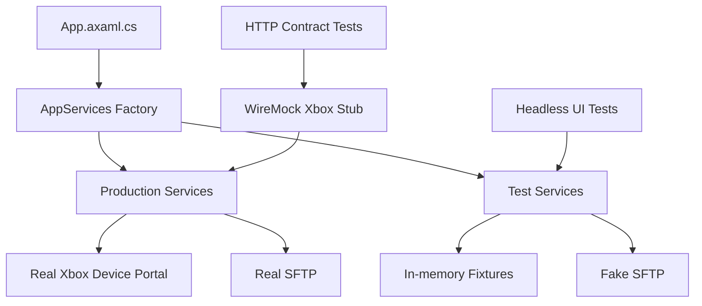

# UI and API Test Automation Without a Real Xbox

**Impact:** High | **Effort:** Medium | **Suggested priority:** Phase 2 testing infrastructure

## Goal

Build a reliable automated test setup for XBVault that can exercise UI flows and Xbox-dependent behavior without requiring a physical Xbox, a live Xbox Device Portal session, or SFTP access to real hardware.

The target is not a full end-to-end test against the real console. The target is an **application end-to-end test with simulated external dependencies**: XBVault behaves as if it is connected to an Xbox, while the Xbox side is controlled by deterministic fakes or a local stub server.

This gives us Cypress/Sikuli-like confidence for desktop flows, without the instability caused by real network devices, console state, credentials, firmware differences, or hardware availability.

## Current State

The project already has a solid xUnit base in `tests/XBVault.Tests`:

- Service and helper tests exist for parsing, caching, settings, package installation, package overrides, update checks, SFTP transfer behavior, and response parsing.
- Test utilities already exist, including `StubHttpMessageHandler` and `FakeSftpService`.
- Xbox service abstractions already exist: `IXboxAuthService`, `IXboxPackageService`, `IXboxSystemService`, `IXboxNetworkService`, `IXboxProcessService`, and `IXboxPerformanceService`.
- Many ViewModels already depend on these interfaces instead of concrete HTTP code.

Main blockers:

- `App.axaml.cs` constructs the production service graph directly in `OnFrameworkInitializationCompleted`.
- Some services still depend on concrete `XboxAuthService` to access its internal `HttpClient`, such as `XboxPackageService`, `XboxSystemService`, `XboxNetworkService`, and `PortalAppFilesService`.
- `FileExplorerViewModel` still depends on concrete `SftpService` and `PortalAppFilesService`, which makes UI tests harder to isolate.
- UI automation selectors are currently mostly `x:Name`; stable external automation would benefit from `AutomationProperties.AutomationId` on critical controls.

## Recommended Test Layers

### Layer 1: Headless Avalonia UI Tests

Use `Avalonia.Headless.XUnit` for fast UI tests that instantiate windows and views without showing a real desktop window.

Purpose:

- Test ViewModel and View binding behavior.
- Test connected/disconnected states.
- Test button commands and visible state changes.
- Test dialogs and windows without OS-level automation.
- Keep tests deterministic and CI-friendly.

Examples of flows:

- Open `InstalledView` with fake installed packages and verify package rows render.
- Simulate disconnected auth and verify connection prompt state.
- Simulate a package refresh and verify loading/status transitions.
- Open `ConnectionWindow` with fake successful connection and verify completion state.
- Open `FileExplorerView` with fake SFTP entries and verify tree/list behavior.

Why first:

- Fastest feedback.
- No real network.
- No real Xbox.
- Less fragile than pixel/image automation.
- Fits the current xUnit test project.

### Layer 2: Fake Xbox Service Tests

Use in-memory fake implementations of Xbox service interfaces.

Purpose:

- Drive UI and ViewModel tests through realistic application states.
- Avoid HTTP entirely for UI tests.
- Make success, failure, empty data, and slow/loading scenarios easy to reproduce.

Suggested fakes:

- `FakeXboxAuthService`
- `FakeXboxPackageService`
- `FakeXboxSystemService`
- `FakeXboxNetworkService`
- `FakeXboxProcessService`
- `FakeXboxPerformanceService`
- Existing or promoted `FakeSftpService`

Example fake capabilities:

- Toggle `IsConnected` and raise `ConnectionChanged`.
- Return configured installed packages.
- Return configured running package names.
- Return configured network JSON.
- Return configured system info JSON.
- Simulate package install/uninstall/launch success and failure.
- Simulate delays and cancellation.
- Record method calls for assertions.

This is the best replacement for a physical Xbox in UI tests.

### Layer 3: Local Xbox Device Portal Stub

Use `WireMock.Net` for tests that need to validate real HTTP behavior against a fake Xbox REST API.

Purpose:

- Test production HTTP services without hitting a real console.
- Verify endpoint paths, methods, headers, CSRF behavior, response parsing, and error handling.
- Reproduce Xbox Device Portal edge cases with fixture JSON.

Typical setup:

```csharp
using var server = WireMockServer.Start();

server
    .Given(Request.Create().WithPath("/api/os/info").UsingGet())
    .RespondWith(Response.Create()
        .WithStatusCode(200)
        .WithHeader("Content-Type", "application/json")
        .WithBody("""{ "DeviceType": "XboxOne" }"""));
```

Candidate endpoints to stub first:

- `GET /api/os/info`
- `GET /api/systeminfo`
- `GET /api/networking/ipconfig`
- `GET /api/app/packagemanager/packages`
- `GET /api/resourcemanager/processes`
- `POST /api/taskmanager/app`
- `DELETE /api/app/packagemanager/package`
- `GET /ext/smb/developerfolder`
- `GET /ext/screenshot?download=true&hdr=false&time=...`

Use this layer for service integration tests, not for most UI tests. UI tests should prefer interface fakes because they are faster and easier to reason about.

### Layer 4: Real Desktop Automation

Use `FlaUI` only for a small number of smoke tests on Windows.

Purpose:

- Launch the real compiled app.
- Verify that the app starts, shows the main window, navigates key tabs, and opens core dialogs.
- Optionally point the app to the local WireMock Xbox stub.

This is closest to Sikuli, but uses Windows UI Automation instead of image matching.

Requirements:

- Add stable `AutomationProperties.AutomationId` to critical buttons, tabs, and dialogs.
- Keep this suite small because it will be slower and more OS-sensitive.

Suggested smoke flows:

- Start app and verify main window appears.
- Open Settings and verify connection fields exist.
- Open Connection dialog and run fake successful connection.
- Navigate Installed, Browse, File Explorer, Tools, and Logs tabs.

Avoid image-based automation as the primary approach. It is too fragile across DPI, theme, animation timing, font rendering, and platform differences.

## Proposed Architecture

Introduce a small testable composition layer so production and tests can create different service graphs.



Suggested production type:

```csharp
internal sealed class AppServices
{
    public required IXboxAuthService Auth { get; init; }
    public required IXboxPackageService Packages { get; init; }
    public required IXboxSystemService System { get; init; }
    public required IXboxNetworkService Network { get; init; }
    public required IXboxProcessService Processes { get; init; }
    public required IXboxPerformanceService Performance { get; init; }
    public required ISftpService Sftp { get; init; }
}
```

Production would call something like:

```csharp
var services = AppServices.CreateProduction();
```

Tests would call something like:

```csharp
var services = TestAppServices.CreateConnectedXbox();
```

The key rule: `App.axaml.cs` should not be the only place where the service graph can be built. Tests need a clean way to provide fake services.

## Implementation Plan

### Phase 1: Add Headless UI Test Harness

Add package:

- `Avalonia.Headless.XUnit` matching the Avalonia version used by the app.

Add test bootstrap:

```csharp
[assembly: AvaloniaTestApplication(typeof(TestAppBuilder))]

public static class TestAppBuilder
{
    public static AppBuilder BuildAvaloniaApp() => AppBuilder.Configure<App>()
        .UseSkia()
        .UseHeadless(new AvaloniaHeadlessPlatformOptions
        {
            UseHeadlessDrawing = false
        });
}
```

Deliverables:

- Test app builder.
- One smoke test that instantiates a simple view/window.
- One connected-state ViewModel or View test.

Success criteria:

- `dotnet test tests/XBVault.Tests/XBVault.Tests.csproj -c Release` passes locally.
- No real Xbox connection attempted.

### Phase 2: Create Official Test Fakes

Add reusable fakes under the test project, likely in `tests/XBVault.Tests/Fakes/`.

Deliverables:

- `FakeXboxAuthService`
- `FakeXboxPackageService`
- `FakeXboxSystemService`
- `FakeXboxNetworkService`
- `FakeXboxProcessService`
- `FakeXboxPerformanceService`
- Make existing `FakeSftpService` reusable outside a single test file if needed.

Success criteria:

- UI/ViewModel tests can simulate connected and disconnected Xbox states.
- UI/ViewModel tests can simulate installed packages and running package state.
- No fake depends on real network, real files outside temp dirs, or real Xbox credentials.

### Phase 3: Refactor Composition Root

Extract service construction from `App.axaml.cs` into a small production factory.

Deliverables:
- `AppServices` or equivalent composition object.
- Production factory that preserves current behavior.
- Test factory that provides fake services.
- Minimal changes to `App.axaml.cs`: build services, then wire ViewModels and windows.

Success criteria:

- Behavior stays unchanged in production.
- Tests can instantiate the main UI with fake services.
- No broad dependency injection framework required unless there is a separate reason to add one.

### Phase 4: Remove Concrete Service Coupling Where It Blocks Tests

Change only the concrete dependencies that block UI tests.

Likely changes:

- `FileExplorerViewModel`: accept `ISftpService` instead of concrete `SftpService`.
- `PortalAppFilesService`: introduce interface if File Explorer UI tests need to cover portal file browsing.
- Xbox HTTP services: consider constructor overloads or a transport abstraction if WireMock or handler-level tests need cleaner setup.

Success criteria:

- Existing tests still pass.
- New UI tests do not construct real SFTP or real HTTP services.
- Production constructors remain simple.

### Phase 5: Add WireMock Xbox Device Portal Stub

Add package:

- `WireMock.Net`

Deliverables:

- `FakeXboxPortalServer` test helper.
- Fixture responses for common Xbox endpoints.
- Tests for `XboxAuthService`, `XboxPackageService`, `XboxSystemService`, and `XboxNetworkService` against the local fake server.

Success criteria:

- Services use real HTTP against `localhost` only.
- Tests cover success, 401/403, 404, malformed JSON, timeout, and empty response scenarios.
- Tests can inspect logged requests to verify endpoint paths and methods.

### Phase 6: Add Small Windows Smoke Suite With FlaUI

Add package only if needed:

- `FlaUI.UIA3`

Deliverables:

- Stable `AutomationProperties.AutomationId` for critical controls.
- One smoke test launching the compiled app.
- Optional app test mode flag to point settings at the local fake Xbox portal.

Success criteria:

- Smoke tests run on Windows CI or locally.
- Suite remains small and non-flaky.
- Failures indicate real startup/navigation regressions, not image timing issues.

## Data Fixtures

Create fixtures that represent useful Xbox states:

- Connected Xbox with no installed apps.
- Connected Xbox with several installed apps.
- App currently running.
- App install succeeds.
- App install fails with known Device Portal error.
- Network info with link speed.
- System info fallback path: `/api/systeminfo` fails, `/api/os/info` succeeds.
- Screenshot response with small valid PNG bytes.
- Crash dumps empty and populated.

Suggested location:

- `tests/XBVault.Tests/Fixtures/XboxPortal/`

Fixture files should be small, deterministic, and based on sanitized real payloads when available.

## What Not To Do

- Do not require a physical Xbox for default CI or local test runs.
- Do not use Sikuli/image matching as the main automation method.
- Do not make UI tests depend on current user settings in `%APPDATA%/XBVault/settings.json`.
- Do not test against real GitHub or catalog APIs in UI tests.
- Do not introduce a large dependency injection framework just for tests unless simpler factories become insufficient.
- Do not add backwards-compatibility layers unless there is a real persisted-data or external-consumer requirement.

## First Candidate Tests

### Connected Installed View

Scenario:

- Fake auth starts connected.
- Fake package service returns two packages.
- `InstalledViewModel.RefreshCommand` runs.

Assertions:

- `IsConnected` is true.
- `HasPackages` is true.
- `Packages.Count` is `2`.
- Status is not an error.

### Disconnected Installed View

Scenario:

- Fake auth starts disconnected.
- View is created.

Assertions:

- Disconnected prompt is visible.
- Package grid is not visible.
- Refresh is disabled.

### Connection Window Success

Scenario:

- Fake auth returns successful `ConnectionTestResult`.
- Fake network service returns link speed JSON.
- `ConnectCommand` runs.

Assertions:

- `IsSuccess` is true.
- `IsFailed` is false.
- Completion callback receives `true`.

### Connection Window Failure

Scenario:

- Fake auth returns failed `ConnectionTestResult` with error detail.

Assertions:

- `IsFailed` is true.
- Output lines include error detail.
- Completion callback receives `false`.

### File Explorer Fake SFTP Listing

Scenario:

- Fake auth starts connected.
- Fake SFTP returns root directories and files.
- ViewModel loads directory.

Assertions:

- Current entries match fake file system.
- Tree roots are populated.
- Loading state returns to false.

## Risks

- Some UI flows have deliberate animation/delay behavior. Tests may need a clock/delay seam later, especially `ConnectionViewModel`.
- Static settings and logging can leak state between tests unless isolated carefully.
- Headless UI tests still need UI thread discipline.
- FlaUI tests can be useful but will be more fragile than headless tests.
- WireMock validates HTTP behavior, but it cannot guarantee the fake payloads match every Xbox firmware variation.

## Suggested Next Step

Start with Phase 1 and Phase 2 together:

1. Add `Avalonia.Headless.XUnit`.
2. Add reusable fake Xbox services.
3. Write the first connected/disconnected `InstalledViewModel` or `InstalledView` tests.

This creates the foundation for UI automation without touching the real Xbox, and keeps the first implementation small enough to review safely.
