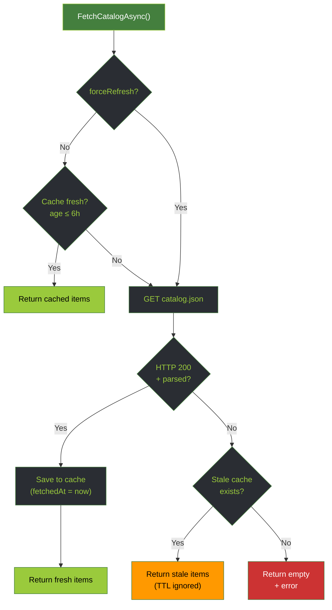
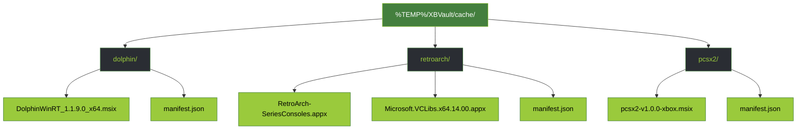

# Data Sources

> **Single source of truth:** the app consumes a generated **JSON catalog API** (`CatalogApiService`). This is the same `catalog.json` that builds the Emulation Revival website, so the desktop app and the site never drift apart.

## Emulation Revival Catalog API

`CatalogApiService` fetches a single generated JSON document (HTTP GET, 30s timeout):

```
https://emulationrevival.github.io/api/catalog.json
```

On success, items are parsed, classified, and written to disk cache (see [Catalog Cache](#catalog-cache)).

### catalog.json structure

Top-level envelope (`CatalogApiResponse`):

```json
{
  "schemaVersion": 1,
  "generatedAt": "2026-06-20T08:00:00Z",
  "items": [ /* CatalogApiItem[] */ ]
}
```

Each item (`CatalogApiItem`):

| Field | Type | Notes |
|-------|------|-------|
| `id` | string | Stable identifier |
| `title` | string | Display name |
| `description` | string | Summary text |
| `category` / `categorySlug` | string | e.g. `Emulator` / `emulator` |
| `version` | string | Latest version |
| `releaseDate` | string? | Release date |
| `compatibility` | string | Console compatibility note |
| `isExperimental` | bool | Flags experimental apps |
| `imageUrl` / `pageUrl` | string? | Card image, source page |
| `downloadUrl` | string? | Fallback primary download |
| `sourceCodeUrl` / `setupGuideUrl` / `tutorialUrl` / `releaseNotesUrl` | string? | External links |
| `requirements` | string[] | Listed requirements |
| `features` | string[] | Listed features |
| `contributors` | object | Developers / porters / maintainers / mod authors / prebuilt-by |
| `downloads` | array | Download assets (see below) |

### Download classification

Each entry in `downloads[]` is `{ url, label, assetId }`. `CatalogApiService.ClassifyDownloads` tags each as **main**, **dependency**, or **external** so the installer knows what to upload to the console:

- **Dependency** — URL/label matches the dependency regex (e.g. `VCLibs`, framework packages).
- **External** — not an installable package (`.appx` / `.msix` / `.zip` / `.msixbundle` / `.appxbundle`); e.g. mod links, ModDB, or non-release GitHub pages.
- **Main** — the first remaining installable package.

The primary `downloadUrl` resolves to the first non-dependency asset, falling back to the item's `downloadUrl` field. See [Package Installation Flow](integration-package-installation-flow) for how these feed the installer.

## Catalog Cache

Parsed results are cached to disk so the app starts instantly and works offline:

```
%APPDATA%\XBVault\cache\catalog-api.json
```

Cache envelope (`CatalogCache`): `{ fetchedAt, source, data }`, where `data` is the full `catalog.json` payload.

| Property | Value |
|----------|-------|
| TTL | **6 hours** (`CacheTtlHours = 6`) |
| Location | `%APPDATA%\XBVault\cache\catalog-api.json` |
| Stale fallback | Used (TTL ignored) when the API is unreachable |
| Manual refresh | `CatalogApiService.ClearCache()` / force-refresh in the UI |

### Fetch flow



## Package Cache

> Distinct from the [Catalog Cache](#catalog-cache) above (catalog metadata in `%APPDATA%`). This cache holds the **downloaded package files** in `%TEMP%`.

Downloaded packages are stored in `%TEMP%/XBVault/cache/`:



`manifest.json` stores parsed metadata and dependency info so reinstalls don't need re-download:

```json
{
  "name": "RetroArch",
  "version": "1.16.0",
  "category": "Emulator",
  "packageFile": "RetroArch-SeriesConsoles.appx",
  "dependencies": ["Microsoft.VCLibs.x64.14.00.appx"],
  "sourceUrl": "https://emulationrevival.github.io/..."
}
```

---

**Related:**
- [Package Installation Flow](integration-package-installation-flow) — how cached files and dependencies feed the installer
- [API Reference](api) — Device Portal endpoints
- [Architecture](architecture) — where `CatalogApiService` sits in the service layer

---

[← API](api) · [Architecture →](architecture)
