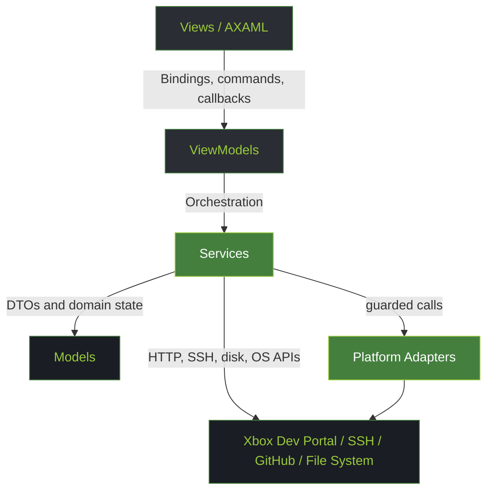
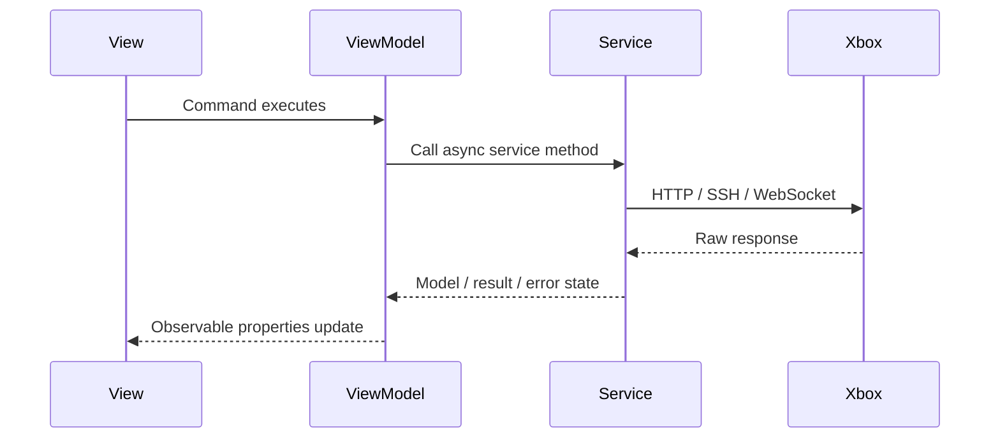

# Developer Architecture Guide

This guide documents how the application is structured for contributors working on desktop, Android, tests, or future frontends. It complements the user-facing docs and the Android planning documents.

## Goals

- Keep Xbox communication and business rules reusable across desktop and Android.
- Keep Avalonia Views thin and platform-adaptable.
- Keep ViewModels free of platform UI APIs except data-binding concepts such as commands, observable state, and callback delegates.
- Keep services testable by depending on interfaces where practical.
- Keep UI-thread mutations centralized through `XBVault.Helpers.UIHelpers` and service override points used by tests.

## Layer Map

## Layer Responsibilities

| Layer | Owns | Must Avoid |
|-------|------|------------|
| Views | AXAML layout, event wiring, drag/drop, dialogs, visual-only behavior | Xbox HTTP calls, package rules, persistent settings logic |
| ViewModels | Observable state, commands, workflow orchestration, user-facing status text | Direct file picker implementation, direct window ownership, platform-specific APIs without callbacks |
| Services | HTTP, WebSocket, SSH/SFTP, filesystem, cache, crypto, install flow, update checks | Avalonia controls, direct UI mutations, view navigation |
| Models | Plain serializable data and derived display properties | Network calls, file I/O, service dependencies |
| Platform Adapters | OS-specific operations such as dialogs, USB/WMI, window persistence | Business rules that should be shared with Android |

## Service Contracts

Service interfaces under `XBVault/Services` are the boundary most useful for Android and tests.

| Contract | Purpose | Android Status |
|----------|---------|----------------|
| `IXboxAuthService` | Configure Xbox base URL, manage connection state, expose SSH credentials, fetch SMB password | Reusable; certificate bypass must remain scoped to Xbox hosts |
| `IXboxPackageService` | List, install, uninstall, launch, suspend, terminate packages | Reusable; multipart upload must be tested on device |
| `IXboxSystemService` | Screenshots, system info, crash dumps, power actions | Reusable; screenshots need mobile memory testing |
| `IXboxProcessService` | Running title, process list, kill process | Reusable |
| `IXboxNetworkService` | Network configuration and Wi-Fi scans | Reusable |
| `IXboxPerformanceService` | WebSocket metrics stream | Reusable; Android background lifecycle needs explicit disconnect |
| `ISftpService` | SSH/SFTP primitive operations | Reusable if SSH.NET works on target runtime |
| `IAppLogger` | Logging abstraction for services that need testable logs | Reusable; Android log sink can adapt later |

Service implementations should log enough context for failures but return structured values where callers need UI decisions. Prefer `Result` models or tuples for expected operational failures and exceptions for unexpected faults.

## ViewModel Contract Pattern

ViewModels are shared frontend logic. They should expose:

- Observable state through `[ObservableProperty]` and derived read-only properties.
- Commands through `[RelayCommand]`.
- Cross-view actions through delegate properties such as `ShowConnectAction`, `ShowConfirmAsync`, or `OpenCustomInstallWithFileAction`.
- No direct dependency on `Window`, `StorageProvider`, or platform pickers unless isolated behind callbacks.

Example flow:

## View Contract Pattern

Desktop Views currently provide platform UI services that Android may replace:

- File picker calls.
- Window/dialog creation.
- Drag/drop handlers.
- Popup/flyout animation.
- Clipboard access.
- Layout decisions tied to desktop dimensions.

When adding new behavior, prefer this shape:

1. View wires UI event or platform-specific capability.
2. View calls ViewModel command or callback.
3. ViewModel delegates business rules to service.
4. Service returns model/result.

Do not move Xbox API calls into Views. If Android needs different UI, it should reuse the same ViewModel and service path.

## Threading Rules

Avalonia collections and UI-bound state must be mutated from the UI thread. Use `UIHelpers.RunOnUI` or `UIHelpers.RunOnUIAsync` instead of direct `Dispatcher.UIThread` calls.

Service-specific testability rule:

- `BackgroundTaskService` uses `PostToUi` and `Marshal` so tests can override UI dispatch inline.
- New services with UI-bound collections should follow the same pattern: expose a protected dispatch method when tests need deterministic execution.

## Android Port Guidance

The Android frontend should reuse these layers as-is wherever possible:

| Reuse Directly | Adapt |
|----------------|-------|
| Models | Mobile-specific view composition |
| Xbox HTTP services | Dialog and picker presentation |
| Catalog/cache/install services | File path UX and storage permission flows |
| ViewModels with callbacks | Main navigation shell |
| SFTP transfer orchestration | Clipboard/share intents |

Android-specific work should be placed behind small adapters rather than forks of core services. If a service needs platform behavior, prefer introducing an interface such as `IFilePicker`, `IClipboardService`, or `IPlatformDialogService` and provide desktop/Android implementations.

## Error Handling Rules

- Expected Xbox failures should become user-facing status messages and logs.
- Unexpected failures should be logged with exception details and surfaced as concise UI messages.
- Cancellation should be represented distinctly from failure.
- Avoid throwing `Exception`; use specific exception types or result objects.
- Preserve response-body snippets for HTTP failures, but truncate long bodies before logging.

## Documentation Rules

- Public service interfaces should have XML comments because they are cross-frontend contracts.
- ViewModels should have class-level comments when their workflow is not obvious.
- Do not add XML comments to every generated property or trivial UI wrapper.
- Markdown docs should explain responsibilities, data flow, platform assumptions, and risks.
- Diagrams must use Mermaid.

## Porting Checklist For New Features

- Is business logic in a service or ViewModel, not the View?
- Does the ViewModel expose callbacks instead of constructing desktop windows directly?
- Are UI-bound updates dispatched through `UIHelpers` or an overridable dispatch method?
- Does the service have an interface if tests or Android need alternate implementations?
- Are file paths based on `SpecialFolder`, `Path.GetTempPath`, or injected platform services?
- Are Windows-only APIs guarded with `OperatingSystem.IsWindows()`?
- Does the feature have a doc note in `docs/android` if Android behavior differs?
