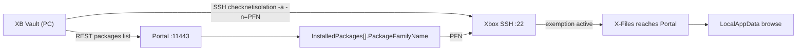

# Feature — Loopback Exempt (Tools)

> **Status: SHIPPED (v1.3.0).** Implemented as a dedicated `LoopbackExemptWindow` accessible from File Explorer. This spec describes the original design.

## Goal

Add a **Tools** tool that applies the Xbox loopback exemption for an installed
UWP app so it can reach the console's Device Portal REST API on itself
(`https://[::1]:11443`). Primary use case: X-Files browsing other apps'
`LocalAppData` via the portal.

The exemption survives app relaunch but is **lost on re-install and console
reboot**, so the tool is a one-click re-apply (not a watcher).

## Background

- X-Files (UWP) cannot reach the portal because Xbox isolates app containers
  from local loopback.
- The exemption is granted by `checknetisolation`, which requires elevation —
  impossible from inside the app, so it must be run over SSH from a PC.
- XB Vault already has every building block: portal REST auth, rotating SSH
  password fetch, SSH command execution, and installed-package listing.



## Key commands (run over SSH, cmd.exe shell)

| Action | Command |
|---|---|
| Add | `checknetisolation loopbackexempt -a -n=<PFN>` |
| Remove | `checknetisolation loopbackexempt -d -n=<PFN>` |
| Verify | `checknetisolation loopbackexempt -s` → grep the PFN |

PFN example: `XFiles.Xbox_jgz7qwhvc5jpc`.

## Files to create

| File | Purpose |
|---|---|
| `XBVault/ViewModels/LoopbackExemptViewModel.cs` | State + commands for the window |
| `XBVault/Views/LoopbackExemptWindow.axaml` | Window UI |
| `XBVault/Views/LoopbackExemptWindow.axaml.cs` | Window code-behind (ctor takes the VM) |

## Files to modify

| File | Change |
|---|---|
| `XBVault/ViewModels/ToolsViewModel.cs` | Inject `SftpService` + `IXboxPackageService`; add `OpenLoopbackExemptAction` delegate + `OpenLoopbackExemptCommand` (mirror `OpenScreenshotCommand` pattern) |
| `XBVault/Views/ToolsView.axaml` | New "DEVELOPER" card with a `Loopback Exempt` button (reuse the card/`Grid ColumnDefinitions` style of the existing cards; icon `tools-loopback-20.png`) |
| `XBVault/App.axaml.cs` | Line ~82: `new ToolsViewModel(authService, systemService, sftpService, packageService)`; wire `toolsViewModel.OpenLoopbackExemptAction` inside `InitAfterSplashAsync` to open `LoopbackExemptWindow` (mirror how `ShowScreenshotAction` opens `ScreenshotWindow`) |

Icons: create `XBVault/Assets/Views/ToolsView/tools-loopback-20.png` per the
assets guide (`docs/ASSETS-GUIDE.md`, personal set
`F:\workspace\icons8-personal-set`).

## Window UI

```
┌─────────────────────────────────────────────┐
│ LOOPBACK EXEMPT                            │
│                                             │
│ App:  [ComboBox of installed packages      ]│
│       (pre-selected: package whose Name     │
│        contains "XFiles", else first Dev)   │
│                                             │
│ Package Family Name:  XFiles.Xbox_jgz...    │
│                                             │
│ [Apply exemption]   [Remove exemption]      │
│ [Refresh list]     [Check status]           │
│                                             │
│ Status: Applied ✓ / Already applied / ...   │
└─────────────────────────────────────────────┘
```

Model: `LoopbackExemptViewModel : ObservableObject`

- `ObservableCollection<InstalledPackage> Packages` (reuse existing model —
  it has `Name` + `PackageFamilyName` already)
- `InstalledPackage? SelectedPackage`
- `string StatusText` (muted colors via existing brushes/converters)
- `bool IsBusy` (disable buttons while running)
- Commands: `ApplyCommand`, `RemoveCommand`, `CheckCommand`, `RefreshCommand`

## Flow (Apply / Remove / Check)

1. Ensure SFTP connected — reuse the `FileExplorerViewModel.InitializeAsync`
   pattern:
   ```csharp
   await _authService.FetchSmbPasswordAsync();
   var creds = _authService.GetSshCredentials();   // DevToolsUser / port 22
   await _sftpService.ConnectAsync(creds.Host, creds.Port, creds.Username, creds.Password);
   ```
2. Load packages on window open: `_packageService.GetInstalledPackagesAsync()`
   → fill `Packages`, pre-select XFiles match.
3. PFN = `SelectedPackage.PackageFamilyName`. If empty, show status error.
4. Run over SSH via `_sftpService.RunShellCommandAsync`:
   - Apply: `checknetisolation loopbackexempt -a -n=<PFN>`
   - Remove: `checknetisolation loopbackexempt -d -n=<PFN>`
5. Verify with `checknetisolation loopbackexempt -s`; check output contains the
   PFN. Set `StatusText` accordingly:
   - `Applied ✓` / `Already applied` / `Removed ✓` / `Not exempted` /
     `Command failed: <error>`.

Keep all work in `Task.Run` (SSH.NET is synchronous) — the existing
`RunShellCommandAsync` already wraps it and holds a shell lock; call it with
`await`.

## Notes / gotchas

- SSH shell is **cmd.exe**, not bash. Quotes/escaping follow Windows rules
  (commands above have no quotes, safe).
- The rotating SSH password comes from `FetchSmbPasswordAsync()` (portal
  `/ext/smb/developerfolder`) — always fetch fresh before connecting; it is
  different from the portal password.
- Do not add a watcher/auto-re-apply after install in this change. Manual
  button only. (Auto-hook post-install is a possible follow-up.)
- "Exempt all developer apps" is out of scope (single-app picker only).

## Verification

- `dotnet build XBVault/XBVault.csproj`
- Manual: connect to an Xbox in Dev Mode, open Tools → Loopback Exempt, pick
  X-Files, Apply → status `Applied ✓`; close X-Files, relaunch it, open About
  probe → portal CONNECTED.
- Re-install X-Files (or reboot), Apply again → still works.

## Reference

- Scripts (same flow, standalone): `x-files-uwp/tools/liberate-loopback.{ps1,sh}`
- Technical doc: `x-files-uwp/docs/PORTAL-APPDATA.md`
