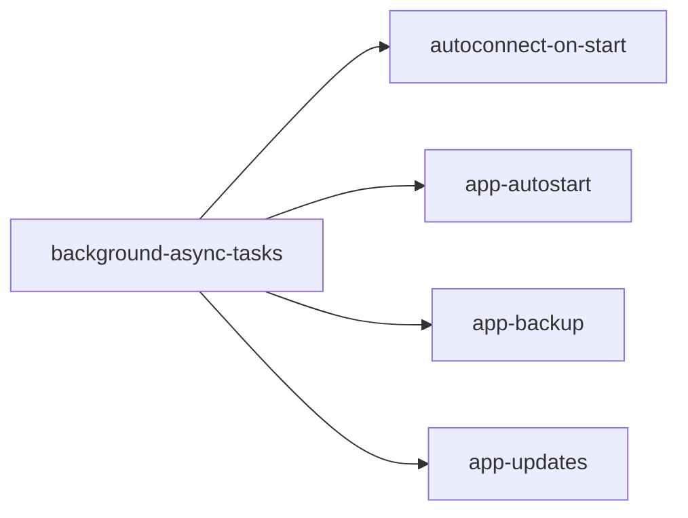

# Background & Automation — Implementation Plan

> Plan of record for the "background + automation" track. Each item is an OpenSpec change under `openspec/changes/`. Status reflects the OpenSpec lifecycle: **Proposed** (proposal written) → **Spec'd** (specs+design) → **Ready** (tasks done, validated) → **Implemented** (code merged).

## Overview

Five changes build a shared background-execution foundation first, then layer Xbox-focused automation features on top. Everything is additive and opt-in. All features operate on the **Xbox console** (installed homebrew apps), not on XBVault's own lifecycle.

| # | Change | Status | Depends on |
|---|--------|--------|-----------|
| 1 | `background-async-tasks` — BackgroundTaskService, connection monitor, notification center, task center | Ready | — |
| 2 | `autoconnect-on-start` — connect at startup + auto-reconnect with backoff (single toggle) | Ready | 1 |
| 3 | `app-autostart` — auto-launch the one favorite installed app when connected | Ready | 1 |
| 4 | `app-backup` — backup an installed app (appx + LocalState + custom folders) to a ZIP | Ready | 1 |
| 5 | `app-updates` — background update check for installed apps + consolidated notification | Ready | 1 |

## Order & Rationale

1. **`background-async-tasks` first** — everything else reports progress through `BackgroundTaskService` and notifies via the notification center. Without it, each feature would reinvent background execution.
2. **`autoconnect-on-start`** consumes connection-monitor `ConnectionLost`/`ConnectionRestored` — small, high-visible value (auto-reconnect).
3. **`app-autostart`**, **`app-backup`**, **`app-updates`** land independently once the foundation exists.

## Change Details

### 1. background-async-tasks
Foundation for all background work.

- `BackgroundTaskService`: one-shot tasks (progress/cancel) + recurring jobs (PeriodicTimer), UI-thread-marshaled `ObservableCollection<BackgroundTask>`, activity events, virtual Dispatcher for unit tests.
- `ConnectionMonitorService`: **liveness check** (`GET /api/os/info` on a configurable interval, default 30 s, shown in Settings). Not a keepalive — the console sleeps regardless; this only detects loss. `ConnectionLost`/`ConnectionRestored` events.
- `NotificationCenterService`: in-window notifications (click action, auto-dismiss 6 s), **grouping/consolidation** (one notification listing many items — avoids toast flooding), and a **history panel** (status-bar bell icon + re-openable dismissed notifications).
- Task-center UI: status-bar indicator (icon + badge + busy animation, hidden at 0) + in-window overlay panel (Running / Scheduled / Recent, progress, cancel, expandable details).
- **Zero new NuGet deps.** New test project `tests/XBVault.Tests`.

**Key files:** `Services/BackgroundTaskService.cs`, `Services/ConnectionMonitorService.cs`, `Services/NotificationCenterService.cs`, `ViewModels/TaskCenterViewModel.cs`, `Views/TasksPanel.axaml`, `Views/NotificationsPanel.axaml`, `MainWindow.axaml` (indicators + overlays).

### 2. autoconnect-on-start
- **Single toggle** "Autoconnect & reconnect" (default **off**) — gates both startup connect and auto-reconnect.
- `ReconnectManager` subscribes to connection-monitor `ConnectionLost`; exponential backoff 1/2/4/8/16/30/60 s; bounded at `ReconnectMaxAttempts` (**configurable, default 5**, shown in Settings); stops on explicit disconnect / manual connect / toggle off / app exit.
- Startup connect after window shown, guarded by toggle + credentials + not-already-connected.
- Every attempt visible (task center + notifications).

**Key files:** `Services/ReconnectManager.cs`, Settings view (toggle + max-attempts field), `SettingsService` keys.

### 3. app-autostart
- Per-app **"Autostart on connect"** action in the Installed tab flyout (icon + confirmation dialog).
- **Single-app exclusivity**: only one app can be autostart; enabling a new one prompts to replace the previous.
- **Badge** on the enabled app's card (top-left, OUTDATED-badge style) + indicative color.
- On connect, auto-launch via **existing `LaunchPackageAsync`** path (suspend-then-launch like manual Play); clears selection + notifies if the app was uninstalled.
- Selection persisted in settings. No daemon, no Windows Run-key, no CLI.

**Key files:** `Services/AutostartService.cs`, `ViewModels/InstalledViewModel.cs` (flyout item + badge + connect hook), `Views/InstalledView.axaml` (menu item + badge overlay), `Services/PackageLauncher.cs` (shared suspend+launch helper).

### 4. app-backup
Per-app backup (Installed tab flyout "Backup app") → one timestamped `.xvbk` ZIP on PC with **up to three parts**:
1. **`.appx`** — package pulled from the console when retrievable (source is a research task; best-effort with `NotRetrievable` fallback).
2. **LocalAppData / LocalState** — recursive pull via existing `PortalAppFilesService` (REST filesystem).
3. **User-selected remote folders** — multi-select dialog (SSH/SFTP, file-explorer style) with recursive SFTP pull.

- Parts optional; ZIP still assembles if some omitted, with a `manifest.json` recording each part's presence/status.
- Runs as a `BackgroundTaskService` task with progress + cancellation; temp dir + atomic move (no partial ZIP).
- v1: one app at a time. Restore and bulk backup are follow-ups.

**Key files:** `Services/AppBackupService.cs` (orchestrator + zip), `Services/AppBackupPackage.cs`, `Services/AppBackupLocalData.cs`, `Services/AppBackupCustomDirs.cs`, `ViewModels/BackupAppViewModel.cs`, `Views/BackupAppDialog.axaml`.

### 5. app-updates
- **Background scan** (`BackgroundTaskService` job) while connected: compares installed apps vs catalog (existing PFN/version logic) — on connect + periodic (default 30 min, configurable).
- **Single consolidated notification** listing all updatable apps (no per-app toast flood); each app clickable → opens the **existing update dialog** (`ItemDetailWindow` update mode).
- Notifications land in the **notification center** for follow-up after dismissal.
- Dedupe via existing `UpdateVersionCache` (no repeat for the same version pair).
- XBVault's **own** self-update check already exists (`App.axaml.cs` startup dialog) — untouched.

**Key files:** `Services/VersionCheckerService.cs` (extracted from `BrowseViewModel`), `Services/InstalledAppUpdateService.cs`, `ViewModels/UpdateNotificationViewModel.cs`.

## What Already Exists (reused, not rewritten)

- `XboxPackageService.LaunchPackageAsync(fullName, rid)` — launch mechanism (used by Play/Run today).
- `PortalAppFilesService` — REST filesystem for app LocalAppData/LocalState (`UserFiles:\`).
- SFTP stack (`ISftpService`/`SftpTransferService`) + file-explorer remote browser — basis for custom-folder backup.
- `BrowseViewModel` outdated comparison + `UpdateVersionCache` (dedupe) + `ItemDetailWindow` update mode — basis for app-updates.
- `App.axaml.cs` `CheckForUpdatesAsync` — XBVault's own update check (already shipped).
- `Program.cs` — CLI args + single-instance mutex (not touched by this track).
- `SettingsService.Current` — singleton settings pattern (no DI container; changes follow this pattern).

## Notes & Conventions

- **No DI container** — plain singletons constructed in `App.axaml.cs` (matches `SettingsService.Current` pattern).
- **Opt-in** — autoconnect, autostart off by default; backup/update-scan run only on explicit action or when connected.
- **Progress is a first-class citizen** — every feature reports through the task center; no silent background work.
- **Notifications consolidate** — grouped notifications instead of toast flooding; notification center allows later follow-up.
- **Icons** — task indicator `mainwindow-tasks-20.png`, bell icon, autostart badge from the Blades/Numix set (see `assets-guide.md`).

## Related Docs

- `docs/ideas/version-checker-bulk-update.md` — partial (OUTDATED badge, per-app update) — app-updates consumes its remaining `VersionCheckerService` piece.
- `docs/ideas/auto-update.md` — XBVault self-update design (already partially implemented as a startup dialog).
- `docs/roadmap.md` — overall product roadmap.
