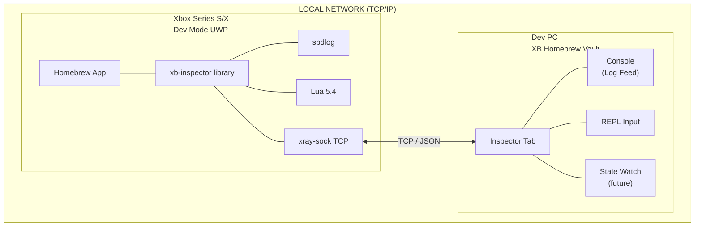
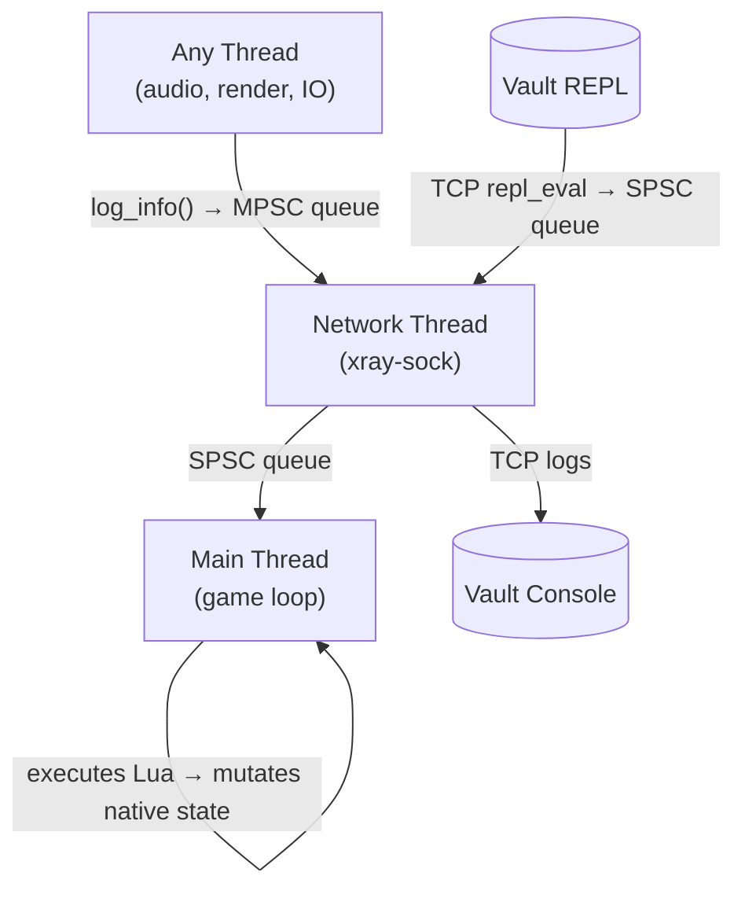
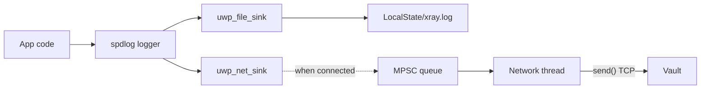
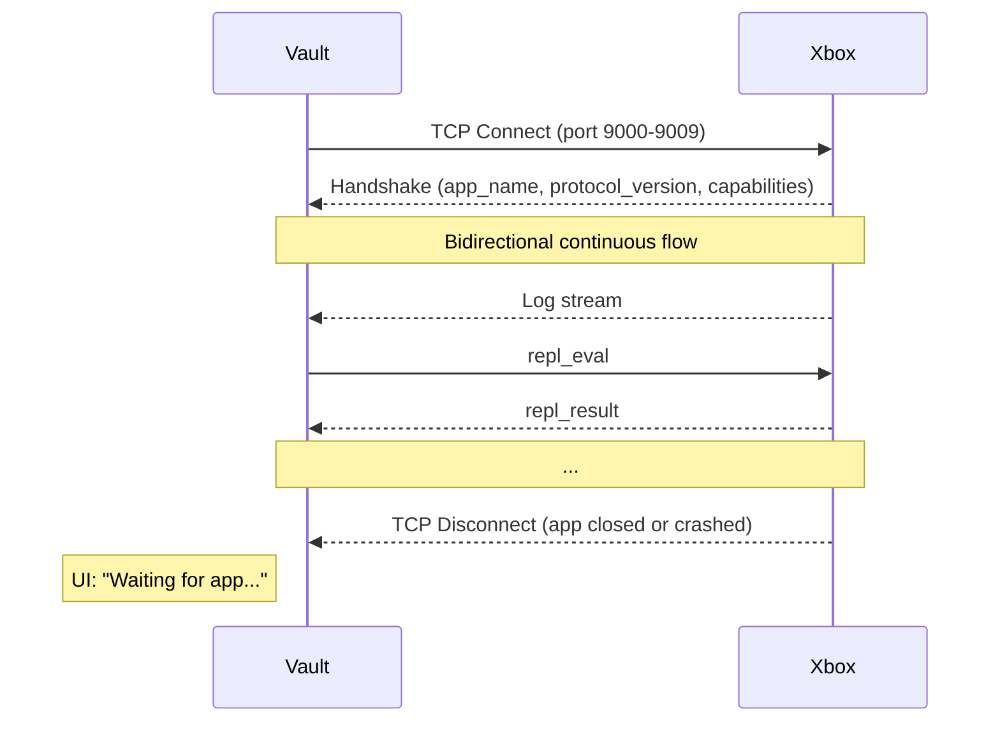

# Inspector — Remote Diagnostics & Live REPL for Xbox Homebrew

## Status

> 🚧 **Under development.** Protocol handling, scan logic, and REPL command forwarding are stubs on the XBVault side. The Xbox-side native library (`xb-inspector`) has full architecture defined and is under active implementation at [uwp-xray-depot](https://github.com/marcelofrau/uwp-xray-depot). UI shell, console, font controls, and state management are complete.

## The Problem

Developing UWP apps for Xbox Dev Mode means flying blind.

- **No console you can actually see.** `OutputDebugString` is invisible without a debugger. `Console.WriteLine` goes nowhere.
- **Remote debugging ties you to Visual Studio.** Attach, wait, hope it doesn't crash. One bad deploy and you're restarting the whole chain.
- **Crash at startup?** Zero diagnostics unless you set up ETW tracing — which requires yet another tool.
- **Runtime state is a black box.** Launch your app, stare at the TV, guess what's happening inside. Did the asset bundle load? Is the config valid? Is the audio thread starving?
- **Every iteration is slow.** Deploy → launch → fail → guess → fix → repeat. No feedback loop.

This is the reality today. Mobile developers have `adb logcat`. iOS devs have device logs. Xbox homebrew devs have... nothing.

## The Solution: `xb-inspector`

**XB-Inspector** is a remote diagnostics suite for Xbox homebrew. Drop in the library, and your app gets:

| Capability | What it does | Like |
|---|---|---|
| **Live logging** | Real-time log feed with levels, tags, thread IDs, timestamps | `adb logcat` |
| **Remote REPL** | Lua shell running *inside your app* — inspect variables, call functions, mutate state | `adb shell` + debugger |
| **Variable binding** | Expose C++/C#/Rust variables to Lua — read and modify at runtime | Watch window |
| **Port scan discovery** | Inspector finds all debug-enabled apps automatically | `adb devices` |
| **Zero config** | Connect Xbox, click Scan, see your app | plug and play |
| **No VS required** | Debug without the Visual Studio remote debugger attached | standalone |

The library is designed for C++ primarily, with C# (MoonSharp) and Rust (mlua) flavors sharing the same JSON protocol.

### What it is NOT

- Not a file transfer tool (File Explorer via SFTP already covers this)
- Not a replacement for breakpoints/step-through (keep Visual Studio for that)
- Not a crash reporter (separate system)
- Not compiled into release builds (`#ifdef XB_INSPECTOR_ENABLED` guard)
- Not a replacement for Xbox Device Portal (deploy still goes through WDP)

It sits in the gap between those tools — the **live insight** layer that mobile developers take for granted and Xbox developers don't have.

## Architecture



### Data flow



| Direction | What | Queue | Producer | Consumer |
|---|---|---|---|---|
| Xbox → Vault | Logs, REPL results | MPSC (multi-producer) | Any app thread | Network thread |
| Vault → Xbox | REPL commands | SPSC (single-producer) | Network thread | Main thread (game loop) |

### Key design decisions

| Decision | Choice | Rationale |
|---|---|---|
| Connection direction | Xbox = passive TCP server | Vault already knows Xbox IP, no mDNS needed |
| Port range | 9000-9009, sequential fallback | Covers multiple apps without port hashing |
| Scan | Manual button | App runs 100% without Vault connected |
| Protocol | JSON over TCP, newline-delimited | Simple, multi-language, debuggable |
| Lua threading | Executed on main thread | Prevents data races on game state |
| Security | `#ifdef XB_INSPECTOR_ENABLED` compile-time | Impossible to leak REPL in release builds |
| Log backpressure | Circular buffer + drop-oldest + synthetic warning | Slow Vault doesn't stall Xbox |

## Logging

The logging system combines spdlog with dual sinks — file + TCP forward.



### Log levels

`DEBUG`, `INFO`, `WARN`, `ERROR`, `FATAL` — each log entry includes a **tag** (e.g. `AUDIO`, `RENDER`, `FS`) and the **thread ID** that emitted it, making it easy to diagnose threading issues.

### Backpressure

If the Vault consumes slowly, the MPSC queue fills up. The policy is **drop-oldest**: the oldest log entry is discarded, and every 64 drops a synthetic warning is injected into the stream so the developer knows data was lost.

```
[WARN] [XB-INSPECTOR] 142 logs dropped due to backpressure
```

### File log format

```
[08-07-2026 15:30:01.002] [INFO]  [GENERAL] Engine initialized
[08-07-2026 15:30:01.015] [DEBUG] [AUDIO]  XAudio2 mastering voice created
[08-07-2026 15:30:02.100] [WARN]  [RENDER] Texture ui_bg.png not found, using default
[08-07-2026 15:30:05.001] [ERROR] [FS]     Failed to open save slot 2: access denied
```

## Remote REPL (Lua)

This is the killer feature. The Inspector embeds Lua 5.4 in your app and gives you a live shell — running inside your process, on your game thread.

```lua
> print(player.name)
Marcos
> player.health = 999    -- modifies C++ variable in real time
> dump(scene)
{
  active_cameras = 2,
  draw_calls = 1420,
  objects = {
    [1] = { name = "Player", pos = { x = 12.5, y = 0, z = -45.1 } },
    [2] = { name = "Enemy",  pos = { x = 8.3, y = 0, z = -30.0 } }
  }
}
> engine_reset()
OK
```

### What you can do from the REPL

| Operation | Example | Use case |
|---|---|---|
| Read variables | `print(player.health)` | Inspect runtime state |
| Modify variables | `player.health = 999` | Cheat, test edge cases |
| Call functions | `engine_reset()` | Trigger behaviors |
| Inspect tables | `dump(camera_config)` | See structured state |
| Run Lua logic | `for i=1,100 do ... end` | Bulk operations, stress tests |
| Debug failures | `check_save_file()` | Verify integrity |

### How it works

1. Developer declares bindings in C++ using `xb::Inspector::bind()` and `xb::Inspector::bind_type()`
2. Lua runs on the **main thread** at the start of each frame — zero data races
3. Commands arrive from Vault via TCP, queued in an SPSC queue
4. Each command is executed via `luaL_dostring` wrapped in `lua_pcall` — errors don't crash the app
5. Results are sent back as JSON via the same TCP connection
6. A 100ms timeout prevents infinite loops from freezing the game

### Safety

| Protection | Implementation |
|---|---|
| No file I/O | `io.*` tables removed from Lua environment |
| No OS commands | `os.execute`, `os.popen` removed |
| No require/loadfile | Dangerous loaders disabled |
| Crash-proof | `lua_pcall` catches all Lua errors |
| Timeout | Script aborted after 100ms |
| Memory | Stack cleared after each command (`lua_settop`) |

### Exposing C++ to Lua

```cpp
// Register a type with its fields
xb::Inspector::bind_type<Player>("Player",
    "health", &Player::health,
    "name", &Player::name
);

// Expose a specific instance
Player player1;
xb::Inspector::bind("player", &player1);

// Expose a function
xb::Inspector::bind_function("engine_reset", []() {
    Engine::reset();
});
```

In the Vault terminal:
```lua
> player.health = 50   -- modifies the real C++ Player object
> engine_reset()       -- calls the engine reset function
```

## Network Protocol

The protocol is JSON over raw TCP, newline-delimited. Every message is a single JSON line.

### Handshake (Xbox → Vault)

Sent immediately on connection:

```json
{
  "event": "handshake",
  "protocol_version": 1,
  "payload": {
    "app_name": "OpenBurningSuite",
    "app_id": "com.trespordez.openburningsuite",
    "capabilities": ["log", "repl"]
  }
}
```

### Log entry (Xbox → Vault)

```json
{
  "event": "log",
  "payload": {
    "level": "WARN",
    "timestamp": "16:42:11.002",
    "tag": "AUDIO",
    "message": "Buffer underrun. Dropping frame.",
    "thread_id": 4712
  }
}
```

### REPL command (Vault → Xbox)

```json
{
  "event": "repl_eval",
  "payload": {
    "id": 1,
    "script": "player.health = 100; return player.name"
  }
}
```

### REPL response (Xbox → Vault)

```json
{
  "event": "repl_result",
  "payload": {
    "id": 1,
    "success": true,
    "output": "Marcos",
    "error": ""
  }
}
```

### Connection lifecycle



### Port scan

The Vault scans ports 9000-9009 on the Xbox IP. Each open port that sends a valid handshake becomes a selectable agent. Full scan completes in <50ms on LAN.

## For Developers

### C++ (primary)

```cpp
#include <xray/inspector.hpp>

int main() {
    xb::Inspector::start();

    // Bind variables for REPL inspection
    xb::Inspector::bind_type<Player>("Player",
        "health", &Player::health,
        "name", &Player::name
    );
    xb::Inspector::bind("player", &g_player);

    // Logging with tags
    xb::Inspector::log_info("Engine initialized");
    xb::Inspector::log_warn("AUDIO", "Buffer underrun");
    xb::Inspector::log_error("RENDER", "Shader compile failed");

    while (running) {
        // REPL commands are consumed and executed here
        update();
        draw();
    }

    xb::Inspector::stop();
}
```

### C# (MoonSharp)

```csharp
XbInspector.Start();

// Binding via reflection — MoonSharp discovers fields automatically
XbInspector.Bind("player", g_player);

XbInspector.LogInfo("Engine initialized");

while (running) {
    update();
    draw();
}

XbInspector.Stop();
```

### Rust (mlua)

```rust
xb_inspector::start();
xb_inspector::bind("player", &g_player);
xb_inspector::log_info("Engine initialized");
```

### CMake integration

```cmake
add_subdirectory(path/to/uwp-xray-depot)
target_link_libraries(my_app PRIVATE xb-inspector)
```

## Security

The Inspector is a **development-only tool**. It is never compiled into release builds.

```cpp
#ifdef XB_INSPECTOR_ENABLED
    #define XRAY_LOG(level, tag, ...) xb::Inspector::log(level, tag, __VA_ARGS__)
    #define XRAY_BIND(name, ptr)      xb::Inspector::bind(name, ptr)
#else
    #define XRAY_LOG(level, tag, ...)   // no-op
    #define XRAY_BIND(name, ptr)        // no-op
#endif
```

| | Enabled | Disabled |
|---|---|---|
| TCP listener | Active port 9000-9009 | Not compiled |
| Lua VM | Loaded (~2MB) | Not compiled |
| Network surface | Open ports | None |
| CPU overhead | ~0.5% idle | Zero |
| Memory overhead | ~2MB | Zero |

A CI step verifies no `XB_INSPECTOR_ENABLED` symbols exist in release builds.

## Non-Goals (v1)

- File transfer (handled by File Explorer / SFTP)
- App lifecycle management (deploy, start, stop — WDP territory)
- CPU/GPU profiling (future possibility)
- TLS/authentication (trusted LAN only, Dev Mode only)
- Binary protocol support (text-only)
- Multi-language REPL (Lua only for v1)

## Roadmap

| Phase | Status | What |
|---|---|---|
| **0 — Depot scaffold** | ✅ Docs, submodules, Lua prebuilt, CMake targets | [uwp-xray-depot](https://github.com/marcelofrau/uwp-xray-depot) |
| **1 — TCP + API** | 🔄 Implementing | `start/stop/log`, handshake, port fallback |
| **2 — Dual logging** | 📅 Planned | spdlog file + TCP sinks, backpressure |
| **3 — Lua REPL** | 📅 Planned | Sol2 bindings, SPSC queue, sandbox |
| **4 — CI + cross-language** | 📅 Planned | Build scripts, C# + Rust guides |

## Reference

- **Xbox library:** [uwp-xray-depot](https://github.com/marcelofrau/uwp-xray-depot) — `xb-inspector` C++ implementation with full docs
- **Desktop app:** `XBVault/ViewModels/InspectorViewModel.cs`
- **Desktop UI:** `XBVault/Views/InspectorView.axaml`
- **Icons:** `XBVault/Assets/Views/InspectorView/*.png`
