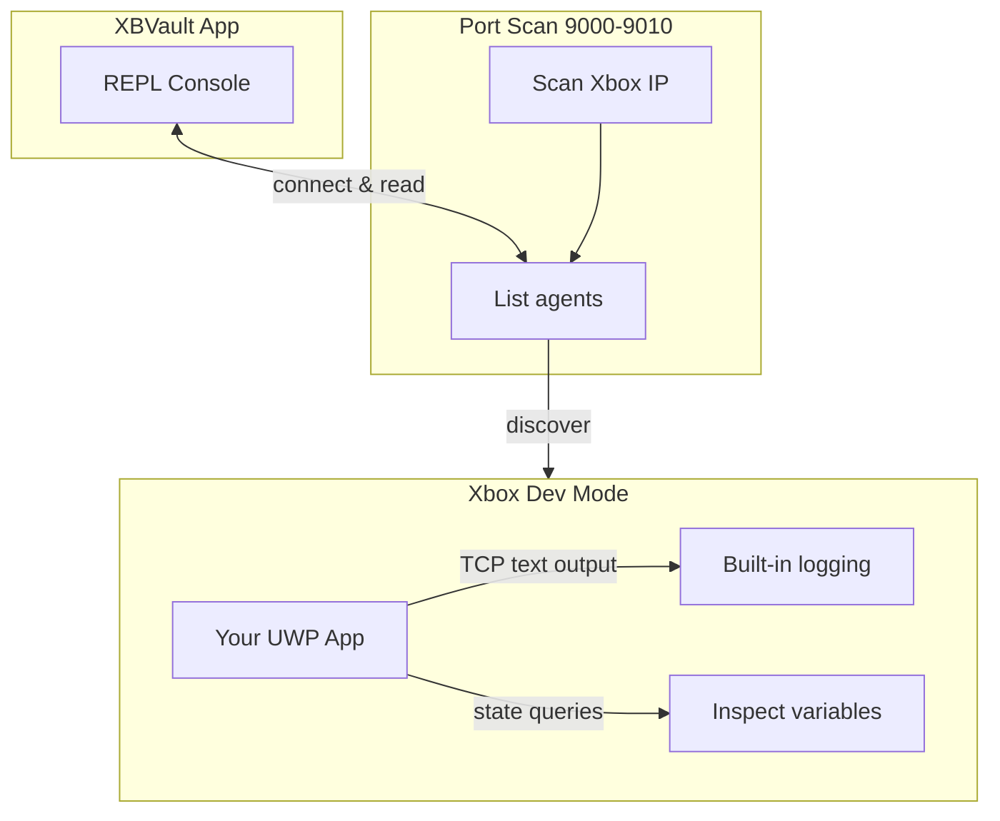
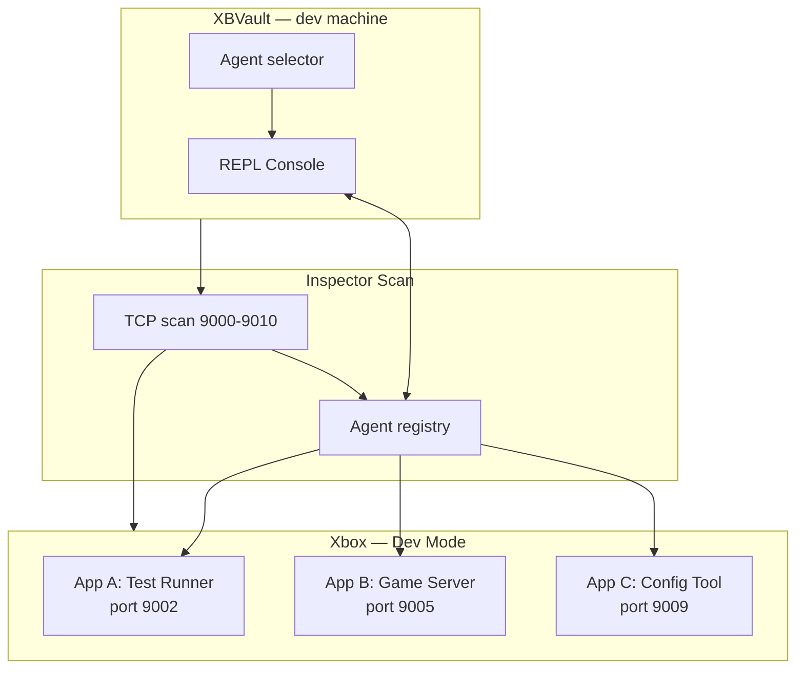

# Inspector — ADB for Xbox Homebrew

## Status

> 🚧 **Under development.** Scan logic, protocol handling, and REPL command forwarding are stubs. The UI shell, console with REPL input, font controls, and state management (disconnected/scanning/ready/sessions) are complete.

## The Problem

Developing UWP apps for Xbox Dev Mode means flying blind.

- No `Console.WriteLine` you can actually see without Visual Studio attached
- Remote debugging is slow, unreliable, and ties you to a full dev environment
- Want to check if your app loaded a config file correctly? Good luck — you're guessing
- Crash at startup? Zero diagnostics unless you set up ETW tracing
- No way to inspect app state at runtime without building a custom debug UI in your app

Every homebrew developer has been there: deploy, launch, stare at the TV, wonder what's happening inside.

## The Solution

Inspector gives you a **live debug terminal** for your Xbox — the same mental model as Android's `adb logcat` or iOS device logs, purpose-built for Xbox homebrew.

Your app speaks a simple text-over-TCP protocol. Inspector discovers it, connects, and shows you everything in real time.



### What it does

| Capability | Like `adb` ... | For Xbox |
|---|---|---|
| Live log output | `adb logcat` | Your app writes to a TCP socket, Inspector shows it |
| Send commands | `adb shell` | Type in the REPL, app receives and responds |
| Multiple targets | `adb devices` | Scan discovers all listening apps on ports 9000-9010 |
| Zero config | plug and play | Connect Xbox, click Scan, see your app |

### What it is NOT

- Not a file transfer tool (File Explorer already does that)
- Not a debugger (you still need VS for breakpoints)
- Not a crash reporter (that's a separate system)
- It sits between those — the **live insight** layer that mobile developers take for granted and Xbox developers don't have

## Why Your App Should Support Inspector

Adding Inspector support is trivial. Your UWP app opens a TCP socket on a port between 9000-9010 and speaks plain text. The protocol is whatever you want — structured JSON, key-value pairs, raw strings.

You get immediate value:

- **Log real-time events** — track app lifecycle, user actions, background tasks
- **Verify integrity** — did your asset bundle load? Is the config valid? Confirm from the console
- **Inspect state** — build a simple command handler: `> status`, `> cache`, `> connections`
- **Debug deployment issues** — app crashes on launch? Add a startup log socket
- **Test without VS** — deploy via XBVault, open Inspector, verify everything works

### Example: a minimal C# agent

```csharp
using var listener = new TcpListener(IPAddress.Any, 9002);
listener.Start();
var client = await listener.AcceptTcpClientAsync();
using var stream = client.GetStream();
using var writer = new StreamWriter(stream) { AutoFlush = true };

writer.WriteLine("[INFO] App started — config loaded OK");
writer.WriteLine("[DATA] AssetBundle: 124 files, 340MB");

// REPL: read commands from Inspector
var reader = new StreamReader(stream);
while (true)
{
    var cmd = await reader.ReadLineAsync();
    if (cmd == "status") writer.WriteLine("Status: running, 340MB RAM");
    if (cmd == "cache")  writer.WriteLine("Cache: 12 entries, 45MB");
}
```

That's it. No SDK, no NuGet package, no boilerplate. A `TcpListener` and a few `WriteLine` calls.

## Architecture



**Flow:**

1. **Connect** your Xbox via XBVault sidebar
2. **Scan** — Inspector probes ports 9000-9010 on the Xbox IP
3. Any app listening on those ports appears as an **agent**
4. **Select** an agent, see its output in the console
5. **Type** commands in the REPL — they go straight to your app

Yours apps don't need to know about XBVault. Just listen on a port and speak text.

## REPL Reference

| Command | Description |
|---|---|
| `help` | Show command reference |
| `clear` | Clear console |
| `scan` | Run agent discovery |
| `connect` | Open connection dialog |
| `status` | Show connection info |
| `<any>` | Forward raw command to selected agent |

## Getting Started

1. **Add a TCP listener** to your UWP app (port 9000-9010)
2. **Write log data** to connected clients via `StreamWriter`
3. **Handle commands** by reading lines from the same stream
4. **Deploy** your app to Xbox via XBVault
5. **Open Inspector**, click **Scan**, see your app appear
6. **Select** your app, watch live output, send commands

## For App Developers

The protocol is intentionally minimal. No handshake required. No SDK to bundle. If your app can open a `TcpListener` and print text, it supports Inspector.

Design your command set however you want:

```
> status       → "uptime: 4h, sessions: 12, cache: 340MB"
> log level 3  → "Log level set to 3"
> config       → "Config: { theme: dark, fps: 60, vsync: true }"
> ping         → "pong (4ms)"
```

Want structured data? Send JSON. Want human-readable? Send plain text. Inspector doesn't care — it's a pipe.

The value compounds when multiple apps support it. Scan once, see every debug-enabled app on your Xbox. No more switching between deploy tools, log viewers, and game windows.

## Non-Goals (v1)

- File transfer (handled by File Explorer via SFTP)
- App deployment or lifecycle management
- Rich agent metadata or capability negotiation
- TLS or encryption on agent channels (local network only)
- Binary protocol support (text-only)

## Future

| Feature | Benefit |
|---|---|
| Agent handshake (`HELLO`) | Auto-identify app name and version |
| Persistent TCP connections | No reconnect overhead between commands |
| Unsolicited agent output | Push logs without a command |
| Structured data mode | Parse and display JSON/formatted output |
| Connection auto-retry | Survive agent restarts |
| Per-agent icons | Visual identity in the channel list |

## Reference

- `XBVault/ViewModels/InspectorViewModel.cs`
- `XBVault/Views/InspectorView.axaml`
- `XBVault/Assets/Views/InspectorView/*.png`
