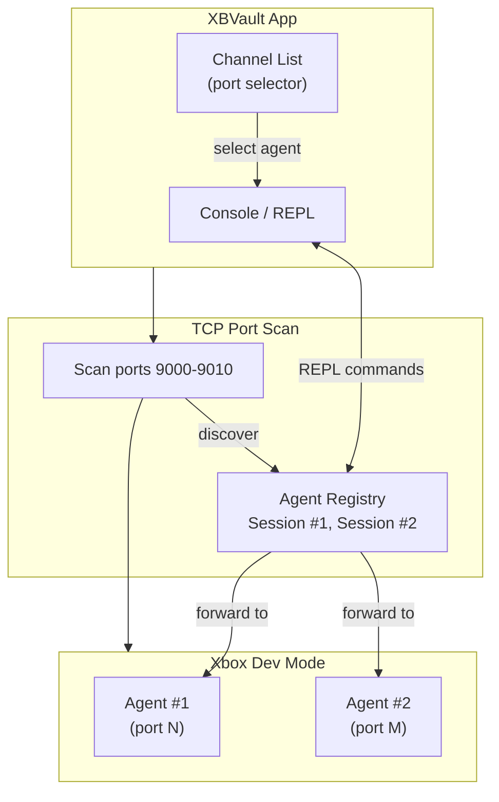

# Inspector — Homebrew Agent Discovery & REPL

## Status
<!-- {{ site.time | date: '%Y-%m-%d' }} -->

> 🚧 **Under development.** Scan logic, protocol handling, and REPL command forwarding are stubs. The UI shell, console with REPL input, font controls, and state management (disconnected/scanning/ready/sessions) are complete.

## Vision

The Inspector is a built-in tool for discovering, inspecting, and interacting with homebrew agents running on your Xbox Dev Mode console.

Think of it as a **debug terminal for your Xbox** — similar in spirit to Android's `adb` or iOS's `idevice` tools, but purpose-built for Xbox homebrew development.

When a homebrew app registers as an **inspector agent** (e.g., a test runner, a performance monitor, a custom game server), the Inspector discovers it via a port scan and opens a REPL session for sending commands and receiving responses in real time.

## Architecture

**Agent discovery flow:**

1. User clicks **Scan** (or types `scan` in REPL)
2. Inspector scans TCP ports 9000–9010 on the connected Xbox
3. Each responding port is listed as a discoverable **agent session**
4. User selects an agent from the channel list to target commands
5. All REPL input is forwarded to the selected agent via TCP socket

**Agent protocol (future):**

Inspector speaks a simple text-over-TCP protocol:
- Agent responds to `HELLO` with identity and capabilities
- All other text is forwarded as raw commands
- Agent may push unsolicited data (logs, status updates) at any time
- Connection is persistent per agent — no HTTP-style request/response

## Features

### Agent Discovery
- Scans TCP ports 9000–9010 on the connected Xbox
- Identifies responding agents by sending a `HELLO` handshake
- Lists discovered agents in the channel combo box
- Manually triggered — avoids unwanted network activity

### REPL Console
- Monospace terminal-style console with timestamped entries
- Input box supports multi-line commands, Ctrl+Enter to send
- `help` prints built-in command reference
- `clear` clears console output
- `scan` triggers agent discovery
- `status` shows connection info and selected agent

### Console Controls
| Control | Description |
|---------|-------------|
| Auto-scroll | Follow new output automatically |
| Font size | Increase / decrease (10–24 px, persisted) |
| Clear | Remove all console entries |

### Session Management
- Each discovered agent is a selectable session
- Selecting a session targets subsequent REPL commands to that agent
- Session list clears on disconnect

## Live Data (In-App)

When viewing the Inspector in-game, the console and session list reflect the **current** connection state. This page is a static reference — the app itself is the source of truth.

## Getting Started

1. **Connect** your Xbox via the sidebar (or click Connect in the Inspector view)
2. Click **Scan** to discover agents on ports 9000–9010
3. An **agent** is any homebrew app that listens on these ports and responds to the Inspector protocol
4. Select an agent from the **channel list** to target your commands
5. Type commands in the REPL input and press **Send** (or Ctrl+Enter)

## REPL Reference

| Command | Description |
|---------|-------------|
| `help`  | Show command reference |
| `clear` | Clear console |
| `scan`  | Run agent discovery scan |
| `connect` | Open connection dialog |
| `status` | Show connection info |
| `<any>` | Forward raw command to selected agent |

## Non-Goals (v1)

- Bi-directional file transfer via REPL
- Agent process management (start/stop agents from Inspector)
- Multiple simultaneous connections to the same agent
- Rich agent metadata (protocol version, feature list)
- Agent-side event subscription (push model)
- TLS/encryption on agent channels

## Future

| Feature | Description |
|---------|-------------|
| Agent handshake | Send `HELLO` to confirm identity before listing |
| Raw TCP socket | Forward REPL input as raw TCP to selected port |
| Agent capabilities | Report version, features, uptime per agent |
| Persistent sessions | Keep TCP connection open per selected agent |
| Unsolicited output | Agent can push log lines without a command |
| Connection auto-retry | Reconnect on agent disconnect |
| Scan progress | Real-time port status during scan |
| Agent icons/badges | Visual indicators for agent type/state |

## Reference

- OpenSpec change: (none yet — exploratory feature)
- Related: `XBVault/ViewModels/InspectorViewModel.cs`
- Related: `XBVault/Views/InspectorView.axaml`
- Related: `XBVault/Assets/Views/InspectorView/*.png`
