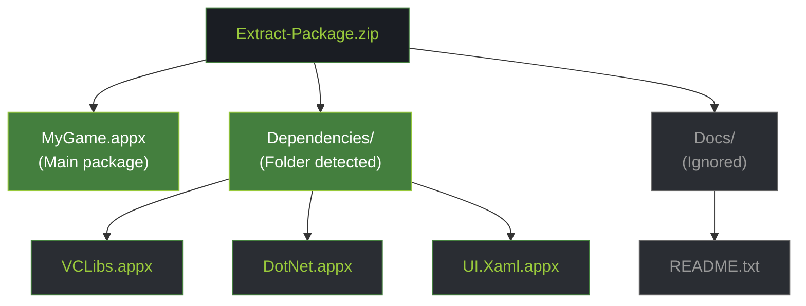
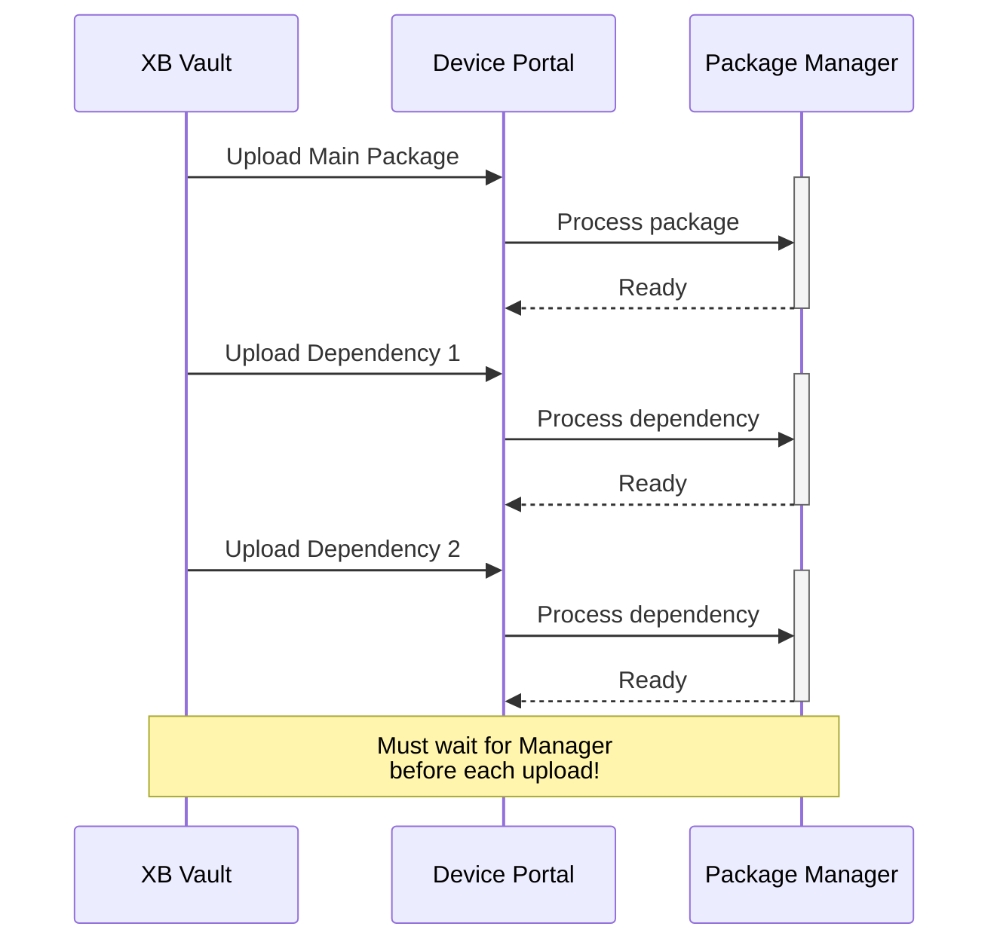
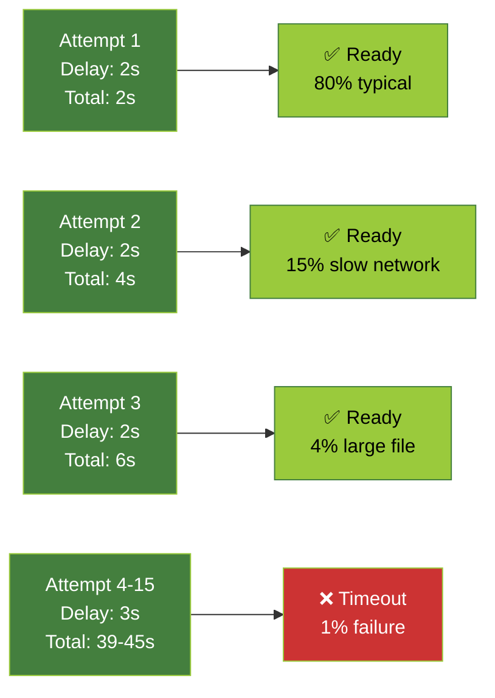
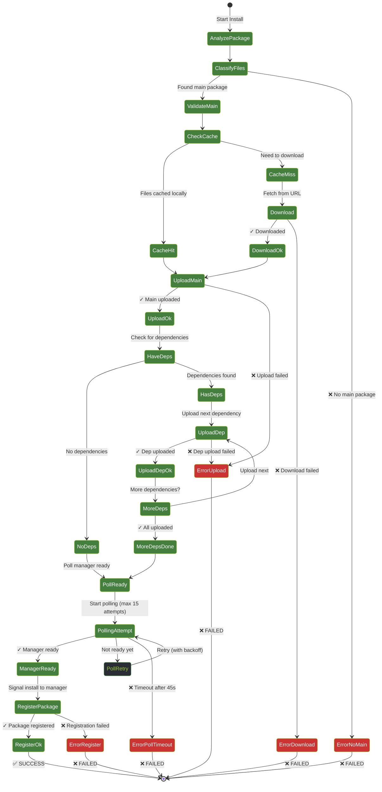
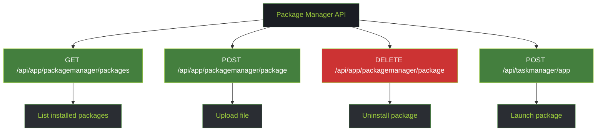

# Package Installation on Xbox: Flow, Dependency Detection, and Failure Handling

> Deep dive into how XB Homebrew Vault handles package installation on Xbox Dev Mode, including dependency detection, polling quirks, and failure recovery.

---

## Overview: Multi-Phase Installation

Xbox package installation is **not atomic**. The process requires careful orchestration across 5 phases:


---

## Phase 1: Dependency Detection

### Why Pre-Analysis Matters

**Xbox limitation:** Package manager can only process one upload at a time. It needs a brief "cooldown" before accepting the next upload.

**Challenge:** How do we know what to upload?

**Solution:** Analyze the package locally BEFORE uploading

### Dependency Detection Algorithm

**File Classification (3 categories):**

```mermaid
graph TD
    PKG["Package Contents"]
    
    PKG --> MAIN["Main Package<br/>install target"]
    PKG --> DEPS["Dependencies<br/>must install first"]
    PKG --> JUNK["Junk<br/>skip, never install"]
    
    MAIN --> MAIN_EX["&#92;.appx, &#92;.msix<br/>&#92;.appxbundle, etc"]
    DEPS --> DEPS_EX["Microsoft&#92;.*<br/>VCLibs, &#92;.NET<br/>ui&#92;.xaml, etc"]
    JUNK --> JUNK_EX["Certs (&#92;.cer, &#92;.pfx)<br/>Scripts (&#92;.ps1)<br/>Telemetry<br/>Diagnostics"]
    
    MAIN_EX -.->|Count: 1| MAIN
    DEPS_EX -.->|Count: 0+| DEPS
    JUNK_EX -.->|Count: 0+| JUNK
    
    style PKG fill:#1A1D23,stroke:#447F3E,color:#9ACA3C
    style MAIN fill:#447F3E,stroke:#9ACA3C,color:#fff
    style DEPS fill:#447F3E,stroke:#9ACA3C,color:#fff
    style JUNK fill:#CC3333,stroke:#9ACA3C,color:#fff
    style MAIN_EX fill:#2A2D33,stroke:#447F3E,color:#9ACA3C
    style DEPS_EX fill:#2A2D33,stroke:#447F3E,color:#9ACA3C
    style JUNK_EX fill:#2A2D33,stroke:#CC3333,color:#9ACA3C
```



### Detection Patterns (Regex)

**Dependency Pattern** (`PackageInstallService.cs:23-24`)
```regex
(?i)(microsoft\.|vclibs|net\.core|ui\.xaml|net\.native|vcruntime|dotnet|runtime\.)
```

**Why this pattern?**
- Xbox packages follow Microsoft naming conventions
- All framework/runtime packages start with these prefixes
- Case-insensitive because naming varies (case-insensitive from different creators)

**Examples matching (will be treated as dependencies):**
```
✓ Microsoft.NET.Runtime.6.0_6.0.0_x64__8wekyb3d8bbwe.appx
✓ Microsoft.VCLibs.140.00_14.0.29914.0_x64__8wekyb3d8bbwe.appx
✓ Microsoft.UI.Xaml.2.8_8.2404.17001.0_x64__8wekyb3d8bbwe.appx
✓ vclibs140_140.0_x64__8wekyb3d8bbwe.appx
✓ dotnet-runtime-6.0-win-x64.exe
```

---

### Junk Filter Pattern (What NOT to Install)

```regex
(?i)(\.cer$|\.pfx$|add-appdevpackage|install\.ps1|\.appxsym$|\.psd1$|
telemetrydependenc|logsideloading|diagnostics\.tracing|
visualstudio\.(remote|telemetry|util)|newtonsoft|system\.runtime\.compiler)
```

**Why filter these?**

| Pattern | Why Skip | Risk |
|---------|----------|------|
| `.cer`, `.pfx` | Certificates/keys | Installing as packages → corrupts package list |
| `install.ps1` | PowerShell scripts | Execution outside intent, Xbox doesn't support |
| `.appxsym` | Debug symbols | Unnecessary, wastes space |
| `telemetrydependenc` | Dev machine diagnostics | Unwanted telemetry collection |
| `logsideloading` | Development logging | Not needed on user console |
| `visualstudio.* ` | VS internals | Machine-specific, won't work on Xbox |

**Examples filtered (will be skipped):**
```
✗ mycert.cer              (certificate)
✗ InstallCertificate.pfx  (key)
✗ add-appdevpackage.ps1   (script)
✗ MyApp.appxsym           (debug symbols)
✗ app.diagnostics.tracing (diagnostics)
```

---

### Folder-Based Dependency Detection

**Code:**
```csharp
private static readonly HashSet<string> DepFolderNames = new(
    StringComparer.OrdinalIgnoreCase) { "Dependencies", "deps", "dep" };
```

**Why case-insensitive?**
- Different package creators use different conventions
- Some use `Dependencies/`, others `deps/`, `dep/`, `DEPENDENCIES/`
- Case-insensitive matching handles all variations

**How it works:**



---

## Phase 2: Download with Cache

### Cache Strategy

**Before uploading to Xbox, check cache:**

```csharp
if (_cache.IsCached(item.Id, fileName))
{
    // Cache hit! Use local file
    Logger.Debug($"Cache hit for {item.Id}/{fileName}");
    progress?.Report(new InstallProgressInfo 
    { 
        Total = 0.4, 
        Status = $"Using cached {fileName}" 
    });
}
else
{
    // Cache miss — download
    Logger.Debug($"Cache miss — downloading {fileName}");
    var response = await _http.GetAsync(item.DownloadUrl,
        HttpCompletionOption.ResponseHeadersRead);
    // ... streaming save to disk
}
```

**Cache location:** `%APPDATA%\XBVault\cache\`

**Why pre-cache?**
- Avoids re-downloading same package
- Speeds up installation if installing same app multiple times
- Survives app restart

---

## Phase 3: Sequential Upload to Xbox

### The Upload Challenge

**Xbox package manager is single-threaded.** It can only process one upload at a time.



### Upload Progress Reporting

**Code structure:**
```csharp
var totalFiles = 1 + dependencies.Length;
var mainName = Path.GetFileName(packagePath);

// Upload main package
progress?.Report(new InstallProgressInfo
{
    Total = 1.0 / totalFiles * 0,
    Status = $"Uploading {mainName}...",
    CurrentFile = mainName
});

var mainOk = await UploadAppxFile(packagePath, progress);

// Upload dependencies one at a time
foreach (var dep in dependencies)
{
    var depName = Path.GetFileName(dep);
    progress?.Report(new InstallProgressInfo
    {
        Total = (double)(1 + depIndex) / totalFiles,
        Status = $"Uploading dependency {depIndex}/{dependencies.Length}: {depName}...",
        CurrentFile = depName
    });
    
    await WaitForPackageManagerReady();  // ← CRITICAL POLLING
    var depOk = await UploadAppxFile(dep, progress);
}
```

---

## Phase 4: Package Manager Polling & Backoff

### Why Polling?

**Xbox package manager is a background service.** After uploading a file, it needs time to:
1. Validate the file
2. Decompress if needed
3. Run antivirus scan
4. Register in catalog
5. Return to "ready" state

**We can't just immediately upload the next file.** We have to poll `/api/app/packagemanager/packages` endpoint and check if `IsReady` is true.

### Polling Strategy: Exponential Backoff

**Code from `XboxDeviceService.cs:571-590`:**

```csharp
private async Task WaitForPackageManagerReady()
{
    const int MaxAttempts = 15;
    const int InitialDelay = 2000;    // 2 seconds
    const int LaterDelay = 3000;      // 3 seconds
    
    for (int i = 0; i < MaxAttempts; i++)
    {
        // First 3 attempts: 2s delay (manager usually ready quickly)
        // Later attempts: 3s delay (give more time if it's busy)
        int delay = i < 3 ? InitialDelay : LaterDelay;
        
        await Task.Delay(delay);
        
        var info = await GetPackageManagerInfoAsync();
        if (info?.IsReady == true)
        {
            Logger.Debug($"Package manager ready after {i+1} attempts ({delay*(i+1)}ms)");
            return;  // Success!
        }
    }
    
    // Still not ready after 45 seconds (15 * 3s)
    Logger.Warn("Package manager still not ready after max attempts");
}
```

### Timing Analysis



### Real-World Xbox Behavior

**Observation from deployment experience:**

1. **Typical case (80%):** Manager ready after 1-2 attempts (2-4 seconds)
2. **Network slow (15%):** Ready by attempt 3-4 (6-9 seconds)
3. **File large (4%):** Needs full polling (10-45 seconds)
4. **Timeout (1%):** After 45s, operation fails

---

## Phase 5: Installation State Machine



---

## Failure Handling & Recovery

### Failure Points & Code Response

#### 1. No Main Package Found

**Scenario:** User selects a ZIP that only has dependencies

```csharp
if (string.IsNullOrWhiteSpace(mainPackagePath))
{
    Logger.Error("No main package found in archive");
    return false;
}
```

**UI Response:** Shows error dialog, installation aborted

---

#### 2. Network/Download Failure

**Scenario:** Emulation Revival server down, or connection lost

```csharp
try
{
    var response = await _http.GetAsync(item.DownloadUrl,
        HttpCompletionOption.ResponseHeadersRead);
    
    response.EnsureSuccessStatusCode();
    // ... download to cache
}
catch (HttpRequestException ex)
{
    Logger.Error(ex, $"Failed to download {item.Name}");
    return false;
}
```

**Recovery:** User can retry; next attempt checks cache first

---

#### 3. Xbox Upload Failure (Network Unreachable)

**Scenario:** Xbox offline, network disconnected, or wrong IP

```csharp
try
{
    var response = await _http.PostAsync(uploadEndpoint, multipartContent);
    
    if (!response.IsSuccessStatusCode)
    {
        var errorBody = await response.Content.ReadAsStringAsync();
        var error = TryParseError(errorBody);
        Logger.Error($"Upload failed: {error}");
        return false;
    }
}
catch (HttpRequestException ex)
{
    Logger.Error(ex, "Upload connection failed");
    return false;
}
```

**UI Response:** "Failed to reach Xbox" error

---

#### 4. Package Manager Polling Timeout

**Scenario:** Xbox is processing large file, takes >45 seconds

```csharp
// After 15 attempts * 3s = 45 seconds max
if (i >= MaxAttempts)
{
    Logger.Warn($"Package manager still not ready after {MaxAttempts} attempts");
    // Installation continues anyway or fails?
    // Depends on implementation
    return;  // or throw exception
}
```

**Risk:** If we don't wait long enough, uploading next file while manager is busy can corrupt the installation

**Current behavior:** Falls through and attempts next upload anyway (potential issue)

**Recommendation:** Increase max attempts or add explicit timeout error

---

#### 5. Malformed Package File

**Scenario:** Corrupted ZIP, invalid .appx format

```csharp
private static string TryParseError(string? body)
{
    if (string.IsNullOrEmpty(body)) return null;
    try
    {
        using var doc = JsonDocument.Parse(body);
        if (doc.RootElement.TryGetProperty("ErrorMessage", out var msg))
            return msg.GetString();
    }
    catch { }  // ← BARE CATCH (issue #5)
    return null;
}
```

**Xbox response:** Returns 400 Bad Request with error message

**Code handling:** Extracts error message (if JSON parseable), logs, returns false

---

### Partial Installation Recovery

**Challenge:** What if 2/3 dependencies uploaded successfully, then network fails?

**Current behavior:**
```csharp
foreach (var dep in dependencies)
{
    var depOk = await UploadAppxFile(dep, progress);
    if (!depOk)
    {
        Logger.Error($"Dependency upload failed: {dep}");
        return false;  // ← Abort immediately
        // Partially uploaded packages remain on Xbox
    }
}
```

**Issue:** No cleanup of partially uploaded files

**Consequence:** Next installation attempt sees those files already present (potential conflict)

**Workaround:** User can manually clean via Dev Portal or re-run install (will skip cached files)

---

## Error Logging & Observability

### Progress Reporting to UI

```csharp
progress?.Report(new InstallProgressInfo
{
    Total = 0.65,  // 0.0 - 1.0 progress bar
    File = 2,      // Current file count
    Status = "Uploading dependency 2/3: vclibs140.appx...",
    CurrentFile = "vclibs140.appx"
});
```

### Error Scenarios Logged

```mermaid
graph LR
    A["[DEBUG]<br/>DownloadAndInstall<br/>MyGame from..."]
    B["[DEBUG]<br/>Cache hit for<br/>game123/myapp.zip"]
    C["[DEBUG]<br/>Target local path<br/>C:&#92;...&#92;myapp.zip"]
    D["[INFO]<br/>Upload starting<br/>MyGame.appx<br/>2 dependencies"]
    E["[DEBUG]<br/>Package manager<br/>ready after<br/>2 attempts"]
    F["[ERROR]<br/>Main package<br/>upload failed<br/>MyGame.appx"]
    G["[WARN]<br/>Package manager<br/>still not ready<br/>max attempts"]
    H["[ERROR]<br/>Dependency<br/>not found<br/>missing-lib.appx"]
    
    A --> B --> C --> D --> E
    D --> F
    E --> G
    D --> H
    
    style A fill:#2A2D33,stroke:#447F3E,color:#9ACA3C
    style B fill:#2A2D33,stroke:#447F3E,color:#9ACA3C
    style C fill:#2A2D33,stroke:#447F3E,color:#9ACA3C
    style D fill:#447F3E,stroke:#9ACA3C,color:#fff
    style E fill:#2A2D33,stroke:#447F3E,color:#9ACA3C
    style F fill:#CC3333,stroke:#9ACA3C,color:#fff
    style G fill:#FF9900,stroke:#9ACA3C,color:#000
    style H fill:#CC3333,stroke:#9ACA3C,color:#fff
```



---

## Xbox API Endpoints Used



### Upload Endpoint: Multipart Form Data

**Endpoint:** `POST /api/app/packagemanager/package`

**Headers:**
- `Authorization: Basic base64(user:pass)`
- `X-CSRF-Token: [token from cookie]`
- `Content-Type: multipart/form-data; boundary=...`

**Body format:**
```
--boundary
Content-Disposition: form-data; name="file"; filename="MyApp.appx"
Content-Type: application/octet-stream

[binary file data]
--boundary--
```

---

## Summary: Design Decisions

| Decision | Rationale |
|----------|-----------|
| **Multi-phase process** | Xbox package manager single-threaded, requires orchestration |
| **Pre-analysis** | Avoid uploading junk, identify dependencies upfront |
| **Regex classification** | Fast, maintainable, handles naming variations |
| **Exponential backoff polling** | Balances responsiveness (2s) + tolerance for slow operations (3s) |
| **Cache before download** | Speeds up repeated installs, survives app restart |
| **Sequential upload** | Xbox limitation, can't parallelize |
| **15 attempts, 45s timeout** | Handles network delays, avoids infinite hangs |
| **Immediate abort on error** | Fails fast, prevents partial/corrupted installations |

---

## Known Issues & Workarounds

### Issue 1: Bare catch in TryParseError

**Code:** Line 422 in XboxDeviceService  
**Risk:** JSON parse error silently swallowed  
**Workaround:** Assume no error message if parse fails

### Issue 2: Polling might not wait long enough

**Code:** MaxAttempts = 15, delay = 3s  
**Risk:** 45 seconds might be insufficient for very large files  
**Recommendation:** Make timeout configurable or increase max attempts

### Issue 3: No cleanup on partial upload failure

**Code:** Foreach loop aborts on first failure  
**Risk:** Partially uploaded dependencies might cause next install to fail  
**Workaround:** User can retry or manually clean via Dev Portal

---

## Testing & Validation

**Scenarios to test:**
- ✓ Download hit (cached file)
- ✓ Download miss (fetch from server)
- ✓ Single package, no dependencies
- ✓ Package with 2-3 dependencies
- ✓ Large file (>500MB)
- ✓ Network timeout during upload
- ✓ Xbox offline during installation
- ✓ Corrupted ZIP file
- ✓ Missing dependencies in archive

---

**Document version:** 1.0  
**Based on:** PackageInstallService.cs + XboxDeviceService.cs analysis  
**Last updated:** 2026-06-25
