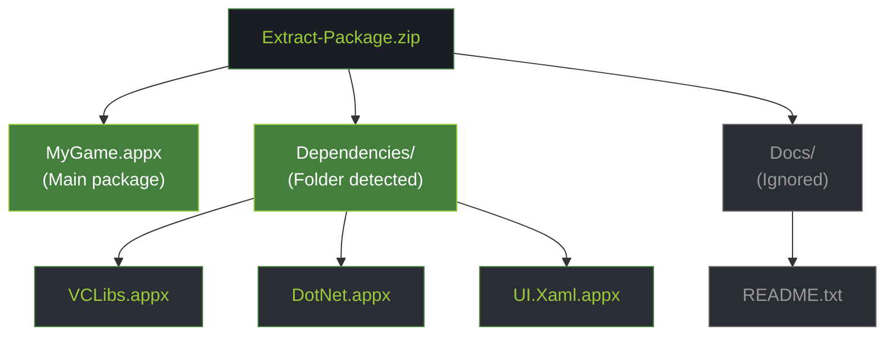
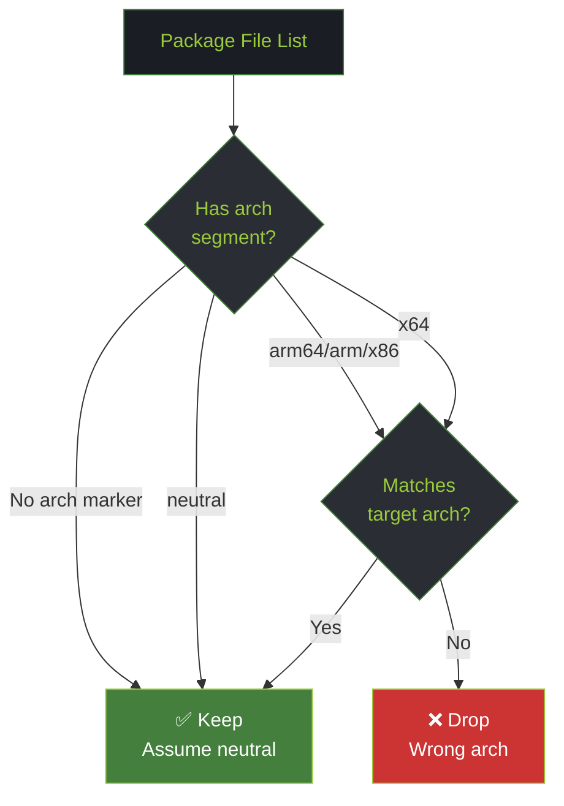
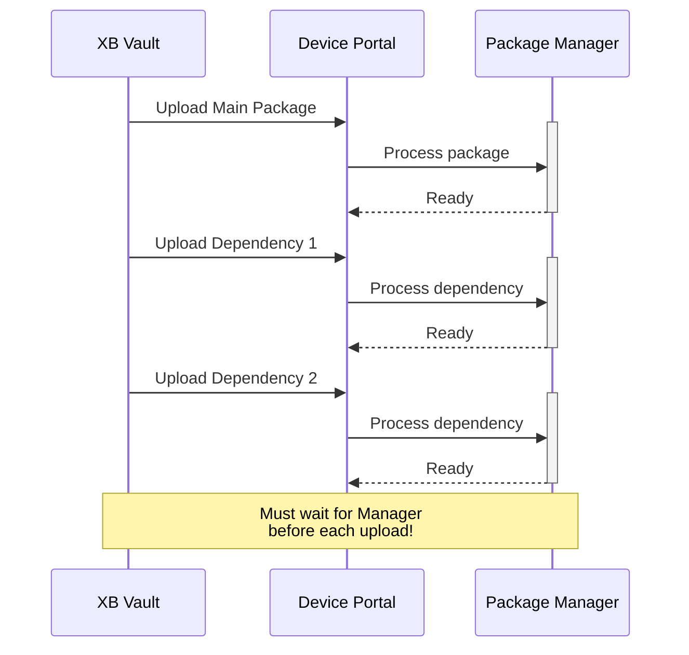
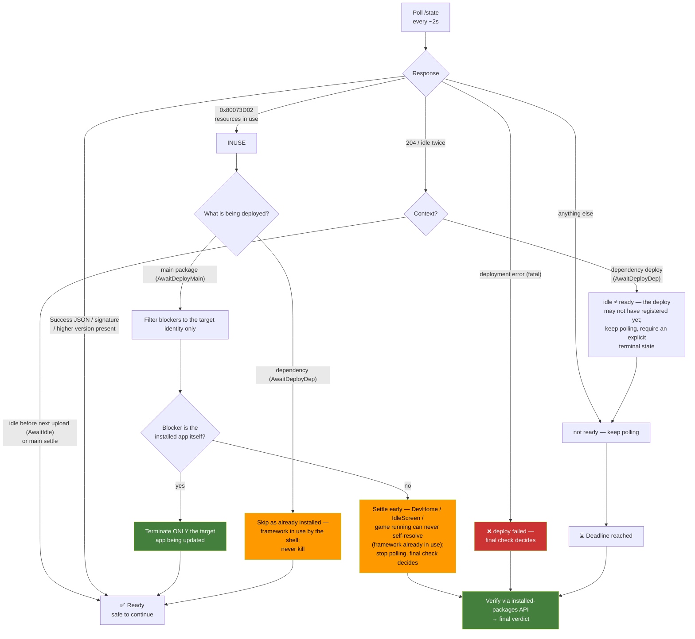
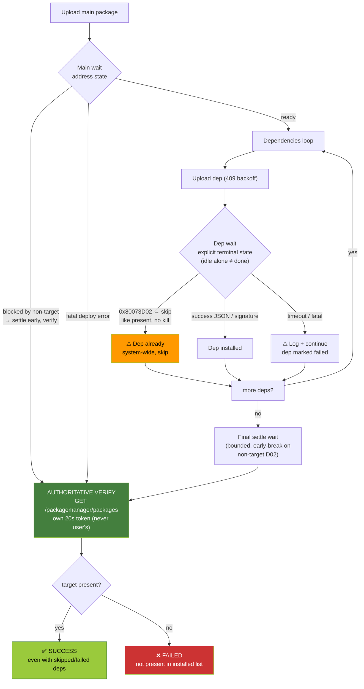

# Package Installation on Xbox: Flow, Dependency Detection, and Failure Handling

> Deep dive into how XB Homebrew Vault handles package installation on Xbox Dev Mode, including dependency detection, polling quirks, and failure recovery.

---

## Overview: Multi-Phase Installation

Xbox package installation is **not atomic**. The process requires careful orchestration across 5 phases:


```mermaid
graph LR
    A["1. Analyze"] --> B["2. Download"]
    B --> C["3. Upload"]
    C --> D["4. Poll"]
    D --> E["5. Verify"]
    E --> F["✅ SUCCESS"]

    style A fill:#447F3E,stroke:#9ACA3C,color:#fff
    style B fill:#447F3E,stroke:#9ACA3C,color:#fff
    style C fill:#447F3E,stroke:#9ACA3C,color:#fff
    style D fill:#447F3E,stroke:#9ACA3C,color:#fff
    style E fill:#447F3E,stroke:#9ACA3C,color:#fff
    style F fill:#9ACA3C,stroke:#447F3E,color:#000
```

Phase 5 changed over time: it used to be "Register" (the app trusted the package-manager poll result). Now it is **Verify** — the install result is decided by re-querying the installed-packages API directly, not by what the poll reports. The reason is at the bottom of this page ("Dependency presence detection").

---

## Phase 1: Dependency Detection

### Why Pre-Analysis Matters

**Xbox limitation:** Package manager can only process one upload at a time. It needs a brief "cooldown" before accepting the next upload.

**Challenge:** How do we know what to upload?

**Solution:** Analyze the package locally BEFORE uploading

### Dependency Detection Algorithm

**File Classification (3 categories):**


```mermaid
graph TD
    PKG["Package Contents"]

    PKG --> MAIN["Main Package<br/>install target"]
    PKG --> DEPS["Dependencies<br/>upload after main"]
    PKG --> JUNK["Junk<br/>skip, never install"]

    MAIN --> MAIN_EX["&#92;.appx, &#92;.msix<br/>&#92;.appxbundle, etc"]
    DEPS --> DEPS_EX["Microsoft&#92;.*<br/>VCLibs, &#92;.NET<br/>ui&#92;.xaml, etc"]
    JUNK --> JUNK_EX["Certs (&#92;.cer, &#92;.pfx)<br/>Scripts (&#92;.ps1)<br/>Telemetry<br/>Diagnostics"]

    MAIN_EX -.->|Count: 1| MAIN
    DEPS_EX -.->|Count: 0+| DEPS
    JUNK_EX -.->|Count: 0+| JUNK

    style PKG fill:#1A1D23,stroke:#447F3E,color:#9ACA3C
    style MAIN fill:#447F3E,stroke:#9ACA3C,color:#fff
    style DEPS fill:#447F3E,stroke:#9ACA3C,color:#fff
    style JUNK fill:#CC3333,stroke:#9ACA3C,color:#fff
    style MAIN_EX fill:#2A2D33,stroke:#447F3E,color:#9ACA3C
    style DEPS_EX fill:#2A2D33,stroke:#447F3E,color:#9ACA3C
    style JUNK_EX fill:#2A2D33,stroke:#CC3333,color:#9ACA3C
```

### Detection Patterns (Regex)

**Dependency Pattern** (`PackageInstallService.cs:23-24`)
```regex
(?i)(microsoft\.|vclibs|net\.core|ui\.xaml|net\.native|vcruntime|dotnet|runtime\.)
```

**Why this pattern?**
- Xbox packages follow Microsoft naming conventions
- All framework/runtime packages start with these prefixes
- Case-insensitive because naming varies (case-insensitive from different creators)

**Examples matching (will be treated as dependencies):**
```
✓ Microsoft.NET.Runtime.6.0_6.0.0_x64__8wekyb3d8bbwe.appx
✓ Microsoft.VCLibs.140.00_14.0.29914.0_x64__8wekyb3d8bbwe.appx
✓ Microsoft.UI.Xaml.2.8_8.2404.17001.0_x64__8wekyb3d8bbwe.appx
✓ vclibs140_140.0_x64__8wekyb3d8bbwe.appx
✓ dotnet-runtime-6.0-win-x64.exe
```

---

### Junk Filter Pattern (What NOT to Install)

```regex
(?i)(\.cer$|\.pfx$|add-appdevpackage|install\.ps1|\.appxsym$|\.psd1$|
telemetrydependenc|logsideloading|diagnostics\.tracing|
visualstudio\.(remote|telemetry|util)|newtonsoft|system\.runtime\.compiler)
```

**Why filter these?**

| Pattern | Why Skip | Risk |
|---------|----------|------|
| `.cer`, `.pfx` | Certificates/keys | Installing as packages → corrupts package list |
| `install.ps1` | PowerShell scripts | Execution outside intent, Xbox doesn't support |
| `.appxsym` | Debug symbols | Unnecessary, wastes space |
| `telemetrydependenc` | Dev machine diagnostics | Unwanted telemetry collection |
| `logsideloading` | Development logging | Not needed on user console |
| `visualstudio.* ` | VS internals | Machine-specific, won't work on Xbox |

**Examples filtered (will be skipped):**
```
✗ mycert.cer              (certificate)
✗ InstallCertificate.pfx  (key)
✗ add-appdevpackage.ps1   (script)
✗ MyApp.appxsym           (debug symbols)
✗ app.diagnostics.tracing (diagnostics)
```

---

### Folder-Based Dependency Detection

**Code:**
```csharp
private static readonly HashSet<string> DepFolderNames = new(
    StringComparer.OrdinalIgnoreCase) { "Dependencies", "deps", "dep" };
```

**Why case-insensitive?**
- Different package creators use different conventions
- Some use `Dependencies/`, others `deps/`, `dep/`, `DEPENDENCIES/`
- Case-insensitive matching handles all variations

**How it works:**


```mermaid
graph TD
    ROOT["Extract-Package.zip"]
    ROOT --> MAIN["MyGame.appx<br/>(Main package)"]
    ROOT --> DEP["Dependencies/<br/>(Folder detected)"]
    ROOT --> DOCS["Docs/<br/>(Ignored)"]

    DEP --> VC["VCLibs.appx"]
    DEP --> DN["DotNet.appx"]
    DEP --> UI["UI.Xaml.appx"]

    DOCS --> README["README.txt"]

    style ROOT fill:#1A1D23,stroke:#447F3E,color:#9ACA3C
    style MAIN fill:#447F3E,stroke:#9ACA3C,color:#fff
    style DEP fill:#447F3E,stroke:#9ACA3C,color:#fff
    style DOCS fill:#2A2D33,stroke:#666,color:#999
    style VC fill:#2A2D33,stroke:#447F3E,color:#9ACA3C
    style DN fill:#2A2D33,stroke:#447F3E,color:#9ACA3C
    style UI fill:#2A2D33,stroke:#447F3E,color:#9ACA3C
    style README fill:#2A2D33,stroke:#666,color:#999
```

---

### Architecture Filter (Prevents Wrong-Arch Packages)

**Problem:** `.appxbundle`/`.msixbundle` files contain architecture-specific packages inside (e.g. `app_arm.appx`, `app_x64.appx`, `app_x86.appx`). Dependency folders (`Dependencies/`, `deps/`) can also contain mixed-arch files like `Microsoft.VCLibs.ARM64.14.00.appx`. Without filtering, all variants get classified and uploaded — ARM packages fail on x64 Xbox.

**Solution:** `FilterByArchitecture()` detects the current system architecture and discards non-matching packages.

**Code** (`PackageInstallService.cs:34-35`):
```csharp
private static readonly Regex ArchPattern = new(
    @"(?:^|[\._\-])(arm64|arm|x64|x86|neutral)(?:[\._\-]|$)",
    RegexOptions.IgnoreCase | RegexOptions.Compiled);
```

**How it works:**


```mermaid
graph TD
    INPUT["Package File List"]
    INPUT --> ARCH_CHECK{"Has arch<br/>segment?"}
    ARCH_CHECK -->|"No arch marker"| KEEP["✅ Keep<br/>Assume neutral"]
    ARCH_CHECK -->|"arm64/arm/x86"| TARGET_MATCH{"Matches<br/>target arch?"}
    ARCH_CHECK -->|"x64"| TARGET_MATCH
    ARCH_CHECK -->|"neutral"| KEEP
    TARGET_MATCH -->|"Yes"| KEEP
    TARGET_MATCH -->|"No"| DROP["❌ Drop<br/>Wrong arch"]

    style INPUT fill:#1A1D23,stroke:#447F3E,color:#9ACA3C
    style ARCH_CHECK fill:#2A2D33,stroke:#447F3E,color:#9ACA3C
    style KEEP fill:#447F3E,stroke:#9ACA3C,color:#fff
    style DROP fill:#CC3333,stroke:#9ACA3C,color:#fff
    style TARGET_MATCH fill:#2A2D33,stroke:#447F3E,color:#9ACA3C
```

**Arch detection is segment-based (not just suffix):**

| Filename | Arch Detected | x64 System | Why |
|----------|---------------|-----------|-----|
| `MyGame_1.0.0.0_x64.appx` | `x64` | ✅ Kept | Match target |
| `MyGame_1.0.0.0_arm.appx` | `arm` | ❌ Dropped | Wrong arch |
| `Microsoft.VCLibs.**ARM64**.14.00.appx` | `arm64` | ❌ Dropped | Arch in middle segment |
| `Microsoft.VCLibs.**x64**.14.00.appx` | `x64` | ✅ Kept | Arch in middle segment |
| `Microsoft.VCLibs.**x86**.14.00.appx` | `x86` | ❌ Dropped | Arch in middle segment |
| `MyApp_1.0.0.0_neutral.appx` | `neutral` | ✅ Kept | Any arch |
| `MyApp.appx` | `none` | ✅ Kept | No marker assumed neutral |

**Where filter is applied** (3 points in `PackageInstallService.cs`):

| Location | What It Filters |
|----------|----------------|
| `ExtractBundles()` return | Inner packages extracted from `.appxbundle`/`.msixbundle` |
| `FindInstallablePackages()` return | Standalone files + `Dependencies/`/`deps/`/`dep/` folders |
| `GetInstallableFiles()` return | Safety net on merged results |

**Coverage:** Both catalog install (`DownloadAndInstallAsync`) and custom/manual install (`AnalyzeLocalFile`/`AnalyzeDirectory`) flow through these same methods — one filter covers both.

---

## Phase 2: Download with Cache

### Cache Strategy

**Before uploading to Xbox, check cache:**

```csharp
if (_cache.IsCached(item.Id, fileName))
{
    // Cache hit! Use local file
    Logger.Debug($"Cache hit for {item.Id}/{fileName}");
    progress?.Report(new InstallProgressInfo
    {
        Total = 0.4,
        Status = $"Using cached {fileName}"
    });
}
else
{
    // Cache miss — download
    Logger.Debug($"Cache miss — downloading {fileName}");
    var response = await _http.GetAsync(item.DownloadUrl,
        HttpCompletionOption.ResponseHeadersRead);
    // ... streaming save to disk
}
```

**Cache location:** `%APPDATA%\XBVault\cache\`

**Why pre-cache?**
- Avoids re-downloading same package
- Speeds up installation if installing same app multiple times
- Survives app restart

---

## Phase 3: Sequential Upload to Xbox

### The Upload Challenge

**Xbox package manager is single-threaded.** It can only process one upload at a time. The main package is uploaded **first**, then each dependency is uploaded one at a time.


```mermaid
sequenceDiagram
    participant App as XB Vault
    participant Portal as Device Portal
    participant Manager as Package Manager

    App->>Portal: Upload Main Package
    activate Manager
    Portal->>Manager: Process package
    Manager-->>Portal: Ready
    deactivate Manager

    App->>Portal: Upload Dependency 1
    activate Manager
    Portal->>Manager: Process dependency
    Manager-->>Portal: Ready
    deactivate Manager

    App->>Portal: Upload Dependency 2
    activate Manager
    Portal->>Manager: Process dependency
    Manager-->>Portal: Ready
    deactivate Manager

    Note over App,Manager: Must wait for Manager<br/>before each upload!
```

### Upload Conflict Retry

If a dependency upload races another deployment, the portal answers `409 Conflict` ("Another deployment is running"). The upload loop backs off (5s → 10s → 15s), waits for the manager, and retries — **3 attempts max**, then returns failure. On Xbox the manager is usually idle by the first retry.

### Upload Streams & Handle Hygiene

An upload is built as a manual multipart body (`ConcatStream` = header + file + footer) to match the exact byte order WDP's browser-upload path expects — `MultipartFormDataContent` reorders headers and is rejected. Every attempt builds **fresh** streams and disposes them after the round, so a `409` retry re-reads the file from disk and no file handle is leaked between attempts.

### Upload Progress Reporting

**Code structure:**
```csharp
var totalFiles = 1 + dependencies.Length;
var mainName = Path.GetFileName(packagePath);

// Upload main package
progress?.Report(new InstallProgressInfo
{
    Total = 1.0 / totalFiles * 0,
    Status = $"Uploading {mainName}...",
    CurrentFile = mainName
});

var mainOk = await UploadAppxFile(packagePath, progress);

// Upload dependencies one at a time
foreach (var dep in dependencies)
{
    var depName = Path.GetFileName(dep);
    progress?.Report(new InstallProgressInfo
    {
        Total = (double)(1 + depIndex) / totalFiles,
        Status = $"Uploading dependency {depIndex}/{dependencies.Length}: {depName}...",
        CurrentFile = depName
    });

    await WaitForPackageManagerReady();  // ← CRITICAL POLLING
    var depOk = await UploadAppxFile(dep, progress);
}
```

---

## Phase 4: Package Manager Polling & Decisions

### Why Polling?

**Xbox package manager is a background service.** After uploading a file, it needs time to:
1. Validate the file
2. Decompress if needed
3. Run antivirus scan
4. Register in catalog
5. Return to "ready" state

We poll `GET /api/app/packagemanager/state` and branch on what the portal answers. The poll is **decision-driven**, not a blind "wait until ready":


```mermaid
flowchart TD
    START["Poll /state<br/>every ~2s"] --> BODY{"Response"}

    BODY -- "204 / idle twice" --> IDLE{"Context?"}
    IDLE -- "idle before next upload (AwaitIdle)<br/>or main settle" --> READY["✅ Ready<br/>safe to continue"]
    IDLE -- "dependency deploy<br/>(AwaitDeployDep)" --> DEPIDLE["idle ≠ ready — the deploy<br/>may not have registered yet;<br/>keep polling, require an explicit<br/>terminal state"]

    BODY -- "Success JSON / signature<br/>/ higher version present" --> READY
    BODY -- "0x80073D02<br/>resources in use" --> INUSE
    BODY -- "deployment error (fatal)" --> FAIL["❌ deploy failed —<br/>final check decides"]
    BODY -- "anything else" --> POLLMORE["not ready — keep polling"]

    INUSE --> TYPE{"What is being deployed?"}
    TYPE -- "main package (AwaitDeployMain)" --> FILTER["Filter blockers to the target identity only"]
    FILTER --> TARGET{"Blocker is the<br/>installed app itself?"}
    TARGET -- "yes" --> KILL["Terminate ONLY the target<br/>app being updated"]
    TARGET -- "no" --> SETTLE["Settle early — DevHome / IdleScreen /<br/>game running can never self-resolve<br/>(framework already in use);<br/>stop polling, final check decides"]
    TYPE -- "dependency (AwaitDeployDep)" --> D02SKIP["Skip as already installed —<br/>framework in use by the shell;<br/>never kill"]
    KILL --> READY
    SETTLE --> VERIFY
    D02SKIP --> READY
    DEPIDLE --> POLLMORE

    POLLMORE --> TIMEOUT["⌛ Deadline reached"]
    FAIL --> VERIFY
    TIMEOUT --> VERIFY["Verify via installed-packages API<br/>→ final verdict"]

    style KILL fill:#447F3E,stroke:#9ACA3C,color:#fff
    style SETTLE fill:#FF9900,stroke:#9ACA3C,color:#000
    style D02SKIP fill:#FF9900,stroke:#9ACA3C,color:#000
    style FAIL fill:#CC3333,stroke:#9ACA3C,color:#fff
    style VERIFY fill:#447F3E,stroke:#9ACA3C,color:#fff
```

### Time Budgets

The poll is **bounded** — no infinite wait. Different operations get different budgets:

| Operation | Budget | Used for |
|-----------|--------|----------|
| Main package deploy settle | 40s | `AwaitDeployMain` — polls + bounded kills |
| Dependency deploy settle | 10s | `AwaitDeployDep` — fast skip/continue decision |
| Idle wait before next upload | 20s | `AwaitIdle` — 409 backoff partner |
| Upload `409` conflict retries | 3 × (5/10/15s) | backoff    |
| Final installed-packages verification | 20s | authoritative verdict (own token) |

Worst realistic case ends around ~70s; the common path (deps already present) finishes in ~10-20s with no screen flicker. Since 2026-08-29 a `0x80073D02` naming only non-target apps no longer burns the 40s settle budget — it settles early (see below) and goes straight to verification.

### The Termination Rule (Critical)

When `0x80073D02` (resources in use) lists a running app:

1. **Never terminate a non-target app.** The Dev Mode shell `Microsoft.Xbox.DevHome`, `Xbox.IdleScreen`, the dashboard, and any game the user is running must not be killed — killing them black-flickers the screen and the shell just restarts.
2. **Only the app being installed/updated may be terminated** — matched by `FullName.StartsWith(targetIdentity + "_")` (`FilterBlockingTargets`). A blocked **main package** that is not the target **settles early** (2026-08-29): the D02 names only DevHome/IdleScreen/games — processes holding a framework that is *already installed* — so it can never self-resolve; the code stops polling and lets the final installed-packages check decide.
3. For **dependencies**, `0x80073D02` never triggers a kill at all — see the next section.

---

## Phase 5: Install, Skip & Verify

### The Full Flow


```mermaid
flowchart TD
    MAIN["Upload main package"] --> MW{"Main wait<br/>address state"}
    MW -- "ready" --> DEPLOOP["Dependencies loop"]
    MW -- "blocked by non-target<br/>→ settle early, verify" --> VF
    MW -- "fatal deploy error" --> VF

    DEPLOOP --> DEPUP["Upload dep (409 backoff)"]
    DEPUP --> DW{"Dep wait<br/>explicit terminal state<br/>(idle alone ≠ done)"}
    DW -- "success JSON / signature" --> DEPOK["Dep installed"]
    DW -- "0x80073D02 → skip<br/>like present, no kill" --> DEPSKIP["⚠ Dep already<br/>system-wide, skip"]
    DW -- "timeout / fatal" --> DEPFAIL["⚠ Log + continue<br/>dep marked failed"]
    DEPSKIP --> NEXT["more deps?"]
    DEPOK --> NEXT
    DEPFAIL --> NEXT
    NEXT -- "yes" --> DEPLOOP
    NEXT -- "no" --> FINAL["Final settle wait<br/>(bounded, early-break on<br/>non-target D02)"]

    FINAL --> VF["AUTHORITATIVE VERIFY<br/>GET /packagemanager/packages<br/>own 20s token (never user's)"]
    VF --> PRESENT{"target present?"}
    PRESENT -- "yes" --> SUCCESS["✅ SUCCESS<br/>even with skipped/failed deps"]
    PRESENT -- "no" --> FAILED["❌ FAILED<br/>not present in installed list"]

    style DEPSKIP fill:#FF9900,stroke:#9ACA3C,color:#000
    style SUCCESS fill:#9ACA3C,stroke:#447F3E,color:#000
    style FAILED fill:#CC3333,stroke:#9ACA3C,color:#fff
    style VF fill:#447F3E,stroke:#9ACA3C,color:#fff
```

### Dependency Presence Detection (Why `0x80073D02` Means "Already Installed")

This is the heart of the hang fix. It was the reason the Gen1Recomp **update** hung forever and reported failure while actually succeeding.

**Key facts (verified against real consoles):**

| Fact | How it was proved |
|------|-------------------|
| `GET /api/app/packagemanager/packages` lists **only registered apps** — never framework packages (VCLibs, .NET Native, UI.Xaml). | Full raw API dumps from 2 consoles (62 and 107 entries): every item has `AppListEntry` + `RegisteredUsers` + `PackageRelativeId ...!App`. Zero frameworks. |
| A **missing** framework produces `0x80073CF3` ("framework could not be found") — a *different* error code. | Microsoft's official MSIX troubleshooting guide (`0x80073CF3`) vs the in-use error. |
| `0x80073D02` = `ERROR_PACKAGES_IN_USE`: "resources it modifies are currently in use". A process can only hold files in use if those files **exist on disk**. | Microsoft Win32 docs for the code; the reason names e.g. `Microsoft.Xbox.DevHome_1.0.2607.19001_x64__...`. |
| `Microsoft.Xbox.DevHome` only runs because it has already loaded the x64 C++ runtime framework. If VCLibs were absent, Dev Mode's shell could not start. | DevHome is a UWP x64 app that statically depends on `Microsoft.VCLibs.*`; it demonstrably runs (it's the always-on Dev Mode shell). |
| The conflict is **specific to the dependency**, not a global gate. | The main package deployed seconds before it succeeded with no `0x80073D02` at all. Only the dependency deploy was blocked. |

**Consequence:** during a dependency deploy, `0x80073D02` can *only* mean the framework is already installed system-wide and held by a running app. Redeploying it can never succeed, and killing the holder (DevHome) does not help — DevHome is the shell and restarts instantly. So the only sane action is:

> **WARN + skip. Never kill. Move on.**

The framework is re-verified indirectly by the final authoritative check: if the main app is present after the flow, the install succeeded — and if it launches (Dev Mode shell boots every time), the framework it needs was present all along.

### The Idle Race (2026-08-29 harden)

`0x80073D02` usually surfaces *late* — the deploy is accepted (`202`), then `/state` returns `204` (idle) for a couple of polls because the deployment is still registering. Two behaviors were hardened against this:

- **`AwaitDeployDep` — idle is no longer "installed".** Earlier code accepted two consecutive `204`s as "dependency installed" right after the upload (`idle twice → Ready`). That was a premature verdict: the deploy had not registered yet, so the real outcome (`0x80073D02` from a framework the shell already holds) landed afterwards and fell into the slow final-settle path — the classic 40s dead tail. The dep wait now keeps polling until an **explicit terminal state** (success JSON, `TRUST_E_NOSIGNATURE`, `0x80073D02 → skip`, higher-version, or fatal), capped by its own 10s `DepPollTimeout` (timed-out → "continuing; final check decides"). Bare idle‑twice *does* remain valid for `AwaitIdle` (before the next upload) and the main settle.
- **`AwaitDeployMain` — non-target D02 settles early.** When the final settle gets `0x80073D02` naming only non-target apps (`targets.Count == 0`), the framework is already installed and held by the Dev Mode shell — it can never self-resolve. The code now returns `Ready` immediately ("settling early, final check decides") instead of polling `MainPollTimeout`. Applies to both the post-main settle and the final settle.

Neither change touches the kill logic (never kill a non-target) nor the verdict — the authoritative installed-packages check still decides SUCCESS/FAILED.

### Final Authoritative Verification

Before returning, the service **always** re-queries `GET /api/app/packagemanager/packages` and looks for `FullName.StartsWith(targetIdentity + "_")`:

- It uses **its own 20s cancellation token** — deliberately **not** the user's token, so an aborted or hung install still reports the *true* final state instead of a misleading "FAILED" (the old flow reused the user's canceled token and let a `TaskCanceledException` mask a successful install).
- **Main app present ⇒ `SUCCESS`**, even when a dependency was skipped or failed.
- **Main app absent ⇒ `FAILED`.**

---

## Failure Handling & Recovery

### Failure Points & Code Response

#### 1. No Main Package Found

**Scenario:** User selects a ZIP that only has dependencies

```csharp
if (string.IsNullOrWhiteSpace(mainPackagePath))
{
    Logger.Error("No main package found in archive");
    return false;
}
```

**UI Response:** Shows error dialog, installation aborted

---

#### 2. Network/Download Failure

**Scenario:** Emulation Revival server down, or connection lost

```csharp
try
{
    var response = await _http.GetAsync(item.DownloadUrl,
        HttpCompletionOption.ResponseHeadersRead);

    response.EnsureSuccessStatusCode();
    // ... download to cache
}
catch (HttpRequestException ex)
{
    Logger.Error(ex, $"Failed to download {item.Name}");
    return false;
}
```

**Recovery:** User can retry; next attempt checks cache first

---

#### 3. Upload Failure (Network Unreachable / 409 Exhausted)

**Scenario:** Xbox offline, network disconnected, or the manager stays busy past the 3 upload retries

```csharp
try
{
    var response = await _auth.PostWithCsrfAsync(uploadEndpoint, content, ...);
    if (response.StatusCode == HttpStatusCode.Conflict && attempt < 3) // backoff & retry
        continue;
    if (!response.IsSuccessStatusCode) { ...; return false; }
}
catch (HttpRequestException ex)
{
    Logger.Error(ex, "Upload connection failed");
    return false;
}
```

**UI Response:** "Failed to reach Xbox" error; `409` conflicts resolve themselves on the next attempt in the common case.

---

#### 4. Main Package Deployment Fails or Times Out

**Scenario:** The poll ends on a fatal deployment error (`Failed`) or hits the 40s deadline. The app no longer trusts the poll — it goes straight to the installed-packages verification (own 20s token). Real outcome decides.

**Behavior change vs. legacy:** the old code "fell through and attempted the next upload" and marked `FAILED` from a canceled verification. Now the verdict always comes from `GET /packagemanager/packages`.

---

#### 5. Dependency Deploy Fails, Times Out, or Is Blocked

**Scenario:** A dependency upload fails, the 10s dep poll times out, or `0x80073D02` appears.

```csharp
case PackageManagerWaitResult.ResourceInUse:
    Logger.Warn($"  Dependency already installed system-wide, skipped: {depName}");
    skippedDependencies++;
    continue;
case PackageManagerWaitResult.Failed:
case PackageManagerWaitResult.TimedOut:
    Logger.Warn($"  Dependency deploy unresolved ({depWait}): {depName} — continuing; final check decides");
    failedDependencies++;
    continue;
```

**Behavior:** dependency problems are **tolerated** — logged, counted, skipped. The final authoritative check decides success. The old immediate-abort on first dependency failure is gone.

---

### Partial Installation Recovery

**Challenge:** What if 2/3 dependencies uploaded successfully, then one is blocked or fails?

**Current behavior:** dependencies never abort the flow — each bad outcome is logged and the loop continues. Partially uploaded frameworks are harmless (the final check focuses on the **main app**, and a framework that fails to deploy was, by `0x80073D02` semantics, already present).

**Residual limitation:** if the main app itself errors out or a genuinely *missing* framework dependency fails (upload-level, not presence-level), the install fails and no cleanup of partial artifacts is attempted. Retry is the workaround.

---

## Error Logging & Observability

### Progress Reporting to UI

```csharp
progress?.Report(new InstallProgressInfo
{
    Total = 0.65,  // 0.0 - 1.0 progress bar
    File = 2,      // Current file count
    Status = "Uploading dependency 2/3: vclibs140.appx...",
    CurrentFile = "vclibs140.appx"
});
```

### Error Scenarios Logged

```mermaid
graph LR
    A["[INFO]<br/>GET /state<br/>deciding..."]
    B["[INFO]<br/>Package manager<br/>ready (idle)")
    C["[WARN]<br/>Dependency skipped —<br/>already installed"]
    D["[INFO]<br/>Terminating target<br/>app being updated"]
    E["[INFO]<br/>Install verified via<br/>packages API"]
    F["[ERROR]<br/>Main package<br/>upload failed"]
    G["[WARN]<br/>Blocked by app not<br/>targeted — waiting"]
    H["[ERROR]<br/>Install confirmed failed —<br/>not present"]

    A --> B
    A --> C
    A --> D
    A --> G
    E --> H
    E --> K["[INFO]<br/>Install result: SUCCESS"]
    F --> H

    style A fill:#2A2D33,stroke:#447F3E,color:#9ACA3C
    style B fill:#2A2D33,stroke:#447F3E,color:#9ACA3C
    style C fill:#FF9900,stroke:#9ACA3C,color:#000
    style D fill:#2A2D33,stroke:#447F3E,color:#9ACA3C
    style E fill:#2A2D33,stroke:#447F3E,color:#9ACA3C
    style F fill:#CC3333,stroke:#9ACA3C,color:#fff
    style G fill:#FF9900,stroke:#9ACA3C,color:#000
    style H fill:#CC3333,stroke:#9ACA3C,color:#fff
    style K fill:#9ACA3C,stroke:#447F3E,color:#000
```

---

## Xbox API Endpoints Used


```mermaid
graph TD
    A["Package Manager & TaskManager API"]

    B["GET /api/app/packagemanager/packages"]
    C["POST /api/app/packagemanager/package"]
    D["DELETE /api/app/packagemanager/package"]
    S["GET /api/app/packagemanager/state"]
    P["GET /api/resourcemanager/processes"]
    T["POST /api/taskmanager/app"]
    TS["POST /api/taskmanager/app/state"]

    A --> B
    A --> C
    A --> D
    A --> S
    A --> P
    A --> T
    A --> TS

    B --> B_DESC["List installed packages (apps only) — conflict check + final verdict"]
    C --> C_DESC["Upload file (main + deps)"]
    D --> D_DESC["Uninstall package"]
    S --> S_DESC["Deployment state — polled, branched by error code"]
    P --> P_DESC["Running processes w/ package info (pre-upload target kill)"]
    T --> T_DESC["Terminate target app (DELETE variant)"]
    TS --> TS_DESC["Suspend / launch target app"]

    style A fill:#1A1D23,stroke:#447F3E,color:#9ACA3C
    style B fill:#447F3E,stroke:#9ACA3C,color:#fff
    style C fill:#447F3E,stroke:#9ACA3C,color:#fff
    style D fill:#CC3333,stroke:#9ACA3C,color:#fff
    style S fill:#447F3E,stroke:#9ACA3C,color:#fff
    style P fill:#447F3E,stroke:#9ACA3C,color:#fff
    style T fill:#447F3E,stroke:#9ACA3C,color:#fff
    style TS fill:#447F3E,stroke:#9ACA3C,color:#fff
    style B_DESC fill:#2A2D33,stroke:#447F3E,color:#9ACA3C
    style C_DESC fill:#2A2D33,stroke:#447F3E,color:#9ACA3C
    style D_DESC fill:#2A2D33,stroke:#447F3E,color:#9ACA3C
    style S_DESC fill:#2A2D33,stroke:#447F3E,color:#9ACA3C
    style P_DESC fill:#2A2D33,stroke:#447F3E,color:#9ACA3C
    style T_DESC fill:#2A2D33,stroke:#447F3E,color:#9ACA3C
    style TS_DESC fill:#2A2D33,stroke:#447F3E,color:#9ACA3C
```

### Upload Endpoint: Multipart Form Data

**Endpoint:** `POST /api/app/packagemanager/package?package=<filename>`

**Headers:**
- `Authorization: Basic base64(user:pass)`
- `X-CSRF-Token: [token from cookie]`
- `Content-Type: multipart/form-data; boundary=----XboxUploadBoundary`

**Body format:**
```
----XboxUploadBoundary
Content-Disposition: form-data; name="file"; filename="MyApp.appx"
Content-Type: application/octet-stream

[binary file data]
----XboxUploadBoundary--
```

---

## Summary: Design Decisions

| Decision | Rationale |
|----------|-----------|
| **Multi-phase process** | Xbox package manager single-threaded, requires orchestration |
| **Pre-analysis** | Avoid uploading junk, identify dependencies upfront |
| **Regex classification** | Fast, maintainable, handles naming variations |
| **Bounded polls (40/10/20s)** | Balances responsiveness + tolerance for slow ops, **never hangs** |
| **Decision-driven polling** | Branch by error code instead of blind wait-until-ready |
| **Terminate only the install target** | DevHome/IdleScreen/games must never be killed (screen flicker, shell restart) |
| **Dep `0x80073D02` ⇒ skip-as-present** | Framework is system-wide and in use by the shell; redeploy can never succeed |
| **`409` retry ×3** | Busy manager resolves itself within ~30s |
| **Final authoritative verification** | Truth comes from the installed-packages API, own 20s token — not from a canceled poll |
| **Cache before download** | Speeds up repeated installs, survives app restart |
| **Sequential upload** | Xbox limitation, can't parallelize |
| **Tolerate dependency failures** | Main-app presence decides success; dependencies are best-effort |

---

## Known Issues & Workarounds

### Issue 1: Verification only proves presence, not launch

The final check proves the main app is **registered**, not that it launches. A corrupted registration (rare) would still pass. Workaround: manual launch visibility on the console is the real end-to-end proof — XB Vault's own "Launch" on the Installed tab covers this.

### Issue 2: No cleanup on partial upload failure

If the main app itself errors out mid-flow, no cleanup is attempted; partially uploaded artifacts can remain. Workaround: retry (next attempt re-uploads over them) or uninstall via the Installed tab / Dev Portal.

### Issue 3: `0x80073D02` skip is inferred, not confirmed via a framework listing

The API never lists frameworks, so the skip trusts the error-code semantics. If a future Xbox version returns `0x80073D02` for a *missing* framework (unknown today), the dep would be skipped wrongly. Safeguard: the final verdict still requires the main app present, and a missing framework would normally surface earlier as `0x80073CF3`, which is still a hard error.

---

## Testing & Validation

**Automated (xUnit, `XboxPackageInstallFlowTests` with stub HTTP + shrunk budgets):**
- ✓ Dependency `0x80073D02` → skipped, **zero** terminate calls, success when main present
- ✓ Dependency deploy timeout → still succeeds when main app present
- ✓ Main blocked by a non-target app → clean fail, no kills
- ✓ Main blocked by its own running instance → target-only kill, success
- ✓ User cancel during wait → still reports the true (installed) state via fresh-token verification
- ✓ `FilterBlockingTargets` keeps only the install target
- ✓ Dep wait: idle, idle then `0x80073D02` → skipped without kill (idle no longer counts as installed)
- ✓ Dep wait never settles (infinite idle) → 10s timeout fallback → still succeeds when app present
- ✓ Final settle with non-target-only D02 → breaks out early (state polls < 50; old behavior ~1000)

**Manual (console, real hardware):**
- [x] XFiles 1.6.0 fresh install w/ 3 bundled deps (2026-08-29): dep [3/3] VCLibs hit `0x80073D02` (blocker `Xbox.IdleScreen…`) after 2 idle polls → "already installed, skipped"; final settle saw the same D02 → "settling early"; SUCCESS in ~21s. Log: idle-race skip path confirmed live.
- [ ] Gen1Recomp update → ~20s success, no flicker/black screen, version updates, LocalState intact
- [ ] Fresh install of an app bundling VCLibs on a console that lacks it → dependency really installs
- [ ] Update while the target app itself is running → only the target is terminated

---

**Document version:** 2.1  
**Based on:** PackageInstallService.cs + XboxPackageService.cs analysis  
**Last updated:** 2026-08-29