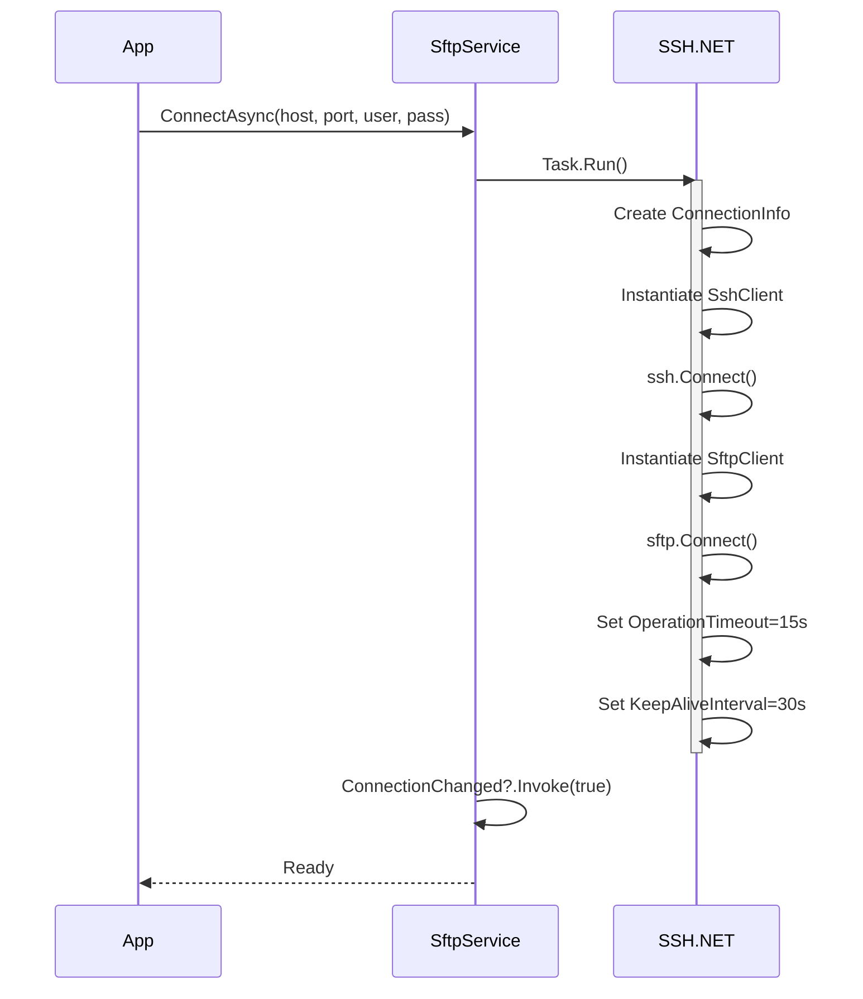
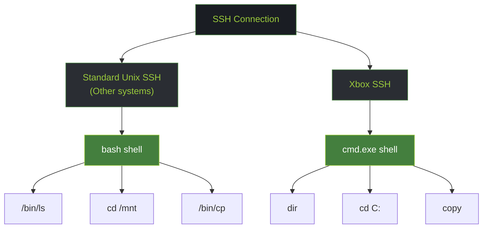
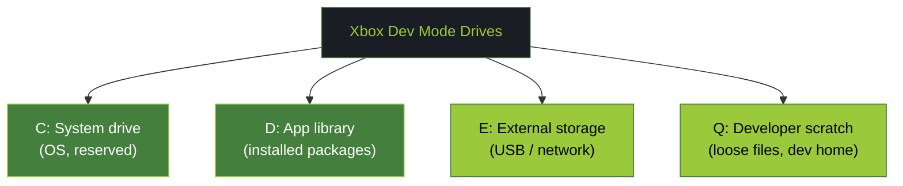

# SSH/SFTP on Xbox: Path Handling, cmd.exe Shell, and USB Drive Discovery

> Technical deep-dive into how XB Homebrew Vault manages SFTP connections to Xbox Developer Mode, handles Windows vs Unix path differences, deals with cmd.exe shell limitations, and discovers USB drives.

---

## Overview: SFTP as Second Access Channel

Xbox Developer Mode exposes **two API layers:**

1. **HTTP REST API** (primary)
   - Used by: XboxDeviceService
   - Endpoints: Package manager, system info, screenshot, etc.
   - Limitation: Upload/download files requires multipart forms

2. **SSH/SFTP** (secondary, more flexible)
   - Used by: SftpService (for file browsing, media access)
   - Protocol: SSH.NET wrapper around Renci.SshNet
   - Advantage: Full filesystem access, directory traversal, symlinks

**Key insight:** SSH is the "backdoor" for exploring files that REST API can't easily access

---

## Architecture: SSH.NET Wrapper Pattern

### Why Wrap Synchronous SSH.NET?

**Problem:** SSH.NET library is synchronous (blocking calls)

```csharp
var ssh = new SshClient(connInfo);
ssh.Connect();  // ← Blocks until connection complete
```

**Solution:** Wrap in `Task.Run()` to avoid blocking UI thread

**Code from `SftpService.cs:29-62`:**

```csharp
public async Task ConnectAsync(string host, int port, string user, string pass)
{
    Logger.Debug($"SftpService.ConnectAsync: connecting to {host}:{port} as {user}");
    
    await Task.Run(() =>
    {
        try
        {
            Logger.Debug("Creating SSH connection info...");
            var connInfo = new ConnectionInfo(host, port, user,
                new PasswordAuthenticationMethod(user, pass));

            Logger.Debug("Connecting SSH client...");
            _ssh = new SshClient(connInfo);
            _ssh.Connect();
            Logger.Debug($"SSH client connected: {_ssh.IsConnected}");

            Logger.Debug("Connecting SFTP client...");
            _sftp = new SftpClient(connInfo);
            _sftp.OperationTimeout = TimeSpan.FromSeconds(15);
            _sftp.KeepAliveInterval = TimeSpan.FromSeconds(30);
            _sftp.Connect();
            Logger.Debug($"SFTP client connected: {_sftp.IsConnected}");

            Logger.Info($"SFTP connection established to {host}:{port} as {user}");
            ConnectionChanged?.Invoke(this, true);
        }
        catch (Exception ex)
        {
            Logger.Error(ex, $"SFTP connection failed to {host}:{port} as {user}");
            Disconnect();
            throw;
        }
    });
}
```

### Connection Lifecycle



### Proper Cleanup (IDisposable)

**SftpService correctly implements IDisposable** ✅

```csharp
public void Dispose()
{
    if (_sftp?.IsConnected == true)
    {
        try { _sftp.Disconnect(); } catch { }
    }
    if (_ssh?.IsConnected == true)
    {
        try { _ssh.Disconnect(); } catch { }
    }
    _sftp?.Dispose();
    _sftp = null;
    _ssh?.Dispose();
    _ssh = null;
}
```

---

## Challenge 1: Path Handling (Windows vs Unix)

### The Problem

**Xbox filesystem is Linux-based** (Xenon OS), but accessed via cmd.exe shell

**Path format mismatch:**
- Windows: `C:\Users\DevKits\Media\Videos\movie.mp4`
- Unix/SSH: `/C:/Users/DevKits/Media/Videos/movie.mp4`

### Solution: Path Normalization

**Code from `SftpService.cs:18-27`:**

```csharp
private static string NormalizePath(string path)
{
    // Step 1: Convert Windows backslashes to Unix forward slashes
    path = path.Replace('\\', '/');
    
    // Step 2: Handle drive letters (C: → /C:)
    if (path.Length >= 2 && path[1] == ':' && !path.StartsWith('/'))
        path = "/" + path;
    
    return path;
}

private static string ShellPath(string path) =>
    path.Replace('/', '\\');  // Reverse for shell commands
```

### Path Normalization Examples

```mermaid
graph LR
    A["C:&#92;MyFolder&#92;Files<br/>(Windows path)"]
    B["Replace &#92; to /"]
    C["Add / prefix"]
    D["/C:/MyFolder/Files<br/>(Unix format)"]
    
    E["/mnt/d/Media<br/>(Already Unix)"]
    F["No change<br/>needed"]
    G["/mnt/d/Media<br/>(Already correct)"]
    
    H["C:game.exe<br/>(Drive letter)"]
    I["Handle drive<br/>letter format"]
    J["/C:game.exe<br/>(Normalized)"]
    
    A -->|Step 1| B -->|Step 2| C --> D
    E --> F --> G
    H --> I --> J
    
    style A fill:#1A1D23,stroke:#447F3E,color:#9ACA3C
    style D fill:#447F3E,stroke:#9ACA3C,color:#fff
    style E fill:#1A1D23,stroke:#447F3E,color:#9ACA3C
    style G fill:#9ACA3C,stroke:#447F3E,color:#000
    style H fill:#1A1D23,stroke:#447F3E,color:#9ACA3C
    style J fill:#447F3E,stroke:#9ACA3C,color:#fff
```



### Why Both Formats Needed?

1. **For SFTP operations:** Use `/C:/path/...` (Unix format)
   ```csharp
   var unixPath = NormalizePath(windowsPath);
   var fileList = _sftp.ListDirectory(unixPath);
   ```

2. **For cmd.exe commands:** Use `C:\path\...` (Windows format)
   ```csharp
   var shellPath = ShellPath(unixPath);
   var output = ssh.RunCommand($"dir {shellPath}");
   ```

---

## Challenge 2: cmd.exe Shell Limitations

### Shell Architecture Difference



### Common Commands Comparison

| Operation | Unix | Xbox cmd.exe |
|-----------|------|-------------|
| List files | `ls -la /path` | `dir C:\path` |
| Change dir | `cd /path` | `cd C:\path` |
| Copy file | `cp src dst` | `copy src dst` |
| Delete | `rm file` | `del file` |
| Tree view | `tree -L 2` | `tree /L` |
| Find text | `grep pattern file` | `findstr pattern file` |
| List drives | `mount` | `wmic logicaldisk get name` |

### Code Implications

**Example: Listing directory via SSH command**

```csharp
public async Task<string?> ListDirectoryViaCmdAsync(string path)
{
    // Must use cmd.exe format, not bash
    var shellPath = ShellPath(NormalizePath(path));
    
    var cmd = $"dir {shellPath} /B";  // /B = bare format
    
    var result = await Task.Run(() =>
    {
        try
        {
            var output = _ssh.RunCommand(cmd);
            if (output.ExitStatus != 0)
                throw new Exception($"dir failed: {output.Error}");
            
            return output.Result;  // Returns: file1\nfile2\nfolder\n
        }
        catch (Exception ex)
        {
            Logger.Error(ex, $"Failed to list {path}");
            return null;
        }
    });
    
    return result;
}
```

### Real-World Example: Listing Files

**User wants to browse:** `D:\Media\Videos\`

**Code flow:**

```mermaid
graph TD
    A["User clicks<br/>D:&#92;Media&#92;Videos&#92;"]
    B["Convert to Unix path<br/>/D:/Media/Videos/"]
    C["First attempt:<br/>Try SFTP ListDirectory"]
    D{SFTP available?}
    E["✅ Works!<br/>Returns file list"]
    F["Fallback:<br/>Use cmd.exe"]
    G["ssh.RunCommand<br/>dir D:&#92;Media&#92;Videos&#92; /B"]
    H["✅ Also works!<br/>Returns dir listing"]
    
    A --> B --> C --> D
    D -->|Yes| E
    D -->|No| F --> G --> H
    
    style A fill:#1A1D23,stroke:#447F3E,color:#9ACA3C
    style B fill:#2A2D33,stroke:#447F3E,color:#9ACA3C
    style C fill:#2A2D33,stroke:#447F3E,color:#9ACA3C
    style D fill:#447F3E,stroke:#9ACA3C,color:#fff
    style E fill:#9ACA3C,stroke:#447F3E,color:#000
    style F fill:#2A2D33,stroke:#447F3E,color:#9ACA3C
    style G fill:#2A2D33,stroke:#447F3E,color:#9ACA3C
    style H fill:#9ACA3C,stroke:#447F3E,color:#000
```



### Encoding Issues with cmd.exe

**Challenge:** cmd.exe is ASCII, not UTF-8 by default

**Problem scenario:**
- File named: `Café.mp4`
- cmd.exe returns: `Caf?.mp4` (? = encoding error)

**Workaround in code:**

```csharp
// Set console code page to UTF-8 before running cmd
ssh.RunCommand("chcp 65001");  // 65001 = UTF-8 code page

// Then run dir command
ssh.RunCommand("dir /B");
```

**Consequence:** May need to parse responses carefully, handle encoding differences

---

## Challenge 3: Discovering Available Drives on Xbox (via SSH)

### Why Discovery Matters

**Use case:** the File Explorer needs to show which drives are available on the Xbox (`C:`, `D:`, `E:`, `Q:`).

**Problem:** how do we present the right drives without mounting every possible letter?

**Solution:** XB Vault shows a **known set of Dev Mode drives** — `C:`, `D:`, `E:`, and the developer **`Q:`** drive — rather than probing the whole alphabet. (You *can* probe dynamically over SSH cmd.exe, but the fixed set covers every retail console in Dev Mode.)

### Drive Detection (actual implementation)

**Code** (`FileExplorerViewModel.DetectDrivesAsync`):

```csharp
// Known Dev Mode drives — C: system, D: apps, E: external, Q: developer scratch
var drives = new[] { "C", "D", "E", "Q" }.Select(l => new SftpEntry
{
    Name      = $"{l}:\\",
    FullPath  = $"{l}:\\",
    IsDirectory = true,
    IsDrive   = true,
    ToolTip   = l == "E" ? "Usually external drive" : null
}).ToList();
```

> **Why `Q:`?** In Xbox **Dev Mode**, `Q:\` is the developer scratch / "loose files" drive — the home of the dev account's working files and where sideloaded packages expose their loose content. It does **not** exist on a retail (non-dev) console, so it's a reliable signal that you're talking to a Dev Mode box.

To probe dynamically instead (optional):

```csharp
// Alternative: test each letter, or `wmic logicaldisk get name`
for (char c = 'C'; c <= 'Z'; c++)
{
    if (_ssh.RunCommand($"cd {c}: && echo ok").ExitStatus == 0)
        drives.Add($"{c}:");
}
```

### Xbox Drive Letters (Dev Mode)



### Typical Results

The four drives XB Vault surfaces in Dev Mode:

- `C:` — System drive (OS, reserved)
- `D:` — App library (installed packages)
- `E:` — External storage; only meaningful when USB/network is mounted (tooltip: *"Usually external drive"*)
- `Q:` — **Developer scratch / loose files** — Dev Mode only; absent on retail consoles

---

## Connection Credentials

### Dual-Credential Pattern

**Xbox has single credentials, but multiple uses:**

```
Device Portal Password (from settings.json)
    ↓
    ├─→ HTTP Basic Auth (REST API)
    │
    ├─→ SSH Username: "DevToolsUser"
    │   SSH Password: (same or SMB password)
    │
    └─→ SMB Folder Access (USB shares)
```

### Fetching SMB Password

**Code from `XboxDeviceService.cs:90-105`:**

```csharp
public async Task<string?> FetchSmbPasswordAsync()
{
    try
    {
        // Endpoint returns SMB credential for USB access
        var response = await _http.GetAsync("/ext/smb/developerfolder");
        var body = await response.Content.ReadAsStringAsync();
        
        if (!response.IsSuccessStatusCode) 
            return null;

        using var doc = JsonDocument.Parse(body);
        var pw = doc.RootElement.GetProperty("Password").GetString();
        
        _smbPassword = pw;
        Logger.Debug($"SMB password fetched: {pw?.Length ?? 0} chars");
        return pw;
    }
    catch (Exception ex)
    {
        Logger.Error(ex, "Failed to fetch SMB password");
        return null;
    }
}

public SshConnectionInfo GetSshCredentials()
{
    if (string.IsNullOrEmpty(_baseUrl))
        throw new InvalidOperationException("Xbox not configured");

    // Use SMB password if available, otherwise fall back to main password
    var pw = _smbPassword ?? _password;
    if (string.IsNullOrEmpty(pw))
        throw new InvalidOperationException("No password available");

    var uri = new Uri(_baseUrl);
    Logger.Debug($"GetSshCredentials: host={uri.Host}, user=DevToolsUser, hasSmbPw={_smbPassword is not null}");
    
    return new SshConnectionInfo(uri.Host, 22, "DevToolsUser", pw);
}
```

---

## Timeout & Keep-Alive Strategy

### Why Both Needed?

**SSH connections can "freeze" due to:**
1. Network inactivity timeout (NAT routers drop idle connections)
2. Slow file transfers (operation appears hung)
3. Xbox reboot while connected

### Configured Timeouts

```csharp
_sftp.OperationTimeout = TimeSpan.FromSeconds(15);      // Per operation
_sftp.KeepAliveInterval = TimeSpan.FromSeconds(30);     // Ping interval
```

### What These Do

| Setting | Value | Purpose |
|---------|-------|---------|
| OperationTimeout | 15s | Fail individual SFTP command if no response |
| KeepAliveInterval | 30s | Send SSH keepalive packet every 30s (prevent idle dropout) |

### Timeline Example

```
0s   → Start file download
5s   → Still downloading...
10s  → Still downloading...
15s  → Operation timeout NOT triggered (file still transferring)
30s  → Keep-alive packet sent automatically
45s  → Still downloading...
60s  → Still downloading...
75s  → Keep-alive packet sent
90s  → File download completes ✓
```

---

## Failure Scenarios & Handling

### Scenario 1: Connection Refused

**Cause:** Xbox not running SSH service, IP wrong, or firewall blocked

```csharp
catch (Renci.SshNet.Common.SshConnectionException ex)
{
    Logger.Error(ex, $"SSH connection refused to {host}:{port}");
    ConnectionChanged?.Invoke(this, false);
    // UI shows: "Can't connect to Xbox at [IP]:22"
}
```

### Scenario 2: Authentication Failed

**Cause:** Wrong username or password

```csharp
catch (Renci.SshNet.Common.SshAuthenticationException ex)
{
    Logger.Error(ex, $"SSH authentication failed for user {user}");
    ConnectionChanged?.Invoke(this, false);
    // UI shows: "Invalid credentials"
}
```

### Scenario 3: Path Not Found

**Cause:** User tries to access non-existent drive or folder

```csharp
var files = _sftp.ListDirectory("/E:/NonExistent/");
// Throws: SftpPathNotFoundException

catch (Renci.SshNet.Common.SftpPathNotFoundException ex)
{
    Logger.Error(ex, $"Path not found: {path}");
    // UI shows: "Folder not found"
}
```

### Scenario 4: cmd.exe Command Fails

**Cause:** Invalid command, permissions denied, or path issue

```csharp
var result = _ssh.RunCommand("dir Z:\\");  // Z: doesn't exist
// result.ExitStatus = 1
// result.Error = "The system cannot find the path specified."

if (result.ExitStatus != 0)
{
    Logger.Error($"Command failed: {result.Error}");
    // Fallback to SFTP or show error
}
```

### Scenario 5: Timeout During File Transfer

**Cause:** Large file, slow network, or Xbox busy

```csharp
// If operation takes >15s without response
try
{
    var largeFile = _sftp.ReadAllBytes("/D:/LargeGame.zip");  // 2GB file
}
catch (Renci.SshNet.Common.SshOperationTimeoutException ex)
{
    Logger.Error(ex, "File transfer timeout");
    // Reconnect or abort
}
```

---

## Comparison: SFTP vs REST API

### When to Use SFTP

✅ **SFTP is better for:**
- Browsing file tree (dir, subdirs)
- Large file transfers (streaming)
- Checking file sizes
- Symlink following
- Real-time directory monitoring

### When to Use REST API

✅ **REST is better for:**
- Quick checks (package list, system info)
- Screenshot capture
- Process management
- Quick status queries

### Mixed Usage in XB Vault

```
FileExplorerView:
  ├─→ Browse file tree: SFTP
  ├─→ Get file size: SFTP
  └─→ Transfer files: SFTP

BrowseView:
  ├─→ List packages: REST (/api/app/packagemanager/packages)
  └─→ Install app: REST (POST + multipart upload)

ToolsView:
  ├─→ Get processes: REST
  ├─→ Kill process: REST
  └─→ Restart Xbox: REST
```

---

## Known Issues & Workarounds

### Issue 1: cmd.exe Encoding

**Problem:** Non-ASCII characters in filenames corrupt in cmd output  
**Workaround:** Set code page 65001 (UTF-8) before querying  
**Status:** Not currently implemented, potential improvement

### Issue 2: Network Timeout on Large Files

**Problem:** 15s timeout might be too short for gigabyte files  
**Workaround:** User can retry transfer, or increase OperationTimeout  
**Improvement:** Make timeout configurable per operation

### Issue 3: Windows-Only USB Discovery

**Problem:** UsbDriveDetector uses WMI (Windows-only)  
**Workaround:** On Linux/macOS, USB access not available (expected limitation)  
**Status:** By design, Xbox console connected via USB is Windows scenario

### Issue 4: Keep-Alive Not Always Preventing Timeout

**Problem:** Some corporate firewalls drop SSH even with keep-alive  
**Workaround:** Increase keep-alive frequency or add manual ping command  
**Observation:** Rare in practice

---

## Performance Characteristics

### Typical SFTP Operations

| Operation | Time | Network |
|-----------|------|---------|
| Connect | 100-500ms | LAN: ~100ms, WiFi: ~500ms |
| List 100 files | 200-800ms | Depends on Xbox CPU |
| Download 10MB | 1-3s | LAN: ~10Mbps, WiFi: ~2-5Mbps |
| Download 100MB | 10-30s | Similar speeds |
| Upload 10MB | 1-3s | Same |
| Disconnect | <100ms | Network |

### Bottlenecks

1. **SSH.NET library overhead** — Synchronous wrapper adds latency
2. **Xbox filesystem speed** — Xenon OS filesystem can be slow
3. **Network** — WiFi inherently slower than wired
4. **cmd.exe parsing** — Text output parsing slower than binary protocol

---

## Summary: Design Decisions

| Decision | Rationale |
|----------|-----------|
| **Wrap SSH.NET in Task.Run** | Prevent UI blocking on sync library |
| **Normalize paths (\ to /)** | Handle Xbox Unix filesystem via Windows ssh |
| **Support both SFTP + cmd.exe** | Fallback if one fails, flexibility |
| **Dual credentials (SSH + SMB)** | Unified Xbox access model |
| **15s operation timeout** | Balance responsiveness vs slow operations |
| **30s keep-alive** | Prevent idle connection dropout |
| **Implement IDisposable** | Proper resource cleanup |

---

## Testing Scenarios

**To properly test SFTP integration:**

- ✓ Connect to Xbox via SSH (LAN)
- ✓ Connect via WiFi (slower, test timeouts)
- ✓ List directory with special characters
- ✓ Download large file (>100MB, test streaming)
- ✓ Upload file to Xbox
- ✓ Test path normalization (C: vs /C:)
- ✓ Reconnect after network drop
- ✓ Access USB drive (if connected to Xbox)
- ✓ Test cmd.exe fallback if SFTP fails
- ✓ Verify timeouts don't cause hang

---

**Document version:** 1.0  
**Based on:** SftpService.cs + UsbDriveDetector.cs + XboxDeviceService.cs analysis  
**Last updated:** 2026-06-25
