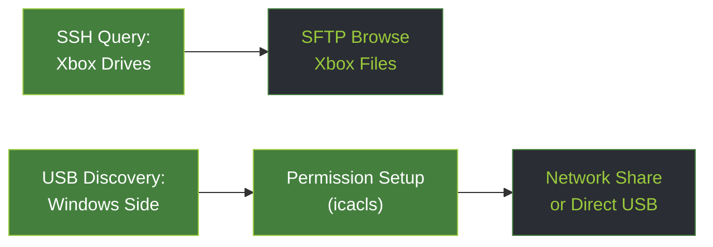
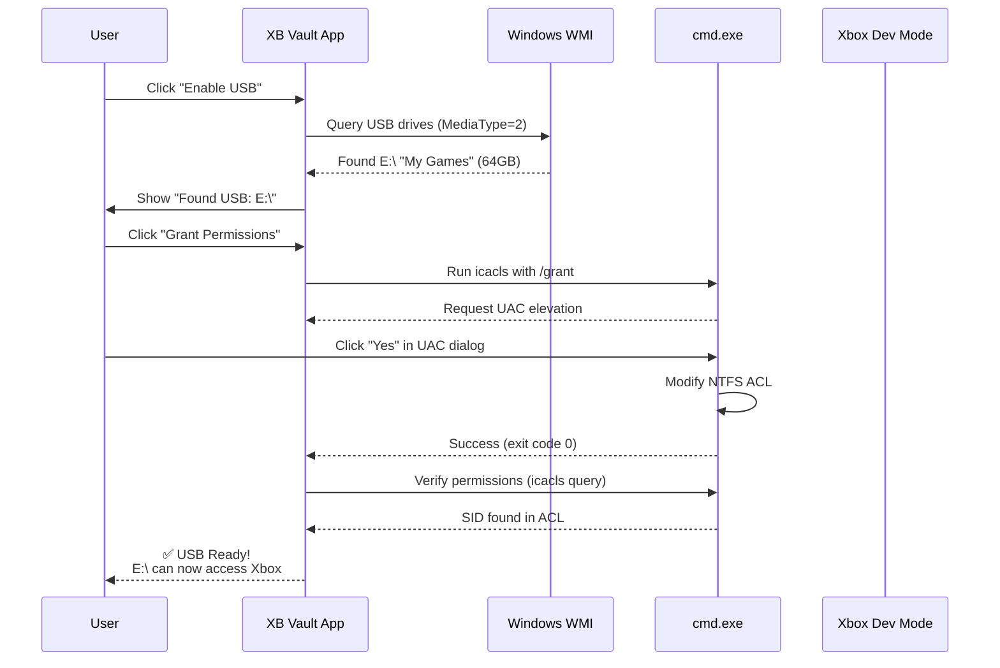

# USB Device Discovery & Permission Setup (Windows)

> Technical guide to discovering USB drives on Windows PC and configuring Xbox permissions for media access.

---

## Overview: USB Discovery vs SSH Drive Query

**Important distinction:**

| Aspect | SSH Drive Query | USB Device Discovery |
|--------|---|---|
| **Where** | On Xbox (via SSH) | On Windows PC |
| **What** | Lists available Xbox drives (C:, D:, E:, F:, etc.) | Finds USB sticks plugged into PC |
| **Purpose** | File Explorer navigation | Prepare USB for Xbox to access |
| **Related doc** | integration-ssh-sftp-challenges.md | This document |

**Workflows:**



---

## Phase 1: Detecting USB Drives (Windows PC)

### Why Detection Matters

**Challenge:** How to identify which drive is the USB among multiple drives on PC?

**Solution:** Use Windows WMI (Win32_LogicalDisk) to query USB drives before connecting to Xbox

### Detection Method: WMI Query

**Code from `UsbDriveDetector.cs`:**

```csharp
#if WINDOWS
    using System.Management;
    
    public class UsbDriveDetector
    {
        public static List<UsbDriveInfo> FindUsbDrives()
        {
            var searcher = new ManagementObjectSearcher(
                "SELECT * FROM Win32_LogicalDisk WHERE MediaType=2");
            
            var drives = new List<UsbDriveInfo>();
            foreach (ManagementObject drive in searcher.Get())
            {
                var letter = drive["Name"]?.ToString();      // "E:"
                var label = drive["VolumeName"]?.ToString(); // "My Games"
                var size = drive["Size"]?.ToString();        // Bytes
                
                drives.Add(new UsbDriveInfo 
                { 
                    Letter = letter,
                    Label = label,
                    SizeBytes = long.Parse(size ?? "0")
                });
            }
            return drives;
        }
    }
#endif
```

### Why MediaType=2?

**WMI MediaType codes:**


### Platform Limitations

**Windows-only:** System.Management doesn't exist on Linux/macOS

```csharp
#if WINDOWS
    // WMI code (Windows only)
#else
    // Fallback: Return empty list or show error
    return new List<UsbDriveInfo>();  // or throw NotSupportedException
#endif
```

**Consequence:** USB detection only works on Windows. Other platforms must use manual fallback (user selects folder).

---

## Phase 2: Detecting USB via File System (Fallback)

### When to Use Fallback

**Scenarios:**
- User on Linux/macOS (no WMI)
- WMI query fails (permissions issue, unusual system)
- User has multiple USB sticks, wants manual selection

### Simple Fallback: "Browse for Folder"

```csharp
// Prompt user to select USB root folder
var dialog = new FolderPickerDialog();
dialog.Title = "Select USB Drive Root";
var result = await dialog.ShowAsync(mainWindow);

if (result != null)
{
    var usbPath = result[0];  // e.g., "E:\" on Windows, "/mnt/usb" on Linux
    return new List<UsbDriveInfo>
    {
        new UsbDriveInfo { Letter = usbPath, Label = "User-selected" }
    };
}
```

### Heuristic Detection (Linux/macOS)

**On Linux:**
```bash
lsblk -d -p -n -l | grep -v '^/dev/.*\(loop\|dm\)' | awk '{print $1}'
# Returns: /dev/sda, /dev/sdb, etc.
```

**On macOS:**
```bash
diskutil list external | grep "^/dev"
# Returns: /dev/disk1, /dev/disk2, etc.
```

**Code example:**
```csharp
#if LINUX
    var proc = Process.Start("lsblk", "-d -p -n -l");
    var output = proc.StandardOutput.ReadToEnd();
    var devices = output.Split("\n").Where(x => !x.Contains("loop")).ToList();
#endif
```

---

## Phase 3: Permission Setup (icacls)

### The Permission Challenge

**Problem:** Xbox apps run in sandboxed context (AppContainer) with restricted access

**Consequence:** Default NTFS permissions block Xbox from reading USB

**Solution:** Grant "ALL APPLICATION PACKAGES" explicit permissions

### Permission Grant Code

**From `UsbPermissionViewModel.cs`:**

```csharp
public async Task<bool> GrantUsbPermissionsAsync(string driveLetter)
{
    try
    {
        // Elevate to admin (required for icacls)
        var process = new Process
        {
            StartInfo = new ProcessStartInfo
            {
                FileName = "cmd.exe",
                Arguments = $"/c icacls \"{driveLetter}\" /grant \"*S-1-15-2-1:(OI)(CI)F\" /T /C",
                UseShellExecute = true,
                Verb = "runas",  // ← Request UAC elevation
                CreateNoWindow = true,
                RedirectStandardOutput = false
            }
        };
        
        process.Start();
        process.WaitForExit();
        
        if (process.ExitCode == 0)
        {
            Logger.Info($"USB permissions granted for {driveLetter}");
            return true;
        }
        else
        {
            Logger.Error($"icacls failed with exit code {process.ExitCode}");
            return false;
        }
    }
    catch (Exception ex)
    {
        Logger.Error(ex, "Failed to grant USB permissions");
        return false;
    }
}
```

### icacls Parameters Explained

```mermaid
graph TD
    CMD["icacls {drive} /grant<br/>*S-1-15-2-1:(OI)(CI)F<br/>/T /C"]
    
    PARAM1["icacls<br/>NTFS Permission Tool"]
    PARAM2["{drive}<br/>Target Drive<br/>e.g., 'E:&#92;' or '/dev/sda'"]
    PARAM3["/grant<br/>Grant (add)<br/>permission"]
    PARAM4["*S-1-15-2-1<br/>ALL APPLICATION<br/>PACKAGES SID"]
    PARAM5["(OI)(CI)F<br/>Object Inherit,<br/>Container Inherit,<br/>Full Access"]
    PARAM6["/T<br/>Traverse Tree<br/>(recursive)"]
    PARAM7["/C<br/>Continue on Error"]
    
    CMD --> PARAM1
    CMD --> PARAM2
    CMD --> PARAM3
    CMD --> PARAM4
    CMD --> PARAM5
    CMD --> PARAM6
    CMD --> PARAM7
    
    style CMD fill:#1A1D23,stroke:#447F3E,color:#9ACA3C
    style PARAM1 fill:#447F3E,stroke:#9ACA3C,color:#fff
    style PARAM2 fill:#2A2D33,stroke:#447F3E,color:#9ACA3C
    style PARAM3 fill:#447F3E,stroke:#9ACA3C,color:#fff
    style PARAM4 fill:#9ACA3C,stroke:#447F3E,color:#000
    style PARAM5 fill:#2A2D33,stroke:#447F3E,color:#9ACA3C
    style PARAM6 fill:#2A2D33,stroke:#447F3E,color:#9ACA3C
    style PARAM7 fill:#2A2D33,stroke:#447F3E,color:#9ACA3C
```



### SID: *S-1-15-2-1 Explained

**What is this SID?**
- `S-1-15-2-1` = "ALL APPLICATION PACKAGES" (Xbox app container group on Windows)
- The `*` prefix means "convert string SID to binary" (required syntax)

**Why this SID?**
- Xbox apps run in AppContainer sandbox (UWP/XAML)
- Default NTFS ACLs don't include AppContainer permissions
- Explicitly granting to this SID allows Xbox apps read/write access

**Permissions breakdown:**

```
(OI) = Object Inherit      → Files inherit permission
(CI) = Container Inherit   → Subdirectories inherit
F    = Full Access         → All rights (read, write, execute, delete)
```

### UAC Elevation Required

**Quirk:** `icacls` requires admin privileges

**Why?** Modifying NTFS ACLs is a privileged operation

**How it works:**
```csharp
Verb = "runas"  // Triggers Windows UAC elevation dialog
```

**User experience:**
1. User clicks "Grant Permissions"
2. Windows UAC dialog appears: "XB Vault wants to make changes"
3. User clicks "Yes"
4. `cmd.exe` runs with elevated token
5. `icacls` modifies ACL on USB drive
6. Permissions granted, Xbox can now access USB

---

## Phase 4: Verifying Permission Success

### Check Permissions

**After granting, verify with:**

```csharp
public async Task<bool> VerifyUsbPermissionsAsync(string driveLetter)
{
    try
    {
        var process = new Process
        {
            StartInfo = new ProcessStartInfo
            {
                FileName = "cmd.exe",
                Arguments = $"/c icacls \"{driveLetter}\"",
                UseShellExecute = false,
                RedirectStandardOutput = true,
                CreateNoWindow = true
            }
        };
        
        process.Start();
        var output = process.StandardOutput.ReadToEnd();
        process.WaitForExit();
        
        // Check if S-1-15-2-1 appears in ACL
        if (output.Contains("S-1-15-2-1"))
        {
            Logger.Info($"USB permissions verified for {driveLetter}");
            return true;
        }
        
        Logger.Warn($"Permission grant may have failed; SID not in ACL");
        return false;
    }
    catch (Exception ex)
    {
        Logger.Error(ex, "Failed to verify permissions");
        return false;
    }
}
```

### Expected Output

**Before granting:**
```
E:\
Everyone:(OI)(CI)F
BUILTIN\Administrators:(OI)(CI)F
```

**After granting:**
```
E:\
Everyone:(OI)(CI)F
BUILTIN\Administrators:(OI)(CI)F
*S-1-15-2-1:(OI)(CI)F
```

---

## Real-World Flow: USB Setup Wizard



---

## Error Handling & Edge Cases

### Case 1: User Denies UAC

**What happens:**
```
UAC dialog appears
User clicks "No"
Process exits with code 1
App detects failure, shows "Permission denied" message
```

**Code handling:**
```csharp
if (process.ExitCode != 0)
{
    Logger.Warn("User denied UAC elevation");
    // Show error: "Admin privileges required to modify USB permissions"
    return false;
}
```

### Case 2: USB is FAT32 (No NTFS ACLs)

**Problem:** FAT32 doesn't support NTFS ACLs

**Symptom:** `icacls` returns error code 5 (access denied)

**Solution:** Inform user USB must be NTFS formatted

```csharp
// Detect filesystem type
var drive = new DriveInfo("E:");
if (drive.DriveFormat != "NTFS")
{
    Logger.Error("USB is not NTFS formatted");
    throw new InvalidOperationException(
        "USB must be formatted as NTFS, not " + drive.DriveFormat);
}
```

### Case 3: Permission Already Granted

**What happens:**
- User runs "Grant Permissions" twice
- `icacls /grant` adds duplicate SID entries (ACL has S-1-15-2-1 twice)
- Not a problem, but redundant

**Optional cleanup:**
```csharp
// Remove before granting
await RunCommandAsync($"icacls \"{driveLetter}\" /remove \"*S-1-15-2-1\" /T /C");
// Then grant fresh
await GrantUsbPermissionsAsync(driveLetter);
```

### Case 4: Antivirus Blocks icacls

**Problem:** Some antivirus software may block permission modification

**Symptom:** `icacls` hangs or fails silently

**Mitigation:** Whitelist `cmd.exe` or allow `icacls` in antivirus settings

---

## Related Concepts

### USB vs Network Share

**USB Direct Access:**
- Pros: Plug & play, fast, no network overhead
- Cons: USB cable required, single connection

**Network Share (SMB):**
- Pros: Wireless, multiple connections, central storage
- Cons: Slower, requires network setup

**XB Vault supports both:** USB for direct access, SMB for network streaming

### Comparison with Linux/macOS

| Platform | Detection | Permission | Notes |
|----------|---|---|---|
| Windows | WMI (easy) | icacls (easy) | UAC elevation required |
| Linux | lsblk (CLI) | chmod (easy) | No sandbox restrictions |
| macOS | diskutil (CLI) | chmod (easy) | APFS/HFS+ different from NTFS |

---

## See Also

- **integration-ssh-sftp-challenges.md** — SSH drive discovery (ON Xbox, not PC)
- **docs/tech-debt.md** — Known issues with USB detection (#14)
