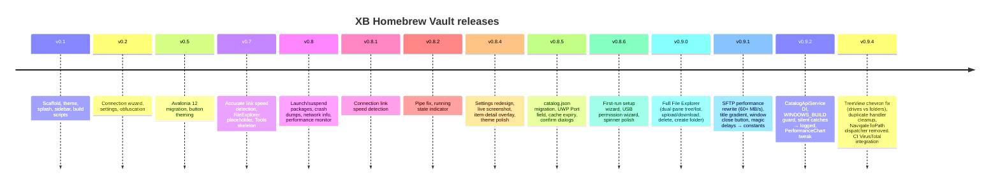
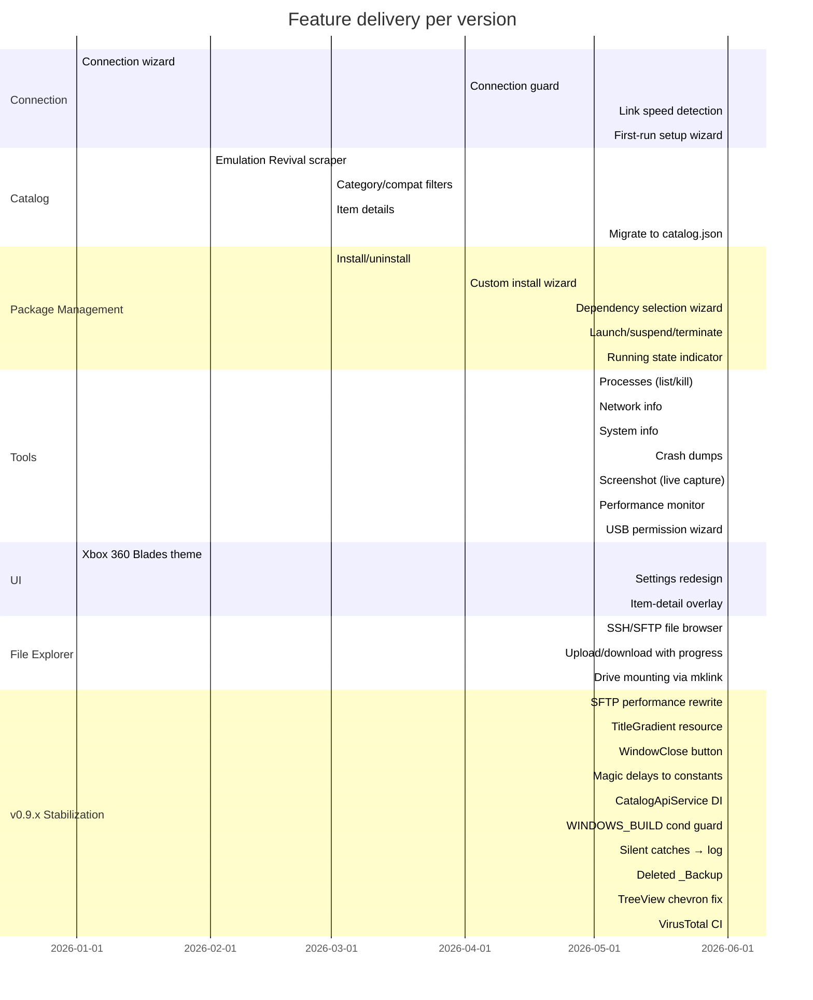
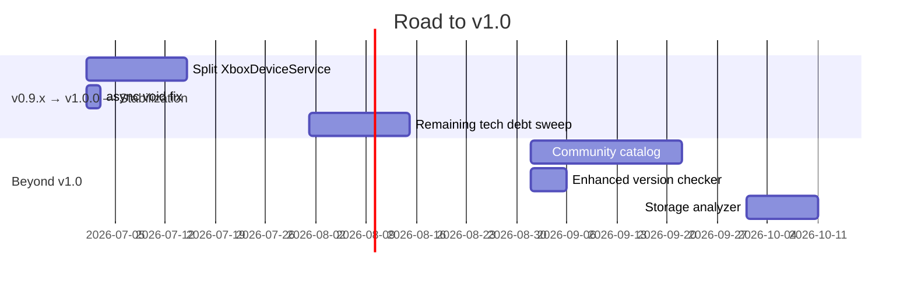

# Roadmap

## Current Status

**Latest release: v0.9.4** · [Download](https://github.com/marcelofrau/xb-homebrew-vault/releases/latest)

The app is feature-complete for daily Xbox Dev Mode homebrew management. Core flows — first-run setup, browse, install, uninstall, dev tools, USB permissions — are all shipping and stable. **v0.9.0 shipped a full File Explorer** with dual-pane tree + list view, upload/download with progress bars, delete, and create folder. **v0.9.1–v0.9.4** focused on SFTP performance (60+ MB/s), tech debt reduction, cross-platform hardening, TreeView layout fixes, and CI VirusTotal integration.

---

## Version History

## What's Shipped

| Phase | Version | Highlights |
|-------|---------|-----------|
| Scaffold | v0.1 | Project structure, Blades theme, splash screen, sidebar navigation, build scripts |
| Connection | v0.2 | Xbox connection wizard, settings persistence, credential obfuscation |
| UI Migration | v0.5 | Avalonia 12 migration, button theming, visual polish |
| Tools skeleton | v0.7 | Link speed detection, File Explorer placeholder, Tools panel skeleton |
| Full tools | v0.8 | Launch/suspend packages, crash dump viewer, network info, performance monitor |
| Bugfixes | v0.8.1–v0.8.2 | Connection link speed, pipe fix, running state indicator |
| Polish | v0.8.4 | Settings redesign, live screenshot capture, item-detail overlay, theme tweaks |
| Catalog API | v0.8.5 | Migrated from HTML scraping to `catalog.json`, UWP Port field, cache expiry, confirm dialogs, dependency selection in wizard |
| Setup & USB | v0.8.6 | First-run setup wizard (3-step), USB permission wizard with WMI detection + icacls, spinner + min-delay polish |
| File Explorer | v0.8.7 | Functional SSH/SFTP file browser — browse, upload/download with progress, drive mounting via `mklink` |
| File Explorer (full) | v0.9.0 | Dual-pane tree + list, folder upload, delete confirm, progress bars, toolbar status, file-type icons |
| SFTP Performance | v0.9.1 | Rewrite: 32 KB loop → native UploadFile/DownloadFile, dynamic buffer (64/256/512 KB), 60+ MB/s |
| Quick wins | v0.9.1 | TitleGradient resource, unified WindowClose button, magic delays → named constants, deleted _Backup |
| Stabilization | v0.9.2 | CatalogApiService constructor injection, WINDOWS_BUILD conditional compile, silent catches → logged, PerformanceChart MaxPoints 30 |
| TreeView & cleanup | v0.9.4 | TreeView chevron offset fix (drives vs folders), duplicate pointer handler consolidation, NavigateToPath dispatcher bottleneck removed, CI VirusTotal integration |

### Feature Delivery Timeline

### Feature Breakdown

| Area | Feature | Status |
|------|---------|--------|
| Connection | Xbox Device Portal connect | ✅ |
| Connection | Saved credentials (obfuscated) | ✅ |
| Connection | Link speed detection | ✅ |
| Connection | First-run setup wizard (3-step) | ✅ v0.8.6 |
| Catalog | Emulation Revival `catalog.json` API | ✅ v0.8.5 |
| Catalog | Category / compatibility filters | ✅ |
| Catalog | Item detail overlay | ✅ v0.8.4 |
| Packages | Install (with dependency resolution) | ✅ |
| Packages | Dependency selection in wizard | ✅ v0.8.5 |
| Packages | Uninstall | ✅ |
| Packages | Custom install wizard (file + URL) | ✅ |
| Packages | Launch / suspend / terminate | ✅ |
| Tools | Process list + kill | ✅ |
| Tools | Network info | ✅ |
| Tools | System info | ✅ |
| Tools | Crash dump viewer | ✅ |
| Tools | Screenshot (live capture) | ✅ v0.8.4 |
| Tools | Real-time performance chart | ✅ |
| Tools | USB permission wizard (WMI + icacls) | ✅ v0.8.6 |
| UI | Xbox 360 Blades dark theme | ✅ |
| UI | Settings redesign | ✅ v0.8.4 |
| UI | Activity log viewer | ✅ |
| File Explorer | SSH/SFTP file browser | ✅ v0.8.7/v0.9.0 |
| File Explorer | Upload / download with progress | ✅ v0.8.7/v0.9.0 |
| File Explorer | Drive mounting via `mklink` | ✅ v0.8.7 |
| File Explorer | Delete / create folder | ✅ v0.9.0 |
| File Explorer | Dual-pane tree + list | ✅ v0.9.0 |
| File Explorer | File-type icons | ✅ v0.9.0 |
| File Explorer | Toolbar status block | ✅ v0.9.0 |
| CI | Windows + Ubuntu + macOS build matrix | ✅ |
| CI | Linux release artifact | ✅ |
| CI | macOS release artifact | ✅ v0.8.6 |
| Stability | TitleGradient resource | ✅ v0.9.1 |
| Stability | WindowClose button unified | ✅ v0.9.1 |
| Stability | Magic delays → named constants | ✅ v0.9.1 |
| Stability | Deleted _Backup directory | ✅ v0.9.1 |
| Stability | SFTP performance (60+ MB/s) | ✅ v0.9.1 |
| Stability | CatalogApiService DI | ✅ v0.9.2 |
| Stability | WINDOWS_BUILD conditional guard | ✅ v0.9.2 |
| Stability | Silent catches → logged | ✅ v0.9.2 |
| Stability | TreeView chevron offset fix | ✅ v0.9.4 |
| Stability | Duplicate pointer handler cleanup | ✅ v0.9.4 |
| Stability | CI VirusTotal integration | ✅ v0.9.4 |

---

## What's Next

### Planned Timeline

### v0.9.x → v1.0.0 — Stabilization

The remaining road to **v1.0.0** is dedicated to **bugfixing, refactoring, and tech debt reduction** — no major new features, just hardening toward a stable 1.0.

| Item | Status | Description |
|------|--------|-------------|
| **Split XboxDeviceService** | 🔴 Remaining | Break the 1200-line god class into `XboxPackageService`, `XboxProcessService`, `XboxSystemService`, `XboxNetworkService`, `XboxPerformanceService` |
| **Remove `async void`** | 🟡 Remaining | Fix fire-and-forget event handlers that can crash the process on unhandled exceptions |
| **Remaining tech debt** | 🟡 5 items | TD #3 (composition root), #7 (IDisposable), #8 (Border corner clip), #13 (CTS dispose), #16 (BrowseViewModel size) |
| TitleGradient resource | ✅ v0.9.1 | Extracted duplicated gradient into shared resource |
| WindowClose button | ✅ v0.9.1 | Unified across all windows |
| Magic delays → constants | ✅ v0.9.1 | Named constants for all magic delay values |
| SFTP performance | ✅ v0.9.1 | 32 KB loop → native UploadFile/DownloadFile, 60+ MB/s |
| CatalogApiService DI | ✅ v0.9.2 | Constructor injection instead of self-instantiation |
| WINDOWS_BUILD guard | ✅ v0.9.2 | Conditional compilation for System.Management |
| Silent catches → log | ✅ v0.9.2 | All `catch { }` now log diagnostics |
| Deleted _Backup | ✅ v0.9.1 | Removed stale backup directory |
| TreeView chevron offset | ✅ v0.9.4 | Fixed drive vs folder chevron alignment, eliminated expansion shake |
| Duplicate handler cleanup | ✅ v0.9.4 | Consolidated tunnel/bubble double-click handlers in File Explorer |
| NavigateToPath dispatcher | ✅ v0.9.4 | Removed unnecessary Dispatcher.UIThread.Post bottleneck |
| VirusTotal CI integration | ✅ v0.9.4 | Automatic artifact scanning on release |

### v1.0.0 — First Stable Release

Marks the completion of the stabilization pass: feature-complete, refactored, and tech-debt-reduced.

### Beyond v1.0 (v1.x+) — Ecosystem & Features

| Feature | Notes |
|---------|-------|
| Community catalog | Curated homebrew repo, click-to-install beyond Emulation Revival |
| Enhanced version checker | Compare installed vs catalog version, 1-click update all |
| Scheduled tasks | Recurring restart/shutdown/catalog refresh/backup |
| Storage analyzer | Pie chart per-app storage, temp/cache cleanup |
| System health checks | Ping latency, storage, memory overview dashboard |
| Enhanced log viewer | Real-time Xbox logs, filter, search, export to file |
| Game clip manager | Browse and download Xbox screenshots and game captures |
| Media player streaming | Play Xbox media on PC over network |
| Xbox Remote Play | Stream Xbox screen to PC |

---

## Contributing

Issues and PRs welcome on [GitHub](https://github.com/marcelofrau/xb-homebrew-vault). See [Tech Debt](tech-debt) for known issues prioritized by severity.

---

[← API Reference](api) · [Tech Debt →](tech-debt)
