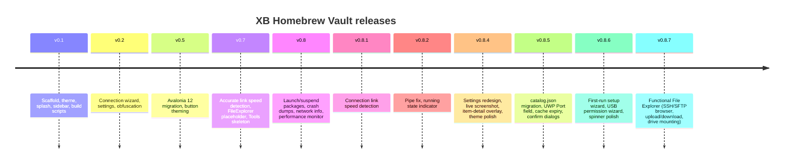
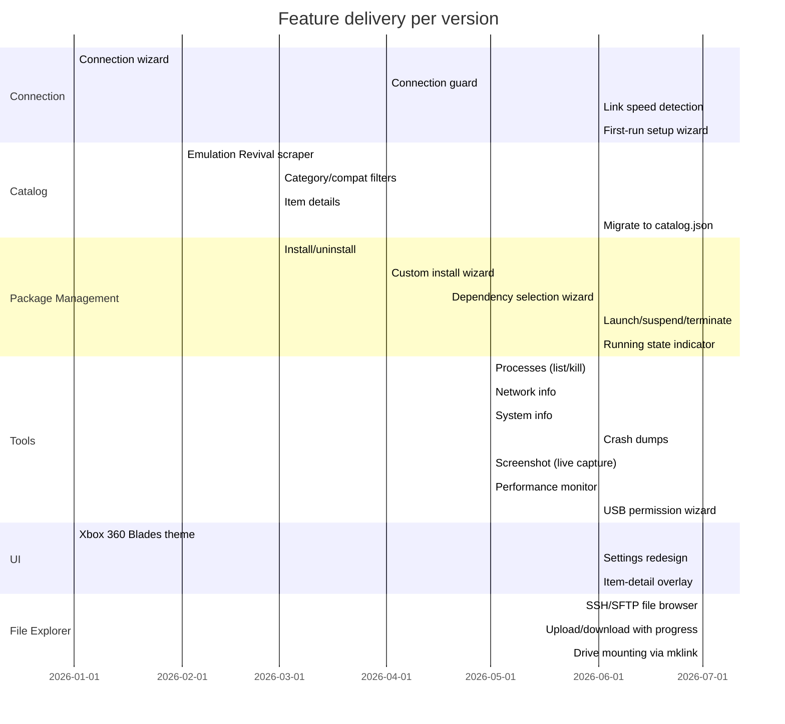
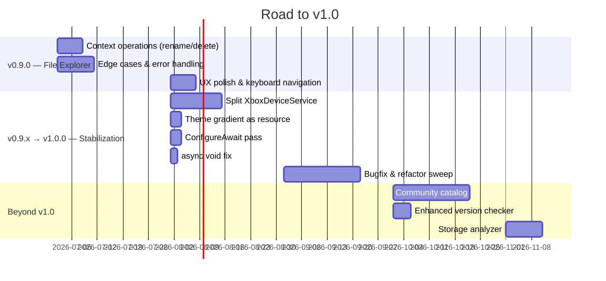

# Roadmap

## Current Status

**Latest release: v0.8.6** · [Download](https://github.com/marcelofrau/xb-homebrew-vault/releases/latest) · **v0.8.7 shipping soon**

The app is feature-complete for daily Xbox Dev Mode homebrew management. Core flows — first-run setup, browse, install, uninstall, dev tools, USB permissions — are all shipping and stable. **v0.8.7 (shipping soon) brings a functional File Explorer** (SSH/SFTP browser), replacing the former placeholder tab.

---

## Version History

## What's Shipped

| Phase | Version | Highlights |
|-------|---------|-----------|
| Scaffold | v0.1 | Project structure, Blades theme, splash screen, sidebar navigation, build scripts |
| Connection | v0.2 | Xbox connection wizard, settings persistence, credential obfuscation |
| UI Migration | v0.5 | Avalonia 12 migration, button theming, visual polish |
| Tools skeleton | v0.7 | Link speed detection, File Explorer placeholder, Tools panel skeleton |
| Full tools | v0.8 | Launch/suspend packages, crash dump viewer, network info, performance monitor |
| Bugfixes | v0.8.1–v0.8.2 | Connection link speed, pipe fix, running state indicator |
| Polish | v0.8.4 | Settings redesign, live screenshot capture, item-detail overlay, theme tweaks |
| Catalog API | v0.8.5 | Migrated from HTML scraping to `catalog.json`, UWP Port field, cache expiry, confirm dialogs, dependency selection in wizard |
| Setup & USB | v0.8.6 | First-run setup wizard (3-step), USB permission wizard with WMI detection + icacls, spinner + min-delay polish |
| File Explorer | v0.8.7 | Functional SSH/SFTP file browser — browse, upload/download with progress, drive mounting via `mklink` |

### Feature Delivery Timeline

### Feature Breakdown

| Area | Feature | Status |
|------|---------|--------|
| Connection | Xbox Device Portal connect | ✅ |
| Connection | Saved credentials (obfuscated) | ✅ |
| Connection | Link speed detection | ✅ |
| Connection | First-run setup wizard (3-step) | ✅ v0.8.6 |
| Catalog | Emulation Revival `catalog.json` API | ✅ v0.8.5 |
| Catalog | Category / compatibility filters | ✅ |
| Catalog | Item detail overlay | ✅ v0.8.4 |
| Packages | Install (with dependency resolution) | ✅ |
| Packages | Dependency selection in wizard | ✅ v0.8.5 |
| Packages | Uninstall | ✅ |
| Packages | Custom install wizard (file + URL) | ✅ |
| Packages | Launch / suspend / terminate | ✅ |
| Tools | Process list + kill | ✅ |
| Tools | Network info | ✅ |
| Tools | System info | ✅ |
| Tools | Crash dump viewer | ✅ |
| Tools | Screenshot (live capture) | ✅ v0.8.4 |
| Tools | Real-time performance chart | ✅ |
| Tools | USB permission wizard (WMI + icacls) | ✅ v0.8.6 |
| UI | Xbox 360 Blades dark theme | ✅ |
| UI | Settings redesign | ✅ v0.8.4 |
| UI | Activity log viewer | ✅ |
| File Explorer | SSH/SFTP file browser | ✅ v0.8.7 |
| File Explorer | Upload / download with progress | ✅ v0.8.7 |
| File Explorer | Drive mounting via `mklink` | ✅ v0.8.7 |
| CI | Windows + Ubuntu + macOS build matrix | ✅ |
| CI | Linux release artifact | ✅ |
| CI | macOS release artifact | ✅ v0.8.6 |

---

## What's Next

### Planned Timeline

### v0.9.0 — File Explorer Consolidation

The functional File Explorer ships in **v0.8.7** (SSH/SFTP browse, upload/download, drive mounting via SSH.NET on port 22 — same credentials as WDP, no companion app). **v0.9.0** is the milestone that marks it complete and polished.

| Item | Description |
|------|-------------|
| Context operations | Rename, delete, new folder from the context menu |
| Error handling | Graceful handling of permission errors, disconnects, large directories |
| UX polish | Keyboard navigation, breadcrumb path bar, drag-and-drop refinements |
| Performance | Lazy-load + virtualization for directories with many entries |

### v0.9.x → v1.0.0 — Stabilization

The road from v0.9.0 to **v1.0.0** is dedicated to **bugfixing, refactoring, and tech debt reduction** — no major new features, just hardening toward a stable 1.0.

| Item | Description |
|------|-------------|
| **Split XboxDeviceService** | Break the 1038-line god class into `XboxPackageService`, `XboxProcessService`, `XboxSystemService`, `XboxNetworkService`, `XboxPerformanceService` |
| **Theme resources** | Extract duplicated title bar gradient + close button into shared `StaticResource` / UserControl (currently copy-pasted in 14+ windows) |
| **`ConfigureAwait(false)` audit** | Add to all service-layer `await` calls |
| **Remove `async void`** | Fix fire-and-forget event handlers that can crash the process on unhandled exceptions |
| **Bugfix & refactor sweep** | Address open issues, reduce duplication, tighten error handling across the app |

### v1.0.0 — First Stable Release

Marks the completion of the stabilization pass: feature-complete, refactored, and tech-debt-reduced.

### Beyond v1.0 (v1.x+) — Ecosystem & Features

| Feature | Notes |
|---------|-------|
| Community catalog | Curated homebrew repo, click-to-install beyond Emulation Revival |
| Enhanced version checker | Compare installed vs catalog version, 1-click update all |
| Scheduled tasks | Recurring restart/shutdown/catalog refresh/backup |
| Storage analyzer | Pie chart per-app storage, temp/cache cleanup |
| System health checks | Ping latency, storage, memory overview dashboard |
| Enhanced log viewer | Real-time Xbox logs, filter, search, export to file |
| Game clip manager | Browse and download Xbox screenshots and game captures |
| Media player streaming | Play Xbox media on PC over network |
| Xbox Remote Play | Stream Xbox screen to PC |

---

## Contributing

Issues and PRs welcome on [GitHub](https://github.com/marcelofrau/xb-homebrew-vault). See [Tech Debt](tech-debt) for known issues prioritized by severity.

---

[← API Reference](api) · [Tech Debt →](tech-debt)
