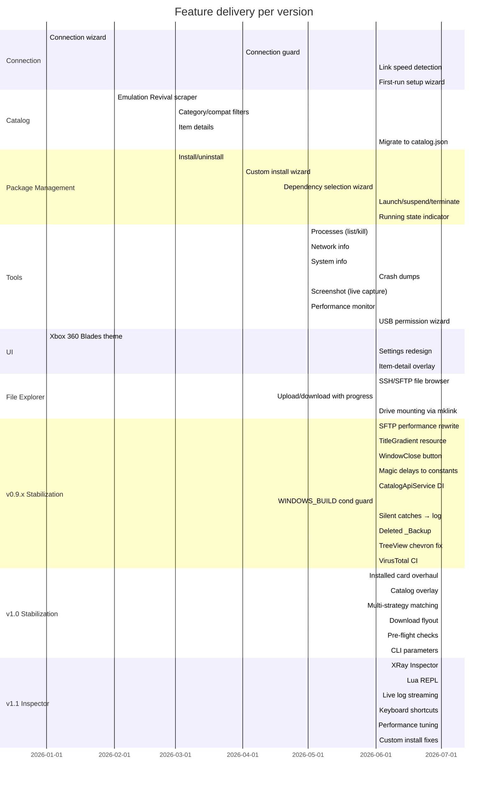
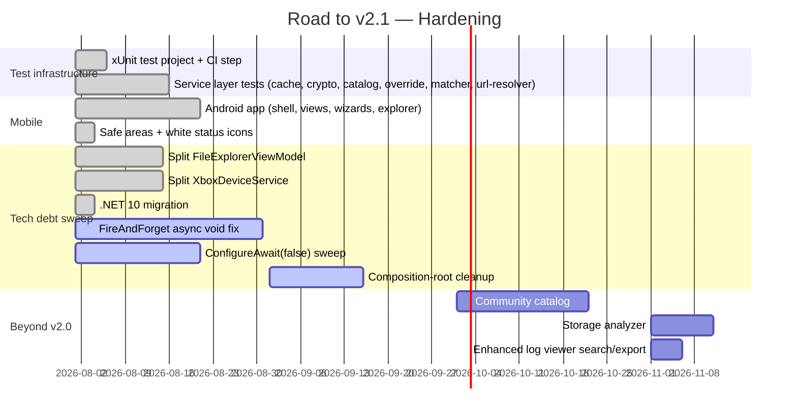

# Roadmap

## Current Status

**Current source version: v2.0.4** · [Download latest release](https://github.com/marcelofrau/xb-homebrew-vault/releases/latest)

The app is feature-complete for daily Xbox Dev Mode homebrew management — on **desktop (Windows/macOS/Linux)** and **Android** (shipped in **v2.0.0**). Core flows — first-run setup, browse, install, uninstall, sideload, dev tools, file explorer, USB permissions, Inspector — are all shipping and stable. Highlights since v1.4:

- **v1.4.0** — .NET 10 migration, background tasks + notification center, app-update scan with per-app ignore, autostart-on-connect, screen-level settings (save/discard/reset).
- **v2.0.0** — **Android mobile app**: full portrait port (~27 `Mobile*` views), tabs shell (Browse/Installed/Tools/Settings), sideload wizard, QR connect share, GoFile share, safe-area handling, `IAppLogger`/SerilogAdapter, exception-safe event handlers, 3-project structure.
- **v2.0.1** — white status-bar icons + safe-area on Android 15+, URL resolver (GoFile / Google Drive / OneDrive), version-gated `versionOverrides`.
- **v2.0.2** — resource-in-use install retries, streaming uploads (OOM fix for 200+ MB packages), screenshot retries.
- **v2.0.3** — matcher overhaul (10+ strategies, false-positive guards), WDP upload format fix, Save Log button.
- **v2.0.4** — abort button, adaptive Browse badges, no auto-uninstall on update, matcher false-positive fixes, **390/390 tests**.

**Next: hardening + the tail of the tech-debt backlog** — the remaining `async void` handlers, the `ConfigureAwait(false)` service-layer policy, composition-root cleanup (`App.axaml.cs` is past 1,900 lines), and the platform-adapter abstractions — see [Tech Debt](tech-debt) and [Developer Architecture Guide](developer-architecture).

---

## Version History

```mermaid
timeline
    title XB Homebrew Vault releases
    v0.1 : Scaffold, theme, splash, sidebar, build scripts
    v0.2 : Connection wizard, settings, obfuscation
    v0.5 : Avalonia 12 migration, button theming
    v0.7 : Accurate link speed detection, FileExplorer placeholder, Tools skeleton
    v0.8 : Launch/suspend packages, crash dumps, network info, performance monitor
    v0.8.1 : Connection link speed detection
    v0.8.2 : Pipe fix, running state indicator
    v0.8.4 : Settings redesign, live screenshot, item-detail overlay, theme polish
    v0.8.5 : catalog.json migration, UWP Port field, cache expiry, confirm dialogs
    v0.8.6 : First-run setup wizard, USB permission wizard, spinner polish
    v0.9.0 : Full File Explorer (dual-pane tree/list, upload/download, delete, create folder)
    v0.9.1 : SFTP performance rewrite (60+ MB/s), title gradient, window close button, magic delays → constants
    v0.9.2 : CatalogApiService DI, WINDOWS_BUILD guard, silent catches → logged, PerformanceChart tweak
    v0.9.4 : TreeView chevron fix (drives vs folders), duplicate handler cleanup, NavigateToPath dispatcher removed, CI VirusTotal integration
    v1.0.0 : Installed card overhaul, catalog overlay, multi-strategy matching, download flyout
    v1.0.1 : Pre-flight checks, CLI params, helper scripts, package manager fix
    v1.1.0 : XRay Inspector (TCP agent, Lua REPL, log streaming), keyboard shortcuts, performance tuning, custom install fixes
    v1.1.1 : Custom install UX, single-instance mutex, shortcut/view tweaks
    v1.2.0 : Auto-update checker, NEW/UPDATE badges, outdated cache, update-flow fixes, linux-arm64 RID
    v1.2.1 : XboxDeviceService split finalized, FileExplorerViewModel split, test infrastructure (172 green), About polish
    v1.3.0 : User Files portal browser, X-Files enablement wizard, Loopback Exempt manager, UI scale to fit screen
    v1.3.1 : SFTP transfer performance rewrite (SSH.NET 2025.1), buffering up to 1 MB, transfer diagnostics, window titles
    v1.4.0 : .NET 10 migration, background tasks + notification center, app-update scan, autostart-on-connect, settings save/discard/reset
    v2.0.0 : Android mobile app (portrait shell, tabs, splash), mobile views (~27), sideload wizard, QR + GoFile share, file explorer, IAppLogger/SerilogAdapter
    v2.0.1 : Safe area + white status icons, URL resolver (GoFile/Drive/OneDrive), version overrides
    v2.0.2 : Resource-in-use retries, streaming uploads (OOM fix), screenshot retries
    v2.0.3 : Matcher overhaul (10+ strategies), WDP upload format fix, Save Log button
    v2.0.4 : Abort button, adaptive badges, no auto-uninstall, matcher false positives, 390/390 tests
```

## What's Shipped

| Phase | Version | Highlights |
|-------|---------|-----------|
| Scaffold | v0.1 | Project structure, Blades theme, splash screen, sidebar navigation, build scripts |
| Connection | v0.2 | Xbox connection wizard, settings persistence, credential obfuscation |
| UI Migration | v0.5 | Avalonia 12 migration, button theming, visual polish |
| Tools skeleton | v0.7 | Link speed detection, File Explorer placeholder, Tools panel skeleton |
| Full tools | v0.8 | Launch/suspend packages, crash dump viewer, network info, performance monitor |
| Bugfixes | v0.8.1–v0.8.2 | Connection link speed, pipe fix, running state indicator |
| Polish | v0.8.4 | Settings redesign, live screenshot capture, item-detail overlay, theme tweaks |
| Catalog API | v0.8.5 | Migrated from HTML scraping to `catalog.json`, UWP Port field, cache expiry, confirm dialogs, dependency selection in wizard |
| Setup & USB | v0.8.6 | First-run setup wizard (3-step), USB permission wizard with WMI detection + icacls, spinner + min-delay polish |
| File Explorer | v0.8.7 | Functional SSH/SFTP file browser — browse, upload/download with progress, drive mounting via `mklink` |
| File Explorer (full) | v0.9.0 | Dual-pane tree + list, folder upload, delete confirm, progress bars, toolbar status, file-type icons |
| SFTP Performance | v0.9.1 | Rewrite: 32 KB loop → native UploadFile/DownloadFile, dynamic buffer (64/256/512 KB), 60+ MB/s |
| Quick wins | v0.9.1 | TitleGradient resource, unified WindowClose button, magic delays → named constants, deleted _Backup |
| Stabilization | v0.9.2 | CatalogApiService constructor injection, WINDOWS_BUILD conditional compile, silent catches → logged, PerformanceChart MaxPoints 30 |
| TreeView & cleanup | v0.9.4 | TreeView chevron offset fix (drives vs folders), duplicate pointer handler consolidation, NavigateToPath dispatcher bottleneck removed, CI VirusTotal integration |
| v1.0 stabilization | v1.0.0 | Installed card overhaul, catalog overlay, multi-strategy matching, download flyout, disabled icon set, file drop dialog |
| Pre-flight & CLI | v1.0.1 | Pre-flight checks, CLI parameters, helper scripts, package manager state fix |
| XRay Inspector | v1.1.0 | TCP agent discovery (ports 9000–9009), Lua REPL with AvaloniaEdit, live log streaming, keyboard shortcuts, performance tuning, custom install fixes |
| Custom install UX | v1.1.1 | Custom install polish, single-instance mutex, shortcut/view tweaks |
| Auto-update | v1.2.0 | GitHub release auto-update checker, NEW/UPDATE catalog badges, outdated-cache detection, update-flow fixes, linux-arm64 RID |
| Hardening | v1.2.1 | XboxDeviceService split finalized, FileExplorerViewModel split, test infrastructure (172 green), About polish |
| Portal & wizards | v1.3.0 | User Files portal browser, X-Files enablement wizard, Loopback Exempt manager, UI scale to fit screen |
| SFTP performance | v1.3.1 | SSH.NET 2025.1 read-path rewrite, up-to-1 MB buffers, transfer diagnostics, window titles |
| Background & updates | v1.4.0 | .NET 10, background tasks + notification center, app-update scan, autostart, settings save/discard/reset |
| Mobile (Android) | v2.0.0 | Full portrait Android app — tabs shell, ~27 mobile views, sideload wizard, QR + GoFile share, file explorer, IAppLogger |
| Mobile hardening | v2.0.1 | Safe area + white status icons, URL resolver (GoFile/Drive/OneDrive), version overrides |
| Install robustness | v2.0.2 | Resource-in-use retries, streaming uploads (OOM fix), screenshot retries |
| Matcher + WDP | v2.0.3 | Matcher overhaul (10+ strategies), WDP upload format fix, Save Log button |
| Mobile reliability | v2.0.4 | Abort button, adaptive badges, no auto-uninstall, matcher fixes, 390/390 tests |

### Feature Delivery Timeline

```mermaid
gantt
    title Feature delivery per version
    dateFormat  YYYY-MM-DD
    section Connection
    Connection wizard            :done, 2026-01, 2026-02
    Connection guard             :done, 2026-04, 2026-04
    Link speed detection         :done, 2026-06, 2026-06
    First-run setup wizard       :done, 2026-06, 2026-06
    section Catalog
    Emulation Revival scraper    :done, 2026-02, 2026-03
    Category/compat filters      :done, 2026-03, 2026-03
    Item details                 :done, 2026-03, 2026-03
    Migrate to catalog.json      :done, 2026-06, 2026-06
    section Package Management
    Install/uninstall            :done, 2026-03, 2026-04
    Custom install wizard        :done, 2026-04, 2026-05
    Dependency selection wizard  :done, 2026-06, 2026-06
    Launch/suspend/terminate     :done, 2026-06, 2026-06
    Running state indicator      :done, 2026-06, 2026-06
    section Tools
    Processes (list/kill)        :done, 2026-05, 2026-06
    Network info                 :done, 2026-05, 2026-06
    System info                  :done, 2026-05, 2026-06
    Crash dumps                  :done, 2026-06, 2026-06
    Screenshot (live capture)    :done, 2026-05, 2026-06
    Performance monitor          :done, 2026-05, 2026-06
    USB permission wizard        :done, 2026-06, 2026-06
    section UI
    Xbox 360 Blades theme        :done, 2026-01, 2026-01
    Settings redesign            :done, 2026-06, 2026-06
    Item-detail overlay          :done, 2026-06, 2026-06
    section File Explorer
    SSH/SFTP file browser        :done, 2026-06, 2026-06
    Upload/download with progress:done, 2026-06, 2026-06
    Drive mounting via mklink    :done, 2026-06, 2026-06
    section v0.9.x Stabilization
    SFTP performance rewrite     :done, 2026-06, 2026-06
    TitleGradient resource       :done, 2026-06, 2026-06
    WindowClose button           :done, 2026-06, 2026-06
    Magic delays to constants    :done, 2026-06, 2026-06
    CatalogApiService DI         :done, 2026-06, 2026-06
    WINDOWS_BUILD cond guard     :done, 2026-06, 2026-06
    Silent catches → log         :done, 2026-06, 2026-06
    Deleted _Backup              :done, 2026-06, 2026-06
    TreeView chevron fix         :done, 2026-06, 2026-06
    VirusTotal CI                :done, 2026-06, 2026-06
    section v1.0 Stabilization
    Installed card overhaul      :done, 2026-07, 2026-07
    Catalog overlay              :done, 2026-07, 2026-07
    Multi-strategy matching      :done, 2026-07, 2026-07
    Download flyout              :done, 2026-07, 2026-07
    Pre-flight checks            :done, 2026-07, 2026-07
    CLI parameters               :done, 2026-07, 2026-07
    section v1.1 Inspector
    XRay Inspector               :done, 2026-07, 2026-07
    Lua REPL                     :done, 2026-07, 2026-07
    Live log streaming           :done, 2026-07, 2026-07
    Keyboard shortcuts           :done, 2026-07, 2026-07
    Performance tuning           :done, 2026-07, 2026-07
    Custom install fixes         :done, 2026-07, 2026-07
```

### Feature Breakdown

| Area | Feature | Status |
|------|---------|--------|
| Connection | Xbox Device Portal connect | ✅ |
| Connection | Saved credentials (obfuscated) | ✅ |
| Connection | Link speed detection | ✅ |
| Connection | First-run setup wizard (3-step) | ✅ v0.8.6 |
| Catalog | Emulation Revival `catalog.json` API | ✅ v0.8.5 |
| Catalog | Category / compatibility filters | ✅ |
| Catalog | Item detail overlay | ✅ v0.8.4 |
| Packages | Install (with dependency resolution) | ✅ |
| Packages | Dependency selection in wizard | ✅ v0.8.5 |
| Packages | Uninstall | ✅ |
| Packages | Custom install wizard (file + URL) | ✅ |
| Packages | Launch / suspend / terminate | ✅ |
| Tools | Process list + kill | ✅ |
| Tools | Network info | ✅ |
| Tools | System info | ✅ |
| Tools | Crash dump viewer | ✅ |
| Tools | Screenshot (live capture) | ✅ v0.8.4 |
| Tools | Real-time performance chart | ✅ |
| Tools | USB permission wizard (WMI + icacls) | ✅ v0.8.6 |
| Tools | XRay Inspector (TCP agent discovery) | ✅ v1.1.0 |
| Tools | Lua REPL (AvaloniaEdit console) | ✅ v1.1.0 |
| Tools | Live log streaming | ✅ v1.1.0 |
| UI | Xbox 360 Blades dark theme | ✅ |
| UI | Settings redesign | ✅ v0.8.4 |
| UI | Activity log viewer | ✅ |
| File Explorer | SSH/SFTP file browser | ✅ v0.8.7/v0.9.0 |
| File Explorer | Upload / download with progress | ✅ v0.8.7/v0.9.0 |
| File Explorer | Drive mounting via `mklink` | ✅ v0.8.7 |
| File Explorer | Delete / create folder | ✅ v0.9.0 |
| File Explorer | Dual-pane tree + list | ✅ v0.9.0 |
| File Explorer | File-type icons | ✅ v0.9.0 |
| File Explorer | Toolbar status block | ✅ v0.9.0 |
| CI | Windows + Ubuntu + macOS build matrix | ✅ |
| CI | Linux release artifact | ✅ |
| CI | macOS release artifact | ✅ v0.8.6 |
| Stability | TitleGradient resource | ✅ v0.9.1 |
| Stability | WindowClose button unified | ✅ v0.9.1 |
| Stability | Magic delays → named constants | ✅ v0.9.1 |
| Stability | Deleted _Backup directory | ✅ v0.9.1 |
| Stability | SFTP performance (60+ MB/s) | ✅ v0.9.1 |
| Stability | CatalogApiService DI | ✅ v0.9.2 |
| Stability | WINDOWS_BUILD conditional guard | ✅ v0.9.2 |
| Stability | Silent catches → logged | ✅ v0.9.2 |
| Stability | TreeView chevron offset fix | ✅ v0.9.4 |
| Stability | Duplicate pointer handler cleanup | ✅ v0.9.4 |
| Stability | CI VirusTotal integration | ✅ v0.9.4 |
| Stability | Test infrastructure (xUnit, 390+ green) | ✅ v2.0.4 |
| Stability | .NET 10 migration | ✅ v1.3.2 |
| File Explorer | User Files portal browser (REST) | ✅ v1.3.0 |
| File Explorer | Portal rename / delete / new folder | ✅ v1.3.0 |
| Tools | X-Files enablement wizard | ✅ v1.3.0 |
| Tools | Loopback Exempt manager | ✅ v1.3.0 |
| UI | UI scale to fit screen (80–120%) | ✅ v1.3.0 |
| Mobile | Android app (portrait shell, tabs, splash) | ✅ v2.0.0 |
| Mobile | Sideload wizard + SAF content URIs | ✅ v2.0.0/v2.0.1 |
| Mobile | QR connect share / GoFile share | ✅ v2.0.0 |
| Mobile | Safe areas + white status icons | ✅ v2.0.1 |
| Mobile | URL resolver (GoFile, Google Drive, OneDrive) | ✅ v2.0.1 |
| Mobile | Logs screen with Save/Share | ✅ v2.0.3 |
| Mobile | Adaptive badges + abort button | ✅ v2.0.4 |
| Updates | Version overrides + 10+ matcher strategies | ✅ v2.0.1/v2.0.3 |

---

## What's Next

### Planned Timeline

```mermaid
gantt
    title Road to v2.1 — Hardening
    dateFormat  YYYY-MM-DD
    section Test infrastructure
    xUnit test project + CI step            :done, 2026-08, 5d
    Service layer tests (cache, crypto, catalog, override, matcher, url-resolver) :done, 2026-08, 15d
    section Mobile
    Android app (shell, views, wizards, explorer) :done, 2026-08, 20d
    Safe areas + white status icons         :done, 2026-08, 3d
    section Tech debt sweep
    Split FileExplorerViewModel             :done, 2026-08, 14d
    Split XboxDeviceService                 :done, 2026-08, 14d
    .NET 10 migration                       :done, 2026-08, 3d
    FireAndForget async void fix            :active, 2026-08, 30d
    ConfigureAwait(false) sweep             :active, 2026-08, 20d
    Composition-root cleanup                :active, 2026-09, 15d
    section Beyond v2.0
    Community catalog                       : 2026-10, 21d
    Storage analyzer                        : 2026-11, 10d
    Enhanced log viewer search/export       : 2026-11, 5d
```

### v2.x — Hardening & Beyond

The **Android app shipped in v2.0.0** — the remaining road is the tail of the tech-debt backlog plus long-term ecosystem features. Desktop stays the reference implementation; Android reuses the same service and ViewModel contracts.

| Item | Status | Description |
|------|--------|-------------|
| **Test infrastructure** | ✅ Shipped | 390+ tests passing under `tests/XBVault.Tests` |
| **Static-analysis cleanup** | ✅ Shipped | Desktop app builds with 0 warnings / 0 errors; nullable context sweep completed |
| **Window icon consistency** | ✅ Shipped | All desktop `Window` roots use the shared app icon, including splash and setup wizard |
| **Developer architecture docs** | ✅ Shipped | Shared service contracts, ViewModel boundaries, threading rules, Android reuse guidance documented |
| **Android app** | ✅ Shipped | v2.0.0 — portrait shell + ~27 mobile views, launcher icons, native splash, safe areas, back navigation |
| **Remove remaining `async void`** | 🟡 Active | `FireAndForget` helper shipped in v2.0.0; ~24 high-risk handlers remain to convert |
| **ConfigureAwait(false) sweep** | 🟡 Active | 8 uses exist; service-layer I/O policy still incomplete |
| **DI / CompositionRoot** | 🟡 Active | `App.axaml.cs` is ~1,906 lines with manual service/ViewModel construction |
| **Platform adapters** | 🟢 Mostly done | Dialogs, pickers, clipboard, navigation, safe-area and lifecycle adapters landed with the Android port; residual gaps tracked in tech-debt |
| **Remaining tech debt** | 🟡 Active | Full list in [Tech Debt](tech-debt) |

### v1.0.0 — First Stable Release ✅

Shipped. Feature-complete, refactored, and tech-debt-reduced. See [CHANGELOG](https://github.com/marcelofrau/xb-homebrew-vault/blob/main/CHANGELOG.md) for details.

### Beyond v2.0 — Ecosystem & Features

| Feature | Notes |
|---------|-------|
| Community catalog | Curated homebrew repo, click-to-install beyond Emulation Revival |
| ~~Enhanced version checker~~ | ✅ v2.0.1–v2.0.4 — version overrides + 10+ matcher strategies |
| ~~Scheduled tasks~~ | ✅ v1.4.0 — background task runner (restart/shutdown/catalog refresh hooks) |
| ~~Enhanced log viewer~~ | ✅ v2.0.3 — save log to file + share (QR/GoFile) |
| Storage analyzer | Pie chart per-app storage, temp/cache cleanup |
| System health checks | Ping latency, storage, memory overview dashboard |
| Game clip manager | Browse and download Xbox screenshots and game captures |
| Media player streaming | Play Xbox media on PC over network |
| Xbox Remote Play | Stream Xbox screen to PC (or phone) |

---

## Contributing

Issues and PRs welcome on [GitHub](https://github.com/marcelofrau/xb-homebrew-vault). See [Tech Debt](tech-debt) for known issues prioritized by severity.

---

[← API Reference](api) · [Tech Debt →](tech-debt)
