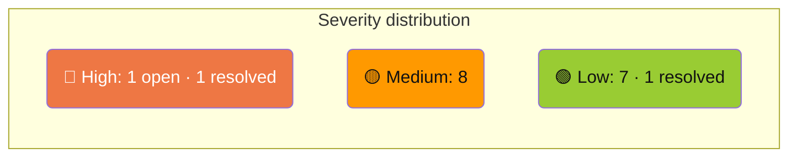

# Technical Debt

Known issues in the codebase, ordered by severity. This page is updated as items are resolved or discovered.

---

## 🔴 High

### 1. XboxDeviceService — God class

**File:** `XBVault/Services/XboxDeviceService.cs` · 1038 lines · 35 public methods/properties

**Problem:** Mixes HTTP calls, WebSocket handling, JSON parsing, and logging across 8 unrelated domains — packages, processes, crash dumps, network, system info, screenshots, performance, restart/shutdown. Every new feature adds another method to the same class, making it hard to test, navigate, or refactor.

**Fix:** Split into:

| Proposed class | Responsibility |
|----------------|---------------|
| `XboxPackageService` | install, uninstall, launch, suspend, terminate, list |
| `XboxProcessService` | list, kill, running title |
| `XboxCrashService` | list crash dumps, delete, crash control |
| `XboxNetworkService` | network config, wifi interfaces/networks |
| `XboxSystemService` | system info, restart, shutdown, screenshot |
| `XboxPerformanceService` | WebSocket connection, snapshot parsing |

### ~~2. `_Backup/` directory tracked in git~~ ✅ Resolved (v0.8.x)

Removed from tracking, added to `.gitignore`, deleted from disk.

---

## 🟡 Medium

### 3. `App.axaml.cs` — 455 lines, manual composition root

**File:** `App.axaml.cs`

The main startup file has grown to 455 lines and does too much:

- Manually instantiates all services with `new` (no DI container)
- `InitAfterSplashAsync` is a 342-line method wiring all 12+ window delegate callbacks, sidebar views, catalog load, splash close, and first-run wizard
- Contains 2 bare `catch { }` blocks at lines 106 and 109 inside `ShowErrorDialogSafe` — errors in the error dialog are silently swallowed

**Fix:** Extract dialog wiring into a `DialogRegistry` class. Consider a lightweight DI container (`Microsoft.Extensions.DependencyInjection`) to replace manual `new`.

---

### 4. No `ConfigureAwait(false)` anywhere

**~88 `await` calls across Services/. Zero have `.ConfigureAwait(false)`.**

Breakdown: ~75 in `XboxDeviceService.cs`, ~8 in `PackageInstallService.cs`, ~5 in `CatalogApiService.cs`.

Service-layer continuations unnecessarily capture the UI synchronization context, which can cause deadlocks and reduces throughput.

**Fix:** Add `.ConfigureAwait(false)` to all `await` calls in Services (HTTP, file I/O, WebSocket). Skip in ViewModels that update `ObservableProperty` on the UI thread.

---

### 5. Silent exception swallowing — multiple sites

Several catch blocks discard exceptions with no logging, no rethrow, and no meaningful fallback. Most impactful:

| File | Line | Pattern | Impact |
|------|------|---------|--------|
| `App.axaml.cs` | 106, 109 | `catch { }` | Error dialog failures silently swallowed |
| `Services/XboxDeviceService.cs` | 384 | `catch { }` | JSON parse in `TryParseError()` silently returns null |
| `Services/XboxDeviceService.cs` | 583–585 | `catch { /* Ignore */ }` | Package manager polling swallows all errors |
| `ViewModels/NetworkInfoViewModel.cs` | 50 | `catch { }` | All network adapter parse errors silently dropped |
| `ViewModels/CrashDataViewModel.cs` | 76 | `catch { CrashDumpEnabled = false; }` | Deserialization failure silently sets default |
| `ViewModels/ConnectionViewModel.cs` | 68 | `catch { }` | JSON parse helper, returns null |
| `Services/AdminHelper.cs` | 19 | `catch { return false; }` | No logging |
| `Services/CryptoService.cs` | 41 | `catch { return string.Empty; }` | No logging |
| `Services/Logger.cs` | 125–127 | `catch { }` × 3 | Logger itself silently fails |
| `Services/XboxDeviceService.cs` | 1140 | `catch { }` | WebSocket close teardown |

Some are intentional (cleanup paths, cancellation), but the majority in service/ViewModel logic hide bugs.

**Fix:** Add `Logger.Warn/Error` to non-intentional silent catches. Use `catch (OperationCanceledException)` explicitly where cancellation is expected.

---

### 6. `async void` in code-behind (fire-and-forget)

Four event handlers use `async void` — unhandled exceptions crash the process with no recovery:

| File | Line | Method |
|------|------|--------|
| `Views/ConnectionWindow.axaml.cs` | 37 | `OnConnectionCompleted` |
| `Views/ErrorDialog.axaml.cs` | 60 | `OnCopyClick` |
| `Views/LogsView.axaml.cs` | 41 | `OnCopyClick` |
| `Views/NetworkInfoWindow.axaml.cs` | 15 | `OnLoaded` |

**Fix:** Wrap body in a safe `FireAndForget` extension with exception logging, or restructure to `async Task` where possible.

---

### 7. `XboxDeviceService` does not implement `IDisposable`

**File:** `XBVault/Services/XboxDeviceService.cs:16`

The class holds `HttpClient _http` and `HttpClientHandler? _handler` (both disposable) but has no `Dispose()` method and does not implement `IDisposable`. The callers in `App.axaml.cs` cannot dispose it at shutdown.

Internal `Configure()` re-creates and disposes old instances on reconfiguration, but this is fragile and there's no cleanup path on normal app exit.

**Fix:** Implement `IDisposable` (or `IAsyncDisposable`) and dispose `_http` and `_handler` properly.

---

### 8. Border CornerRadius does not clip Image (Avalonia 12.0.0)

**Files:** `Views/BrowseView.axaml`, `Views/ItemDetailWindow.axaml`

`Border CornerRadius="8,8,0,0"` with `Image Stretch="UniformToFill"` inside does not clip to rounded corners — image corners bleed through.

**Tried:** overlay Border stroke, separate Border with CornerRadius, `ClipToBounds="True"`. None worked.

**Next steps:**
- Apply `Clip` geometry via code-behind (`RectangleGeometry` with `RadiusX/Y` bound to `ActualWidth/ActualHeight`)
- Or use `ImageBrush` inside a `Border` (different render path, may clip correctly)
- Check if a newer Avalonia patch resolves this

---

### 9. Title bar gradient duplicated across windows

The same `LinearGradientBrush` (`#447F3E` → `#9ACA3C`) is defined **inline** in every dialog window plus MainWindow — some windows define it twice (title bar + table header). `SetupWizardWindow` and `UsbPermissionWindow` added in v0.8.6 continue the pattern.

**Fix:** Extract as a named `StaticResource` in `BladesTheme.axaml`:

```xml
<LinearGradientBrush x:Key="TitleGradient" StartPoint="0%,0%" EndPoint="100%,0%">
  <GradientStop Color="#447F3E" Offset="0"/>
  <GradientStop Color="#9ACA3C" Offset="1"/>
</LinearGradientBrush>
```

---

### 10. Close button template duplicated across windows

Same `<Button>` with inline styles (`#CC3333` hover, 32×32, transparent default) copy-pasted into every window, including new windows added in v0.8.6.

**Fix:** Create a reusable `WindowCloseButton` style or UserControl in `BladesTheme.axaml`.

---

## 🟢 Low

### 11. Hardcoded magic delays — 23 instances

`Task.Delay(ms)` with hardcoded numbers across Views, ViewModels, and Services:

| File | Lines | Values |
|------|-------|--------|
| `Views/ConnectionWindow.axaml.cs` | 41, 43 | 2000, 1500 |
| `Views/RefreshWindow.axaml.cs` | 51 | 1500 |
| `Views/LogsView.axaml.cs` | 58 | 2000 |
| `App.axaml.cs` | 125 | 2000 (splash delay) |
| `ViewModels/ConnectionViewModel.cs` | 105–172 | 300, 500, 400, 600, 300, 250, 250, 350, 350, 350, 350 (animation timing) |
| `ViewModels/BrowseViewModel.cs` | 564 | 3000 |
| `ViewModels/UsbPermissionViewModel.cs` | 227 | 1000 |
| `ViewModels/RefreshViewModel.cs` | 69 | 200 |
| `ViewModels/SettingsViewModel.cs` | 77 | 3000 |
| `Services/XboxDeviceService.cs` | 572, 587 | 2000, 3000 |

**Fix:** Name as `const int` or `static readonly TimeSpan` with a descriptive identifier.

---

### 12. `CatalogApiService` not injected — created inline in two places

**Files:** `ViewModels/BrowseViewModel.cs:40`, `Services/CatalogApiService.cs:309`

`BrowseViewModel` creates its own `CatalogApiService` instance in the constructor (`_catalogService = new CatalogApiService()`), bypassing the composition root in `App.axaml.cs`. Additionally, `CatalogApiService.cs:309` creates an instance of itself inside a static method (`LoadFromCache`) to call `ClassifyDownloads` — a class instantiating itself as a utility.

This means there are potentially 3 separate `CatalogApiService` instances alive at runtime, but only 1 registered cache/service in `App.axaml.cs`.

**Fix:** Inject `CatalogApiService` via constructor in `BrowseViewModel`. Extract `ClassifyDownloads` to a static method to avoid self-instantiation.

---

### 13. `PerformanceViewModel` — `CancellationTokenSource` never disposed

**File:** `ViewModels/PerformanceViewModel.cs`

`_cts?.Cancel()` is called before reassignment, but `_cts.Dispose()` is never called and the class does not implement `IDisposable`. `CancellationTokenSource` holds a `WaitHandle` that is not released until GC finalizer.

**Fix:** Call `_cts?.Dispose()` before nulling, implement `IDisposable`.

---

### 14. `DllImport` in Logger + `System.Management` load-time risk on Linux

Two Windows-specific dependencies:

| File | Issue |
|------|-------|
| `Services/Logger.cs` | `[DllImport("kernel32.dll")]` — call site is guarded with `OperatingSystem.IsWindows()`, but P/Invoke metadata is always emitted |
| `Services/UsbDriveDetector.cs` | `using System.Management` — runtime guard exists at line 13, but the assembly reference is load-time; if `System.Management` is absent from the Linux publish output, the app may fail to start |

The Linux and macOS release artifacts in CI publish with `--self-contained true`, which bundles all referenced assemblies. Verify that `System.Management` (a Windows-only NuGet) is excluded or stubbed in the Linux/macOS publish output.

**Fix Logger:** Already functionally guarded. The `DllImport` declaration itself is low risk — no further action required unless P/Invoke metadata size is a concern.

**Fix UsbDriveDetector:** Add `#if WINDOWS` conditional compilation or move `using System.Management` inside the guarded block with reflection-based dynamic loading. Verify Linux CI artifact actually starts.

---

### 15. ~~`PerformanceSnapshot.cs` — catch with no log~~ ✅ Resolved

The previously documented silent catch at `PerformanceSnapshot.cs:78` now calls `Logger.Error(ex, "Failed to parse PerformanceSnapshot")`. Item closed.

---

### 16. `BrowseViewModel.cs` — 499 lines

Approaching the god-class threshold. Contains catalog loading, filtering, search, item selection, install orchestration, and image thumbnail management.

**Fix:** No immediate action required, but monitor. Consider extracting install-related logic into a dedicated coordinator if it grows further.

---

### 17. Orphaned `_Backup` icons — verify before deleting

`Assets/_Backup/Icons/setup-save-continue.ico` and `setup-test-connection.ico` were created for the old `SetupWindow` (removed). With `SetupWizardWindow` added in v0.8.6, verify whether these are still orphaned before deleting.

**Fix:** Check `Assets/Views/SetupWizardWindow/` for overlapping references; delete `_Backup` icons if confirmed unused.

---

## Summary



| Severity | Open | Resolved | Estimated effort |
|----------|------|----------|-----------------|
| 🔴 High | 1 | 1 ✅ | 2–4 hours |
| 🟡 Medium | 8 | — | 8–16 hours |
| 🟢 Low | 7 | 1 ✅ | 3–6 hours |
| **Total** | **16 open** | **2 resolved** | **13–26 hours** |

---

[← Roadmap](roadmap) · [← Home](.)
