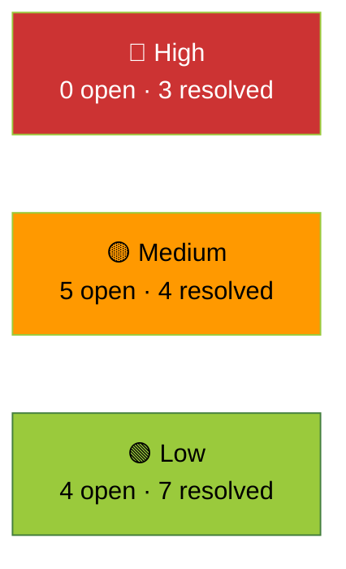

# Technical Debt

Known issues in the codebase, ordered by severity. This page is updated as items are resolved or discovered.

> **Last verified against code:** August 2026 (main, after .NET 10 migration). Line counts and locations below reflect the current source. **172 tests green**, build 0 warnings/0 errors.

---

## 🔴 High

### 1. XboxDeviceService — God class split (resolved — split #2 done)

**Facade `XBVault/Services/XboxDeviceService.cs` deleted (Aug 2026, split #2).** God class fully split into 6 domain services behind interfaces; ViewModels inject `IXbox*` interfaces; composition root wires concrete services.

**Split #1 (Aug 2026):** facade strategy with 147 tests green, 0 warnings/0 errors.

**Split #2 (Aug 2026):**

| Interface | Implementation | Responsibilities |
|-----------|---------------|------------------|
| `IXboxAuthService` | `XboxAuthService` | HTTP client, CSRF, cookies, Configure/Test/Disconnect, ConnectionChanged, IsConnected |
| `IXboxPackageService` | `XboxPackageService` | list, install, uninstall, launch, suspend, terminate, running packages |
| `IXboxProcessService` | `XboxProcessService` | list processes, kill, running title |
| `IXboxSystemService` | `XboxSystemService` | system info, crash dumps, crash control, screenshot, restart, shutdown |
| `IXboxNetworkService` | `XboxNetworkService` | network config, wifi interfaces/networks |
| `IXboxPerformanceService` | `XboxPerformanceService` | WebSocket performance, snapshot |
| — | `XboxResponseParser` | pure static JSON/error helpers (tests retargeted here) |

- All 16 ViewModels inject the specific `IXbox*` services they need (auth + domain).
- `PackageInstallService` takes `IXboxPackageService`.
- `App.axaml.cs` composition root: `new XboxAuthService()` + 5 domain services with `auth` ctor arg; `InitAfterSplashAsync` takes concrete services.
- Tests: `XboxDeviceServiceHelperTests` → `XboxResponseParserTests` (`XboxDeviceService.` → `XboxResponseParser.`). **147 tests green, build 0 warnings/0 errors.**

**Remaining plan:** none — see [Split XboxDeviceService](ideas/refactor-xboxdeviceservice) for the historical record.

### ~~2. `FileExplorerViewModel` — new god class~~ ✅ Resolved (Aug 2026, split)

**File:** `XBVault/ViewModels/FileExplorerViewModel.cs` · **1,736 lines** (post-split growth: was 1,223 after split, 1,880 pre-split)

**Problem:** Added in v0.9.0 and never tracked in tech debt. Became the largest file in the codebase — bigger than `XboxDeviceService`. Mixed SSH/SFTP operations, drive mounting, recursive folder upload, path parsing, drag-drop state, and UI state management. Upload logic alone spanned `UploadFolderAsync`/`UploadMixedAsync`/`UploadFileAsync` with per-file progress reporting.

**Split (Aug 2026):** extracted into three layers —
- `FileSystemPathParser` (`XBVault/Helpers/`) — 9 static helpers (`FormatBps`, `InsertSorted`, `UpdateChildrenPathsRecursive`, `CollectExpandedPaths`, `ClearTreeCache`, `FindEntry`, `GetParentPath`, `FindParent`, `BuildBreadcrumbSegments`); VM keeps them via `using static`.
- `ISftpService` + `SftpService : ISftpService` — SSH/SFTP transport interface.
- `SftpTransferService` (`XBVault/Services/`) — upload/download pipelines (`UploadFilesAsync`, `UploadFolderAsync`, `UploadMixedAsync`, `UploadZipExtractAsync`, `DownloadFilesAsync`, `DownloadSingleFileAsync`, `DownloadFolderAsync`). Owns its own `CancellationTokenSource`; reports via `IProgress<TransferUpdate>`; returns `TransferResult` with `NewEntries` for the VM to splice into the tree. Best-effort partial-file cleanup on cancel.
- `FileExplorerViewModel` (1,880 → 1,223 lines at split, complexity 254 → 177) keeps tree/list state + command wiring only. Post-split USB/drive work grew it back to **1,736 lines** (see #10).

### ~~3. `_Backup/` directory tracked in git~~ ✅ Resolved (v0.8.x)

Removed from tracking, added to `.gitignore`, deleted from disk.

---

## 🟡 Medium

### 4. `App.axaml.cs` — ~786 lines, manual composition root (partial)

**File:** `XBVault/App.axaml.cs` (~786 lines)

**Still open:**
- Manually instantiates all core services with `new` (XboxAuthService + 5 Xbox* domain services, CacheService, PackageInstallService, SftpService, SftpTransferService, CatalogApiService, PackageOverrideService, BackgroundTaskService, ConnectionMonitorService, NotificationCenterService, PortalAppFilesService) — no DI container. Zero `Microsoft.Extensions.DependencyInjection` usage anywhere in the project.
- `InitAfterSplashAsync` is a very large method wiring all window delegate callbacks, sidebar views, catalog load, splash close, and first-run wizard.

**Resolved since June 2026:**
- The two bare `catch { }` blocks (formerly lines 107/110 in `ShowErrorDialogSafe`) are **fixed** — all catch blocks now log via `Logger.Error`.

**Fix:** Extract dialog wiring into a `DialogRegistry` class. Consider a lightweight DI container (`Microsoft.Extensions.DependencyInjection`) to replace manual `new`.

### 5. No `ConfigureAwait(false)` anywhere — 404 awaits

**~404 `await` calls across Services/ViewModels. Zero use `.ConfigureAwait(false)`.**

Spread across `XboxDeviceService.cs` (~100+), `PackageInstallService.cs`, `CatalogApiService.cs`, `SftpService.cs`, `XrayAgentService.cs`, and all ViewModels. The `await` count grew ~4x since the June 2026 verification (~82–100).

Service-layer continuations unnecessarily capture the UI synchronization context, which can cause deadlocks and reduces throughput.

**Fix:** Add `.ConfigureAwait(false)` to all `await` calls in Services (HTTP, file I/O, WebSocket). Skip in ViewModels that update `ObservableProperty` on the UI thread.

### ~~6. Silent exception swallowing~~ ✅ Resolved (Aug 2026)

The 10 originally-documented silent catches were fixed (logged) in v0.9.2. A fresh scan (Aug 2026) found 26 bare `catch { }` sites; the ⚠️ regressions are now **all logged** (`Logger.Trace`):

| File | Line(s) | Now logs |
|------|---------|----------|
| `Services/XboxResponseParser.cs` | 60, 76, 92, 109 | `IsSignatureError`/`IsResourceInUseError`/`IsHigherVersionError`/`IsFatalDeploymentError` — malformed JSON |
| `Converters/BoolToValueConverter.cs` | 18 | `ChangeType` fallback failure |
| `ViewModels/FileExplorerViewModel.cs` | 1218 | WinSCP `where` probe |
| `ViewModels/InstalledViewModel.cs` | 523, 545 | banner asset load, outdated check |
| `Views/ErrorDialog.axaml.cs` | 145, 157 | clipboard write, restart launch |
| `Views/FileExplorerView.axaml.cs` | 601 | WinSCP `winscp://` shell launch |

**Kept intentional** (self-protection / last-resort): `Logger.cs` (9), `Program.cs` (88), `SftpService.cs` disconnect (109, 113), `PlatformDialog.cs` (64, 117), `PreFlightChecker.cs` (69). Each touched site gained a `// why` comment explaining why the exception is swallowed.

### 7. `async void` in code-behind — grew 11 → 22 instances

**22 instances across 11 files** (up from 11). Unhandled exceptions in `async void` crash the process with no recovery:

| File | Line | Method | Risk |
|------|------|--------|------|
| `MainWindow.axaml.cs` | 271 | `OnDiscordClick` | High |
| `MainWindow.axaml.cs` | 279 | `OnDisconnectClick` | High |
| `Views/BrowseView.axaml.cs` | 109 | `OnDrop` | High |
| `Views/ConnectionWindow.axaml.cs` | 59 | `OnConnectionCompleted` | High |
| `Views/ErrorDialog.axaml.cs` | 95 | `OnConnectClick` | High |
| `Views/ErrorDialog.axaml.cs` | 110 | `OnDownloadClick` | High |
| `Views/FileExplorerView.axaml.cs` | 278 | `OnTreeItemExpanded` | High |
| `Views/FileExplorerView.axaml.cs` | 289 | `OnBrowseFilesClick` | High |
| `Views/FileExplorerView.axaml.cs` | 307 | `OnUploadFilesClick` | High |
| `Views/FileExplorerView.axaml.cs` | 328 | `OnUploadFolderClick` | High |
| `Views/FileExplorerView.axaml.cs` | 349 | `OnUploadZipExtractClick` | High |
| `Views/FileExplorerView.axaml.cs` | 647 | `OnDropZoneDrop` | High |
| `Views/InspectorView.axaml.cs` | 147 | `OnDrop` | High |
| `Views/InstalledView.axaml.cs` | 108 | `OnDrop` | High |
| `Views/NetworkInfoWindow.axaml.cs` | 15 | `OnLoaded` | High |
| `Views/LogsView.axaml.cs` | 44 | `OnCopyClick` | Low |
| `Views/SftpInfoWindow.axaml.cs` | 23–59 | 4 × clipboard copy | Low |
| `Controls/DialogFadeBehavior.cs` | 46 | `OnClosing` | Low |

**Fix:** Wrap body in a safe `FireAndForget` extension with exception logging, or restructure to `async Task` where possible.

### ~~8. `XboxDeviceService` does not implement `IDisposable`~~ ✅ Resolved (split #1)

**File:** `XBVault/Services/XboxDeviceService.cs:170`

The god class held `HttpClient _http` and `HttpClientHandler? _handler` (both disposable) but had no `Dispose()`. During split #1 the state moved into `XboxAuthService` (which implements `IDisposable`), and the facade now forwards `Dispose()` to it. `GC.SuppressFinalize` present in both.

**Note:** `App.axaml.cs` still never calls `Dispose()` on the facade at shutdown — the resource is freed on process exit. Revisit when composition root is reworked (see #4).

### 9. Border CornerRadius does not clip Image (Avalonia 12.0.0)

**Files:** `Views/BrowseView.axaml`, `Views/ItemDetailWindow.axaml`

`Border CornerRadius="8,8,0,0"` with `Image Stretch="UniformToFill"` inside does not clip to rounded corners — image corners bleed through. Re-verified Aug 2026: still no clip workaround in the tree.

**Tried:** overlay Border stroke, separate Border with CornerRadius, `ClipToBounds="True"`. None worked.

**Next steps:**
- Apply `Clip` geometry via code-behind (`RectangleGeometry` with `RadiusX/Y` bound to `ActualWidth/ActualHeight`)
- Or use `ImageBrush` inside a `Border` (different render path, may clip correctly)
- Check if a newer Avalonia patch resolves this

### 10. Large ViewModels beyond the god-class threshold (undocumented)

**Files:** beyond `BrowseViewModel`, these ViewModels now exceed the ~500-line threshold:

| File | Lines | Complexity | Notes |
|------|-------|-----------|-------|
| `ViewModels/FileExplorerViewModel.cs` | **1,736** | — | post-split growth, see #2 |
| `ViewModels/BrowseViewModel.cs` | **899** | 167 | grew from 580 |
| `ViewModels/CustomInstallViewModel.cs` | 726 | 98 | wizard orchestration |
| `ViewModels/InstalledViewModel.cs` | 632 | 112 | package list + refresh |
| `ViewModels/InspectorViewModel.cs` | 545 | 72 | XRay agent + REPL |

**Fix:** No immediate action for the smaller ones, but `BrowseViewModel` (catalog loading + filtering + search + install orchestration + thumbnail management) is a refactor candidate: extract install orchestration into a coordinator.

### ~~11. Title bar gradient duplicated across windows~~ ✅ Resolved (v0.9.1)

Extracted as `TitleGradient` named resource in `BladesTheme.axaml`.

### ~~12. Close button template duplicated across windows~~ ✅ Resolved (v0.9.1)

Unified `WindowCloseButton` style in `BladesTheme.axaml`.

---

## 🟢 Low

### ~~13. Hardcoded magic delays~~ ✅ Resolved (v0.9.1 + Aug 2026)

Named constants cover the bulk (`SplashMinDelayMs`, `PollDelayMs`, `RetryDelayMs`, `DialToneDelayMs`, etc.). The last two raw-literal stragglers were promoted (Aug 2026):

| File | Before | After |
|------|--------|-------|
| `Controls/DialogFadeBehavior.cs` | `Task.Delay(200)` | `FadeOutDelay` (`static readonly TimeSpan`) |
| `ViewModels/CustomInstallViewModel.cs` | `Task.Delay(1500)` × 2 | `UninstallRetryDelayMs = 1500` (const) |

### ~~14. `CatalogApiService` not injected~~ ✅ Resolved (v0.9.2)

`BrowseViewModel` now receives `CatalogApiService` via constructor (`BrowseViewModel.cs:50`). No more self-instantiation.

### ~~15. `PerformanceViewModel` — `CancellationTokenSource` never disposed~~ ✅ Resolved

Now implements `IDisposable` and calls `_cts?.Dispose()` (`PerformanceViewModel.cs:18–21`).

### ~~16. `DllImport` in Logger + `System.Management` load-time risk on Linux~~ ✅ Resolved (v0.9.2)

`UsbDriveDetector` WMI code wrapped in `#if WINDOWS_BUILD`; csproj defines `WINDOWS_BUILD` only on Windows builds. Non-Windows builds get a no-op fallback.

### ~~17. `PerformanceSnapshot.cs` — catch with no log~~ ✅ Resolved

Now logs `Logger.Error(ex, "Failed to parse PerformanceSnapshot")`.

### 18. `BrowseViewModel.cs` — approaching the god-class threshold

**File:** `XBVault/ViewModels/BrowseViewModel.cs` · **899 lines** (grew from 580)

Contains catalog loading, filtering, search, item selection, install orchestration, progress reporting, and image thumbnail management.

**Fix:** Extract install-related logic into a dedicated coordinator. See #10.

### ~~19. Orphaned `_Backup` icons~~ ✅ Resolved (v0.9.1)

Deleted `Assets/_Backup/` directory.

### 20. File Explorer drive list is hardcoded — no discovery

**File:** `ViewModels/FileExplorerViewModel.cs:429` (`DetectDrivesAsync`)

The File Explorer surfaces a **static** set of drives — `{ "C", "D", "E", "G", "J", "L", "M", "N", "Q", "S", "T", "U", "V", "X", "Y" }` — with no runtime discovery.

**Fix:** Discover drives dynamically over SSH instead of hardcoding — e.g. probe `cd {letter}: && echo ok` across the alphabet, and build the list from what actually responds. Keep the current set only as a fallback if discovery fails.

**Status:** Sufficiently addressed for now — the expanded list covers all known Xbox drive letters.

### 21. Zero test coverage — highest-impact gap

**Status:** Mostly resolved (Aug 2026) — **172 tests green** (up from 160): Phase 1a/1b (pure services) + Phase 1c (19 god-class helpers characterized, 2 real bugs found/fixed) + `SftpTransferServiceTests` (13 tests over an in-memory `FakeSftpService` — upload files/folder/mixed/zip-extract, download single/folder/multi, cancel with partial cleanup, empty results, connection-lost path). See [Testing Infrastructure](ideas/testing-infrastructure).

**Still open:** instance logic of the Xbox domain services (HTTP/WebSocket) — `XboxAuthService`, `XboxPackageService`, … need in-memory fakes/stubs.

### 22. Comment ratio 0–2% across Services/ViewModels

`Services/` at 2% comments, `ViewModels/` at 0%. Business logic in the Xbox domain services (error-code interpretation, retry loops) and `PackageInstallService` (dependency classification) is undocumented inline.

**Progress (Aug 2026):** `// why` comments added at every site touched by the #2 split and the #6/#13/#23 passes — bare-catch rationales, culture-invariance rationale on all 8 formatters, and the delay constants in `DialogFadeBehavior`/`CustomInstallViewModel`. Still open for untouched business logic.

### ~~23. Culture-dependent size/speed formatting — latent in 8 formatters~~ ✅ Resolved (Aug 2026)

**All 8 formatters** now use `CultureInfo.InvariantCulture` (with `using System.Globalization;` where missing), so size/percent strings render identically on pt-BR (comma) and en-US (dot):

| File | Formatter(s) |
|------|--------------|
| `Models/SftpEntry.cs` | `FormatSize` |
| `Models/SystemInfo.cs` | memory `FormatSize` |
| `Models/ProcessInfo.cs` | `MemoryDisplay`, `CpuDisplay` |
| `Models/CrashDumpInfo.cs` | `FileSizeDisplay` |
| `Services/PackageInstallService.cs` | `FormatBytes` |
| `Services/PreFlightChecker.cs` | `FormatBytes` |
| `Services/UsbDriveDetector.cs` | `FormatSize` |
| `ViewModels/SettingsViewModel.cs` | `FormatBytes` |

`XboxDeviceService.SizeFormat` and `FileExplorerViewModel.FormatBps` were already fixed in Phase 1c (tests). Each formatter carries a `// why` comment explaining the invariant.

---

## Summary

```mermaid
graph LR
    H["🔴 High<br/>0 open · 3 resolved"]
    M["🟡 Medium<br/>5 open · 4 resolved"]
    L["🟢 Low<br/>4 open · 7 resolved"]
    
    style H fill:#CC3333,stroke:#9ACA3C,color:#fff
    style M fill:#FF9900,stroke:#9ACA3C,color:#000
    style L fill:#9ACA3C,stroke:#447F3E,color:#000
```

| Severity | Open | Resolved | Estimated effort |
|----------|------|----------|-----------------|
| 🔴 High | 0 | 3 ✅ | – |
| 🟡 Medium | 5 | 4 ✅ | 6–14 hours |
| 🟢 Low | 4 | 7 ✅ | 2–4 hours |
| **Total** | **9 open** | **14 resolved** | **8–18 hours** |

### Notable changes since June 2026 verification

- **`XboxDeviceService` 1,433 → deleted** (split #1 facade, split #2 removed it entirely): extracted `XboxAuthService`, `XboxPackageService`, `XboxProcessService`, `XboxSystemService`, `XboxNetworkService`, `XboxPerformanceService`, `XboxResponseParser`. See [Split XboxDeviceService](ideas/refactor-xboxdeviceservice).
- **.NET 10 migration (Aug 2026):** `net8.0` → `net10.0` (app + tests), CI `dotnet-version: 10.0.x`, `Tmds.DBus.Protocol` bumped to 0.92.0 (GHSA-xrw6-gwf8-vvr9), 172 tests green. Release stays self-contained (no client runtime).
- **Testing (Aug 2026):** **172 tests green.** 17 god-class helpers characterized (#1 ×10, #2 ×9 → now `FileSystemPathParser`). Two real bugs found+fixed: `UpdateChildrenPathsRecursive` duplicated path segments on nested rename (grandchild got `\sub\sub\`); `SizeFormat`/`FormatBps` were culture-dependent (pt-BR comma vs CI dot).
- **`FileExplorerViewModel` (1,880 → 1,223 lines at split, complexity 254 → 177)** — split done (Aug 2026): `FileSystemPathParser` helpers, `ISftpService`, `SftpTransferService`; VM keeps tree/list state + command wiring. `TransferResult.NewEntries` re-splices into tree on upload. Post-split USB/drive work grew it back to **1,736 lines** (see #10).
- **Cleanup pass (Aug 2026):** **160 tests green.** Resolved **#6** (all ⚠️ bare catches logged via `Logger.Trace` with `// why`), **#13** (last magic delays → `FadeOutDelay`/`UninstallRetryDelayMs`), **#23** (all 8 size formatters → `CultureInfo.InvariantCulture`). **#21** extended: `SftpTransferServiceTests` + in-memory `FakeSftpService` (13 tests, incl. cancel-with-partial-cleanup determinism via `await Task.Yield()` before the sync wait — the naive version deadlocked the test thread). **#22** progress: `// why` comments on every touched site.
- **`App.axaml.cs` 497 → 724 lines**; bare `catch { }` at 107/110 **fixed** (now logged).
- **`BrowseViewModel` 580 → 899 lines** — past the god-class threshold.
- **`async void` 11 → 22** instances across 11 files.
- **`await` count ~82–100 → ~404**; still **0** `.ConfigureAwait(false)`.
- **Bare `catch { }`**: 26 sites found; most intentional, several regressions flagged in #6.
- **Resolved since last revision:** #14 (CatalogApiService DI), #15 (CTS dispose), #16 (WINDOWS_BUILD guard) — all were marked open in the June verification but are confirmed fixed in v1.2.0.
- **New services** added since June docs (untracked): `XrayAgentService`, `GitHubReleaseCheckerService`, `UpdateVersionCache`, `PackageOverrideService`, `PreFlightChecker`, `WindowSettingsService`.

---

[← Roadmap](roadmap) · [← Home](.)
