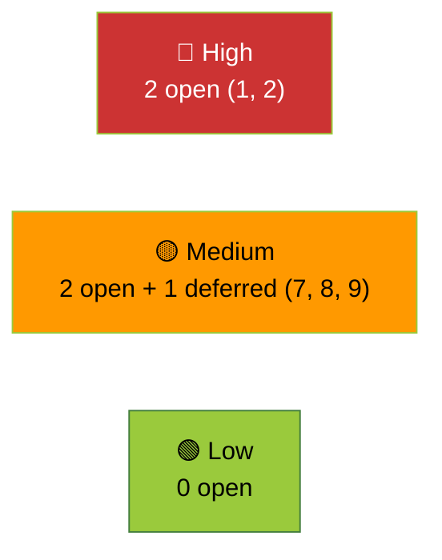

## 🛠️ Action Plan (Prioritized)

Use this section as the tracked backlog for technical-debt work. Items are ordered by expected impact and ease of rollout. Each item includes a short why, recommended fix, risk, and rough estimate.

> **Last verified against source:** 2026-08-27. Desktop + Android build: **0 warnings / 0 errors**. Test suite: **718 passed** (`dotnet format whitespace --verify-no-changes` clean). Source version: **2.0.5** (`net10.0`).

1. App.axaml.cs composition root (Priority: High)
   - Why: 1,906 lines — the largest file in the codebase. Manual `new` wiring of 18 services, splash logic, dialog creation, action-delegate wiring, mobile init — all in one file. No DI container.
   - Fix: Add `Microsoft.Extensions.DependencyInjection`, extract `CompositionRoot` class, split dialog/wiring logic.
   - Risk: medium (startup touchpoints). Tests must pass.
   - Estimate: 12–24 hours.

2. Extract coordinators from large ViewModels (Priority: High)
   - Why: FileExplorerViewModel (1,809 lines), BrowseViewModel (915), InstalledViewModel (887), CustomInstallViewModel (681) all violate SRP.
   - Fix: Extract `FileExplorerTransferCoordinator`, `BrowseInstallCoordinator`, `ThumbnailService`, inject them.
   - Risk: medium-high (integration surface), perform incrementally.
   - Estimate: 16–40 hours.

3. Convert `async void` handlers (Priority: High — safety) — ✅ DONE 2026-08-27
   - Current: 0 remaining (was 20). All converted to `FireAndForget`-wrapped `async Task` locals or `async Task`.
   - Why: `async void` throws unobserved exceptions and can crash app.
   - Fix: Wrap body in `SafeFireAndForget` helper (already exists in `TaskExtensions.cs`); convert to `async Task` where possible. — *implemented*
   - Risk: low.
   - Estimate: 4–8 hours.

4. Secrets: XOR obfuscation — ✅ DONE 2026-08-27 (Priority: High — security)
   - `CryptoService` now uses **SEC2**: AES-256-GCM with a key derived via PBKDF2 (SHA-256, 100k it) from machine+user identity + per-install random salt. Pure managed, cross-platform (Windows/macOS/Linux/Android), zero P/Invoke, zero new UX.
   - Legacy XOR values (pre-SEC2 builds) still decrypt on read and are **re-encrypted on the next save** (lazy migration) — installed configs keep working.
   - A config copied to another machine/user is undecryptable; `TryDeobfuscate` returns false and the app prompts the user to re-run the Setup Wizard (desktop `ConfirmWindow`, mobile `MobileConfirmDialogView`) + inline warning in Settings with a Reconfigure button.
   - Shared-configs-between-OSes is *not* a supported scenario (user decision).

5. Increase tests for Xbox domain services (Priority: High) — ✅ DONE 2026-08-27
   - **Full Xbox HTTP coverage via stubbed transport:** `XboxSystemService` (12: screenshot retry/cancel/fail, system-info retention, reboot/shutdown params), `XboxNetworkService` (12: ipconfig/interfaces/networks passthrough + errors), `XboxProcessService` (6: kill no-op unconfigured, running-list empty/fail, running title), `XboxPerformanceService` (9: not-configured guard, canceled-token, real WebSocket loopback server receiving snapshot, fragmented frames, malformed JSON). Plus earlier suites (auth, package dep-install, portal, zip, ProgressReadStream). Suite: **718 tests** (was 679).

6. Cancellation/disposal audit — ✅ DONE 2026-08-27 (Priority: Medium)
   - Current: `CustomInstallViewModel` now implements `IDisposable` (disposes `_analyzeCts`); all 4 hosts call `vm.Dispose()` on window close / overlay close. (`MobileLogsView._shareCts` IS disposed in the finally block.)
   - Fix: Implement IDisposable on CustomInstallViewModel. — *implemented*
   - Risk: low.
   - Estimate: 2–4 hours.

7. Bare `catch { }` blocks (Priority: Medium) — ✅ DONE 2026-08-27
   - Current: 0 bare `catch { }` remain (was 26). All now have explicit `// why` comments (self-protection / best-effort cleanup / fallback) or log. Best-effort cleanups and logger self-protection intentionally stay silent (recursive logging loop); GoFile request/response parses and QR clipboard writes now log `Warn` on failure.
   - Fix: Add explicit `// why` comments where intentional; log where possible. — *implemented*

8. `.Result` blocking calls (Priority: Medium) — 🅳 deferred (user sign-off required)
   - Current: 3 instances in SftpService.cs (lines 550, 595) and XrayAgentService.cs (line 263).
   - Fix: Replace with proper `await` or extract to async methods. **BUT** — `SftpService` and `XrayAgentService` are delicate (cmd.exe / sync calls); both work perfectly and are not to be retested. Address only as a carefully-tested refactor with explicit sign-off.
   - Risk: low (but platform-sensitive).
   - Estimate: 1–2 hours.

9. Service/ViewModel documentation (Priority: Medium)
   - Current: 26/37 services missing class-level XML `
` docs (~8% coverage). (`CryptoService` gained a full summary in the SEC2 pass.)
   - Fix: Add XML docs to all service classes and key ViewModel public members.
   - Risk: low.
   - Estimate: 4–8 hours.

10. CI checks & analyzers (Priority: Low) — ✅ DONE 2026-08-27
    - Current: new `format` job in `.github/workflows/build.yml` runs `dotnet format whitespace --verify-no-changes` on `XBVault.csproj` + tests csproj (ubuntu-latest). `EnforceCodeStyleInBuild` + `AnalysisLevel` already active in `Directory.Build.props`. Whole-repo whitespace sweep applied the same job's rules (46 files, whitespace only).

11. UI clipping workaround (Priority: Low) — ✅ resolved
    - Why: Avalonia 12 CornerRadius does not clip inner Image.
    - Status: Not blocking — images render acceptably.
    - Fix: `RectangleGeometry` clip or `ImageBrush` render path if needed.
    - Risk: low.
    - Estimate: 1–2 hours.

12. Hardcoded URLs (Priority: Low) — ✅ DONE 2026-08-27
    - Current: 33 hardcoded URL strings → **0 remaining outside the registry**.
    - Fix: Centralized in `XBVault/Configuration/AppUrls.cs` (root namespace `XBVault`, so no usings needed app-wide). API endpoints (catalog, GitHub release API, overrides raw), Gofile servers/contents/upload, Google Drive export, Discord invites (3), project/docs/legacy sites. Templated hosts via `string.Format` (InvariantCulture) with cached `CompositeFormat`.
    - Risk: low.
    - Estimate: 1–2 hours. — *implemented*

Removed from backlog
- **ConfigureAwait(false) sweep** — user decision: this is a client app, not a library; the sweep is noise. Removed rather than scheduled.

Quick wins to do immediately
- ~~Wrap `async void` handlers with `SafeFireAndForget`~~ ✅ DONE 2026-08-27 (see item 3).
- ~~Centralize API URLs in a constants file~~ ✅ DONE 2026-08-27 (see item 12).
- Add IDisposable to CustomInstallViewModel (CA1001 suppressed) — ✅ done 2026-08-27.

How to track progress in this doc
- Mark item status with emoji: ✅ done, ⚠️ in-progress, ⏳ planned, ❗ blocked.
- Add per-item `owner`, `branch`, and `PR` links when work starts.

# Technical Debt

Known issues in the codebase, ordered by severity. This page is updated as items are resolved or discovered.

> **Last verified against code:** 2026-08-27 (main worktree). Line counts and locations below reflect current source. **679 tests green**, desktop + Android build **0 warnings / 0 errors**. Source version: **2.0.5**.

---

## 🔴 High

### 1. `App.axaml.cs` — 1,906 lines, composition root god-file

**File:** `XBVault/App.axaml.cs` (**1,906 lines** — the largest file in the codebase)

**Still open:**
- Manually instantiates 18 core services with `new` (`XboxAuthService`, 5 Xbox domain services, cache/install/SFTP/catalog/background/notification/update services) — no DI container.
- `InitAfterSplashAsync` is a massive method wiring all window delegate callbacks, sidebar views, catalog load, splash close, and first-run wizard.
- `InitAndroidAfterSplashAsync` duplicates the same wiring pattern for mobile.
- Dialog creation mixed with business logic.

**Fix:** Extract `CompositionRoot` class. Consider `Microsoft.Extensions.DependencyInjection` to replace manual `new`. Split dialog wiring into a `DialogRegistry`.

### 2. Large ViewModels — 5 files exceed 600 lines

**Files:**

| File | Lines | Notes |
|------|-------|-------|
| `ViewModels/FileExplorerViewModel.cs` | **1,809** | SFTP nav, file ops, transfers, portal, drag/drop, toolbar state |
| `ViewModels/BrowseViewModel.cs` | **915** | Catalog, thumbnails, install orchestration |
| `ViewModels/InstalledViewModel.cs` | **887** | Package list, polling, launch/update actions |
| `ViewModels/CustomInstallViewModel.cs` | **681** | Wizard orchestration |
| `ViewModels/InspectorViewModel.cs` | 545 | XRay agent + REPL |

**0 coordinator classes extracted.** No `*Coordinator.cs` files exist.

**Fix:** Extract `FileExplorerTransferCoordinator`, `BrowseInstallCoordinator`, `ThumbnailService` and inject them.

> **⚠️ CUIDADO:** `FileExplorerViewModel`/`SftpService`/`SftpTransferService` handle the Xbox SSH/SFTP layer, which runs **cmd.exe (not bash)** — command probing and error handling are deliberately conservative. Refactor these **incrementally with tests and explicit approval**; do not blanket-split without preserving the probe/fallback semantics documented above (see item #8).

### 3. Convert `async void` handlers — ✅ DONE (2026-08-27)

**All `async void` event handlers eliminated** — **20 → 0**. Converted every handler to a `async Task` local `Handler()` wrapped in `FireAndForget("context")` (logs unobserved exceptions instead of crashing), or to `async Task` for VM/App methods.

Converted:
- `FileExplorerView.axaml.cs` (6), `MobileFileExplorerView.axaml.cs` (5), `ErrorDialog.axaml.cs` (2), `MobileLogsView.axaml.cs` (2), `BrowseView.axaml.cs` (1), `InstalledView.axaml.cs` (1), `InspectorView.axaml.cs` (1), `LogsView.axaml.cs` (1), `Controls/DialogFadeBehavior.cs` (1)
- Non-handlers: `BrowseViewModel.OnConnectionChanged` → `Work().FireAndForget(...)`; `App.ShowMobileCustomInstall` → `async Task`, lambdas call `.FireAndForget("App.ShowMobileCustomInstall")`.

**Fix:** Wrap body in `SafeFireAndForget` helper (already exists in `TaskExtensions.cs`). Convert to `async Task` where possible. — *DONE*

### 4. Secrets: replace XOR obfuscation — ✅ DONE (2026-08-27)

**File:** `XBVault/Services/CryptoService.cs`

Replaced XOR+salt with **SEC2**: AES-256-GCM, key derived via PBKDF2 (SHA-256, 100k iterations) from `MachineName|UserName` identity + per-install random salt. Pure managed — cross-platform, no P/Invoke, no OS keychain, no master-password UX.

Format: `SEC2:` + base64(`salt(16) ‖ nonce(12) ‖ tag(16) ‖ ciphertext`). Prefix-versioned so a future format migrates cleanly.

- Legacy XOR values still decrypt on read (grandfathered) and re-encrypt to SEC2 on the next save — installed configs keep working.
- A config file copied to another machine/user is undecryptable; `TryDeobfuscate` distinguishes "no stored secret" from "stored but undecryptable" instead of the old silent `""`.
- On undecryptable credentials the app prompts the user to re-run the Setup Wizard: desktop `ConfirmWindow` at startup + inline Settings warning with a Reconfigure button; mobile `MobileConfirmDialogView` overlay + Settings reconfigure delegate.
- Cross-OS config sharing is intentionally unsupported (user decision).

**Tests:** 13 → 21 in `CryptoServiceTests` (round-trip, prefix format, token uniqueness, tamper → fail, legacy migration, cross-machine failure, key derivation stability).

---

## 🟡 Medium

### 5. Cancellation/disposal audit — ✅ DONE (2026-08-27)

`CustomInstallViewModel` now implements `IDisposable` (disposes `_analyzeCts`); all 4 hosts call `vm.Dispose()` on window close / overlay close. (`MobileLogsView._shareCts` IS disposed in the `finally` block — verified not a gap.)

**Fix:** Implement `IDisposable` on `CustomInstallViewModel`. — *implemented*

### 6. Bare `catch { }` blocks — ✅ DONE (2026-08-27, 0 remaining)

**0 bare `catch { }` remain** (was 26). Every catch now carries an explicit `// why` comment or logs. Classification:

| File | Count | Handling |
|------|------:|----------|
| `Services/Logger.cs` | 10 | `// logger must never throw` (recursive logging loop) — silent by design |
| `App.axaml.cs` | 1 | `// best-effort cleanup` (temp file delete) |
| `Views/MobileFileExplorerView.axaml.cs` | 4 | `// best-effort cleanup` |
| `Services/LogShareService.cs` | 3 | cleanup + 2 parses now `Logger.Warn` on failure |
| `Services/SftpService.cs` | 2 | `// best-effort teardown` |
| `Services/PlatformDialog.cs` | 2 | `// fallback — platform dialog unavailable` |
| `Views/MobileErrorDialogView.axaml.cs` | 1 | `// fallback — icon asset missing` |
| `Views/MobileQrDialogView.axaml.cs` | 1 | now `Logger.Warn` on clipboard write failure |
| `Views/QrDialogWindow.axaml.cs` | 1 | now `Logger.Warn` on clipboard write failure |
| `Services/PreFlightChecker.cs` | 1 | `// best-effort cleanup` |

**Intentional silences kept** (logging failures must never crash the app; best-effort cleanup and teardown stays quiet). Parsing and clipboard writes — the two that used to fail silently with user-visible impact — now log `Warn`.

### 7. `.Result` blocking calls — 3 instances (all 🅳 deferred — do not touch)

> **⛔ NÃO MEXER sem sign-off explícito.** O usuário determinou que tanto o **SFTP** quanto o **XrayAgentService** são delicados (sync calls / cmd.exe do Xbox). Ambos funcionam perfeitamente e não devem ser retestados. Deixar esses `.Result` como estão.

| File:Line | Context | Status |
|-----------|---------|--------|
| `SftpService.cs:550` | `cmd.Result ?? string.Empty` — SFTP command output | 🅳 deferida (SFTP/FileExplorer cauteloso) |
| `SftpService.cs:595` | `cmd.Result ?? string.Empty` — SFTP command output | 🅳 deferida (SFTP/FileExplorer cauteloso) |
| `XrayAgentService.cs:263` | `return readTask.Result` — after `Task.WhenAny` (safe but code smell) | 🅳 deferida (Xray sync-calls delicado) |

> **⚠️ CUIDADO — SFTP/FileExplorer/Xray (all deferred):** The Xbox SSH/SFTP layer is delicate. It provides a **cmd.exe instead of bash**, so probing and command handling are intentionally kept conservative. The `XrayAgentService` is likewise sensitive about sync calls. Do **not** refactor `SftpService`, `FileExplorerViewModel`, or `XrayAgentService` without explicit sign-off — several code paths there are deliberate (best-effort disconnect cleanup, hardcoded drive fallback, `.Result` after guaranteed-completed tasks, Xray sync-call patterns). Address these only as part of a carefully-tested refactor later, never as a standalone quick fix.

### 8. Service/ViewModel documentation uneven

**26/37 services** missing class-level XML `
` docs (~8% coverage). Interfaces generally have docs; implementations do not.

Missing: `CacheService`, `CryptoService`, `GitHubReleaseCheckerService`, `NotificationCenterService`, `PackageOverrideService`, `SettingsService`, `SftpService`, `VersionCheckerService`, `XboxAuthService`, `XboxPackageService`, and 16 more.

**Fix:** Add XML docs to all service classes.

### 9. `BrowseViewModel` — 915 lines

**File:** `XBVault/ViewModels/BrowseViewModel.cs` · **915 lines** (+18% from 776)

Contains catalog loading, filtering, search, item selection, install orchestration, progress reporting, and image thumbnail management. Still past the god-class threshold.

**Fix:** Extract install orchestration into `BrowseInstallCoordinator`. See #2.

---

## 🟢 Low

### 10. CI checks & analyzers — ✅ DONE (2026-08-27)

`format` job added to `.github/workflows/build.yml` (ubuntu-latest): runs two `dotnet format whitespace --verify-no-changes` checks (shared+desktop, tests). `EnforceCodeStyleInBuild` + `AnalysisLevel` live in `Directory.Build.props` (already active). Repo swept with the same rule set (whitespace only, 46 files).

> **Last verified against code:** 2026-08-27 (main worktree). Line counts and locations below reflect current source. **718 tests green**, desktop + Android build **0 warnings / 0 errors**, `dotnet format whitespace --verify-no-changes` clean (2/2). Source version: **2.0.5**.

### 11. UI clipping workaround — ✅ resolved (2026-08-27)

Avalonia 12 `Border CornerRadius` does not clip inner `Image`. Not currently blocking — images render acceptably.

**Fix:** `RectangleGeometry` clip or `ImageBrush` if needed.

### 12. Hardcoded URLs — ✅ DONE (2026-08-27)

API endpoints, Discord links, Gofile URLs — all centralized in `XBVault/Configuration/AppUrls.cs` (root namespace `XBVault`, no usings needed). Templated hosts use `string.Format` (InvariantCulture) with cached `CompositeFormat`.

**Fix:** Centralize API URLs in constants class. — *implemented*

---

## ✅ Resolved

| # | Item | Resolved | Notes |
|---|------|----------|-------|
| — | XboxDeviceService god class | Aug 2026 | Split into 6 domain services |
| — | FileExplorerViewModel split | Aug 2026 | Extracted ISftpService, SftpTransferService, FileSystemPathParser |
| — | `_Backup/` directory in git | v0.8.x | Removed, added to .gitignore |
| — | Title bar gradient duplicated | v0.9.1 | Extracted as `TitleGradient` |
| — | Close button template duplicated | v0.9.1 | Unified `WindowCloseButton` |
| — | Hardcoded magic delays | v0.9.1 + Aug 2026 | Named constants |
| — | `CatalogApiService` not injected | v0.9.2 | Constructor injection |
| — | `PerformanceViewModel` CTS not disposed | v0.9.2 | Now implements IDisposable |
| — | `DllImport` + `System.Management` Linux risk | v0.9.2 | `WINDOWS_BUILD` conditional |
| — | `PerformanceSnapshot` catch no log | v0.9.2 | Now logs |
| — | Orphaned `_Backup` icons | v0.9.1 | Deleted |
| — | Culture-dependent formatting | Aug 2026 | All 8 formatters use InvariantCulture |
| — | UI clipping workaround | 2026-08-27 | Not needed — images render acceptably |
| — | Test coverage (240→718) | 2026-08-27 | +199% growth; 718 tests green |
| — | File Explorer drive list | 2026-08-27 | SSH probe added (fallback still hardcoded) |
| — | Logging partially adopted | 2026-08-27 | IAppLogger exists, 5 services use it |
| — | Secrets XOR | 2026-08-27 | SEC2 AES-256-GCM + PBKDF2 machine-bound |
| — | Hardcoded URLs (33) | 2026-08-27 | Centralized in `AppUrls.cs` |
| — | Xbox test coverage | 2026-08-27 | Full Xbox domain coverage: auth, package (dep-install), portal, zip, ProgressReadStream, System/Network/Process/Performance (39 new) — 718 total |
| — | CI format gate | 2026-08-27 | `format` job runs `dotnet format whitespace --verify-no-changes` (2 projects); whole-repo whitespace sweep applied |

---

## Summary

```mermaid
graph LR
    H["🔴 High<br/>2 open (1, 2)"]
    M["🟡 Medium<br/>2 open + 1 deferred (7, 8, 9)"]
    L["🟢 Low<br/>0 open"]

    style H fill:#CC3333,stroke:#9ACA3C,color:#fff
    style M fill:#FF9900,stroke:#9ACA3C,color:#000
    style L fill:#9ACA3C,stroke:#447F3E,color:#000
```

| Severity | Open | Resolved | Estimated effort |
|----------|------|----------|-----------------|
| 🔴 High | 2 | — | 28–64 hours |
| 🟡 Medium | 3 (incl. 1 deferred) | — | 13–34 hours |
| 🟢 Low | 0 | — | — |
| **Total** | **5 open** | **20 resolved** | **41–98 hours** |

### Notable changes since Aug 2026 verification

- **App.axaml.cs** 847 → **1,906 lines** (+125%): composition root now the largest file in the codebase.
- **async void** 10 → **20** handlers: mobile views added 10 new handlers.
- **Test coverage** 240 → **718 tests** (+199%): matcher exhaustive tests, service tests, ViewModel tests, Xbox package/auth/portal suites, CryptoService SEC2 suite, full Xbox domain coverage (System/Network/Process/Performance via stub + real WebSocket loopback).
- **XboxDeviceService** deleted: fully split into 6 domain services behind interfaces.
- **FileExplorerViewModel** 1,880 → **1,809 lines**: split done but post-split growth; still the largest ViewModel.
- **Bare `catch { }`** 15 → **26 → 0**: all now commented/logged (2026-08-27).
- **ConfigureAwait(false)** backlog item removed (user decision — client app, not a library; sweep was noise).
- **CI format gate** added (2026-08-27): `format` job — `dotnet format whitespace --verify-no-changes`.
- **New since last verification:** `GitHubReleaseCheckerService`, `UpdateVersionCache`, `PackageOverrideService`, `PreFlightChecker`, `WindowSettingsService`, `MobileErrorDialogView`, `MobileLogsView`, `MobileFileExplorerView`, `XBVault/Configuration/AppUrls.cs`.
- **Resolved since last verification:** secrets XOR → SEC2, hardcoded URLs → `AppUrls.cs`, UI clipping, test coverage (653→718), Xbox domain tests all covered, CI format gate.

---

[← Roadmap](roadmap) · [← Home](.)
