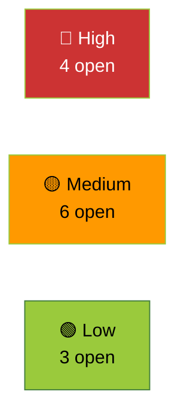

## 🛠️ Action Plan (Prioritized)

Use this section as the tracked backlog for technical-debt work. Items are ordered by expected impact and ease of rollout. Each item includes a short why, recommended fix, risk, and rough estimate.

> **Last verified against source:** 2026-08-27. Desktop + Android build: **0 warnings / 0 errors**. Test suite: **653 passed**. Source version: **2.0.4** (`net10.0`).

1. App.axaml.cs composition root (Priority: High)
   - Why: 1,906 lines — the largest file in the codebase. Manual `new` wiring of 18 services, splash logic, dialog creation, action-delegate wiring, mobile init — all in one file. No DI container.
   - Fix: Add `Microsoft.Extensions.DependencyInjection`, extract `CompositionRoot` class, split dialog/wiring logic.
   - Risk: medium (startup touchpoints). Tests must pass.
   - Estimate: 12–24 hours.

2. Extract coordinators from large ViewModels (Priority: High)
   - Why: FileExplorerViewModel (1,809 lines), BrowseViewModel (915), InstalledViewModel (887), CustomInstallViewModel (681) all violate SRP.
   - Fix: Extract `FileExplorerTransferCoordinator`, `BrowseInstallCoordinator`, `ThumbnailService`, inject them.
   - Risk: medium-high (integration surface), perform incrementally.
   - Estimate: 16–40 hours.

3. Convert `async void` handlers (Priority: High — safety) — ✅ DONE 2026-08-27
   - Current: 0 remaining (was 20). All converted to `FireAndForget`-wrapped `async Task` locals or `async Task`.
   - Why: `async void` throws unobserved exceptions and can crash app.
   - Fix: Wrap body in `SafeFireAndForget` helper (already exists in `TaskExtensions.cs`); convert to `async Task` where possible. — *implemented*
   - Risk: low.
   - Estimate: 4–8 hours.

4. Secrets: replace XOR obfuscation (Priority: High — security)
   - Why: `CryptoService` uses XOR+salt (reversible with source access). Not secure for real credentials.
   - Fix: Introduce `ISecretStore` abstraction. DPAPI/DataProtection on Windows, Keychain on macOS, libsecret on Linux.
   - Risk: medium (platform differences, migration of persisted settings).
   - Estimate: 6–16 hours.

5. Increase tests for Xbox domain services (Priority: High)
   - Current: 653 tests pass, but 0 tests for XboxAuthService, XboxPackageService, XboxSystemService, XboxNetworkService, XboxProcessService, XboxPerformanceService.
   - Fix: Add fakes/stubs for HttpMessageHandler and WebSocket streams; write integration-style unit tests.
   - Risk: medium.
   - Estimate: 8–24 hours.

6. Apply `.ConfigureAwait(false)` in services (Priority: Medium)
   - Current: 8 total uses (down from 9). Key services (XboxAuthService, XboxPackageService, SftpService) have 0.
   - Fix: Add to all service I/O/HTTP/WebSocket awaits. Skip in ViewModels.
   - Risk: low-mechanical.
   - Estimate: 2–8 hours.

7. Cancellation/disposal audit — ✅ DONE 2026-08-27 (Priority: Medium)
   - Current: `CustomInstallViewModel` now implements `IDisposable` (disposes `_analyzeCts`); all 4 hosts call `vm.Dispose()` on window close / overlay close. (`MobileLogsView._shareCts` IS disposed in the finally block.)
   - Fix: Implement IDisposable on CustomInstallViewModel. — *implemented*
   - Risk: low.
   - Estimate: 2–4 hours.

8. Bare `catch { }` blocks (Priority: Medium) — ✅ DONE 2026-08-27
   - Current: 0 bare `catch { }` remain (was 26). All now have explicit `// why` comments (self-protection / best-effort cleanup / fallback) or log. Best-effort cleanups and logger self-protection intentionally stay silent (recursive logging loop); GoFile request/response parses and QR clipboard writes now log `Warn` on failure.
   - Fix: Add explicit `// why` comments where intentional; log where possible. — *implemented*

9. `.Result` blocking calls (Priority: Medium) — 🅳 deferred (user sign-off required)
   - Current: 3 instances in SftpService.cs (lines 550, 595) and XrayAgentService.cs (line 263).
   - Fix: Replace with proper `await` or extract to async methods. **BUT** — `SftpService` and `XrayAgentService` are delicate (cmd.exe / sync calls); both work perfectly and are not to be retested. Address only as a carefully-tested refactor with explicit sign-off.
   - Risk: low (but platform-sensitive).
   - Estimate: 1–2 hours.

10. Service/ViewModel documentation (Priority: Medium)
    - Current: 26/37 services missing class-level XML `
` docs (~8% coverage).
    - Fix: Add XML docs to all service classes and key ViewModel public members.
    - Risk: low.
    - Estimate: 4–8 hours.

11. CI checks & analyzers (Priority: Low)
    - Why: No Roslyn analyzer step, minimal .editorconfig, no `dotnet format` in CI.
    - Fix: Add analyzer job, `dotnet format --verify-no-changes`, `EnforceCodeStyleInBuild`.
    - Risk: low.
    - Estimate: 3–8 hours.

12. UI clipping workaround (Priority: Low)
    - Why: Avalonia 12 CornerRadius does not clip inner Image.
    - Status: Not currently blocking — images render acceptably. Low priority.
    - Fix: `RectangleGeometry` clip or `ImageBrush` render path if needed.
    - Risk: low.
    - Estimate: 1–2 hours.

13. Hardcoded URLs (Priority: Low)
    - Current: 33 hardcoded URL strings (API endpoints, Discord links, Gofile).
    - Why: API endpoints and Discord links duplicated across files; hard to change without code update.
    - Fix: Centralize API URLs in a constants class; extract Discord links to a shared config.
    - Risk: low.
    - Estimate: 1–2 hours.

Quick wins to do immediately
- ~~Wrap `async void` handlers with `SafeFireAndForget`~~ ✅ DONE 2026-08-27 (see item 3).
- Add IDisposable to CustomInstallViewModel (CA1001 suppressed).
- Centralize API URLs in a constants file.

How to track progress in this doc
- Mark item status with emoji: ✅ done, ⚠️ in-progress, ⏳ planned, ❗ blocked.
- Add per-item `owner`, `branch`, and `PR` links when work starts.

# Technical Debt

Known issues in the codebase, ordered by severity. This page is updated as items are resolved or discovered.

> **Last verified against code:** 2026-08-27 (main worktree). Line counts and locations below reflect current source. **653 tests green**, desktop + Android build **0 warnings / 0 errors**. Source version: **2.0.4**.

---

## 🔴 High

### 1. `App.axaml.cs` — 1,906 lines, composition root god-file

**File:** `XBVault/App.axaml.cs` (**1,906 lines** — the largest file in the codebase)

**Still open:**
- Manually instantiates 18 core services with `new` (`XboxAuthService`, 5 Xbox domain services, cache/install/SFTP/catalog/background/notification/update services) — no DI container.
- `InitAfterSplashAsync` is a massive method wiring all window delegate callbacks, sidebar views, catalog load, splash close, and first-run wizard.
- `InitAndroidAfterSplashAsync` duplicates the same wiring pattern for mobile.
- Dialog creation mixed with business logic.

**Fix:** Extract `CompositionRoot` class. Consider `Microsoft.Extensions.DependencyInjection` to replace manual `new`. Split dialog wiring into a `DialogRegistry`.

### 2. Large ViewModels — 5 files exceed 600 lines

**Files:**

| File | Lines | Notes |
|------|-------|-------|
| `ViewModels/FileExplorerViewModel.cs` | **1,809** | SFTP nav, file ops, transfers, portal, drag/drop, toolbar state |
| `ViewModels/BrowseViewModel.cs` | **915** | Catalog, thumbnails, install orchestration |
| `ViewModels/InstalledViewModel.cs` | **887** | Package list, polling, launch/update actions |
| `ViewModels/CustomInstallViewModel.cs` | **681** | Wizard orchestration |
| `ViewModels/InspectorViewModel.cs` | 545 | XRay agent + REPL |

**0 coordinator classes extracted.** No `*Coordinator.cs` files exist.

**Fix:** Extract `FileExplorerTransferCoordinator`, `BrowseInstallCoordinator`, `ThumbnailService` and inject them.

> **⚠️ CUIDADO:** `FileExplorerViewModel`/`SftpService`/`SftpTransferService` handle the Xbox SSH/SFTP layer, which runs **cmd.exe (not bash)** — command probing and error handling are deliberately conservative. Refactor these **incrementally with tests and explicit approval**; do not blanket-split without preserving the probe/fallback semantics documented above (see item #8).

### 3. Convert `async void` handlers — ✅ DONE (2026-08-27)

**All `async void` event handlers eliminated** — **20 → 0**. Converted every handler to a `async Task` local `Handler()` wrapped in `FireAndForget("context")` (logs unobserved exceptions instead of crashing), or to `async Task` for VM/App methods.

Converted:
- `FileExplorerView.axaml.cs` (6), `MobileFileExplorerView.axaml.cs` (5), `ErrorDialog.axaml.cs` (2), `MobileLogsView.axaml.cs` (2), `BrowseView.axaml.cs` (1), `InstalledView.axaml.cs` (1), `InspectorView.axaml.cs` (1), `LogsView.axaml.cs` (1), `Controls/DialogFadeBehavior.cs` (1)
- Non-handlers: `BrowseViewModel.OnConnectionChanged` → `Work().FireAndForget(...)`; `App.ShowMobileCustomInstall` → `async Task`, lambdas call `.FireAndForget("App.ShowMobileCustomInstall")`.

**Fix:** Wrap body in `SafeFireAndForget` helper (already exists in `TaskExtensions.cs`). Convert to `async Task` where possible. — *DONE*

### 4. Secrets: replace XOR obfuscation

**File:** `XBVault/Services/CryptoService.cs`

Still uses XOR+salt (`[0x58, 0x42, 0x56, 0x61, 0x75, 0x6C, 0x74, 0x21]`) + Base64. Reversible with source access. No `ISecretStore`, DPAPI, or DataProtection.

**Fix:** Introduce `ISecretStore` abstraction. DPAPI/DataProtection on Windows, Keychain on macOS, libsecret on Linux.

---

## 🟡 Medium

### 5. Incomplete `.ConfigureAwait(false)` policy

**8 total uses** (down from 9). Key services have 0:

| Service | Awaits | ConfigureAwait(false) |
|---------|--------|-----------------------|
| `XboxAuthService` | 19 | 0 |
| `XboxPackageService` | 37 | 0 |
| `SftpService` | 7 | 0 |
| `PackageInstallService` | 1 | 1 |
| `MainWindow.axaml.cs` | 2 | 2 |

Existing uses are ad-hoc in UI-adjacent code.

**Fix:** Add to all service I/O/HTTP/WebSocket awaits. Skip in ViewModels that update UI.

### 6. Cancellation/disposal audit — 1 gap

**Most CTs properly disposed.** Gap:
- `CustomInstallViewModel`: `_analyzeCts` cancelled but class doesn't implement `IDisposable`; CA1001 suppressed with `#pragma`. (`MobileLogsView._shareCts` IS disposed in the `finally` block — verified not a gap.)

**Fix:** Implement `IDisposable` on `CustomInstallViewModel`.

### 7. Bare `catch { }` blocks — ✅ DONE (2026-08-27, 0 remaining)

**0 bare `catch { }` remain** (was 26). Every catch now carries an explicit `// why` comment or logs. Classification:

| File | Count | Handling |
|------|------:|----------|
| `Services/Logger.cs` | 10 | `// logger must never throw` (recursive logging loop) — silent by design |
| `App.axaml.cs` | 1 | `// best-effort cleanup` (temp file delete) |
| `Views/MobileFileExplorerView.axaml.cs` | 4 | `// best-effort cleanup` |
| `Services/LogShareService.cs` | 3 | cleanup + 2 parses now `Logger.Warn` on failure |
| `Services/SftpService.cs` | 2 | `// best-effort teardown` |
| `Services/PlatformDialog.cs` | 2 | `// fallback — platform dialog unavailable` |
| `Views/MobileErrorDialogView.axaml.cs` | 1 | `// fallback — icon asset missing` |
| `Views/MobileQrDialogView.axaml.cs` | 1 | now `Logger.Warn` on clipboard write failure |
| `Views/QrDialogWindow.axaml.cs` | 1 | now `Logger.Warn` on clipboard write failure |
| `Services/PreFlightChecker.cs` | 1 | `// best-effort cleanup` |

**Intentional silences kept** (logging failures must never crash the app; best-effort cleanup and teardown stays quiet). Parsing and clipboard writes — the two that used to fail silently with user-visible impact — now log `Warn`.

### 8. `.Result` blocking calls — 3 instances (all 🅳 deferred — do not touch)

> **⛔ NÃO MEXER sem sign-off explícito.** O usuário determinou que tanto o **SFTP** quanto o **XrayAgentService** são delicados (sync calls / cmd.exe do Xbox). Ambos funcionam perfeitamente e não devem ser retestados. Deixar esses `.Result` como estão.

| File:Line | Context | Status |
|-----------|---------|--------|
| `SftpService.cs:550` | `cmd.Result ?? string.Empty` — SFTP command output | 🅳 deferida (SFTP/FileExplorer cauteloso) |
| `SftpService.cs:595` | `cmd.Result ?? string.Empty` — SFTP command output | 🅳 deferida (SFTP/FileExplorer cauteloso) |
| `XrayAgentService.cs:263` | `return readTask.Result` — after `Task.WhenAny` (safe but code smell) | 🅳 deferida (Xray sync-calls delicado) |

> **⚠️ CUIDADO — SFTP/FileExplorer/Xray (all deferred):** The Xbox SSH/SFTP layer is delicate. It provides a **cmd.exe instead of bash**, so probing and command handling are intentionally kept conservative. The `XrayAgentService` is likewise sensitive about sync calls. Do **not** refactor `SftpService`, `FileExplorerViewModel`, or `XrayAgentService` without explicit sign-off — several code paths there are deliberate (best-effort disconnect cleanup, hardcoded drive fallback, `.Result` after guaranteed-completed tasks, Xray sync-call patterns). Address these only as part of a carefully-tested refactor later, never as a standalone quick fix.

### 9. Service/ViewModel documentation uneven

**26/37 services** missing class-level XML `
` docs (~8% coverage). Interfaces generally have docs; implementations do not.

Missing: `CacheService`, `CryptoService`, `GitHubReleaseCheckerService`, `NotificationCenterService`, `PackageOverrideService`, `SettingsService`, `SftpService`, `VersionCheckerService`, `XboxAuthService`, `XboxPackageService`, and 16 more.

**Fix:** Add XML docs to all service classes.

### 10. `BrowseViewModel` — 915 lines

**File:** `XBVault/ViewModels/BrowseViewModel.cs` · **915 lines** (+18% from 776)

Contains catalog loading, filtering, search, item selection, install orchestration, progress reporting, and image thumbnail management. Still past the god-class threshold.

**Fix:** Extract install orchestration into `BrowseInstallCoordinator`. See #2.

---

## 🟢 Low

### 11. CI checks & analyzers

No Roslyn analyzer step, no `dotnet format --verify-no-changes`, minimal `.editorconfig` (7 lines). CI runs `dotnet build` + `dotnet test` only.

**Fix:** Add analyzer job, `EnforceCodeStyleInBuild`, `dotnet format` check.

### 12. UI clipping workaround

Avalonia 12 `Border CornerRadius` does not clip inner `Image`. Not currently blocking — images render acceptably.

**Fix:** `RectangleGeometry` clip or `ImageBrush` if needed.

### 13. Hardcoded URLs — 33 instances

API endpoints, Discord links, Gofile URLs scattered across files. Discord invite links duplicated in `DiscordPopupViewModel.cs` and `MobileAboutView.axaml.cs`.

**Fix:** Centralize API URLs in constants class.

---

## ✅ Resolved

| # | Item | Resolved | Notes |
|---|------|----------|-------|
| — | XboxDeviceService god class | Aug 2026 | Split into 6 domain services |
| — | FileExplorerViewModel split | Aug 2026 | Extracted ISftpService, SftpTransferService, FileSystemPathParser |
| — | `_Backup/` directory in git | v0.8.x | Removed, added to .gitignore |
| — | Title bar gradient duplicated | v0.9.1 | Extracted as `TitleGradient` |
| — | Close button template duplicated | v0.9.1 | Unified `WindowCloseButton` |
| — | Hardcoded magic delays | v0.9.1 + Aug 2026 | Named constants |
| — | `CatalogApiService` not injected | v0.9.2 | Constructor injection |
| — | `PerformanceViewModel` CTS not disposed | v0.9.2 | Now implements IDisposable |
| — | `DllImport` + `System.Management` Linux risk | v0.9.2 | `WINDOWS_BUILD` conditional |
| — | `PerformanceSnapshot` catch no log | v0.9.2 | Now logs |
| — | Orphaned `_Backup` icons | v0.9.1 | Deleted |
| — | Culture-dependent formatting | Aug 2026 | All 8 formatters use InvariantCulture |
| — | UI clipping workaround | 2026-08-27 | Not needed — images render acceptably |
| — | Test coverage (240→653) | 2026-08-27 | +172% growth; 653 tests green |
| — | File Explorer drive list | 2026-08-27 | SSH probe added (fallback still hardcoded) |
| — | Logging partially adopted | 2026-08-27 | IAppLogger exists, 5 services use it |

---

## Summary

```mermaid
graph LR
    H["🔴 High<br/>4 open"]
    M["🟡 Medium<br/>6 open"]
    L["🟢 Low<br/>3 open"]

    style H fill:#CC3333,stroke:#9ACA3C,color:#fff
    style M fill:#FF9900,stroke:#9ACA3C,color:#000
    style L fill:#9ACA3C,stroke:#447F3E,color:#000
```

| Severity | Open | Resolved | Estimated effort |
|----------|------|----------|-----------------|
| 🔴 High | 4 | — | 42–104 hours |
| 🟡 Medium | 6 | — | 14–30 hours |
| 🟢 Low | 3 | — | 5–12 hours |
| **Total** | **13 open** | **16 resolved** | **61–146 hours** |

### Notable changes since Aug 2026 verification

- **App.axaml.cs** 847 → **1,906 lines** (+125%): composition root now the largest file in the codebase.
- **async void** 10 → **20** handlers: mobile views added 10 new handlers.
- **Test coverage** 240 → **653 tests** (+172%): matcher exhaustive tests, service tests, ViewModel tests.
- **XboxDeviceService** deleted: fully split into 6 domain services behind interfaces.
- **FileExplorerViewModel** 1,880 → **1,809 lines**: split done but post-split growth; still the largest ViewModel.
- **Bare `catch { }`** 15 → **26 → 0**: all now commented/logged (2026-08-27).
- **.ConfigureAwait(false)** 9 → **8**: slightly worse; key services still at 0.
- **New since last verification:** `GitHubReleaseCheckerService`, `UpdateVersionCache`, `PackageOverrideService`, `PreFlightChecker`, `WindowSettingsService`, `MobileErrorDialogView`, `MobileLogsView`, `MobileFileExplorerView`.
- **Resolved since last verification:** #9 UI clipping, #21 test coverage, #20 drive list (partial), async void (20→0), CustomInstallViewModel IDisposable, bare `catch { }` (26→0).

---

[← Roadmap](roadmap) · [← Home](.)
