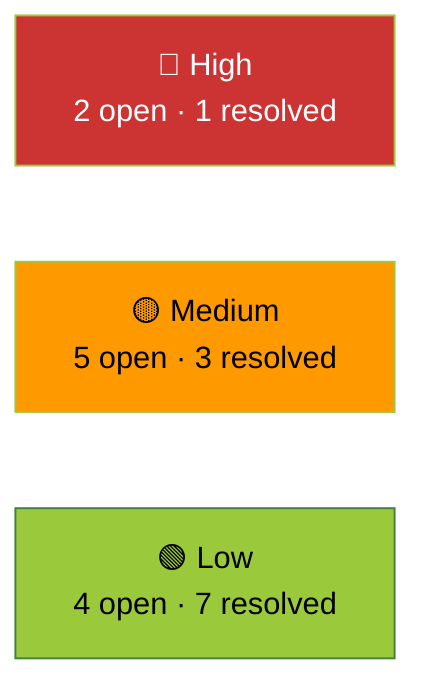

# Technical Debt

Known issues in the codebase, ordered by severity. This page is updated as items are resolved or discovered.

> **Last verified against code:** August 2026 (v1.2.0). Line counts and locations below reflect the current source and were re-verified against the v1.2.0 tree — several items grew significantly since the June 2026 verification.

---

## 🔴 High

### 1. XboxDeviceService — God class split (in progress — split #1 done)

**File:** `XBVault/Services/XboxDeviceService.cs` · **170 lines** (was 1,433) · now a thin facade delegating to 6 extracted services

**Progress (Aug 2026, split #1):** The god class was split via the facade strategy:

| New service | File | Lines | Responsibilities |
|-------------|------|-------|------------------|
| `XboxAuthService` | `Services/XboxAuthService.cs` | 334 | HTTP client, CSRF, cookies, Configure/Test/Disconnect |
| `XboxPackageService` | `Services/XboxPackageService.cs` | 504 | list, install, uninstall, launch, suspend, terminate, running packages |
| `XboxProcessService` | `Services/XboxProcessService.cs` | 90 | list processes, kill, running title |
| `XboxSystemService` | `Services/XboxSystemService.cs` | 237 | system info, crash dumps, crash control, screenshot, restart, shutdown |
| `XboxNetworkService` | `Services/XboxNetworkService.cs` | 99 | network config, wifi interfaces/networks |
| `XboxPerformanceService` | `Services/XboxPerformanceService.cs` | 87 | WebSocket performance, snapshot |
| `XboxResponseParser` | `Services/XboxResponseParser.cs` | 156 | pure static JSON/error helpers |

`XboxDeviceService` now implements `IDisposable` (see #8) and keeps `ConnectionChanged` + the static helper delegates so existing callers/tests stay green. **147 tests still pass, build 0 warnings/0 errors.**

**Still open:**
- ViewModels still inject the facade, not the domain services (migration phase).
- No interfaces (`IXboxPackageService`, etc.) yet — mocking blocked.
- `App.axaml.cs` composition root still does `new XboxDeviceService()`; domain services not registered.
- Shared types centralized in `XBVault/Models/XboxSharedTypes.cs` (`PackagesResponse`, `SshConnectionInfo`, `ConnectionTestResult`).

**Remaining plan:** inject domain services into ViewModels, add interfaces, then delete the facade. See [Split XboxDeviceService](ideas/refactor-xboxdeviceservice).

### 2. `FileExplorerViewModel` — new god class (undocumented)

**File:** `XBVault/ViewModels/FileExplorerViewModel.cs` · **1,880 lines** · **cyclomatic complexity 254** (highest in the project)

**Problem:** Added in v0.9.0 and never tracked in tech debt. It is now the **largest file in the codebase** — bigger than `XboxDeviceService`. Mixes SSH/SFTP operations, drive mounting, recursive folder upload, path parsing, drag-drop state, and UI state management. Upload logic alone spans `UploadFolderAsync`/`UploadMixedAsync`/`UploadFileAsync` with per-file progress reporting.

**Fix:** Split into:
- `SftpUploadService` — folder/mixed/file upload pipelines with progress
- `FileSystemPathParser` — drive-relative path normalization (used by ~15 call sites)
- `FileExplorerViewModel` keeps only tree/list state + command wiring

### ~~3. `_Backup/` directory tracked in git~~ ✅ Resolved (v0.8.x)

Removed from tracking, added to `.gitignore`, deleted from disk.

---

## 🟡 Medium

### 4. `App.axaml.cs` — 724 lines, manual composition root (partial)

**File:** `XBVault/App.axaml.cs` (was 497 lines in June 2026)

**Still open:**
- Manually instantiates all core services with `new` (XboxDeviceService, CacheService, PackageInstallService, SftpService, CatalogApiService, PackageOverrideService) — no DI container. Zero `Microsoft.Extensions.DependencyInjection` usage anywhere in the project.
- `InitAfterSplashAsync` is a very large method wiring all window delegate callbacks, sidebar views, catalog load, splash close, and first-run wizard.

**Resolved since June 2026:**
- The two bare `catch { }` blocks (formerly lines 107/110 in `ShowErrorDialogSafe`) are **fixed** — all catch blocks now log via `Logger.Error`.

**Fix:** Extract dialog wiring into a `DialogRegistry` class. Consider a lightweight DI container (`Microsoft.Extensions.DependencyInjection`) to replace manual `new`.

### 5. No `ConfigureAwait(false)` anywhere — 404 awaits

**~404 `await` calls across Services/ViewModels. Zero use `.ConfigureAwait(false)`.**

Spread across `XboxDeviceService.cs` (~100+), `PackageInstallService.cs`, `CatalogApiService.cs`, `SftpService.cs`, `XrayAgentService.cs`, and all ViewModels. The `await` count grew ~4x since the June 2026 verification (~82–100).

Service-layer continuations unnecessarily capture the UI synchronization context, which can cause deadlocks and reduces throughput.

**Fix:** Add `.ConfigureAwait(false)` to all `await` calls in Services (HTTP, file I/O, WebSocket). Skip in ViewModels that update `ObservableProperty` on the UI thread.

### 6. Silent exception swallowing — mostly resolved, but regressions appeared

The 10 originally-documented silent catches were all fixed (logged) in v0.9.2. However a **fresh scan (Aug 2026) finds 26 bare `catch { }` sites**, most of which are intentional but several need attention:

| File | Line | Pattern | Verdict |
|------|------|---------|---------|
| `Services/Logger.cs` | 126, 152, 220–241, 304 | self-protection | ✅ intentional (logger can't log itself) |
| `Services/SftpService.cs` | 109, 113 | disconnect + `Logger.Trace` | ✅ intentional |
| `Services/XboxDeviceService.cs` | 770–819 | JSON parse guards returning `false` | ⚠️ intentional but silently swallows malformed responses — add `Logger.Trace` |
| `Program.cs` | 88 | last-resort stderr | ✅ intentional |
| `ViewModels/FileExplorerViewModel.cs` | 1835 | unknown | ⚠️ check + log |
| `ViewModels/InstalledViewModel.cs` | 521, 543 | refresh error handling | ⚠️ check + log |
| `Views/ErrorDialog.axaml.cs` | 145, 157 | clipboard | ⚠️ low risk, add trace |
| `Views/FileExplorerView.axaml.cs` | 601 | drop handler | ⚠️ check + log |
| `Converters/BoolToValueConverter.cs` | 18 | converter fallback | ⚠️ add trace |

**Fix:** Audit the ⚠️ sites; add `Logger.Warn/Trace` where the exception is not deliberately ignored.

### 7. `async void` in code-behind — grew 11 → 22 instances

**22 instances across 11 files** (up from 11). Unhandled exceptions in `async void` crash the process with no recovery:

| File | Line | Method | Risk |
|------|------|--------|------|
| `MainWindow.axaml.cs` | 271 | `OnDiscordClick` | High |
| `MainWindow.axaml.cs` | 279 | `OnDisconnectClick` | High |
| `Views/BrowseView.axaml.cs` | 109 | `OnDrop` | High |
| `Views/ConnectionWindow.axaml.cs` | 59 | `OnConnectionCompleted` | High |
| `Views/ErrorDialog.axaml.cs` | 95 | `OnConnectClick` | High |
| `Views/ErrorDialog.axaml.cs` | 110 | `OnDownloadClick` | High |
| `Views/FileExplorerView.axaml.cs` | 278 | `OnTreeItemExpanded` | High |
| `Views/FileExplorerView.axaml.cs` | 289 | `OnBrowseFilesClick` | High |
| `Views/FileExplorerView.axaml.cs` | 307 | `OnUploadFilesClick` | High |
| `Views/FileExplorerView.axaml.cs` | 328 | `OnUploadFolderClick` | High |
| `Views/FileExplorerView.axaml.cs` | 349 | `OnUploadZipExtractClick` | High |
| `Views/FileExplorerView.axaml.cs` | 647 | `OnDropZoneDrop` | High |
| `Views/InspectorView.axaml.cs` | 147 | `OnDrop` | High |
| `Views/InstalledView.axaml.cs` | 108 | `OnDrop` | High |
| `Views/NetworkInfoWindow.axaml.cs` | 15 | `OnLoaded` | High |
| `Views/LogsView.axaml.cs` | 44 | `OnCopyClick` | Low |
| `Views/SftpInfoWindow.axaml.cs` | 23–59 | 4 × clipboard copy | Low |
| `Controls/DialogFadeBehavior.cs` | 46 | `OnClosing` | Low |

**Fix:** Wrap body in a safe `FireAndForget` extension with exception logging, or restructure to `async Task` where possible.

### ~~8. `XboxDeviceService` does not implement `IDisposable`~~ ✅ Resolved (split #1)

**File:** `XBVault/Services/XboxDeviceService.cs:170`

The god class held `HttpClient _http` and `HttpClientHandler? _handler` (both disposable) but had no `Dispose()`. During split #1 the state moved into `XboxAuthService` (which implements `IDisposable`), and the facade now forwards `Dispose()` to it. `GC.SuppressFinalize` present in both.

**Note:** `App.axaml.cs` still never calls `Dispose()` on the facade at shutdown — the resource is freed on process exit. Revisit when composition root is reworked (see #4).

### 9. Border CornerRadius does not clip Image (Avalonia 12.0.0)

**Files:** `Views/BrowseView.axaml`, `Views/ItemDetailWindow.axaml`

`Border CornerRadius="8,8,0,0"` with `Image Stretch="UniformToFill"` inside does not clip to rounded corners — image corners bleed through. Re-verified Aug 2026: still no clip workaround in the tree.

**Tried:** overlay Border stroke, separate Border with CornerRadius, `ClipToBounds="True"`. None worked.

**Next steps:**
- Apply `Clip` geometry via code-behind (`RectangleGeometry` with `RadiusX/Y` bound to `ActualWidth/ActualHeight`)
- Or use `ImageBrush` inside a `Border` (different render path, may clip correctly)
- Check if a newer Avalonia patch resolves this

### 10. Large ViewModels beyond the god-class threshold (undocumented)

**Files:** beyond `BrowseViewModel`, these ViewModels now exceed the ~500-line threshold:

| File | Lines | Complexity | Notes |
|------|-------|-----------|-------|
| `ViewModels/FileExplorerViewModel.cs` | **1,880** | **254** | see #2 |
| `ViewModels/BrowseViewModel.cs` | **899** | 167 | grew from 580 |
| `ViewModels/CustomInstallViewModel.cs` | 726 | 98 | wizard orchestration |
| `ViewModels/InstalledViewModel.cs` | 632 | 112 | package list + refresh |
| `ViewModels/InspectorViewModel.cs` | 545 | 72 | XRay agent + REPL |

**Fix:** No immediate action for the smaller ones, but `BrowseViewModel` (catalog loading + filtering + search + install orchestration + thumbnail management) is a refactor candidate: extract install orchestration into a coordinator.

### ~~11. Title bar gradient duplicated across windows~~ ✅ Resolved (v0.9.1)

Extracted as `TitleGradient` named resource in `BladesTheme.axaml`.

### ~~12. Close button template duplicated across windows~~ ✅ Resolved (v0.9.1)

Unified `WindowCloseButton` style in `BladesTheme.axaml`.

---

## 🟢 Low

### ~~13. Hardcoded magic delays~~ ✅ Mostly resolved (v0.9.1)

Named constants now cover the bulk (`SplashMinDelayMs`, `PollDelayMs`, `RetryDelayMs`, `DialToneDelayMs`, etc.). Two stragglers remain as raw literals:

| File | Line | Value |
|------|------|-------|
| `Controls/DialogFadeBehavior.cs` | 53 | `200` |
| `ViewModels/CustomInstallViewModel.cs` | 550, 566 | `1500` × 2 |

**Fix:** Promote to `const`/`static readonly TimeSpan`.

### ~~14. `CatalogApiService` not injected~~ ✅ Resolved (v0.9.2)

`BrowseViewModel` now receives `CatalogApiService` via constructor (`BrowseViewModel.cs:50`). No more self-instantiation.

### ~~15. `PerformanceViewModel` — `CancellationTokenSource` never disposed~~ ✅ Resolved

Now implements `IDisposable` and calls `_cts?.Dispose()` (`PerformanceViewModel.cs:18–21`).

### ~~16. `DllImport` in Logger + `System.Management` load-time risk on Linux~~ ✅ Resolved (v0.9.2)

`UsbDriveDetector` WMI code wrapped in `#if WINDOWS_BUILD`; csproj defines `WINDOWS_BUILD` only on Windows builds. Non-Windows builds get a no-op fallback.

### ~~17. `PerformanceSnapshot.cs` — catch with no log~~ ✅ Resolved

Now logs `Logger.Error(ex, "Failed to parse PerformanceSnapshot")`.

### 18. `BrowseViewModel.cs` — approaching the god-class threshold

**File:** `XBVault/ViewModels/BrowseViewModel.cs` · **899 lines** (grew from 580)

Contains catalog loading, filtering, search, item selection, install orchestration, progress reporting, and image thumbnail management.

**Fix:** Extract install-related logic into a dedicated coordinator. See #10.

### ~~19. Orphaned `_Backup` icons~~ ✅ Resolved (v0.9.1)

Deleted `Assets/_Backup/` directory.

### 20. File Explorer drive list is hardcoded — no discovery

**File:** `ViewModels/FileExplorerViewModel.cs:429` (`DetectDrivesAsync`)

The File Explorer surfaces a **static** set of drives — `{ "C", "D", "E", "G", "J", "L", "M", "N", "Q", "S", "T", "U", "V", "X", "Y" }` — with no runtime discovery.

**Fix:** Discover drives dynamically over SSH instead of hardcoding — e.g. probe `cd {letter}: && echo ok` across the alphabet, and build the list from what actually responds. Keep the current set only as a fallback if discovery fails.

**Status:** Sufficiently addressed for now — the expanded list covers all known Xbox drive letters.

### 21. Zero test coverage — highest-impact gap

**Status:** Mostly resolved (Aug 2026) — 147 tests green: Phase 1a/1b (pure services) + Phase 1c (19 god-class helpers characterized, 2 real bugs found/fixed). See [Testing Infrastructure](ideas/testing-infrastructure).

**Still open:** instance logic of `XboxDeviceService` (HTTP/WebSocket) + `FileExplorerViewModel` (SFTP pipelines) — blocked on splits #1/#2. Split #1 done (facade); instance tests can now target the domain services (`XboxAuthService`, `XboxPackageService`, …) directly.

### 22. Comment ratio 0–2% across Services/ViewModels

`Services/` at 2% comments, `ViewModels/` at 0%. Business logic in `XboxDeviceService` (error-code interpretation, retry loops) and `PackageInstallService` (dependency classification) is undocumented inline.

**Fix:** Add `// why` comments to non-obvious logic during the #1/#2 refactors rather than as a standalone pass.

### 23. Culture-dependent size/speed formatting — latent in 8 formatters

**Fixed (Aug 2026):** `XboxDeviceService.SizeFormat` and `FileExplorerViewModel.FormatBps` now use `CultureInfo.InvariantCulture` — found by Phase 1c tests (pt-BR machine output `1,5KB`, CI en-US `1.5KB` → flaky).

**Still latent** — same `:F1` current-culture pattern in: `SftpEntry.FormatSize`, `SystemInfo` (line 77/80), `PackageInstallService` (485/488), `ProcessInfo` (47/50), `CrashDumpInfo` (25/28), `PreFlightChecker` (263/266), `UsbDriveDetector` (93–95), `SettingsViewModel` (185–187).

**Fix:** Switch each to `CultureInfo.InvariantCulture` when next touched (or batch pass — ~30 min).

---

## Summary

```mermaid
graph LR
    H["🔴 High<br/>2 open · 1 resolved"]
    M["🟡 Medium<br/>5 open · 3 resolved"]
    L["🟢 Low<br/>4 open · 7 resolved"]
    
    style H fill:#CC3333,stroke:#9ACA3C,color:#fff
    style M fill:#FF9900,stroke:#9ACA3C,color:#000
    style L fill:#9ACA3C,stroke:#447F3E,color:#000
```

| Severity | Open | Resolved | Estimated effort |
|----------|------|----------|-----------------|
| 🔴 High | 2 | 1 ✅ | 8–14 hours |
| 🟡 Medium | 5 | 3 ✅ | 8–18 hours |
| 🟢 Low | 4 | 7 ✅ | 2–4 hours |
| **Total** | **11 open** | **11 resolved** | **18–36 hours** |

### Notable changes since June 2026 verification

- **`XboxDeviceService` 1,433 → 170 lines** (split #1): extracted `XboxAuthService`, `XboxPackageService`, `XboxProcessService`, `XboxSystemService`, `XboxNetworkService`, `XboxPerformanceService`, `XboxResponseParser`. Facade keeps `ConnectionChanged` + static helper delegates; **147 tests green, 0 build warnings**. See [Split XboxDeviceService](ideas/refactor-xboxdeviceservice).
- **Testing (Aug 2026):** 147 tests green. 17 god-class helpers characterized (#1 ×10, #2 ×7). Two real bugs found+fixed: `UpdateChildrenPathsRecursive` duplicated path segments on nested rename (grandchild got `\sub\sub\`); `SizeFormat`/`FormatBps` were culture-dependent (pt-BR comma vs CI dot).
- **`FileExplorerViewModel` (1,880 lines, complexity 254)** is now the largest file in the repo — untracked until this revision.
- **`App.axaml.cs` 497 → 724 lines**; bare `catch { }` at 107/110 **fixed** (now logged).
- **`BrowseViewModel` 580 → 899 lines** — past the god-class threshold.
- **`async void` 11 → 22** instances across 11 files.
- **`await` count ~82–100 → ~404**; still **0** `.ConfigureAwait(false)`.
- **Bare `catch { }`**: 26 sites found; most intentional, several regressions flagged in #6.
- **Resolved since last revision:** #14 (CatalogApiService DI), #15 (CTS dispose), #16 (WINDOWS_BUILD guard) — all were marked open in the June verification but are confirmed fixed in v1.2.0.
- **Testing (Aug 2026):** 144 tests green. 17 god-class helpers characterized (#1 ×10, #2 ×7). Two real bugs found+fixed: `UpdateChildrenPathsRecursive` duplicated path segments on nested rename (grandchild got `\sub\sub\`); `SizeFormat`/`FormatBps` were culture-dependent (pt-BR comma vs CI dot).
- **New services** added since June docs (untracked): `XrayAgentService`, `GitHubReleaseCheckerService`, `UpdateVersionCache`, `PackageOverrideService`, `PreFlightChecker`, `WindowSettingsService`.

---

[← Roadmap](roadmap) · [← Home](.)
