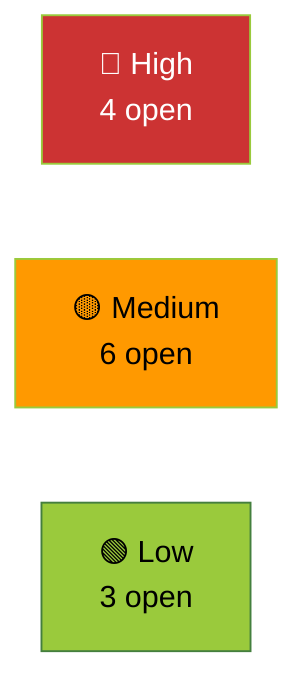

 
## 🛠️ Action Plan (Prioritized)

Use this section as the tracked backlog for technical-debt work. Items are ordered by expected impact and ease of rollout. Each item includes a short why, recommended fix, risk, and rough estimate.

> **Last verified against source:** 2026-08-17. Desktop app build: **0 warnings / 0 errors**. Test suite: **240 passed**. Source version: **1.4.0** (`net10.0`). Android skeleton builds in Release for `net10.0-android36.0/android-arm64` when `JAVA_HOME` points to JDK 21.

1. DI + composition-root cleanup (Priority: High)
   - Why: Manual `new` wiring in `App.axaml.cs` couples startup, hides lifetimes, and prevents easy testing.
   - Fix: Add `Microsoft.Extensions.DependencyInjection`, implement `CompositionRoot` to register services/interfaces, resolve services from provider in `App` and ensure provider disposal on shutdown.
   - Risk: medium (startup touchpoints). Tests must pass.
   - Estimate: 6–12 hours.

2. Convert `async void` handlers (Priority: High — safety)
   - Current: 10 actual `async void` event handlers remain (mostly drag/drop and file-picker code-behind).
   - Why: `async void` throws unobserved exceptions and can crash app.
   - Fix: Convert to `async Task` where possible; for event APIs that require `void`, wrap body with `FireAndForget` helper that logs exceptions.
   - Risk: low.
   - Estimate: 2–6 hours.

3. Apply `.ConfigureAwait(false)` in services (Priority: Medium — correctness/perf)
   - Current: 9 uses exist; service-layer coverage is still incomplete.
   - Why: Service-layer awaits can capture UI sync context unnecessarily.
   - Fix: Add `.ConfigureAwait(false)` to service I/O/HTTP/WebSocket awaits. Skip in ViewModels when interacting with UI-bound state.
   - Risk: low-mechanical; run tests.
   - Estimate: 2–8 hours (automatable via Roslyn fixer).

4. Secrets: replace XOR obfuscation (Priority: High — security)
   - Why: `CryptoService` currently only obfuscates secrets; not secure for real credentials.
   - Fix: Introduce `ISecretStore` abstraction. Implement DPAPI/DataProtection on Windows, Keychain on macOS, libsecret on Linux, or use `Microsoft.AspNetCore.DataProtection` with OS-backed key protection as a pragmatic cross-platform option.
   - Risk: medium (platform differences, migration of persisted settings).
   - Estimate: 6–16 hours.

5. Increase tests for Xbox domain services (Priority: High)
   - Current: 240 tests pass, but HTTP/WebSocket service instance behavior still needs deeper fake-transport coverage.
   - Why: HTTP/WebSocket-heavy services (`XboxAuthService`, `XboxPackageService`, etc.) lack enough instance-level unit tests.
   - Fix: Add fakes/stubs for `HttpMessageHandler` and WebSocket streams; write integration-style unit tests exercising error paths and retry logic.
   - Risk: medium.
   - Estimate: 8–24 hours.

6. Extract coordinators from large ViewModels (Priority: Medium)
   - Why: `BrowseViewModel`, `FileExplorerViewModel`, `CustomInstallViewModel` contain orchestration and transport logic violating SRP.
   - Fix: Create small coordinator/services (e.g., `BrowseInstallCoordinator`, `ThumbnailService`, `FileExplorerTransferCoordinator`) and inject them.
   - Risk: medium-high (integration surface), perform incrementally with tests.
   - Estimate: 8–40 hours per ViewModel (iterative).

7. Logging & observability (Priority: Medium)
   - Why: Static `Logger` is convenient but incompatible with DI-first lifecycles and structured logging.
   - Fix: Add `IAppLogger` wrapper and adapter for current `Logger`; plan migration to `Microsoft.Extensions.Logging` sinks incrementally.
   - Risk: low.
   - Estimate: 2–6 hours.

8. Cancellation/disposal audit (Priority: Medium)
   - Why: Some services create CTS internally and occasionally leak disposables.
   - Fix: Prefer passing `CancellationToken` from callers, ensure every `CancellationTokenSource` is disposed, and add `IDisposable` where ownership exists. Add unit tests for disposal behaviors where feasible.
   - Risk: low.
   - Estimate: 4–8 hours.

9. UI clipping workaround (Priority: Low)
   - Why: Avalonia 12 CornerRadius does not clip inner Image.
   - Fix: Use `RectangleGeometry` clip bound to `ActualWidth/ActualHeight` in code-behind or switch to `ImageBrush` render path.
   - Risk: low.
   - Estimate: 1–2 hours.

10. CI checks & analyzers (Priority: Low)
   - Why: Prevent regressions for `async void`, `.ConfigureAwait(false)`, formatting, and style.
   - Fix: Add Roslyn analyzers, `dotnet format`, and GitHub Actions job(s) to run analyzers + tests.
   - Risk: low.
   - Estimate: 3–8 hours.

Quick wins to do immediately
- Replace highest-risk `async void` handlers (MainWindow, FileExplorer drop/upload handlers, ConnectionWindow). Small PRs reduce crash surface quickly.
- Add `FireAndForget` helper and replace trivial event bodies.
- Add `IAppLogger` wrapper and use it in startup.

How to track progress in this doc
- Mark item status with emoji: ✅ done, ⚠️ in-progress, ⏳ planned, ❗ blocked.
- Add per-item `owner`, `branch`, and `PR` links when work starts.

# Technical Debt

Known issues in the codebase, ordered by severity. This page is updated as items are resolved or discovered.

> **Last verified against code:** 2026-08-17 (main worktree, after .NET 10 + static-analysis cleanup). Line counts and locations below reflect current source. **240 tests green**, desktop build **0 warnings / 0 errors**.

---

## 🔴 High

### 1. XboxDeviceService — God class split (resolved — split #2 done)

**Facade `XBVault/Services/XboxDeviceService.cs` deleted (Aug 2026, split #2).** God class fully split into 6 domain services behind interfaces; ViewModels inject `IXbox*` interfaces; composition root wires concrete services.

**Split #1 (Aug 2026):** facade strategy with 147 tests green, 0 warnings/0 errors.

**Split #2 (Aug 2026):**

| Interface | Implementation | Responsibilities |
|-----------|---------------|------------------|
| `IXboxAuthService` | `XboxAuthService` | HTTP client, CSRF, cookies, Configure/Test/Disconnect, ConnectionChanged, IsConnected |
| `IXboxPackageService` | `XboxPackageService` | list, install, uninstall, launch, suspend, terminate, running packages |
| `IXboxProcessService` | `XboxProcessService` | list processes, kill, running title |
| `IXboxSystemService` | `XboxSystemService` | system info, crash dumps, crash control, screenshot, restart, shutdown |
| `IXboxNetworkService` | `XboxNetworkService` | network config, wifi interfaces/networks |
| `IXboxPerformanceService` | `XboxPerformanceService` | WebSocket performance, snapshot |
| — | `XboxResponseParser` | pure static JSON/error helpers (tests retargeted here) |

- All 16 ViewModels inject the specific `IXbox*` services they need (auth + domain).
- `PackageInstallService` takes `IXboxPackageService`.
- `App.axaml.cs` composition root: `new XboxAuthService()` + 5 domain services with `auth` ctor arg; `InitAfterSplashAsync` takes concrete services.
- Tests: `XboxDeviceServiceHelperTests` → `XboxResponseParserTests` (`XboxDeviceService.` → `XboxResponseParser.`). **147 tests green, build 0 warnings/0 errors.**

**Remaining plan:** none — see [Split XboxDeviceService](ideas/refactor-xboxdeviceservice) for the historical record.

### ~~2. `FileExplorerViewModel` — new god class~~ ✅ Resolved (Aug 2026, split)

**File:** `XBVault/ViewModels/FileExplorerViewModel.cs` · **1,750 lines** (post-split growth: was 1,223 after split, 1,880 pre-split)

**Problem:** Added in v0.9.0 and never tracked in tech debt. Became the largest file in the codebase — bigger than `XboxDeviceService`. Mixed SSH/SFTP operations, drive mounting, recursive folder upload, path parsing, drag-drop state, and UI state management. Upload logic alone spanned `UploadFolderAsync`/`UploadMixedAsync`/`UploadFileAsync` with per-file progress reporting.

**Split (Aug 2026):** extracted into three layers —
- `FileSystemPathParser` (`XBVault/Helpers/`) — 9 static helpers (`FormatBps`, `InsertSorted`, `UpdateChildrenPathsRecursive`, `CollectExpandedPaths`, `ClearTreeCache`, `FindEntry`, `GetParentPath`, `FindParent`, `BuildBreadcrumbSegments`); VM keeps them via `using static`.
- `ISftpService` + `SftpService : ISftpService` — SSH/SFTP transport interface.
- `SftpTransferService` (`XBVault/Services/`) — upload/download pipelines (`UploadFilesAsync`, `UploadFolderAsync`, `UploadMixedAsync`, `UploadZipExtractAsync`, `DownloadFilesAsync`, `DownloadSingleFileAsync`, `DownloadFolderAsync`). Owns its own `CancellationTokenSource`; reports via `IProgress<TransferUpdate>`; returns `TransferResult` with `NewEntries` for the VM to splice into the tree. Best-effort partial-file cleanup on cancel.
- `FileExplorerViewModel` (1,880 → 1,223 lines at split, complexity 254 → 177) keeps tree/list state + command wiring only. Post-split USB/drive/portal work grew it back to **~1,750 lines** (see #10).

### ~~3. `_Backup/` directory tracked in git~~ ✅ Resolved (v0.8.x)

Removed from tracking, added to `.gitignore`, deleted from disk.

---

## 🟡 Medium

### 4. `App.axaml.cs` — 847 lines, manual composition root (partial)

**File:** `XBVault/App.axaml.cs` (**847 lines**)

**Still open:**
- Manually instantiates all core services and ViewModels with `new` (`XboxAuthService`, 5 Xbox domain services, cache/install/SFTP/catalog/background/notification/update services, and screen ViewModels) — no DI container. Zero `Microsoft.Extensions.DependencyInjection` usage in the app project.
- `InitAfterSplashAsync` is a very large method wiring all window delegate callbacks, sidebar views, catalog load, splash close, and first-run wizard.

**Resolved since June 2026:**
- The two bare `catch { }` blocks (formerly lines 107/110 in `ShowErrorDialogSafe`) are **fixed** — all catch blocks now log via `Logger.Error`.

**Fix:** Extract dialog wiring into a `DialogRegistry` class. Consider a lightweight DI container (`Microsoft.Extensions.DependencyInjection`) to replace manual `new`.

### 5. Incomplete service-layer `ConfigureAwait(false)` policy

**9 `.ConfigureAwait(false)` calls currently exist.** Most are in UI/code-behind or a single service retry path; service-layer I/O policy is not applied consistently.

High-value targets remain `XboxAuthService`, `XboxPackageService`, `XboxSystemService`, `XboxNetworkService`, `XboxProcessService`, `SftpService`, `SftpTransferService`, `CatalogApiService`, `PortalAppFilesService`, and `XrayAgentService`.

Service-layer continuations may capture the UI synchronization context unnecessarily, which can cause deadlocks and reduces throughput.

**Fix:** Add `.ConfigureAwait(false)` to all `await` calls in Services (HTTP, file I/O, WebSocket). Skip in ViewModels that update `ObservableProperty` on the UI thread.

### ~~6. Silent exception swallowing~~ ✅ Mostly resolved (Aug 2026)

The 10 originally-documented silent catches were fixed (logged) in v0.9.2. A fresh scan (2026-08-17) found **15** bare `catch { }` sites. They are concentrated in logger self-protection, last-resort fatal output, SFTP disconnect cleanup, and platform dialog fallbacks.

| File | Count | Rationale |
|------|------:|-----------|
| `Services/Logger.cs` | 9 | Logger self-protection; logging failures must not recursively fail the app |
| `Program.cs` | 1 | Last-resort fatal console output |
| `Services/SftpService.cs` | 2 | Best-effort disconnect cleanup |
| `Services/PlatformDialog.cs` | 2 | Native dialog fallback paths |
| `Services/PreFlightChecker.cs` | 1 | Best-effort environment probe |

**Kept intentional** (self-protection / last-resort): `Logger.cs` (9), `Program.cs` (89), `SftpService.cs` disconnect (127, 131), `PlatformDialog.cs` (64, 117), `PreFlightChecker.cs` (70). Still worth adding explicit `// why` comments where missing.

### 7. `async void` in code-behind — 10 remaining handlers

**10 actual `async void` declarations remain across 5 files.** Unhandled exceptions in `async void` can crash the process with no recovery. Two additional grep hits are documentation/comments, not handlers.

| File | Line | Method | Risk |
|------|------|--------|------|
| `Controls/DialogFadeBehavior.cs` | 50 | `OnClosing` | Low |
| `Views/BrowseView.axaml.cs` | 110 | `OnDrop` | High |
| `Views/InstalledView.axaml.cs` | 109 | `OnDrop` | High |
| `Views/InspectorView.axaml.cs` | 148 | `OnDrop` | High |
| `Views/FileExplorerView.axaml.cs` | 313 | `OnTreeItemExpanded` | High |
| `Views/FileExplorerView.axaml.cs` | 324 | `OnBrowseFilesClick` | High |
| `Views/FileExplorerView.axaml.cs` | 342 | `OnUploadFilesClick` | High |
| `Views/FileExplorerView.axaml.cs` | 363 | `OnUploadFolderClick` | High |
| `Views/FileExplorerView.axaml.cs` | 384 | `OnUploadZipExtractClick` | High |
| `Views/FileExplorerView.axaml.cs` | 700 | `OnDropZoneDrop` | High |

**Fix:** Wrap body in a safe `FireAndForget` extension with exception logging, or restructure to `async Task` where possible.

### ~~8. `XboxDeviceService` does not implement `IDisposable`~~ ✅ Resolved (split #1)

**File:** `XBVault/Services/XboxDeviceService.cs:170`

The god class held `HttpClient _http` and `HttpClientHandler? _handler` (both disposable) but had no `Dispose()`. During split #1 the state moved into `XboxAuthService` (which implements `IDisposable`), and the facade now forwards `Dispose()` to it. `GC.SuppressFinalize` present in both.

**Note:** `App.axaml.cs` still never calls `Dispose()` on the facade at shutdown — the resource is freed on process exit. Revisit when composition root is reworked (see #4).

### 9. Border CornerRadius does not clip Image (Avalonia 12.0.0)

**Files:** `Views/BrowseView.axaml`, `Views/ItemDetailWindow.axaml`

`Border CornerRadius="8,8,0,0"` with `Image Stretch="UniformToFill"` inside does not clip to rounded corners — image corners bleed through. Re-verified Aug 2026: still no clip workaround in the tree.

**Tried:** overlay Border stroke, separate Border with CornerRadius, `ClipToBounds="True"`. None worked.

**Next steps:**
- Apply `Clip` geometry via code-behind (`RectangleGeometry` with `RadiusX/Y` bound to `ActualWidth/ActualHeight`)
- Or use `ImageBrush` inside a `Border` (different render path, may clip correctly)
- Check if a newer Avalonia patch resolves this

### 10. Large ViewModels beyond the god-class threshold (undocumented)

**Files:** beyond `BrowseViewModel`, these ViewModels now exceed the ~500-line threshold:

| File | Lines | Complexity | Notes |
|------|-------|-----------|-------|
| `ViewModels/FileExplorerViewModel.cs` | **1,750** | — | post-split growth, see #2 |
| `ViewModels/BrowseViewModel.cs` | **776** | — | catalog, thumbnails, install orchestration |
| `ViewModels/InstalledViewModel.cs` | **757** | — | package list, polling, launch/update/autostart actions |
| `ViewModels/CustomInstallViewModel.cs` | **742** | — | wizard orchestration |
| `ViewModels/InspectorViewModel.cs` | 545 | 72 | XRay agent + REPL |

**Fix:** No immediate action for the smaller ones, but `BrowseViewModel` (catalog loading + filtering + search + install orchestration + thumbnail management) is a refactor candidate: extract install orchestration into a coordinator.

### ~~11. Title bar gradient duplicated across windows~~ ✅ Resolved (v0.9.1)

Extracted as `TitleGradient` named resource in `BladesTheme.axaml`.

### ~~12. Close button template duplicated across windows~~ ✅ Resolved (v0.9.1)

Unified `WindowCloseButton` style in `BladesTheme.axaml`.

---

## 🟢 Low

### ~~13. Hardcoded magic delays~~ ✅ Resolved (v0.9.1 + Aug 2026)

Named constants cover the bulk (`SplashMinDelayMs`, `PollDelayMs`, `RetryDelayMs`, `DialToneDelayMs`, etc.). The last two raw-literal stragglers were promoted (Aug 2026):

| File | Before | After |
|------|--------|-------|
| `Controls/DialogFadeBehavior.cs` | `Task.Delay(200)` | `FadeOutDelay` (`static readonly TimeSpan`) |
| `ViewModels/CustomInstallViewModel.cs` | `Task.Delay(1500)` × 2 | `UninstallRetryDelayMs = 1500` (const) |

### ~~14. `CatalogApiService` not injected~~ ✅ Resolved (v0.9.2)

`BrowseViewModel` now receives `CatalogApiService` via constructor (`BrowseViewModel.cs:50`). No more self-instantiation.

### ~~15. `PerformanceViewModel` — `CancellationTokenSource` never disposed~~ ✅ Resolved

Now implements `IDisposable` and calls `_cts?.Dispose()` (`PerformanceViewModel.cs:18–21`).

### ~~16. `DllImport` in Logger + `System.Management` load-time risk on Linux~~ ✅ Resolved (v0.9.2)

`UsbDriveDetector` WMI code wrapped in `#if WINDOWS_BUILD`; csproj defines `WINDOWS_BUILD` only on Windows builds. Non-Windows builds get a no-op fallback.

### ~~17. `PerformanceSnapshot.cs` — catch with no log~~ ✅ Resolved

Now logs `Logger.Error(ex, "Failed to parse PerformanceSnapshot")`.

### 18. `BrowseViewModel.cs` — approaching the god-class threshold

**File:** `XBVault/ViewModels/BrowseViewModel.cs` · **776 lines**

Contains catalog loading, filtering, search, item selection, install orchestration, progress reporting, and image thumbnail management.

**Fix:** Extract install-related logic into a dedicated coordinator. See #10.

### ~~19. Orphaned `_Backup` icons~~ ✅ Resolved (v0.9.1)

Deleted `Assets/_Backup/` directory.

### 20. File Explorer drive list is hardcoded — no discovery

**File:** `ViewModels/FileExplorerViewModel.cs:429` (`DetectDrivesAsync`)

The File Explorer surfaces a **static** set of drives — `{ "C", "D", "E", "G", "J", "L", "M", "N", "Q", "S", "T", "U", "V", "X", "Y" }` — with no runtime discovery.

**Fix:** Discover drives dynamically over SSH instead of hardcoding — e.g. probe `cd {letter}: && echo ok` across the alphabet, and build the list from what actually responds. Keep the current set only as a fallback if discovery fails.

**Status:** Sufficiently addressed for now — the expanded list covers all known Xbox drive letters.

### 21. Zero test coverage — highest-impact gap

**Status:** Mostly resolved (Aug 2026) — **240 tests green**. Coverage includes pure helpers, service workflows, `SftpTransferService` with an in-memory `FakeSftpService`, settings/cache/catalog flows, and background task behavior. See [Testing Infrastructure](ideas/testing-infrastructure).

**Still open:** instance logic of the Xbox domain services (HTTP/WebSocket) — `XboxAuthService`, `XboxPackageService`, … need in-memory fakes/stubs.

### 22. Service/ViewModel documentation still uneven

Interface XML docs and contributor architecture docs were added in Aug 2026, but inline documentation remains uneven in complex workflow code.

**Progress (Aug 2026):** service interfaces now document cross-frontend contracts; `docs/developer-architecture.md` documents service/View/ViewModel boundaries and Android reuse rules. Still open: untouched business logic in large ViewModels, install classification, and retry/error interpretation.

### ~~23. Culture-dependent size/speed formatting — latent in 8 formatters~~ ✅ Resolved (Aug 2026)

**All 8 formatters** now use `CultureInfo.InvariantCulture` (with `using System.Globalization;` where missing), so size/percent strings render identically on pt-BR (comma) and en-US (dot):

| File | Formatter(s) |
|------|--------------|
| `Models/SftpEntry.cs` | `FormatSize` |
| `Models/SystemInfo.cs` | memory `FormatSize` |
| `Models/ProcessInfo.cs` | `MemoryDisplay`, `CpuDisplay` |
| `Models/CrashDumpInfo.cs` | `FileSizeDisplay` |
| `Services/PackageInstallService.cs` | `FormatBytes` |
| `Services/PreFlightChecker.cs` | `FormatBytes` |
| `Services/UsbDriveDetector.cs` | `FormatSize` |
| `ViewModels/SettingsViewModel.cs` | `FormatBytes` |

`XboxDeviceService.SizeFormat` and `FileExplorerViewModel.FormatBps` were already fixed in Phase 1c (tests). Each formatter carries a `// why` comment explaining the invariant.

---

## Summary

```mermaid
graph LR
    H["🔴 High<br/>4 open"]
    M["🟡 Medium<br/>6 open"]
    L["🟢 Low<br/>3 open"]
    
    style H fill:#CC3333,stroke:#9ACA3C,color:#fff
    style M fill:#FF9900,stroke:#9ACA3C,color:#000
    style L fill:#9ACA3C,stroke:#447F3E,color:#000
```

| Severity | Open | Resolved | Estimated effort |
|----------|------|----------|-----------------|
| 🔴 High | 4 | — | 22–58 hours |
| 🟡 Medium | 6 | — | 18–60 hours |
| 🟢 Low | 3 | — | 3–8 hours |
| **Total** | **13 open** | — | **43–126 hours** |

### Notable changes since June 2026 verification

- **`XboxDeviceService` 1,433 → deleted** (split #1 facade, split #2 removed it entirely): extracted `XboxAuthService`, `XboxPackageService`, `XboxProcessService`, `XboxSystemService`, `XboxNetworkService`, `XboxPerformanceService`, `XboxResponseParser`. See [Split XboxDeviceService](ideas/refactor-xboxdeviceservice).
- **.NET 10 migration (Aug 2026):** `net8.0` → `net10.0` (app + tests), CI `dotnet-version: 10.0.x`, `Tmds.DBus.Protocol` bumped to 0.92.0 (GHSA-xrw6-gwf8-vvr9). Release stays self-contained (no client runtime).
- **Testing (Aug 2026):** **240 tests green.** Helper and service workflows are covered; Xbox HTTP/WebSocket service instance tests remain the main gap.
- **`FileExplorerViewModel` (1,880 → 1,223 lines at split, now ~1,750)** — split done (Aug 2026): `FileSystemPathParser` helpers, `ISftpService`, `SftpTransferService`; VM keeps tree/list state + command wiring. Post-split USB/drive/portal work grew it back above the threshold (see #10).
- **`App.axaml.cs` 497 → 847 lines**; startup/composition/dialog wiring remains the largest composition-root debt.
- **`BrowseViewModel` ~776 lines** — still past the refactor threshold, though smaller than older verification numbers.
- **`async void`**: 10 actual event handlers remain.
- **`.ConfigureAwait(false)`**: 9 uses now exist; service-layer policy still incomplete.
- **Bare `catch { }`**: 15 sites found, mostly logger/platform-disconnect self-protection; still worth documenting or wrapping where possible.
- **Android skeleton:** `XBVault.Android` exists and builds successfully in Release with `JAVA_HOME=%LOCALAPPDATA%\Android\Sdk\jdk-21`. JDK 25 still triggers `XA0030`, so local docs/build scripts should standardize JDK 21 for Android work.
- **Resolved since last revision:** #14 (CatalogApiService DI), #15 (CTS dispose), #16 (WINDOWS_BUILD guard) — all were marked open in the June verification but are confirmed fixed in v1.2.0.
- **New services** added since June docs (untracked): `XrayAgentService`, `GitHubReleaseCheckerService`, `UpdateVersionCache`, `PackageOverrideService`, `PreFlightChecker`, `WindowSettingsService`.

---

[← Roadmap](roadmap) · [← Home](.)
