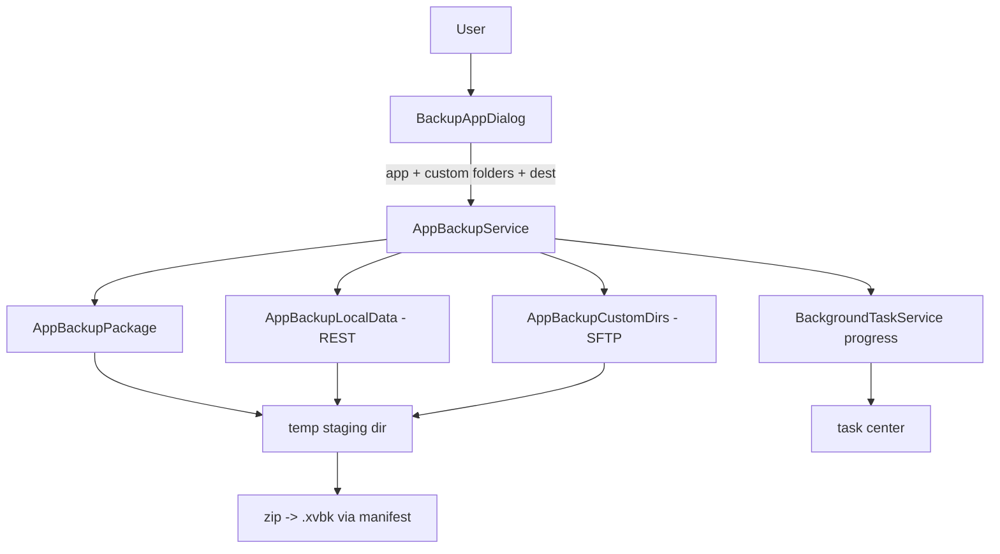

## Context

XBVault has three console access paths this feature composes:
- **REST filesystem**: `PortalAppFilesService` exposes per-app `UserFiles:\LocalAppData\<pkg>\...` / `DevelopmentFiles` as a read-only tree via `/api/filesystem/apps/*`.
- **SFTP**: the file explorer stack (`ISftpService` / `SftpTransferService`) already browses arbitrary remote folders.
- **Package retrieval**: the appx source is the open question — candidates are the portal filesystem, an existing download endpoint, or an SFTP path (`D:\DevelopmentFiles`).

Backup is read-only against the console (nothing modified). Runs as a `BackgroundTaskService` task.

## Goals / Non-Goals

**Goals:**
- One `.xvbk` ZIP per app: appx (best-effort) + LocalAppData/LocalState + user-selected SFTP folders + manifest.
- Multi-select remote-folder dialog (file-explorer style) in the backup wizard.
- Progress + cancellation via task center.

**Non-Goals:**
- Restore of backups (not requested — v1 backs up only; restore is a follow-up).
- Multi-app / bulk backup.
- Compression of data before zipping (zip does it).
- Cloud backup.

## Decisions

### 1. Orchestrator + three pullers, one ZIP
`AppBackupService` orchestrates three pullers into a temp staging dir, then zips. Each puller is its own service (testable independently):
- `AppBackupPackage` — appx download (source research task).
- `AppBackupLocalData` — recursive REST pull via `PortalAppFilesService`.
- `AppBackupCustomDirs` — recursive SFTP pull of chosen paths.

### 2. Manifest-first integrity
Write `manifest.json` listing app name/version, each part's presence/status, omission reasons, timestamps. Matches the `.xvbk` convention from the (later) vault-backup work and gives restore a validation anchor later.

### 3. Temp dir + atomic move
Stage everything under `%LOCALAPPDATA%/XBVault/backup-tmp/<backup-id>`, zip to `<dest>/<app>-<yyyyMMdd-HHmmss>.xvbk.tmp`, then rename to final. Cancel/failure → delete temp. No partial ZIP at destination.

### 4. Progress model
Two-phase progress: each puller reports its own sub-progress; orchestrator maps to a weighted 0–1 across parts (e.g. appx 30%, localdata 40%, custom 30%). Simple counters, no streaming byte-accurate progress in v1.

### 5. Custom-folder dialog reuse
Reuse the file-explorer remote-browser control for the multi-select dialog (SSH listing), returning selected remote paths. Single-select mode already exists; multi-select is the new bit.

### 6. Appx source research gate
Task 1.1 in tasks.md is a research spike: determine the reliable appx source (portal filesystem endpoint vs SFTP `D:\DevelopmentFiles\...`) before coding `AppBackupPackage`. Until resolved, appx part can ship `NotRetrievable` and the ZIP still works.

## Architecture

## File map

| File | Purpose |
| --- | --- |
| `XBVault/Services/AppBackupService.cs` | Orchestrator + temp/zip/atomic move |
| `XBVault/Services/AppBackupPackage.cs` | Appx pull |
| `XBVault/Services/AppBackupLocalData.cs` | REST LocalAppData/LocalState pull |
| `XBVault/Services/AppBackupCustomDirs.cs` | SFTP folder pull |
| `XBVault/ViewModels/BackupAppViewModel.cs` | Wizard VM |
| `XBVault/Views/BackupAppDialog.axaml` | Wizard UI (+ remote multi-select) |
| `XBVault/Views/InstalledView.axaml` (mod) | "Backup app" flyout item |

## Risks / Trade-offs

- **Appx source unreliable** → best-effort with `NotRetrievable`; research spike gates it.
- **REST LocalState pulls are slow (many files)** → progress + cancel; temp dir means abort is safe. Trade-off: no byte-accurate progress v1.
- **Large custom folders fill disk** → destination check before start (free-space estimate on staging + dest).
- **Read-only guarantee** → all pullers only read; verify no write endpoints touched in review.
- **App data changes during pull** → v1 accepts eventual consistency; manifest records pull window.

## Migration Plan

- Additive, read-only. Rollback: no backup files created unless user acts.

## Open Questions

- Confirm the reliable appx retrieval source (research spike).
- Default destination `%USERPROFILE%/XBVault-backups` acceptable? Shared with vault-backup convention.
- Should the custom-folder dialog allow arbitrary remote paths or only browseable tree nodes?
