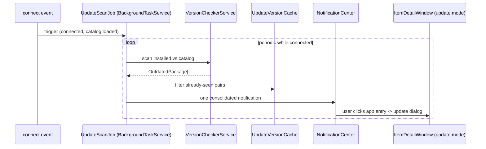

## Context

XBVault already does version comparison client-side: `BrowseViewModel` marks catalog/installed matches OUTDATED, InstalledView has an Update button that opens `ItemDetailWindow` in update mode, and `UpdateVersionCache` (`update-versions.json`) suppresses repeated notifications for a given installed→catalog version pair. XBVault's own update check exists as a startup dialog (`App.axaml.cs:CheckForUpdatesAsync`). This change adds the *proactive installed-apps* scan + consolidated notification, reusing all of the above.

## Goals / Non-Goals

**Goals:**
- Background scan while connected (on connect + periodic), deduped.
- One consolidated notification listing all updatable apps; per-app click → existing update dialog.
- Notifications land in the notification center (foundation) for later follow-up.

**Non-Goals:**
- Bulk "Update All" queue (future; see `version-checker-bulk-update.md`).
- Dedicated Updates tab (future).
- XBVault's own self-update flow (already exists, untouched).
- Scanning when disconnected.

## Decisions

### 1. Extract shared comparison into a service
`BrowseViewModel` already has the PFN-match + version-compare + outdated logic inline (around lines 700–760 using `_updateCache`). Extract a `VersionCheckerService` that returns `OutdatedPackage[]` (installed, catalog, installedVer, availableVer, compatible) so both Browse UI and the background scan share one code path. This fulfils the "VersionCheckerService" remaining item from `version-checker-bulk-update.md`.

### 2. Scan as a recurring BackgroundTaskService job, connected-gated
Job "Check app updates" registered with interval (default 30 min, configurable). The job body no-ops unless `IsConnected` and catalog is loaded. Also triggers immediately on connect. Uses the existing `BrowseViewModel`-populated catalog cache when present (avoid refetch).

### 3. Consolidated notification model
One `UpdateNotification` per scan result: title "N updates available", body = list of app entries (name, installed→available version). The notification center already supports click actions — each entry gets its own command that opens `ItemDetailWindow` in update mode for that app. If the app is no longer installed, the entry is dropped from the notification.

### 4. Dedupe stays in UpdateVersionCache
On a new version pair, `RecordUpdate(...)` marks it seen (same semantics as Browse UI). Only brand-new pairs raise a notification.

### 5. Entry point to Installed/update
`ItemDetailWindow` update mode is opened by `InstalledViewModel`'s Update button today. Add a small "open update for package X" action (route through `MainViewModel`/Installed tab activation) so the notification click reaches the same dialog.

## Architecture

## File map

| File | Purpose |
| --- | --- |
| `XBVault/Services/VersionCheckerService.cs` | Shared PFN/version comparison (extracted from BrowseViewModel) |
| `XBVault/Services/InstalledAppUpdateService.cs` | Scan job orchestration + connected gate + dedupe |
| `XBVault/ViewModels/UpdateNotificationViewModel.cs` | Notification content + per-app commands |
| `XBVault/ViewModels/BrowseViewModel.cs` (mod) | Use extracted `VersionCheckerService` |
| Connect flow (mod) | Trigger job on connect |

## Risks / Trade-offs

- **Scan cost on every connect** → dedupe + cache; scan is cheap local compare once catalog is in memory.
- **Catalog stale** → only scan with loaded catalog; otherwise skip + log (spec).
- **Notification duplication after reinstall** → `UpdateVersionCache` keyed by version pair; reinstall with same versions stays suppressed.
- **Catalog unavailable offline** → scan skipped silently (spec).

## Migration Plan

- Additive, read-only. Rollback: disable job; no notifications.

## Open Questions

- Default scan interval (lean 30 min) + configurable in Settings?
- Click behavior: open `ItemDetailWindow` directly, or switch to Installed tab with app highlighted? (Lean: open update dialog directly — matches existing Update button behavior.)
