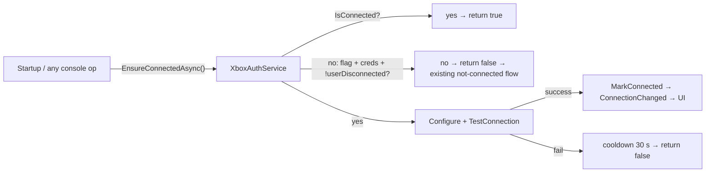

## Context

`background-async-tasks` (previous change) shipped the notification center + task center. This change drops its `ConnectionMonitorService` (recurring liveness job) as overengineered and adds a minimal auto-connect: one startup connect + lazy connect-before-operation. The app is a small singleton-style .NET 10/Avalonia app; no DI container. "Connected" is a reachability flag (`IXboxAuthService.IsConnected`), not a real session — REST calls work off saved credentials, so auto-connect is just Configure + Test + MarkConnected.

## Goals / Non-Goals

**Goals:**
- Connect once at startup when the user opts in (default off).
- Lazily auto-connect before any operation that needs the console, then proceed.
- Bounded self-mediation: cooldown after a failed auto-connect (~30 s) so a dead console doesn't get hammered.
- Explicit disconnect is respected until a manual reconnect or app restart.

**Non-Goals:**
- Background retry loops, reconnect manager, or recurring liveness probing (removed).
- Auto-connect for SFTP/storage operations (portal REST only).
- Detecting loss proactively — loss surfaces as an error on the next console-touching operation.

## Decisions

### 1. `EnsureConnectedAsync` owns auto-connect
`IXboxAuthService.EnsureConnectedAsync(ct)` returns true when already connected; otherwise, only when `AutoConnect` on + configured + not explicitly disconnected. It re-Configures from in-memory credentials, Tests the connection, and on success `MarkConnected()` (which flips all bound UI via `ConnectionChanged`). In-flight calls share one attempt via a `SemaphoreSlim`; a failed attempt stamps a 30 s cooldown.

### 2. Single setting, one toggle
`AutoConnect` (bool, default false). Toggle written to `SettingsService.Current` immediately; persisted on Settings Save. No max-attempts field, no interval — both dead concepts.

### 3. Startup connect is a visible one-shot task
After the window shows (and first-run wizard handled), if `AutoConnect` + credentials + not connected, a single `BackgroundTaskService.RunAsync("Connecting to Xbox…")` runs the connect with a result toast. No recurring job.

### 4. Explicit disconnect sticks
`Disconnect()` sets `_userDisconnected`; `EnsureConnectedAsync` refuses while set. `MarkConnected()` (manual connect) clears it — the user re-opted into auto behavior. App restart resets it.

## Architecture

## File map

| File | Purpose |
| --- | --- |
| `XBVault/Services/ConnectionMonitorService.cs` | **deleted** (job + events + toasts) |
| `XBVault/Services/IXboxAuthService.cs` + `XboxAuthService.cs` | `EnsureConnectedAsync` + `_userDisconnected` + `SemaphoreSlim` + cooldown |
| `XBVault/Models/AppSettings.cs` | +`AutoConnect`; −`ConnectionCheckIntervalSeconds` |
| `XBVault/ViewModels/SettingsViewModel.cs` + `Views/SettingsView.axaml` | toggle row; interval row removed |
| `XBVault/App.axaml.cs` | monitor wiring removed; startup autoconnect task + result toast |
| Installed / Tools / FileExplorer / Inspector / Browse ViewModels | `IsConnected` guards → `EnsureConnectedAsync` (flag-off keeps old flows) |
| `tests/XBVault.Tests/EnsureConnectedTests.cs` | 8 unit tests (flag, configured, disconnect, manual-reconnect, success, cooldown, concurrency) |

## Risks / Trade-offs

- **Dead console + AutoConnect on** → each operation stalls up to the 10 s test timeout, bounded to one attempt per 30 s by cooldown.
- **Loss detection is reactive** → no "Connection Lost" toast; the user notices when the next operation fails or lazily reconnects.
- **Stale in-memory credentials** → only if settings are edited on disk without ever reconnecting; negligible.

## Migration Plan

- Additive, off by default. Rollback: toggle off; `EnsureConnectedAsync` no-ops; monitor stays removed.
- Removes the `ConnectionCheckIntervalSeconds` setting (orphan JSON key ignored on load) and the task-center "Connection Monitor" scheduled/recent churn.
