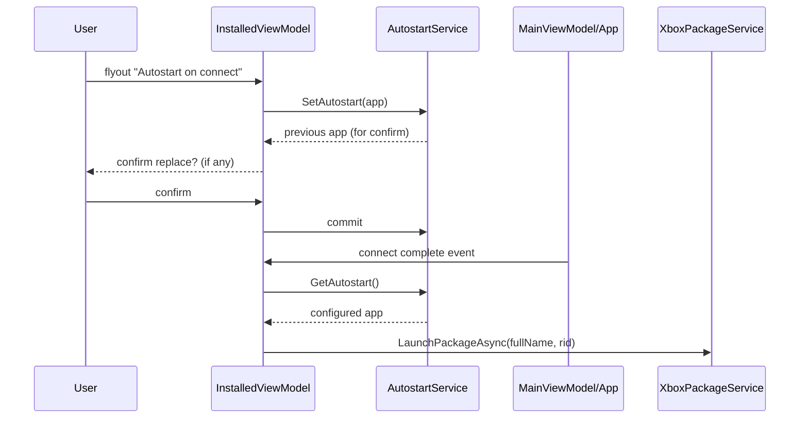

## Context

XBVault already launches installed apps from the Installed tab via `InstalledViewModel.LaunchPackageAsync` → `XboxPackageService.LaunchPackageAsync(fullName, rid)`, with `SuspendAnyRunningAsync` before launching. The connection lifecycle lives in `MainViewModel`/`App.axaml.cs` (connect completes → `IsXboxConnected = true`). This change adds a persisted "autostart on connect" app selection.

## Goals / Non-Goals

**Goals:**
- Per-app autostart toggle in the Installed tab flyout (icon + confirm dialog).
- Single-app exclusivity with replace confirmation.
- Top-left badge (OUTDATED style) + indicative color.
- Auto-launch on connect via existing `LaunchPackageAsync` path.
- Persisted selection.

**Non-Goals:**
- Multiple autostart apps (single favorite only, per decision).
- Settings-page placement (lives in Installed tab, per decision).
- Changing XBVault's own startup/daemon behavior.
- Autostart for X-ray agent or system apps.

## Decisions

### 1. Selection stored as `AutostartPackageFullName` in `AppSettings`
Single string field (the app's `FullName` or `PackageFamilyName`, matching how `LaunchPackageAsync` is invoked). Persisted via `SettingsService` (existing JSON settings file). Empty = none.

### 2. Exclusivity enforced in one service
`AutostartService` owns read/write of the selection and the "set replaces previous" rule. UI calls `SetAutostart(app)` (returns previous selection for the confirm prompt) and `ClearAutostart()`.

### 3. Badge reuses OUTDATED badge pattern
InstalledView card templates already render an OUTDATED badge (top-right per screenshots — user wants top-left for autostart, mirroring placement but distinct corner + color). Implement as a second overlay `Border` with a distinct resource key + color, same geometry/style.

### 4. Launch-on-connect hook reuses manual launch code
Refactor `InstalledViewModel.LaunchPackageAsync(pkg)` into a reusable `PackageLauncher` helper (suspend-running + launch + refresh), called both by Play and by the connect hook. Connect hook fires once after `IsXboxConnected` transitions true; if the autostart app isn't in the installed list, clear selection + notify.

### 5. No flyout duplication
The existing per-app flyout (Play/Run, Uninstall, etc.) gets one new `MenuItem` "Autostart on connect" with an icon; when the app is already autostart, the item reads "Remove autostart".

## Architecture

## File map

| File | Purpose |
| --- | --- |
| `XBVault/Services/AutostartService.cs` | Selection persistence + exclusivity |
| `XBVault/Models/AppSettings.cs` (mod) | `AutostartPackageFullName` |
| `XBVault/ViewModels/InstalledViewModel.cs` (mod) | Flyout item, badge state, connect hook |
| `XBVault/Views/InstalledView.axaml` (mod) | Flyout menu item + autostart badge overlay |
| `XBVault/Services/PackageLauncher.cs` (new) | Shared suspend+launch+refresh helper |

## Risks / Trade-offs

- **Launch on connect surprises user** → opt-in (off by default), clear badge + confirmation at set time.
- **App removed while set** → cleared on connect with notification (spec).
- **Two connections (autoconnect + manual) both firing hook** → hook fires on transition, guarded by `IsXboxConnected` edge detection.
- **Badge vs OUTDATED badge confusion** → different corner + color, documented in assets guide.

## Migration Plan

- Additive, off by default. Rollback: clear `AutostartPackageFullName`; no launch on connect.

## Open Questions

- Exact icon for the flyout item + badge (Blades/Numix set) — **resolved**: `icons8-automatic` family (`installed-autostart-16/20/48.png`).
- Where the connect-complete signal is best observed (`MainViewModel.IsXboxConnected` setter vs `App.axaml.cs`) — **resolved**: `InstalledViewModel.OnConnectionChanged` (via `ConnectionStateService`).
