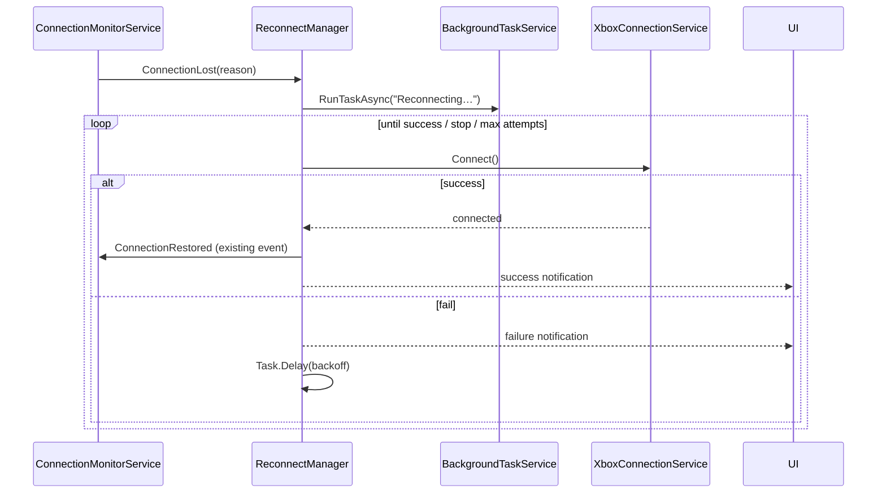

## Context

`background-async-tasks` (previous change) adds `ConnectionMonitorService` raising `ConnectionLost`/`ConnectionRestored`, plus notification center + task center. This change consumes those events. The app is a small singleton-style .NET 8/Avalonia app; no DI container. Connection client is `XboxConnectionService` (built on SSH.NET) with explicit Connect/Disconnect and saved credentials in `SettingsService`.

## Goals / Non-Goals

**Goals:**
- Reconnect with exponential backoff on `ConnectionLost`, only while the user opted in.
- Optional connect-at-startup behavior under the same single toggle (default off).
- Every attempt visible (task center + notifications); bounded retries (configurable, default 5) so a dead console doesn't spin forever.

**Non-Goals:**
- Replacing manual connect flow.
- Auto-reconnect for the file-transfer/storage connection beyond the portal connection.
- Persisting reconnect state across app restarts.

## Decisions

### 1. ReconnectManager subscribes to ConnectionLost, not to HTTP failures
The connection monitor already surfaces loss; manager is a pure consumer (single event source, no duplicate detection logic).

### 2. Backoff owned by a single retry loop task
One `BackgroundTask` ("Reconnecting to console…") drives all attempts for a single loss episode. Each failed attempt appends to task `Details`; a bounded attempt counter (from Settings, default 5) stops the loop. Backoff sequence 1/2/4/8/16/30/60 s, implemented with `Task.Delay` (no timer needed).

### 3. Stop conditions centralized in the loop guard
The loop checks a combined condition each iteration: autoconnect enabled AND not explicitly disconnected AND app not shutting down. Manual Connect resets state; manual Disconnect sets the stop flag.

### 4. Startup connect reuses the same code path as manual connect
`AutoconnectAtStartup` runs once after the main window shows (`MainWindow.Opened`), guarded by: single toggle on, credentials present, not already connected. Runs through `BackgroundTaskService.RunTaskAsync` so it appears in the task center with the same UI as manual connect.

### 5. Settings shape — one toggle + one number
- `AutoConnect` (bool, default false) — the single **"Autoconnect & reconnect"** toggle: gates both startup connect and automatic reconnect.
- `ReconnectMaxAttempts` (int, default 5) — bound for consecutive failed attempts, shown in Settings with its default. (Lean answer to the earlier "separate toggle vs tied" question: tied — one toggle, simpler UX.)
Reconnect manager re-reads both on each loop iteration; no restart needed to change them.

## Architecture

## File map

| File | Purpose |
| --- | --- |
| `XBVault/Services/ReconnectManager.cs` | Subscribes `ConnectionLost`, runs backoff loop, stop conditions |
| `XBVault/Services/SettingsService.cs` (mod) | `AutoConnect`, `ReconnectMaxAttempts` keys |
| `XBVault/Services/AppStartup.cs` (new or mod) | Startup connect wiring on window opened |
| Settings view (mod) | Toggle + max-attempts field (default shown) |

## Risks / Trade-offs

- **Reconnect storms on flaky Wi-Fi** → bounded attempts (`ReconnectMaxAttempts`, default 5) then stop; user must act. Trade-off: fully automatic reconnect beyond the bound is not attempted.
- **Startup connect slows first paint** → runs after window shown, asynchronously; UI stays responsive.
- **Console on sleep/unreachable** → backoff cap 60 s bounds request rate.
- **Two connect sources race** (startup + user click) → guard `if (IsConnected || connecting) return;` in the connect path.

## Migration Plan

- Additive, off by default. Rollback: toggle off; manager loop no-ops.
- Ships after `background-async-tasks` (connection monitor, notification center, task center must exist).

## Open Questions

- Max-attempts input type in Settings: numeric field vs fixed presets (lean: small numeric field, default 5).
- Whether reconnect should also fire when the app detects loss during an in-flight task (e.g. install) — lean: no auto-reconnect mid-task, surface error instead.
