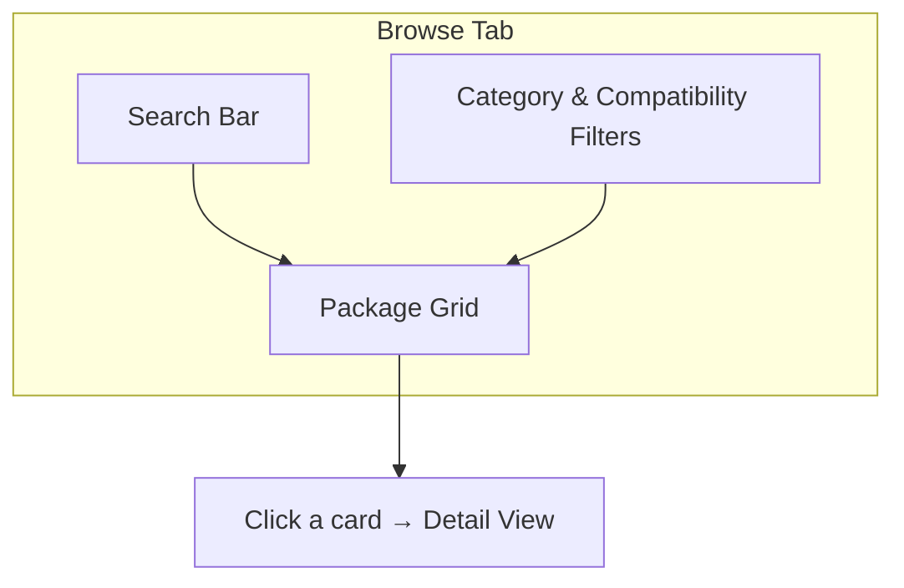
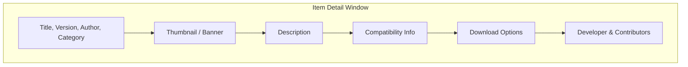

# Catalog Browser

The Catalog Browser is the main screen of XB Homebrew Vault. It lets you browse, search, and discover homebrew apps, emulators, games, and tools from the **Emulation Revival** catalog.

---

## Overview

When you open the app (and are connected), the **Browse** tab shows a grid of package cards. Each card represents an app or tool you can install on your Xbox.

---

## Browsing Packages

### Package Cards

Each card shows:
- **Thumbnail image** — artwork or icon for the package
- **Title** — the name of the app
- **Category** — what type of app it is (Emulator, Game, etc.)
- **Compatibility badge** — whether it works with your Xbox's architecture

### Categories

Packages are organized by type:

| Category | Examples |
|----------|----------|
| **Emulator** | RetroArch, DuckStation, XBSnes, PPSSPP |
| **Application** | Jellyfin, Kodi, Spotify |
| **Game** | Space Cadet Pinball, Quake |
| **Tool** | SMWRP, SMBR |
| **Library** | Mono, .NET Runtime |

---

## Searching

Use the **search bar** at the top of the Browse tab:

1. Type at least **3 characters** — results update as you type
2. Matches against the package **name** and **description**
3. Combine with category or compatibility filters for narrower results

**Tips:**
- If search returns nothing, try shorter or broader terms
- Clear the search bar to see all packages again
- The catalog must finish loading before search works — wait for the spinner to disappear

---

## Filtering

### Category Filter

Click the category dropdown to filter by type:
- Show only Emulators
- Show only Games
- Show only Applications
- etc.

### Compatibility Filter

The compatibility filter checks your Xbox's architecture against each package's requirements:
- **Compatible** — works on your Xbox
- **Incompatible** — won't work on your hardware
- You can toggle this filter to see all packages or only compatible ones

### Combining Filters

Search, category filter, and compatibility filter all work together. For example:
- Search "retro" + Category "Emulator" = RetroArch-style emulators
- Category "Game" + Compatibility filter = games that run on your Xbox

---

## Package Detail View

Click any card to open the **detail window**:

### What You See

| Section | Information |
|---------|-------------|
| **Header** | Package name, version, author, category badge |
| **Thumbnail** | Package artwork or banner image |
| **Description** | Detailed description of what the app does |
| **Compatibility** | Which Xbox architectures are supported |
| **Downloads** | Available download options (file variants) |
| **Developer** | Who built it, with links to GitHub, Ko-fi, Patreon, etc. |
| **Contributors** | People who ported, maintain, or contributed to the package |

### Author & Contributor Links

Each person listed may have clickable links to:
- **GitHub** — source code repository
- **Ko-fi** / **Patreon** / **Buy Me a Coffee** / **PayPal** — donation/support pages

Click any name to see their profile and support links.

### NEW and UPDATE Badges

- **NEW** — a package you haven't installed yet, recently added to the catalog
- **UPDATE** — a newer version is available for a package you already have installed

---

## Installing from the Catalog

From the detail view, click the **Install** button:

- If the package has only one download option, it installs immediately
- If there are multiple variants, a menu appears — choose the one you want

See [Installing Packages](Installing-Packages.md) for full details on the installation process.

---

## Custom Install (from Browse)

You can also start a **Custom Install** directly from the Browse tab:
- Click the Custom Install button in the sidebar or detail view
- This lets you install `.appxbundle`, `.msixbundle`, `.appx`, or `.msix` files from your PC

See [Installing Packages — Custom Install](Installing-Packages.md#custom-install-wizard) for details.

---

## Community Discord

Click the **Discord icon** in the sidebar to open a dialog with curated Xbox homebrew community servers. Great for getting help, sharing discoveries, and staying up to date.

---

## Auto-Update Checking

XB Homebrew Vault periodically checks for app updates in the background:
- When an update is available, a **notification** appears
- You can configure how often the app checks in [Settings](Settings.md)
- The catalog also shows **UPDATE** badges on packages that have newer versions available

---

## Tips

- **First load is slow** — the catalog downloads on first launch. Subsequent loads use the cached version.
- **No internet?** The catalog is cached locally — you can browse previously loaded packages offline.
- **Refresh** — if the catalog seems outdated, you can clear the cache in Settings and reload.
