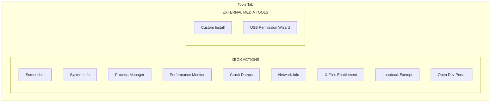

# Dev Tools

The **Tools** tab gives you access to Xbox system utilities that normally require the Device Portal web interface or specialized tools — all from within XB Homebrew Vault.

---

## Overview

> **Note:** You must be connected to your Xbox for these tools to work. If disconnected, the Tools tab shows a "Not connected" message with a Connect button.

---

## Screenshot Capture

Capture what's currently displayed on your Xbox screen.

### How to Use

1. Click **Screenshot** in the Tools tab
2. Wait a moment while the app captures the screen
3. The screenshot is saved as a **PNG file** on your PC
4. A visual confirmation shows when the save is complete

### Details

- Screenshots are saved to your PC's screenshots folder with a timestamp filename
- One click — no need to set up capture software on the Xbox
- Works for anything displayed on the Xbox screen in Dev Mode

---

## System Information

View detailed hardware and software information about your Xbox.

### What You See

| Information | Description |
|-------------|-------------|
| **Console Type** | Xbox One, Xbox One S, Xbox One X, Xbox Series S, or Xbox Series X |
| **OS Version** | The Dev Mode OS version and build number |
| **CPU** | Processor model and specifications |
| **Memory** | Total and available RAM |
| **Network** | IP address, MAC address, WiFi status, link speed |

### How to Use

1. Click **System Info**
2. A window opens with all the details
3. Close the window when done

---

## Process Manager

View and control running processes on your Xbox — like Task Manager, but for your Xbox.

### What You Can Do

| Action | Description |
|--------|-------------|
| **View process list** | See all active processes with their IDs and names |
| **Refresh** | Update the list to see current processes |
| **Kill process** | Force-stop an unresponsive or unwanted process |

### How to Use

1. Click **Process Manager**
2. The app loads the process list from your Xbox
3. Browse the list — each entry shows the process name and ID
4. Select a process and click **Kill** to terminate it
5. Click **Refresh** to update the list

> **Use with caution:** Killing system processes can cause your Xbox to behave unexpectedly. Only kill processes you recognize.

---

## Performance Monitor

Real-time performance metrics from your Xbox — CPU, memory, GPU, temperature, and network.

### What You See

| Metric | Description |
|--------|-------------|
| **CPU** | Overall utilization percentage |
| **Memory** | Used and available RAM |
| **GPU** | Utilization and clock speed |
| **Temperature** | CPU and GPU temperatures |
| **Network** | Current network throughput |

### How It Works

- Data updates in **real-time** via WebSocket connection
- A live chart shows metrics over time
- Useful for diagnosing performance issues or monitoring while testing apps

### How to Use

1. Click **Performance Monitor**
2. A window opens with live-updating charts
3. Watch the metrics in real-time
4. Close the window when done

---

## Crash Dumps

View and manage crash dump files collected from your Xbox. Crash dumps are created when an app crashes and contain diagnostic information.

### What You Can Do

| Action | Description |
|--------|-------------|
| **List dumps** | See all available crash dumps with timestamps |
| **View details** | Inspect the contents of a specific dump |
| **Delete** | Remove individual dumps or all at once |
| **Refresh** | Re-scan for new dumps |

### How to Use

1. Click **Crash Dumps**
2. The app lists all crash dumps from your Xbox
3. Select a dump to view its details
4. Delete dumps you no longer need to free up space

---

## Network Info

View detailed network configuration of your Xbox.

### What You See

| Information | Description |
|-------------|-------------|
| **IP Address** | Your Xbox's current IP address |
| **MAC Address** | Network hardware address |
| **WiFi Status** | Connected to WiFi or Ethernet |
| **Link Speed** | Current network connection speed |
| **Gateway** | Router/gateway address |
| **DNS** | DNS server addresses |

---

## X-Files Enablement

A one-click wizard that sets up the **X-Files** homebrew file explorer app to work with the Xbox Device Portal.

### What It Does

X-Files is a popular homebrew file manager for Xbox Dev Mode. However, it can't reach the Xbox's own REST API by default due to loopback restrictions. This wizard:

1. **Detects** if X-Files is installed on your Xbox
2. **Applies** the loopback exemption automatically
3. X-Files can then browse `LocalAppData` and `DevelopmentFiles`

### How to Use

1. Click **X-Files Enablement**
2. The wizard scans your installed packages
3. If X-Files is found, it applies the exemption
4. A success message confirms the setup

> **Note:** X-Files must be installed on your Xbox first. Install it from the catalog if you don't have it.

---

## Loopback Exempt Manager

A full manager for loopback exemptions on your Xbox. This is needed when Dev Mode apps need to access network services running on the Xbox itself (like the Device Portal REST API).

### What It Does

- Lists all installed packages that can receive loopback exemptions
- Shows the current exemption status for each
- Lets you **apply** or **remove** exemptions

### How to Use

1. Click **Loopback Exempt**
2. Browse the list of packages
3. Toggle exemptions on or off
4. Changes take effect immediately

---

## USB Permission Wizard

Prepare a USB drive for use with Xbox Dev Mode. This sets up NTFS file permissions so the Xbox can read and write to the drive.

> **Windows only:** USB detection works only on Windows. On macOS and Linux, specify the drive path manually.

### How to Use

1. Connect your USB drive to your PC
2. Click **USB Permission Wizard**
3. The app detects connected USB drives
4. Select your drive from the list
5. Click **Grant Permissions**
6. The app applies NTFS permissions via Windows `icacls`
7. Move the drive to your Xbox — it will be recognized and writable

### Requirements

- The USB drive must be formatted as **NTFS** (not FAT32 or exFAT)
- Run XB Homebrew Vault as **Administrator** if permission grant fails
- The drive must be connected **before** opening the wizard

---

## Open Dev Portal

Opens your Xbox's Device Portal web interface in your default browser. The URL is pre-filled with your Xbox's connection address.

This is a shortcut — you don't need to type the URL manually. The Device Portal gives you web-based access to your Xbox's Dev Mode features.
