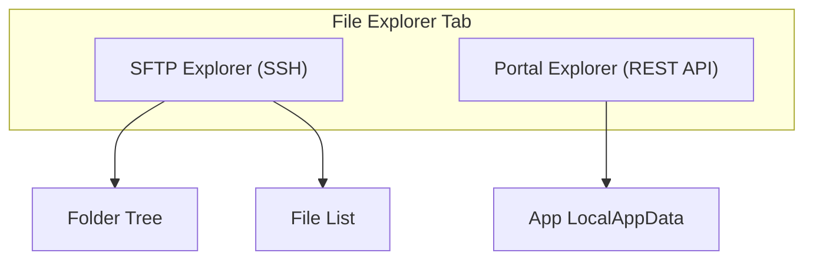
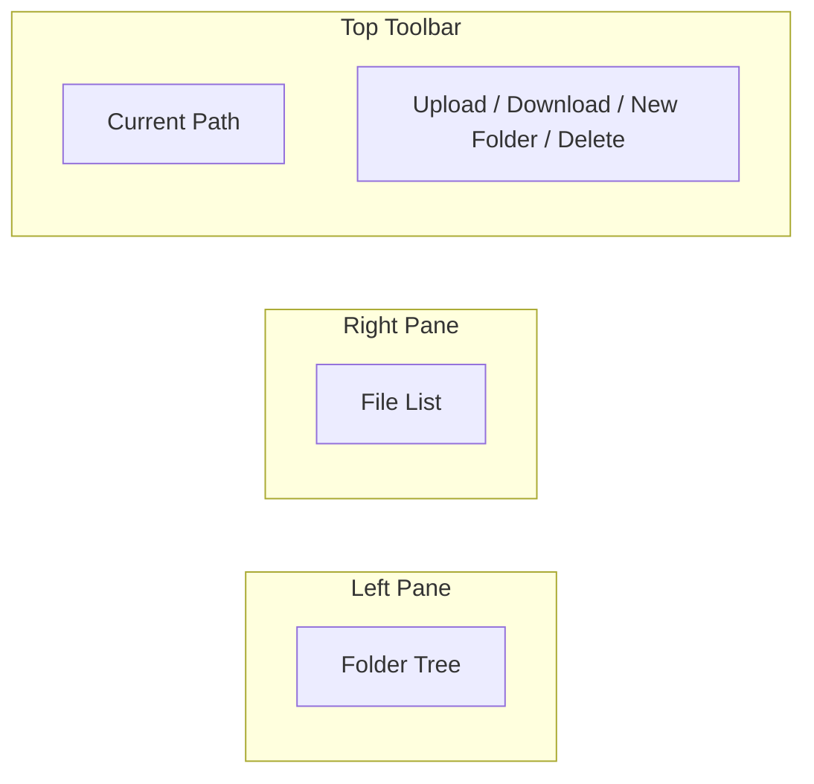

# File Explorer

The **File Explorer** tab lets you browse and manage files on your Xbox's file system directly from your PC — upload, download, delete, create folders, and navigate the directory tree.

---

## Overview

The File Explorer has two browsing modes:

| Mode | Protocol | What It Accesses |
|------|----------|-----------------|
| **SFTP Explorer** | SSH/SFTP | Full Xbox file system (sandbox) |
| **Portal Explorer** | REST API | App `LocalAppData` / `DevelopmentFiles` |

---

## SFTP Explorer (Main File Browser)

This is the primary file browser — it uses SSH/SFTP to connect to your Xbox's file system.

### Layout

The explorer has a **dual-pane** layout:

| Pane | Purpose |
|------|---------|
| **Left (Tree)** | Folder hierarchy — click to navigate |
| **Right (List)** | Files in the selected folder — with name, size, date |
| **Toolbar** | Current path, action buttons, status info |

### Navigation

1. Click a folder in the **tree** to expand it
2. Click a folder in the **file list** to open it
3. The **path bar** shows your current location
4. Use the **back** button to go up one level

### File Operations

#### Upload Files

1. Navigate to the target folder on your Xbox
2. Click **Upload** in the toolbar (or drag files onto the window)
3. Select files from your PC
4. Progress is shown for each file
5. Files appear in the list when done

**Upload supports:**
- Single file upload
- Folder upload (recursively uploads all contents)
- Drag and drop from your file manager

#### Download Files

1. Select a file or folder in the list
2. Click **Download**
3. Choose where to save on your PC
4. Progress is shown during transfer

#### Create a New Folder

1. Navigate to where you want the new folder
2. Click **New Folder**
3. Type the folder name
4. The folder appears in the list

#### Delete Files or Folders

1. Select the item(s) to delete
2. Click **Delete**
3. Confirm the deletion
4. Items are removed from your Xbox

### Transfer Speed

File transfers use optimized SFTP with adaptive buffering:
- Small files: fast transfer with minimal overhead
- Large files: buffer scales up to 1 MB for files over 1 GB
- Typical speeds: 60+ MB/s on a good local network

---

## Portal Explorer (App Files)

This mode accesses app-specific files through the Xbox Device Portal REST API. It's useful for browsing the files that your installed apps have created.

### What You Can Access

- `LocalAppData` — per-app data folders
- `DevelopmentFiles` — files placed by developers during deployment

### What You Can Do

| Action | Description |
|--------|-------------|
| **Browse** | Navigate the app file tree |
| **Download** | Download individual or multiple files |
| **Create Folder** | Create new folders inside an app's data |
| **Rename** | Rename files or folders |
| **Delete** | Remove files or folders |

### How to Use

1. The Portal view shows a list of installed apps
2. Select an app to browse its `LocalAppData`
3. Navigate folders and manage files as needed

> **Note:** Portal access uses the same credentials as your main Dev Mode connection.

---

## Connection Requirements

The File Explorer requires an active Dev Mode connection:

- **SFTP mode** — uses your Dev Mode SSH credentials (same as main connection)
- **Portal mode** — uses the Device Portal REST API (same credentials)

If you're not connected, the File Explorer shows a "Not connected" message with a Connect button.

---

## Keyboard Shortcuts

| Shortcut | Action |
|----------|--------|
| **Delete** | Delete selected file(s) |
| **Ctrl+A** | Select all files in list |
| **Escape** | Cancel current operation |

---

## Troubleshooting

| Problem | Solution |
|---------|----------|
| **Files don't load** | Check your connection — the File Explorer needs an active Dev Mode connection |
| **Upload fails** | Check Xbox disk space; try a wired connection for large files |
| **Can't see some folders** | Some Xbox system directories are restricted and won't show |
| **Slow transfers** | Wi-Fi can be slow — use Ethernet for large file operations |
| **Tree doesn't expand** | The folder may be empty or the connection may be slow — wait a moment |
