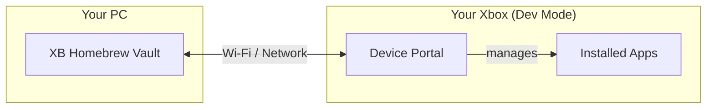

# XB Homebrew Vault — Wiki

Welcome to the **XB Homebrew Vault** wiki. This is your complete guide to using the app — from first launch to advanced features.

---

## What is XB Homebrew Vault?

XB Homebrew Vault is a free, open-source desktop app that connects to your Xbox (One or Series S|X) in **Developer Mode** over Wi-Fi. It lets you browse, install, and manage homebrew apps, emulators, and tools — all from your PC, without touching the Xbox dashboard.

**Works on:** Windows 10/11, macOS, Linux (x64 and ARM)

---

## Wiki Pages

### Getting Started

| Page | What you'll learn |
|------|-------------------|
| [Setup & Connection](Setup-and-Connection.md) | Install the app, connect to your Xbox, first-time setup |
| [CLI Reference](CLI-Reference.md) | Command-line options and flags |

### Using the App

| Page | What you'll learn |
|------|-------------------|
| [Catalog Browser](Catalog-Browser.md) | Browse, search, and discover homebrew packages |
| [Installing Packages](Installing-Packages.md) | One-click install, custom install, dependencies |
| [Installed Apps](Installed-Apps.md) | Launch, suspend, terminate, uninstall packages |
| [File Explorer](File-Explorer.md) | Browse and manage files on your Xbox via SSH/SFTP |
| [Settings](Settings.md) | Configure connection, preferences, and maintenance |

### Developer Tools

| Page | What you'll learn |
|------|-------------------|
| [Dev Tools](Dev-Tools.md) | Screenshot, system info, processes, performance, USB, network |
| [Inspector](Inspector.md) | Live log streaming, Lua REPL, remote diagnostics |

### Help & Reference

| Page | What you'll learn |
|------|-------------------|
| [Troubleshooting](Troubleshooting.md) | Fix common problems — connection, installs, crashes |
| [FAQ](FAQ.md) | Frequently asked questions |
| [Privacy & Data](Privacy-and-Data.md) | What data is stored, what is collected, how to reset |
| [Glossary](Glossary.md) | Technical terms explained in plain language |

---

## Quick Links

- **Download:** [Latest Release](https://github.com/marcelofrau/xb-homebrew-vault/releases/latest)
- **Report a Bug:** [GitHub Issues](https://github.com/marcelofrau/xb-homebrew-vault/issues)
- **Community:** Discord icon in the app sidebar

---

## Screenshots

| Catalog Browser | Installed Apps | Dev Tools |
|:---:|:---:|:---:|
|  |  |  |
