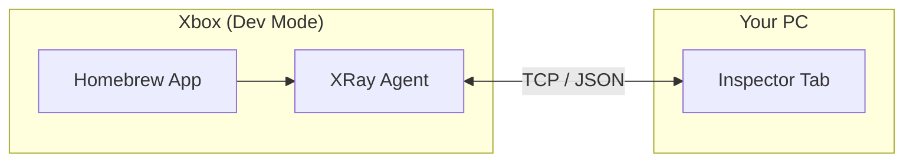
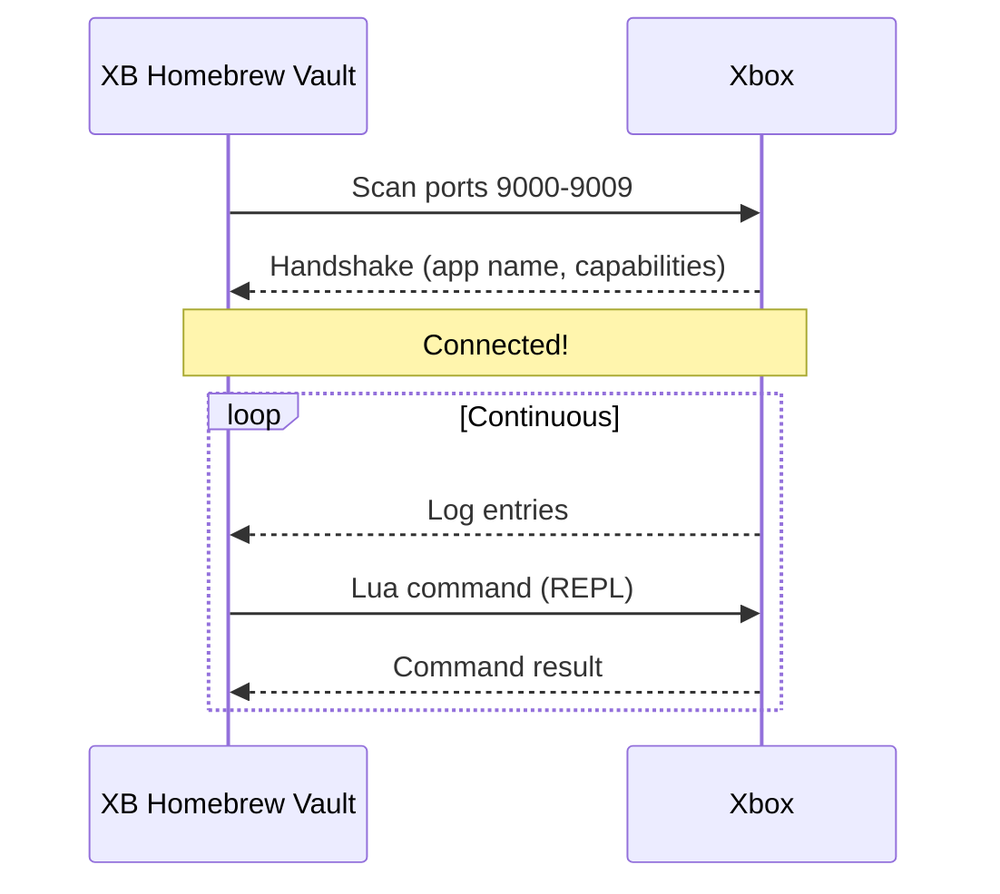

# Inspector (XRay)

The **Inspector** tab provides live diagnostics for Xbox homebrew apps that include the XRay agent library. It lets you stream logs in real-time and execute Lua commands remotely.

---

## What Is Inspector?

Inspector is a developer tool that connects to **XRay agents** running inside homebrew apps on your Xbox. Think of it like `adb logcat` for Android — but for Xbox.



| Capability | What It Does |
|------------|-------------|
| **Live Log Streaming** | See Xbox app logs in real-time as they happen |
| **Lua REPL** | Send Lua commands to the app and see results instantly |
| **Agent Discovery** | Automatically finds running XRay agents on your Xbox |

---

## How It Works

1. A homebrew app with the XRay library running on your Xbox listens on TCP ports 9000–9009
2. XB Homebrew Vault scans those ports and connects to any active agent
3. Once connected, logs stream in real-time and you can send commands



---

## Using the Inspector

### Connecting to an Agent

1. Make sure your Xbox is connected
2. Open the **Inspector** tab
3. The app scans for XRay agents automatically
4. If agents are found, select one from the list
5. You're connected — logs start streaming

### Viewing Logs

Once connected, the **console area** shows real-time log entries:

```
[15:30:01.002] [INFO]  [GENERAL] Engine initialized
[15:30:01.015] [DEBUG] [AUDIO]  XAudio2 mastering voice created
[15:30:02.100] [WARN]  [RENDER] Texture not found, using default
[15:30:05.001] [ERROR] [FS]     Failed to open save slot 2
```

Each entry includes:
- **Timestamp** — when the log was emitted
- **Level** — DEBUG, INFO, WARN, ERROR, or FATAL
- **Tag** — which subsystem (AUDIO, RENDER, FS, etc.)
- **Message** — the actual log text

### Sending Lua Commands (REPL)

The REPL (Read-Eval-Print Loop) lets you execute Lua code inside the running app:

1. Type a Lua command in the input area at the bottom
2. Press **Enter** or click **Send**
3. The result appears in the console

**Example commands:**

```lua
-- Read a variable
print(player.name)

-- Modify state
player.health = 999

-- Call a function
engine_reset()

-- Inspect a table
dump(scene)
```

> **Note:** What commands are available depends on what the app developer has exposed. Not all apps expose variables or functions.

### Safety

The Lua sandbox is locked down for safety:
- No file I/O (can't read/write files)
- No OS commands (can't run shell commands)
- Timeout after 100ms (prevents infinite loops)
- Errors don't crash the app (caught by `lua_pcall`)

---

## When to Use Inspector

| Use Case | Example |
|----------|---------|
| **Debugging crashes** | See the last log entries before a crash |
| **Monitoring runtime state** | Watch logs as you test an app |
| **Testing changes** | Modify variables live without restarting |
| **Performance diagnosis** | Look for timing-related log entries |
| **Verifying features** | Confirm that specific code paths execute |

---

## Requirements

- The homebrew app must include the **XRay agent library** (compiled with `XB_INSPECTOR_ENABLED`)
- The app must be **running** on your Xbox
- Your Xbox must be **connected** in Dev Mode

> **Not all apps have Inspector support.** Only apps that specifically include the XRay library will appear in the agent scanner.

---

## Troubleshooting

| Problem | Solution |
|---------|----------|
| **No agents found** | Make sure the app is running and includes XRay support |
| **Logs not streaming** | Check the connection; try disconnecting and reconnecting |
| **REPL command fails** | The app may not expose that variable/function; try simpler commands |
| **Connection drops** | The app may have crashed or closed — check if it's still running |
| **Slow log stream** | Network latency; use a wired connection for best performance |
