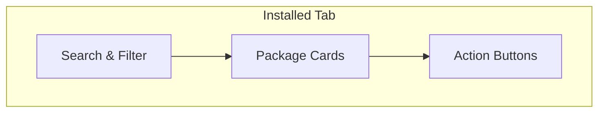
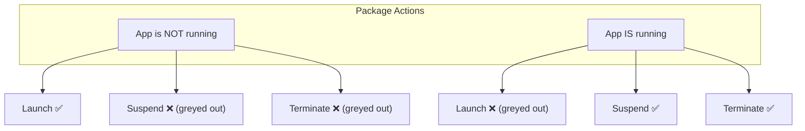

# Installed Apps

The **Installed** tab shows every package currently on your Xbox. This is where you launch, manage, and remove apps.

---

## Overview

When you open the Installed tab:

1. The app connects to your Xbox and lists all installed packages
2. Each package is shown as a **card** with key information
3. Running apps are highlighted

---

## Package Cards

Each card displays:

| Field | What It Shows |
|-------|---------------|
| **Title** | Package name |
| **Version** | Installed version number |
| **Publisher** | Who published it |
| **Architecture** | Xbox architecture it was built for |
| **Running indicator** | Green overlay if the app is currently running |

### Running State

Apps that are currently running on your Xbox are highlighted with a **green overlay** on their card. This makes it easy to see what's active at a glance.

---

## Actions

Each package card has action buttons:

### Launch

- **Starts** the package on your Xbox
- Only available when the app is **not** running
- The app launches on your Xbox's Dev Mode

### Suspend

- **Pauses** a running app (saves its state)
- Useful if you want to temporarily stop an app without losing progress

### Terminate

- **Force-stops** a running app
- Use this when an app is unresponsive or you want to fully close it

### Uninstall

Removes the package from your Xbox:

1. Select a package in the Installed view
2. Click **Uninstall**
3. A confirmation dialog appears — confirm to remove it
4. The package is deleted from your Xbox

> **Warning:** Uninstalling a package removes it completely. If you need it again, you'll have to reinstall it.

---

## Refreshing the Package List

Click the **Refresh** button to re-scan installed packages on your Xbox. This is useful if:

- You installed something outside of XB Homebrew Vault (e.g., via the Device Portal)
- The list seems outdated
- You just uninstalled something and want to confirm it's gone

---

## Searching & Filtering Installed Packages

Use the search bar to find specific packages by name. This is useful when you have many apps installed.

---

## Launching Apps from Installed View

When you click **Launch**:

1. The app sends a launch command to your Xbox
2. The package starts running on your Xbox
3. The card updates to show the **running** state (green overlay)
4. You can now use **Suspend** or **Terminate** to control it

---

## Checking for Updates

XB Homebrew Vault can check if any of your installed packages have newer versions available:

- The **Browse** tab shows **UPDATE** badges on packages with newer versions
- You can reinstall from the catalog to update to the latest version
- Background update checks run periodically (configurable in Settings)

---

## Autostart

Some packages are configured to launch automatically when your Xbox enters Dev Mode. XB Homebrew Vault respects these settings and may trigger autostart when connecting.

---

## Tips

- **Launch from Installed** is the same as launching from the Xbox dashboard — it starts the app in Dev Mode
- If a package doesn't appear in Installed, try clicking **Refresh** — it may have been installed outside the app
- Running state polling happens automatically — you don't need to refresh to see running status
- **Suspend** is like pausing — the app stays in memory and can resume. **Terminate** kills the process entirely
